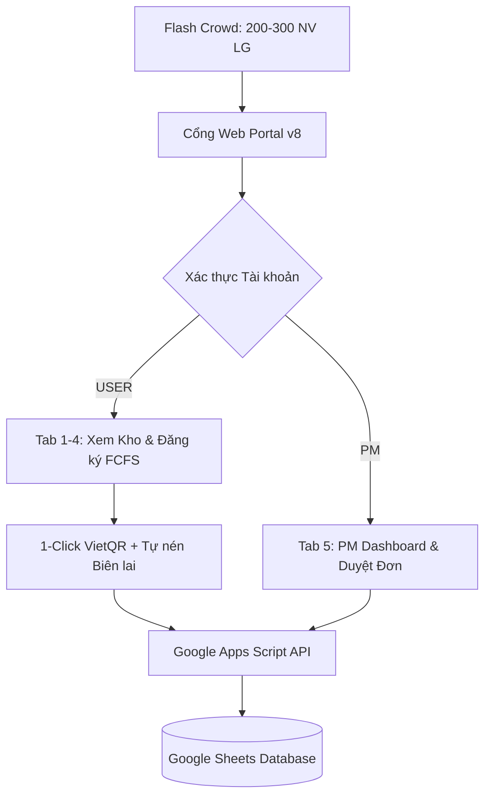
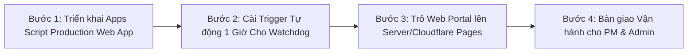

# KẾ HOẠCH & TIẾN ĐỘ DỰ ÁN CỔNG BÁN HÀNG NỘI BỘ LG
## PROJECT STATUS, MILESTONES & NEXT STEPS ROADMAP
*Hệ thống Bán hàng Nội bộ Doanh nghiệp (Internal Sales Portal) — LG Electronics Vietnam*  
*Chuẩn nhận diện: LG Brand Identity V5.2 | Đơn vị chủ trì: Jeong-Do Management & IT*  
*Cập nhật lần cuối: 01/10/2026 · Bổ sung trạng thái v1: 05/10/2026 (mục 2b, 3) — thông tin hiện hành: [`docs/CURRENT_STATE.md`](docs/CURRENT_STATE.md)*

---

## 1. TỔNG QUAN & MỤC TIÊU DỰ ÁN (PROJECT OVERVIEW)

* **Mục tiêu cốt lõi:** Xây dựng cổng web bán hàng nội bộ trực quan, hiện đại, bảo mật và vận hành theo cơ chế **First-Come, First-Served (FCFS)** cho nhân viên LG Electronics Việt Nam.
* **Tải mục tiêu khi Go-Live:** Chịu tải đồng thời **200 – 300 nhân viên** truy cập và đăng ký trong 60 – 180 giây đầu tiên khi mở bán (Flash-Crowd).
* **Đối tượng phục vụ:**
  1. **Product Marketeers (PM):** Quản trị nhiều chương trình bán hàng khác nhau trong năm (HA, HE, BS...), tải lên danh sách sản phẩm, kiểm duyệt chứng từ nộp tiền VietQR và xuất kho.
  2. **Cán bộ Nhân viên (Employees):** Xem thông báo mở bán, tra cứu giỏ hàng theo kho (AYA, AYB, AYC), đặt chỗ 1-click, quét mã VietQR nộp tiền và theo dõi trạng thái đơn hàng.

---

## 2. HIỆN TRẠNG TIẾN ĐỘ: "WHERE WE ARE" (ĐÃ HOÀN THÀNH 100%)

Tất cả các tính năng dưới đây đã được lập trình, kiểm thử luồng thực tế và xác minh tự động bằng Playwright:

| Giai đoạn | Hạng mục tính năng | Trạng thái | Minh chứng kỹ thuật & File liên quan |
|:---|:---|:---:|:---|
| **Phase P0** | **Xác thực & Phân quyền (Auth & RBAC)** | ✅ Hoàn thành | Đăng nhập Mã NV/Password. Phân quyền `PM Quản trị` vs `Nhân viên`. Lưu trữ Google Sheet tab `Users` + Fallback Demo. ([Code.gs:L526](apps-script/Code.gs#L526)) |
| **Phase P1** | **Quản trị Đa chương trình (Multi-Program)** | ✅ Hoàn thành | Chạy đồng thời nhiều ngành hàng (`IS2026Q3-HA`, `IS2026Q3-HE`, `IS2026Q4-BS`), bộ lọc theo tab chương trình, giới hạn suất mua riêng biệt (`maxPerEmployee`). |
| **Phase P2** | **Cơ chế Khóa FCFS & Chống đặt trùng (Locking)** | ✅ Hoàn thành | Giữ chỗ 24h theo từng Slot ID (`HA-001`, `HE-002`). Cơ chế `LockService` chống Race Condition khi nhiều người cùng bấm đăng ký 1 sản phẩm. |
| **Phase P3** | **Thanh toán VietQR 1-Chạm & Tự động nén ảnh** | ✅ Hoàn thành | Modal VietQR tự động điền cú pháp `[MãNV] [MãSlot]`, STK VCB Tây Hồ. Canvas HTML5 tự động nén biên lai xuống < 300KB (max 1280px, quality 0.75). |
| **Phase P4** | **PM Dashboard & Đối soát Đơn hàng** | ✅ Hoàn thành | Tab 5 dành riêng cho PM: Thống kê KPI tồn kho/doanh thu, xem ảnh biên lai ngân hàng, nút **Duyệt nộp tiền** hoặc **Từ chối & Mở lại slot** tự động. |
| **Phase P4.5** | **Bảo mật Tự phục vụ: Đổi Mật Khẩu (Self-Service)** | ✅ Hoàn thành | Nút `Đổi MK` tại thanh tiêu đề. Modal xác thực mật khẩu cũ, kiểm tra tối thiểu 6 ký tự. Cập nhật thẳng vào Cột B Sheet `Users` và duy trì `localStorage`. |
| **Phase P4.6** | **Mở Cổng Thanh Toán (Allow Payment Gate) & Mật khẩu Kép** | ✅ Hoàn thành | Cơ chế kiểm soát rủi ro: Đăng ký ban đầu ở trạng thái `Đã đăng ký - Chờ mở thanh toán` (khóa thanh toán, chống lỗi nộp tiền trước). PM duyệt và bấm `🔓 Mở cổng thanh toán (N)` chuyển hàng loạt sang `Chờ nộp tiền`, kích hoạt 24h đếm ngược. Các đơn sau thời điểm mở tiếp tục chờ đợt sau. Hỗ trợ xác thực mật khẩu kép (Admin nhập plaintext trực tiếp trên Sheet hoặc User đổi qua Portal với Salted SHA-256). Đã kiểm thử Playwright 4/4 suites passed 100%. |
| **Phase P5** | **Bộ nhớ đệm 2 tầng & Chịu tải 200–300 Users** | ✅ Hoàn thành | Tích hợp Server `CacheService` (60s) + Client SWR `sessionStorage` (25s). Đã Stress Test 250 requests đồng thời đạt **903.7 req/s, 100% thành công, độ trễ p95 = 179ms**. *(Cập nhật 05/10/2026: số này chưa được đo lại và không rõ đo ở môi trường nào. Số đo trên máy chủ Apps Script thật (staging): 60 yêu cầu/giây, 0% lỗi, p50 ≈ 1,7–2,1 s, khởi động nguội 33–37 s — xem `docs/04-v1-hardening/V1_HARDENING_CHANGE_PROPOSAL.md` §4.5.)* |
| **Phase P6** | **Tăng cường Bảo mật Dữ liệu (SHA-256 + Salt)** | ✅ Hoàn thành | Mã hóa mật khẩu một chiều SHA-256 với Salt `LG_VN_INTERNAL_SALES_2026_SALT_` trong Google Apps Script (`Utilities.computeDigest`), hỗ trợ xác thực kép tương thích ngược. |
| **Phase P7** | **Hệ thống Email Tự động & Watchdog Giải phóng 24h** | ✅ Hoàn thành | Template email thương hiệu LG V5.2 (`REGISTRATION_CONFIRM`, `PAYMENT_APPROVED`, `PAYMENT_REJECTED`, `EXPIRATION_WARNING`, `EXPIRATION_ALERT`). Tự động giải phóng slot quá hạn 24h & gửi cảnh báo trước 2h. Nút kích hoạt tay cho PM trên Dashboard. Đã kiểm thử tự động 100% qua Playwright. |
| **Layout** | **Chuẩn hóa Giao diện & Nhận diện LG Brand** | ✅ Hoàn thành | Áp dụng LG Brand Identity V5.2 (Heritage Red `#A50034`, Warm Gray `#F0ECE4`). Tách bạch Brief Dashboard (Tab 1) và Kho hàng trực quan (Tab 2). |

### 2b. CẬP NHẬT 05/10/2026 — GIA CỐ BẢN V1 (nhánh `v1-hardening`)

Kiểm thử chạy **code thật** (thay vì dò chuỗi) phát hiện một số hạng mục ở bảng trên chưa hoạt động đúng với **tài khoản nhân viên thật**. Tất cả đã được sửa và kiểm chứng:

| Hạng mục bảng trên | Phát hiện ngày 05/10 | Trạng thái v1 |
|---|---|---|
| P0 Phân quyền | Máy chủ chấp nhận chữ ký phiên "demo" → tự cấp được quyền PM/ADMIN | ✅ Đã đóng; thêm role **ADMIN** (toàn quyền PM + cài đặt hệ thống) |
| P2 Khóa FCFS | Một số thao tác PM / watchdog ghi Sheet ngoài khóa | ✅ Mọi lệnh ghi trong khóa; staging: luôn đúng 1 người thắng |
| P4.6 / P7 | "Hủy giữ chỗ" chưa có trên máy chủ | ✅ Có route; chỉ hủy trước khi khai nộp tiền |
| P5 / P8 polling 6–8 s | Polling không nhận dữ liệu từ máy chủ; danh mục nhân viên thật hiển thị sai | ✅ Sửa; đo staging 60 yêu cầu/giây, 0% lỗi |
| P7 Email | Tài khoản Gmail cá nhân: 100 email/ngày | ✅ Công tắc bật/tắt cho ADMIN |
| Bước P8 dán URL vào `SHEET_API_URL` | Nhân viên mở link không có URL máy chủ | ✅ Thay bằng `portal.html` (`scripts/build_production.py`) |

Chi tiết và bằng chứng: [`docs/04-v1-hardening/V1_HARDENING_CHANGE_PROPOSAL.md`](docs/04-v1-hardening/V1_HARDENING_CHANGE_PROPOSAL.md).

---

## 3. KẾ HOẠCH HÀNH ĐỘNG TIẾP THEO: "WHAT WE STILL DO NEXT"

Hệ thống đã hoàn thiện toàn bộ tính năng kỹ thuật P0 đến P7. Giai đoạn duy nhất còn lại trước khi Golive là **Phase P8: Triển khai Chạy Chính Thức (Production Go-Live & Bàn giao)**:

> ⚠️ **Thay thế từ 05/10/2026:** trình tự triển khai chính thức hiện hành là [`docs/04-v1-hardening/V1_RELEASE_RUNBOOK.md`](docs/04-v1-hardening/V1_RELEASE_RUNBOOK.md) mục 3 (có điểm khôi phục, staging, `rotateSessionSecret`, build `portal.html`, khởi động máy chủ). Các bước bên dưới giữ để tham khảo; riêng bước "dán URL vào `SHEET_API_URL`" **không còn dùng**.

### Chi tiết các bước thực hiện Phase P8:

### 🌐 Giai đoạn P8: Triển khai Chạy Chính Thức (Production Go-Live)
* **Nội dung thực hiện:**
  1. **Deploy Production Web App:**
     - Truy cập dự án Google Apps Script liên kết với Google Sheets `LG_Internal_Sales_Database`.
     - Chọn `Deploy` -> `New Deployment` -> Loại `Web app`.
     - Cấu hình: *Execute as:* **Me** (`user@lge.com`), *Who has access:* **Anyone within LG Electronics** (hoặc *Anyone* nếu chạy cross-domain).
     - Dán URL Web App vào hằng số `SHEET_API_URL` trong [Mau_Dang_Ky_Internal_Sales_3009.html](Mau_Dang_Ky_Internal_Sales_3009.html).
  2. **Cài đặt Time-driven Trigger cho 24h Expiration Watchdog:**
     - Trong Apps Script, mở tab **Triggers (Biểu tượng đồng hồ)**.
     - Thêm trigger mới cho hàm `runExpirationWatchdog`:
       - *Event source:* **Time-driven**
       - *Type of time based trigger:* **Hour timer**
       - *Select hour interval:* **Every hour** (mỗi 1 giờ tự động quét và giải phóng các slot quá hạn).
  3. **Kích hoạt gửi Email Thật:**
     - Mở Google Sheet tab `Config`, đổi giá trị cấu hình `ENABLE_AUTO_EMAIL` từ `false` thành `true`.
  4. **Triển khai Web Portal:**
     - Đặt file `Mau_Dang_Ky_Internal_Sales_3009.html` lên hạ tầng web nội bộ LG hoặc Cloudflare Pages / GitHub Pages bảo mật với domain nội bộ.
  5. **Bàn giao Vận hành:**
     - Bàn giao tài liệu hướng dẫn cho PM về cách Import file Excel danh mục sản phẩm mới vào tab `Products`.

---

## 4. BẢN ĐỒ TẬP TIN DỰ ÁN & QUY TẮC DỌN DẸP (CLEANLINESS POLICY)

Để tránh nhầm lẫn tập tin cũ gây lỗi hệ thống, cấu trúc thư mục được quy chuẩn như sau:

| Thư mục / Tập tin | Vai trò nghiệp vụ | Tình trạng | Hướng dẫn sử dụng |
|:---|:---|:---:|:---|
| **`Mau_Dang_Ky_Internal_Sales_3009.html`** | **CỔNG WEB CHÍNH THỨC (PORTAL LIVE)** | **ACTIVE** | **File nguồn duy nhất đang chạy trên hệ thống**. Đầy đủ tính năng P0 đến P4.5. |
| **`apps-script/Code.gs`** | **BACKEND GOOGLE APPS SCRIPT** | **ACTIVE** | Chứa toàn bộ API xử lý Auth, Khóa FCFS, Đổi MK, Duyệt tiền, Ghi log. |
| **`PROJECT_PLANNING.md`** | **KẾ HOẠCH & TIẾN ĐỘ DỰ ÁN** | **ACTIVE** | File hiện tại — theo dõi tiến độ và các bước làm tiếp theo. |
| **`docs/01-setup-and-deployment/USERS_SHEET_TEMPLATE.md`** | **TÀI LIỆU CẤU HÌNH SHEET USERS** | **ACTIVE** | Hướng dẫn tạo cột, tài khoản mẫu và cơ chế đổi mật khẩu. |
| **`docs/01-setup-and-deployment/SETUP_APPS_SCRIPT.md`** | **HƯỚNG DẪN TRIỂN KHAI APPS SCRIPT** | **ACTIVE** | Quy trình cấu hình và cấp quyền cho Google Web App. |
| **`docs/01-setup-and-deployment/GITHUB_CLONE_AND_LOCAL_SETUP.md`** | **HƯỚNG DẪN CLONE & CÀI ĐẶT LOCAL** | **ACTIVE** | Thiết lập môi trường từ GitHub, cấu hình web server nội bộ. |
| **`docs/02-user-and-pm-guide/PM_AND_USER_OPERATIONAL_GUIDE.md`** | **SỔ TAY VẬN HÀNH DÀNH CHO PM & USER** | **ACTIVE** | Hướng dẫn từng bước với Flowchart chi tiết cho PM và Nhân viên. |
| **`docs/03-architecture-and-analysis/KE_HOACH_TOI_UU_TOAN_DIEN_INTERNAL_SALES.md`** | **ĐỀ ÁN KIẾN TRÚC CHI TIẾT** | **ACTIVE** | Báo cáo phân tích chuyên sâu 7 điểm mù và thiết kế GRAP Dashboard. |
| **`docs/03-architecture-and-analysis/HANDOVER.md`** | **HỒ SƠ BÀN GIAO KỸ THUẬT** | **ACTIVE** | Nhật ký thay đổi và kịch bản test chi tiết qua các phiên bản. |
| **`assets/`** | **THƯ MỤC TÀI NGUYÊN HỆ THỐNG CẤU TRÚC** | **ACTIVE** | Chứa templates Excel tải về và config ngân hàng (`bank_accounts.json`). |
| **`data/LG_Internal_Sales_Database.xlsx`** | **FILE EXCEL CSDL MẪU** | **ACTIVE** | File Excel cấu trúc chuẩn gồm 8 tab dữ liệu phục vụ đối soát. |

---

## 5. TIÊU CHÍ NGHIỆM THU & ĐO LƯỜNG (SUCCESS CRITERIA)
*Theo nguyên lý Peter Drucker: "If it cannot be measured, it cannot be managed"*

1. **Độ ổn định (Availability):** 100% người dùng đăng nhập và xem kho hàng thành công trong giờ cao điểm, tỷ lệ lỗi HTTP 429/500 < 0.5%.
2. **Tính toàn vẹn (Integrity):** Tuyệt đối không xảy ra tình trạng đặt trùng 1 slot (Zero Double-Booking).
3. **Hiệu suất thao tác (Usability):** Thời gian từ lúc chọn sản phẩm đến khi hiển thị mã VietQR chuyển khoản < 3 giây.
4. **Tối ưu băng thông:** Kích thước biên lai tải lên tự động giảm 70–85% nhờ nén canvas, không xảy ra lỗi Payload Too Large.
