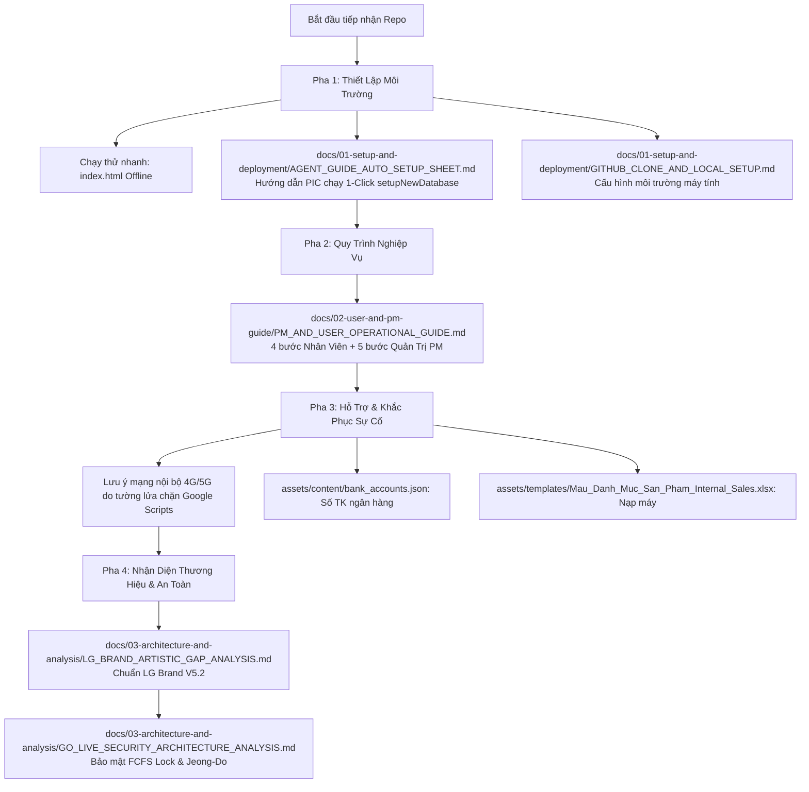

# Cổng Bán Hàng Nội Bộ LG Electronics Việt Nam (LG Internal Sales Portal)

Hệ thống số hóa toàn diện quy trình đăng ký, giữ chỗ theo nguyên tắc First-Come, First-Served (FCFS), thanh toán đối soát qua VietQR và quản trị các đợt bán hàng nội bộ ưu đãi dành riêng cho cán bộ công nhân viên **LG Electronics Việt Nam (LGEVH)**.

> 📌 **THÔNG TIN MỚI NHẤT (05/10/2026): đọc [`docs/CURRENT_STATE.md`](docs/CURRENT_STATE.md) trước.** Bản v1 đã gia cố trên nhánh `v1-hardening` và đạt kiểm thử trên máy chủ staging; **chưa** triển khai bản chính thức. Mở bán: **10:00 14/10/2026**.

> ✅ **LINK CHÍNH THỨC CHO NHÂN VIÊN (06/10/2026):**  
> 🔗 **[https://gobitangocbao.github.io/lg-internal-sales-portal/portal.html](https://gobitangocbao.github.io/lg-internal-sales-portal/portal.html)**  
> *Gửi link này, **không kèm `?ui=v2`**: giao diện v2 đã là mặc định. `?ui=v2` ép v2 kể cả khi phải quay lại v1.4 (`UI_V2_DEFAULT = false`), nên người giữ link có tham số sẽ không nhận bản quay lại. `?ui=v1` chỉ dùng để xem giao diện cũ khi xử lý sự cố.*

> 🚀 **BẢN DEMO TRỰC TUYẾN (đào tạo / thử nghiệm):**  
> 🔗 **[https://gobitangocbao.github.io/lg-internal-sales-portal/](https://gobitangocbao.github.io/lg-internal-sales-portal/)**  
> *Đây là **bản demo**: mặc định chạy Demo Offline với tài khoản mẫu. Bản chính thức cho nhân viên là `portal.html`, sinh bằng `scripts/build_production.py` (không có tài khoản/dữ liệu demo) — xem [`docs/04-v1-hardening/V1_RELEASE_RUNBOOK.md`](docs/04-v1-hardening/V1_RELEASE_RUNBOOK.md).*

> 🔒 **LƯU Ý BẢO MẬT & BẢN QUYỀN:** Kho lưu trữ chứa thông tin tài khoản ngân hàng thụ hưởng pháp nhân, danh mục sản phẩm và quy trình kiểm toán Jeong-Do. Dữ liệu đã được **khử định danh (sanitized)** toàn diện để có thể triển khai an toàn trên môi trường cá nhân hóa mà không làm rò rỉ dữ liệu cá nhân của bất kỳ ai.

---

## 🧭 0. Dành Cho AI Agent & Kỹ Sư Mới: Lộ Trình Đọc Tài Liệu (Agent Onboarding Roadmap)

Khi một AI Agent hoặc kỹ sư mới tiếp nhận repository này từ GitHub, hãy đọc tài liệu theo **4 Pha chuẩn hóa** dưới đây để nắm bắt hệ thống nhanh nhất, thiết lập CSDL độc lập và hỗ trợ người dùng trơn tru:



### Bảng tra cứu tài liệu theo thứ tự ưu tiên:

| Pha | Mục tiêu | Tài liệu cần đọc | Trọng tâm cần nắm |
|---|---|---|---|
| **Pha 0** | **Nắm trạng thái hiện tại** | [`docs/CURRENT_STATE.md`](docs/CURRENT_STATE.md)<br>[`docs/04-v1-hardening/`](docs/04-v1-hardening/README.md) | Phiên bản, vai trò (USER/PM/ADMIN), việc còn mở, Runbook triển khai & khôi phục, nhật ký thay đổi. |
| **Pha 1** | **Thiết lập, Git & CSDL riêng** | [`docs/01-setup-and-deployment/GIT_CONFIGURATION_AND_HANDOVER.md`](docs/01-setup-and-deployment/GIT_CONFIGURATION_AND_HANDOVER.md)<br>[`docs/01-setup-and-deployment/AGENT_GUIDE_AUTO_SETUP_SHEET.md`](docs/01-setup-and-deployment/AGENT_GUIDE_AUTO_SETUP_SHEET.md)<br>[`docs/01-setup-and-deployment/GITHUB_CLONE_AND_LOCAL_SETUP.md`](docs/01-setup-and-deployment/GITHUB_CLONE_AND_LOCAL_SETUP.md)<br>[`docs/01-setup-and-deployment/SETUP_APPS_SCRIPT.md`](docs/01-setup-and-deployment/SETUP_APPS_SCRIPT.md) | **Cấu hình mạng Git kép (all, origin, gobita):** Đẩy đồng bộ cả 2 kho bằng `git push all main`.<br>**1-Click setupNewDatabase():** Hướng dẫn PIC chạy hàm để Google Apps Script tự tạo Google Sheet trên Drive cá nhân của họ, lấy `SPREADSHEET_ID` và dán Web App URL vào Modal Cấu hình API trên giao diện web. |
| **Pha 2** | **Vận hành & Nghiệp vụ** | [`docs/02-user-and-pm-guide/PM_AND_USER_OPERATIONAL_GUIDE.md`](docs/02-user-and-pm-guide/PM_AND_USER_OPERATIONAL_GUIDE.md) | **Luồng 4 bước của Nhân viên:** Chọn đợt bán → Đặt suất FCFS → Nhận thông báo mở cổng → Quét VietQR nộp tiền.<br>**Luồng 5 bước của PM:** Tạo đợt bán mới → Nạp Excel sản phẩm → Hẹn giờ tự động → Duyệt/từ chối đơn qua Lightbox → Kết sổ. |
| **Pha 3** | **Hỗ trợ User & Sự cố** | [`docs/01-setup-and-deployment/GITHUB_CLONE_AND_LOCAL_SETUP.md`](docs/01-setup-and-deployment/GITHUB_CLONE_AND_LOCAL_SETUP.md) *(Mục 6)*<br>[`assets/content/bank_accounts.json`](assets/content/bank_accounts.json)<br>[`assets/templates/`](assets/templates/) | **Sự cố mạng Intranet:** Hướng dẫn user chuyển sang **4G/5G** nếu mạng nội bộ nhà máy chặn Webhook Google.<br>**Cập nhật cấu hình:** Sửa số tài khoản ngân hàng hoặc nạp thêm máy từ file mẫu `.xlsx`. |
| **Pha 4** | **Brand & Bảo mật** | [`docs/03-architecture-and-analysis/LG_BRAND_ARTISTIC_GAP_ANALYSIS.md`](docs/03-architecture-and-analysis/LG_BRAND_ARTISTIC_GAP_ANALYSIS.md)<br>[`docs/03-architecture-and-analysis/GO_LIVE_SECURITY_ARCHITECTURE_ANALYSIS.md`](docs/03-architecture-and-analysis/GO_LIVE_SECURITY_ARCHITECTURE_ANALYSIS.md) | Tuân thủ tuyệt đối **LG Brand Guidelines V5.2** (Đỏ Heritage `#A50034`, Warm Gray `#F0ECE4`, font LG EI, trợ lý Digital Logo Play) và khóa `LockService` chống tranh chấp slot. |

---

## 1. Khởi chạy nhanh trong 1 giây (Instant Quickstart)

* **Cách 1 (Zero-Install):** Mở trực tiếp tệp [`index.html`](index.html) hoặc [`Mau_Dang_Ky_Internal_Sales_3009.html`](Mau_Dang_Ky_Internal_Sales_3009.html) bằng bất kỳ trình duyệt nào (Chrome, Safari, Edge, Firefox). Hệ thống hoạt động 100% độc lập, không yêu cầu cài đặt `node_modules` hay chạy lệnh build.
* **Cách 2 (Local Web Server):**
  ```bash
  python3 -m http.server 8000
  ```
  Truy cập: `http://localhost:8000`

---

## 2. Kiến trúc & Cấu trúc thư mục chuẩn hóa (Repository Structure)

Toàn bộ repository được tổ chức khoa học, gọn gàng, tách biệt mã nguồn, tài sản thương hiệu và hệ thống tài liệu:

```text
lg-internal-sales-portal/
├── index.html                               # Cổng điều hướng tự động vào ứng dụng mới nhất
├── Mau_Dang_Ky_Internal_Sales_3009.html     # Ứng dụng Web lõi (Production Single-File System)
├── apps-script/
│   └── Code.gs                              # Backend Google Apps Script (1-Click setupNewDatabase, Auth, FCFS)
├── assets/                                  # Thư mục tài nguyên có thể tùy biến cấu hình (Xem assets/README.md)
│   ├── README.md                            # Cẩm nang tổng quan phân mục tài nguyên hệ thống
│   ├── branding/                            # Bộ nhận diện thương hiệu LG (Digital Logo Play)
│   ├── content/                             # Cấu hình tài khoản ngân hàng & dữ liệu hệ thống
│   │   ├── bank_accounts.json               # Số tài khoản VCB/TCB, tên thụ hưởng, cú pháp
│   │   ├── system_config.json               # Phân quyền, chương trình mặc định, hạn mức
│   │   └── README.md                        # Hướng dẫn chỉnh sửa nội dung
│   ├── digital-logo-play/                   # Ảnh động LG Digital Logo Play chuẩn nhận diện
│   ├── images/                              # Banner showcase & biểu tượng chuyển động
│   │   ├── lg_hero_banner.jpg               # Banner showcase sản phẩm cao cấp
│   │   └── quick-links-ani/                 # [MỚI] Bộ Motion Icons & Kinetic SVG Suite chuẩn LG.com
│   │       ├── *.gif                        # Hoạt ảnh GIF chính thức trích xuất từ CDN LG.com
│   │       ├── *.svg                        # Biểu tượng vector động học có CSS keyframes nhúng sẵn
│   │       └── README.md                    # Cẩm nang kỹ thuật & SOP thay thế icon hot-swapping
│   └── templates/                           # Thư viện tệp mẫu chuẩn hệ thống
│       ├── Mau_Danh_Muc_San_Pham_Internal_Sales.xlsx # Mẫu Excel nạp danh mục sản phẩm cho PM
│       ├── LG_Internal_Sales_Master_Database.xlsx    # Bảng tính cơ sở dữ liệu mẫu 8 sheets
│       └── README.md                        # Hướng dẫn định dạng cột và công thức
├── data/                                    # Thư viện runtime nhúng cục bộ
│   ├── heic2any.min.js                      # Bộ giải mã ảnh iPhone (.HEIC) sang JPEG
│   ├── xlsx.mini.min.js                     # SheetJS client-side xử lý Excel không cần server
│   ├── LG_Internal_Sales_Database.xlsx      # Database cục bộ đồng bộ
│   └── Mau_Danh_Muc_San_Pham_Internal_Sales.xlsx # File mẫu sẵn sàng tải xuống
├── docs/                                    # Hệ thống tài liệu kỹ thuật & cẩm nang vận hành
│   ├── 01-setup-and-deployment/             # Hướng dẫn clone GitHub, cài đặt và cloud setup
│   │   ├── GIT_CONFIGURATION_AND_HANDOVER.md # [CẨM NANG GIT & BÀN GIAO PIC] Cấu hình kép & chuyển giao
│   │   ├── AGENT_GUIDE_AUTO_SETUP_SHEET.md  # [CẨM NANG AGENT & PIC] Tạo CSDL riêng 1-Click
│   │   ├── GITHUB_CLONE_AND_LOCAL_SETUP.md  # [HƯỚNG DẪN CLONE & THIẾT LẬP CHI TIẾT]
│   │   ├── SETUP_APPS_SCRIPT.md             # Hướng dẫn triển khai Apps Script Backend
│   │   └── USERS_SHEET_TEMPLATE.md          # Đặc tả định dạng bảng tính Google Sheets
│   ├── 02-user-and-pm-guide/                # Cẩm nang quy trình cho Người dùng & Quản trị viên
│   │   └── PM_AND_USER_OPERATIONAL_GUIDE.md # [CẨM NANG VẬN HÀNH KÈM SƠ ĐỒ QUY TRÌNH]
│   ├── CURRENT_STATE.md                     # [ĐỌC TRƯỚC] Thông tin hiện hành — nguồn chuẩn duy nhất
│   ├── 04-v1-hardening/                     # Bản v1: đề xuất, Runbook triển khai & khôi phục, nhật ký thay đổi
│   ├── 03-architecture-and-analysis/        # Báo cáo kiểm toán bảo mật, nhận diện thương hiệu
│   │   ├── GO_LIVE_SECURITY_ARCHITECTURE_ANALYSIS.md
│   │   ├── LG_BRAND_ARTISTIC_GAP_ANALYSIS.md
│   │   └── KE_HOACH_TOI_UU_TOAN_DIEN_INTERNAL_SALES.md
│   └── README.md                            # Mục lục điều hướng tài liệu docs
├── scripts/build_production.py              # Sinh portal.html (bản chính thức, không dữ liệu demo)
├── tests/                                   # Kiểm thử: backend_gas_harness.js, cloud_mode_regression.py, staging_smoke_test.py, run_e2e_tests.js
├── PROJECT_PLANNING.md                      # Lộ trình kỹ thuật & kế hoạch phát triển
└── README.md                                # Tài liệu tổng quan dự án (File này)
```

---

## 3. Tài khoản Demo có sẵn để thử nghiệm (Demo Credentials)

> ⚠️ **Chỉ có trong bản demo.** Bản chính thức (`portal.html`) không có tài khoản demo, và máy chủ chính thức từ chối mọi phiên đăng nhập demo. Danh sách đầy đủ (gồm `VH11111`, `VH99999`, tài khoản khóa `VH00001`) và vai trò mới **ADMIN**: [`docs/CURRENT_STATE.md`](docs/CURRENT_STATE.md) mục 3–4.

Hệ thống tích hợp sẵn các tài khoản demo trên thanh đăng nhập để kiểm thử ngay lập tức (chỉ cần bấm nút đăng nhập nhanh hoặc gõ mật khẩu `test123`):

| Vai trò | Mã Nhân Viên | Mật khẩu mặc định | Họ và Tên | Bộ phận | Quyền hạn chính |
|---|---|:---:|---|---|---|
| **PM Quản Trị** | `VH12345` | `test123` | Nguyễn Thị Quỳnh Như | HS PM Support | Tạo đợt bán, nạp Excel, mở cổng nộp tiền, hẹn giờ, soi ảnh Lightbox, duyệt đơn hàng loạt, kết sổ. |
| **Nhân Viên 1** | `VH88921` | `test123` | Trần Văn Nam | Audit & Jeong-Do | Xem catalog, đặt suất FCFS, tra cứu biên lai, đổi mật khẩu cá nhân. |
| **Nhân Viên 2** | `VH55432` | `test123` | Lê Hoàng Anh | HE Sales Division | Thử nghiệm đặt suất và nộp ủy nhiệm chi VietQR. |
| **Nhân Viên 3** | `VH33211` | `test123` | Hoàng Minh Trí | HA Production | Thử nghiệm giữ chỗ cạnh tranh đa người dùng. |
| **Nhân Viên 4** | `VH99120` | `test123` | Đặng Thanh Hà | Finance & Accounting | Kiểm thử đối soát luồng tài chính. |

---

## 4. Hướng Dẫn Vận Hành & Khắc Phục Sự Cố Cho User

> Mục 1–2 dưới đây áp dụng cho **bản demo**. Ở **bản chính thức** (`portal.html`) không có huy hiệu Demo / nút "Cấu hình API": trang tự kết nối máy chủ. Hướng dẫn sử dụng bản v1: [`docs/02-user-and-pm-guide/PM_AND_USER_OPERATIONAL_GUIDE.md`](docs/02-user-and-pm-guide/PM_AND_USER_OPERATIONAL_GUIDE.md) — Phần C.

1. **Khi chạy thử nghiệm (Demo Mode):**
   - Mặc định khi mở trang, huy hiệu ở góc trên bên phải hiển thị `⚪ Demo Mode (Offline)`.
   - Dữ liệu được lưu trữ tự động trong `localStorage` của trình duyệt, người dùng có thể thoải mái thao tác mà không ảnh hưởng tới dữ liệu thật.
2. **Khi kết nối Google Sheet thật (Cloud Live Mode):**
   - Nhấp vào huy hiệu `⚪ Demo Mode (Offline)` hoặc nút `Cấu hình API` trong Tab PM.
   - Dán Web App URL Google Apps Script của bạn và bấm `Kiểm Tra & Lưu Cấu Hình`. Huy hiệu sẽ chuyển sang `🟢 Google Cloud Live`.
3. **Xử lý sự cố mạng nội bộ nhà máy (Intranet Firewall):**
   - Một số khu vực nhà máy LG có tường lửa chặn kết nối Webhook tới Google Scripts.
   - Khi gặp sự cố chậm hoặc lỗi mạng, nhân viên chỉ cần **chuyển sang mạng di động 4G/5G cá nhân** hoặc Wi-Fi ngoài để hoàn tất giữ chỗ và gửi chứng từ chuyển khoản. Biểu mẫu có tính năng Auto-Draft nên không bị mất dữ liệu đã điền.
4. **Bàn giao kỹ thuật & Đồng bộ Git kép (Multi-Agent & PIC Handover):**
   - Đọc cẩm nang chi tiết: [`docs/01-setup-and-deployment/GIT_CONFIGURATION_AND_HANDOVER.md`](docs/01-setup-and-deployment/GIT_CONFIGURATION_AND_HANDOVER.md).
   - Đẩy cập nhật đồng bộ lên cả 2 kho lưu trữ GitHub bằng 1 lệnh duy nhất: `git push all main`.
5. **Bản v1 (05/10/2026):** thay đổi đang nằm trên nhánh `v1-hardening` (chưa gộp vào `main`). Điểm khôi phục: tag `checkpoint-pre-v1-hardening-20261005`. Kiểm thử chạy code thật: `node tests/backend_gas_harness.js` và `python3 tests/cloud_mode_regression.py`.

---

## 5. Nguyên Tắc Thương Hiệu & Cam Kết Đạo Đức (Jeong-Do Management)

* **Thiết kế thương hiệu:** Tuân thủ chuẩn mực **LG Electronics Brand Guidelines V5.2**:
  - **Tông màu chủ đạo:** Đỏ Heritage `#A50034`, Đỏ Active `#EA1917` (LG.com Web), Xám ấm Warm Gray 06 `#F0ECE4`.
  - **Phông chữ tiêu chuẩn:** `LG EI Text` & `LG EI Headline`.
  - **Trợ lý thông minh:** Biểu tượng động LG Digital Logo Play tương tác cảm xúc.
  - **Bộ Biểu Tượng Chuyển Động (LG.com Motion Icons & Kinetic SVG Suite):** Thanh điều hướng danh mục nhanh (`.lg-quick-category-bar`) 8 đĩa tròn tích hợp hoạt ảnh GIF chính thức từ CDN LG.com (`ico_offer1_ani.gif`) và bộ vector SVG động học chế tác riêng (`cat_tv_soundbar.svg`, `cat_instaview_refrigerator.svg`, `cat_washtower.svg`, `cat_air_conditioner.svg`, `cat_gram_laptop.svg`, `cat_vcb_security.svg`, `ico_epc.svg`). Toàn bộ được mô-đun hóa trong [`assets/images/quick-links-ani/`](assets/images/quick-links-ani/), cho phép thay thế và cập nhật hot-swapping mà không cần sửa code.
* **Đạo đức kinh doanh Jeong-Do:**
  - Suất mua ưu đãi nội bộ là đặc quyền dành riêng cho nhân viên LG phục vụ nhu cầu cá nhân/gia đình.
  - Nghiêm cấm hành vi đầu cơ, bán lại cho bên thứ ba. Mọi vi phạm sẽ bị hủy quyền mua và xử lý kỷ luật theo quy chế công ty.

**Chủ quản dự án:** Hoàng Minh Hiền — Kế toán & Kiểm toán Nội bộ / Jeong-Do Management, LG Electronics Việt Nam.
