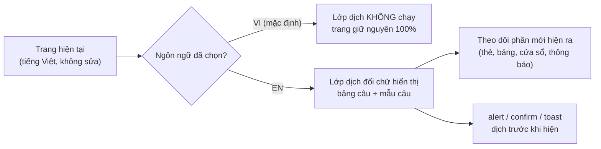
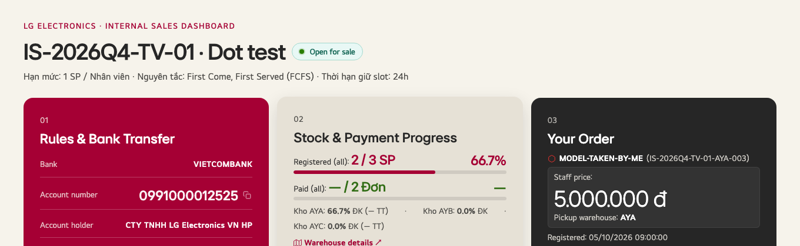

# Thêm tiếng Anh (nút VI/EN): đánh giá khả năng làm & kế hoạch

> **Trạng thái (08/10/2026):** **ĐÃ LÀM XONG trên nhánh `i18n/en`, bản `v2.4.0`. Kết quả và số đo: §9.** Chủ dự án đã trả lời đủ Q-I1 đến Q-I8 (§7, §8.4). **Còn chờ: chủ dự án duyệt bản dịch Tab 1** → [`i18n/TAB1_EN_REVIEW.md`](i18n/TAB1_EN_REVIEW.md).
> **Yêu cầu của chủ dự án:**
> - Giữ nguyên bản tiếng Việt, không đổi gì.
> - Thêm nút VI/EN; bản tiếng Anh **dịch đầy đủ**, ngắn gọn, dễ hiểu, **không song ngữ** trên cùng màn hình.
> - Quay lại bản hiện tại được bất cứ lúc nào.
> - Không đổi chức năng đã duyệt.

---

## 0. Kết luận
**Làm được.** Bản thử (§4) đã chứng minh 3 điều:
1. Ở chế độ **VI**, trang **giống hệt** bản hiện tại đến từng phần tử.
2. Ở chế độ **EN**, đầu trang, tab và thẻ đã sang tiếng Anh, **chức năng đăng ký giữ chỗ vẫn chạy**, không có lỗi JS.
3. Có thể tắt toàn bộ bằng **1 công tắc**.

Cách làm đề xuất là **lớp dịch chồng**: không sửa các câu chữ tiếng Việt đang có trong code, chỉ đổi phần chữ hiển thị khi người dùng chọn EN.

**Giới hạn, phải biết trước:**
- Nội dung do PM nhập (tên chương trình, mô tả tình trạng sản phẩm) **vẫn là tiếng Việt**.
- Email tự động và file Excel gửi kế toán **đề xuất giữ tiếng Việt** (xem Q-I1, Q-I2).

---

## 1. Khối lượng (đo trên `v2-final`)
| Nơi có chữ tiếng Việt | Số lượng | Ghi chú |
|---|---|---|
| HTML tĩnh: đoạn chữ | 725 (667 câu khác nhau) | Tab 1, tiêu đề, nhãn form, cửa sổ, hướng dẫn |
| Thuộc tính `placeholder` / `title` / `aria-label` / `alt` | 101 | |
| Chuỗi trong JavaScript | 890 (687 khác nhau) | Gồm 54 `alert`, 16 `confirm`, 59 `showToast`, 7 `showWait`, nhiều đoạn HTML tạo động |
| Dữ liệu demo (chỉ có ở bản demo, bản `portal.html` đã xoá) | khoảng 198 | **Không dịch** |
| Apps Script: câu trả về web hiển thị (`message`) | 107 (303 chuỗi có dấu) | Web hiện thẳng ở 30 chỗ |
| Email tự động | 7 tiêu đề + 6 mẫu nội dung | Máy chủ gửi |
| **Tổng cần dịch cho web** | **≈ 1.350 câu, ≈ 11.500 từ** | Sau khi bỏ trùng |

---

## 2. Rủi ro làm hỏng chức năng (đã đo) và cách tránh
| Rủi ro | Số chỗ | Cách tránh |
|---|---|---|
| **Trạng thái đơn được lưu bằng tiếng Việt** trong Google Sheet (`'Chờ nộp tiền'`, `'Đã khai nộp - chờ đối soát'`…) và **code so sánh trực tiếp** | 80 phép `===` / `!==` · 9 phép `includes` / `indexOf` · máy chủ dùng 21 chỗ | **Không bao giờ dịch giá trị.** Chỉ đổi **chữ hiển thị** trên huy hiệu và nhãn. Dữ liệu, máy chủ, Excel giữ nguyên giá trị tiếng Việt |
| Ô chọn `<option>` có **value** tiếng Việt (bộ lọc trạng thái PM) | 6 | Chỉ dịch chữ hiển thị của option, **giữ nguyên value** |
| **Code đọc lại chữ đang hiển thị** rồi so với tiếng Việt | **2** (bộ lọc tab 3, dòng 13073 & 13075: `row.innerText.includes('Đã Nộp' / 'Chờ Nộp')`) | **Phải sửa 2 dòng này** để so theo giá trị gốc, không theo chữ hiển thị. Đây là thay đổi chức năng duy nhất, rất nhỏ, có test |
| Câu báo lỗi **từ máy chủ** hiện thẳng lên web | 30 chỗ hiển thị · 107 câu | Dịch ở **phía web** bằng bảng đối chiếu câu và mẫu câu. **Không sửa Apps Script** |
| Câu có biến (`Bạn đã đăng ký ${n} sản phẩm…`) | phần lớn trong 890 chuỗi JS | Dịch bằng mẫu câu có chỗ trống. Câu nào không khớp sẽ **còn nguyên tiếng Việt**: đo được (§5), không hỏng chức năng |
| Chữ tiếng Anh dài/ngắn khác tiếng Việt làm vỡ bố cục | — | So ảnh EN ở 1440 / 1024 / 390px; chỉnh câu ngắn lại, không sửa CSS của bản VI |
| Nhận diện biên lai ngân hàng Việt Nam (OCR) | 3 bộ từ khoá | **Giữ nguyên**: biên lai luôn là tiếng Việt |

---

## 3. Cách làm đề xuất: lớp dịch chồng

- **Một file từ điển riêng** `assets/i18n/en.json`: câu tiếng Việt → câu tiếng Anh, cộng các mẫu câu có biến. Sửa lời dịch **không cần đụng code**.
- **Nút VI/EN** đặt cạnh nút "Đêm / Sáng" ở đầu trang và ở màn đăng nhập. Lựa chọn được nhớ trên máy (`localStorage`). Có thể ép bằng link `?lang=en` hoặc `?lang=vi`.
- **Không dịch:** giá trị dữ liệu và trạng thái lưu trên máy chủ, nội dung PM nhập, mã slot, serial, số tiền, ngày giờ, thông tin ngân hàng, nội dung chuyển khoản trong QR.
- **Văn phong:** câu ngắn, từ thông dụng. Bảng thuật ngữ thống nhất, ví dụ:
  - Giữ chỗ → *Reserve*
  - Kho → *Warehouse*
  - Cổng thanh toán → *Payment window*
  - Đối soát → *Payment check*
  - Kết sổ → *Close program*
  - Biên lai → *Receipt*
  - Ưu đãi nội bộ → *Staff deal*
  - Giữ nguyên tên riêng: Jeong-Do, VietQR, LG.com, Slot, PM

---

## 4. Bản thử đã chạy (08/10/2026)
Bản thử dùng lớp dịch chồng với khoảng 45 câu cho đầu trang, tab, đăng nhập và thẻ. Script: [`design/i18n/i18n_overlay_poc.js`](i18n/i18n_overlay_poc.js). Chạy trên **bản sao tạm, không đụng repo**.

| Phép thử | Kết quả |
|---|---|
| Chế độ VI: DOM so với bản gốc (che đồng hồ chạy theo giây) | **Giống hệt** ở màn đăng nhập (875.613 ký tự) và sau đăng nhập (892.178) |
| Chế độ EN: chữ tiếng Việt còn lại ở thanh người dùng + thanh tab | **0** |
| Chế độ EN: đăng ký giữ chỗ (máy chủ giả) | Vẫn gửi `register_product` thành công |
| Lỗi JS (VI và EN) | 0 |
| Chữ tiếng Việt còn hiện trên toàn trang (EN) | 109/133. Đúng như dự kiến, vì bản thử chỉ dịch khoảng 45 câu |

---

## 5. Tiêu chí nghiệm thu (đo được)
1. **VI giống hệt `v2-final`:** DOM và ảnh chụp trùng nhau ở 1920/1440/1280/1024/390px, cả 3 vai trò, sáng và tối (che đồng hồ).
2. **EN đầy đủ:** chữ tiếng Việt còn hiện = **0**, ngoại trừ vùng dữ liệu được đánh dấu "không dịch" (nội dung PM nhập, tên chương trình, mô tả sản phẩm).
3. **Chức năng:** toàn bộ test hồi quy (137 phép kiểm) chạy **ở cả VI và EN**, e2e 165, harness 98: tất cả đạt.
4. **Bộ lọc tab 3** (2 dòng sửa) lọc đúng ở cả VI và EN.
5. Kiểm tay trên 1 điện thoại thật ở chế độ EN: đăng nhập → giữ chỗ → nộp tiền → PM duyệt.

---

## 6. Quay lại bản hiện tại: 3 lớp an toàn
| Mức | Cách | Thời gian |
|---|---|---|
| Từng người | Bấm **VI**, hoặc mở link `?lang=vi` | Tức thì |
| Tất cả người dùng | Đổi **`I18N_ENABLED = false`** → ẩn nút, lớp dịch không chạy, trang về đúng bản hiện tại → build `portal.html` → push | Khoảng 5 phút |
| Bỏ hẳn | Build `portal.html` từ tag **`v2-final`** (hoặc tag của bản ngay trước) | Khoảng 5 phút |

Nhánh riêng `i18n/en` tạo từ `v2-final`. Mỗi bước có tag riêng. Apps Script **không đổi** (chỉ sửa web), nên không phải deploy máy chủ.

---

## 7. Cần chủ dự án quyết định
| # | Câu hỏi | Lựa chọn | Đề xuất |
|---|---|---|---|
| **Q-I1** | Email tự động (máy chủ gửi) | (a) Giữ tiếng Việt · (b) Theo ngôn ngữ người dùng chọn (phải sửa Apps Script, lưu ngôn ngữ mỗi người) | **ĐÃ CHỐT (08/10): chỉ dịch giao diện web; máy chủ, email, cơ sở dữ liệu giữ tiếng Việt** (Admin và PM đều là người Việt) |
| **Q-I2** | File Excel gửi giao hàng / kế toán | (a) Giữ tiêu đề tiếng Việt · (b) Theo ngôn ngữ đang chọn | **ĐÃ CHỐT: (a)**, cùng quyết định Q-I1 |
| **Q-I3** | Cách ghi tiền khi ở EN | (a) Giữ `1.875.000 đ` · (b) `1,875,000 VND` | **ĐÃ CHỐT: (a) giữ cách ghi tiền** |
| **Q-I4** | Ai duyệt bản dịch **Tab 1 (thư thông báo và quy định)**? Đây là nội dung chính sách | Chủ dự án · HR/Pháp chế · Không cần | **ĐÃ CHỐT: chủ dự án duyệt** |
| **Q-I5** | Thứ tự với v3 (giao diện điện thoại) | (a) Làm v3 / Đợt 0 trước, rồi EN · (b) EN trước | **ĐÃ CHỐT: (b) tiếng Anh trước.** Khi làm v3 sau, phải cập nhật từ điển EN cho mọi chữ mới hoặc đổi (đưa vào tiêu chí nghiệm thu v3) |
| **Q-I6** | Thời điểm | Trước hay sau mở bán 14/10 | **ĐÃ CHỐT (08/10): làm ngay** (đang giai đoạn thử, chưa triển khai thật) |

**Ước lượng sau khi duyệt:**
- Dịch và rà thuật ngữ: khoảng 1,5–2 ngày làm việc.
- Lớp dịch, nút VI/EN, 2 dòng sửa bộ lọc, test cả 2 ngôn ngữ: khoảng 1 ngày.
- Chủ dự án duyệt bản dịch Tab 1: tuỳ Q-I4.

---

## 8. Rà soát nút / lệnh: dịch thế nào để không hỏng chức năng (08/10/2026)

**Câu hỏi của chủ dự án:**
- Các cụm "Còn 1 SP khả dụng", "Xem báo cáo kho", "Cổng TT đã mở", "Nộp tiền ngay (1-Chạm)", "Hủy giữ chỗ" vẫn là tiếng Việt trong ảnh bản thử.
- Đó là nút lệnh. Dịch có làm hỏng chức năng không?

**Trả lời:**
- Các cụm này **còn tiếng Việt chỉ vì bản thử đầu chưa có trong từ điển** (bản thử chỉ có khoảng 45 câu), không phải vì là nút lệnh.
- Đã thêm cả 5 cụm vào bản thử, rồi **bấm thật từng nút ở chế độ EN**: chức năng chạy đúng (§8.2).
- Lý do an toàn: **lệnh gắn với nút qua `onclick` hoặc mã nút (`id`), không qua chữ trên nút.**

### 8.1 Rà toàn bộ phần tử bấm được (máy tính 1440px)
Phạm vi: Nhân viên (đăng nhập, tab 1–4, form nộp tiền, cửa sổ Nộp tiền ngay, báo cáo kho) và PM (Dashboard). Danh sách đầy đủ: [`design/i18n/interactive_inventory.json`](i18n/interactive_inventory.json).

| Cách gắn chức năng | Số phần tử có chữ tiếng Việt | Dịch chữ có ảnh hưởng chức năng? |
|---|---|---|
| `onclick="hàm(...)"`: lệnh nằm trong code | 67 | **Không** |
| Lựa chọn trong ô chọn `<option value="…">` | 16 | **Không**, nếu **giữ nguyên value** và chỉ dịch chữ hiển thị |
| Nút gửi form (`submit`) | 6 | **Không** |
| Link `href` tạo từ mã model (Tìm thông tin model) | 2 | **Không** |
| Nhận lệnh qua phần tử cha | 2 | **Không**: một nút đã khoá ("Đã có người giữ chỗ"), một nhãn của ô tích |
| **Tổng** | **93** | **0 phần tử chạy lệnh dựa trên chữ** |

### 8.2 Bằng chứng: bấm thật ở chế độ EN (bản thử 2, máy chủ giả)
| Nút (EN) | Kết quả |
|---|---|
| **Pay now →** (Nộp tiền ngay) | Mở cửa sổ nộp tiền ✅ |
| **Stock report ↗** (Xem báo cáo kho) | Mở cửa sổ báo cáo kho ✅ |
| **Cancel reservation** (Hủy giữ chỗ) | Hiện hộp thoại xác nhận → gửi lệnh `user_cancel_registration` lên máy chủ ✅ |
| **PAYMENT OPEN** (Cổng TT đã mở), **1 item(s) left** (Còn 1 SP khả dụng) | Chỉ là nhãn trạng thái, hiển thị đúng ✅ |
| Lỗi JS | 0 |

**Phát hiện thêm:** **hộp thoại xác nhận (`confirm`) vẫn là tiếng Việt** vì bản thử mới bọc `alert`. Bản chính sẽ bọc cả `confirm`, `prompt`, `showToast`, `showWait`. Kết quả Đồng ý/Huỷ của người dùng **không phụ thuộc chữ**.

### 8.3 Những chỗ THẬT SỰ phải xử lý (đã kiểm bằng code)
| # | Nhóm | Ở đâu | Vấn đề khi chuyển sang EN | Cách làm, không đổi chức năng |
|---|---|---|---|---|
| H1 | **Đọc chữ hiển thị để lọc** | Bộ lọc trạng thái tab 3, `filterTable` dòng 13073 / 13075 | So với chữ "Đã Nộp" / "Chờ Nộp" trên dòng bảng. Ở EN, dòng ghi tiếng Anh nên không khớp | Gắn trạng thái gốc vào dòng (`data-status`) và lọc theo đó. **Xem lỗi có sẵn H1b** |
| H1b | **Lỗi có sẵn ở bản VI** [VERIFIED] | cùng chỗ | Bảng chỉ có các huy hiệu "Chờ nộp tiền" / "Chờ đối soát". Bộ lọc tìm "Chờ **N**ộp" (N hoa) và "Đã Nộp" (không có ở đâu). Nên **chọn bất kỳ trạng thái nào cũng ẩn hết dòng**, ngay cả ở tiếng Việt | Sửa cùng H1, **cần duyệt** (Q-I7) |
| H2 | **Xuất file đọc chữ trên màn hình** | Nút "Xuất Excel" ở tab 3, `exportToCSV` dòng 13089 | Đọc chữ trong bảng tab 3. Ở EN, file tải về sẽ có **tiêu đề tiếng Anh** | Tuỳ Q-I8. Nếu giữ tiếng Việt thì xuất từ tiêu đề gốc, không đọc màn hình |
| H3 | Nút **đổi chữ khi đang xử lý** | 24 chỗ (ví dụ "Đang xác thực…" → "Đăng nhập", "Đang nén ảnh & nộp…" → "Xác Nhận Nộp Tiền") | Code ghi lại chữ tiếng Việt sau mỗi lần xử lý | Lớp dịch theo dõi mọi thay đổi chữ và dịch lại **trước khi màn hình kịp vẽ**. Đưa đủ 24 câu này vào từ điển. Test từng nút |
| H4 | **Chữ có số / tên thay đổi** | "Còn N SP khả dụng", "N Đơn", "Mở cổng thanh toán (N)", "Duyệt hàng loạt (N)", "… — Đã hết", "Đăng ký: <ngày>" | Từ điển câu cố định không khớp | Dùng **mẫu câu có chỗ trống**. Câu nào thiếu mẫu sẽ còn tiếng Việt, được **đo và báo** (§5), không làm hỏng chức năng |
| H5 | **Chú thích (`title` / `placeholder`) đổi lúc chạy** | 4 chỗ (huy hiệu kết nối, dòng "Bấm để đăng ký slot…", chấm bước hướng dẫn) | Bản thử đầu không theo dõi thuộc tính | Bản thử 2 đã theo dõi thêm `title`, `placeholder`, `aria-label` |
| H6 | **Ô chỉ để hiển thị có chữ tiếng Việt** | Ô "Mã Slot" ở form tab 3 (`… · Kho AYA · …`) | Lớp dịch không đổi giá trị ô nhập (cố ý, để không đụng dữ liệu) | Chỉ dịch các ô **chỉ-đọc** được đánh dấu rõ. **Không bao giờ** dịch ô người dùng nhập hoặc ô gửi máy chủ |
| H7 | **Giá trị là dữ liệu, không được dịch** | Tên chương trình mặc định khi PM tạo đợt (dòng 7829): được lưu lên máy chủ | Nếu dịch sẽ lưu tiếng Anh vào cơ sở dữ liệu | **Giữ tiếng Việt** (Q-I1) |
| H8 | **Dữ liệu trùng chữ với từ điển** | Mô tả sản phẩm, tên chương trình, ghi chú do PM nhập | Nếu một mô tả trùng đúng một câu trong từ điển, nó sẽ bị dịch nhầm | Đánh dấu vùng dữ liệu `data-no-i18n` (thẻ sản phẩm, tên đợt, mô tả, ghi chú) |
| H9 | Câu báo từ máy chủ | 30 chỗ hiện `res.message` · 107 câu | Máy chủ trả tiếng Việt | Bảng đối chiếu câu và mẫu câu ở phía web. **Không sửa Apps Script** (Q-I1) |
| — | `copyContent` (dòng 11659) | | Có xoá chữ "Sao chép" khi sao chép | **Không ai gọi hàm này** (code thừa), nên không có rủi ro |

### 8.4 Câu hỏi mới
| # | Câu hỏi | Lựa chọn | Đề xuất |
|---|---|---|---|
| **Q-I7** | Sửa **lỗi có sẵn H1b** (bộ lọc trạng thái tab 3 luôn ẩn hết dòng, kể cả ở tiếng Việt) | Duyệt · Không duyệt | **ĐÃ DUYỆT (08/10)**, đã sửa (§9) |
| **Q-I8** | File "Xuất Excel" ở **tab 3** (bản sao của chính nhân viên) khi đang ở EN | (a) Giữ tiêu đề tiếng Việt (giống file PM) · (b) Theo ngôn ngữ đang chọn | **ĐÃ CHỐT (08/10): (a) giữ tiếng Việt**, đã làm (§9) |

### 8.5 Tiêu chí nghiệm thu bổ sung
- Chạy lại bản rà §8.1 ở **chế độ EN**: 93/93 phần tử vẫn chạy đúng lệnh. Bấm thử tự động các nút chính: giữ chỗ, nộp tiền, huỷ, mở cổng, duyệt, xuất Excel, kết sổ.
- 24 nút đổi chữ khi xử lý (H3): sau mỗi lần xử lý **vẫn hiện tiếng Anh**.
- Bộ lọc tab 3 lọc đúng ở cả VI và EN (sau khi Q-I7 được duyệt).

---

## 9. Kết quả triển khai (08/10/2026, bản `v2.4.0`)

### 9.1 Đã làm
| Phần | Nội dung |
|---|---|
| Lớp dịch | `assets/i18n/i18n.js`. Ở VI: không tải từ điển, không theo dõi trang, `T()` trả nguyên văn. Ở EN: dịch chữ hiển thị, `placeholder` / `title` / `aria-label`, hộp thoại `alert` / `confirm` / `prompt`, thông báo nhỏ, màn chờ |
| Từ điển | `assets/i18n/en_source.json` (người đọc / sửa) → `python3 scripts/i18n_build.py` → `assets/i18n/en.js`. **1.097 câu + 215 mẫu câu** (câu có số, mã, tên). Gồm cả 86 câu báo lỗi từ máy chủ (`Code.gs` không đổi, web dịch khi hiện) |
| Nút VI/EN | Góc phải khung đăng nhập + đầu trang, cạnh nút Đêm / Sáng. Nhớ lựa chọn trên máy (`lg_lang`). Link `?lang=en` / `?lang=vi` |
| H1 / H1b (Q-I7) | Bộ lọc tab 3 lọc theo `data-status` gốc của dòng. Trước: chọn trạng thái nào cũng ẩn hết dòng (cả ở tiếng Việt) |
| H2 (Q-I8) | "Xuất Excel" tab 3 đọc chữ tiếng Việt gốc (`lgI18nText`) → file luôn tiếng Việt |
| H6 | Ô chỉ-đọc "Mã Slot" ở form tab 3 hiện tiếng Anh; ô gửi máy chủ không đổi |
| Không dịch (cố ý) | Dữ liệu: mô tả / tình trạng sản phẩm, tên chương trình, ghi chú PM, tên người. Máy chủ, email, Google Sheet, mọi file Excel: tiếng Việt (Q-I1, Q-I2). Cách ghi tiền `1.875.000 đ` (Q-I3) |

### 9.2 Bổ sung so với kế hoạch (phát hiện khi đo)
| # | Vấn đề | Cách xử lý |
|---|---|---|
| 1 | "Kho", "Tivi" và viết tắt "SP" (sản phẩm), "NV" (nhân viên) là tiếng Việt **không dấu** → bộ nhận diện bỏ sót (vd. "2 / 3 SP", "1 SP / NV") | Nhận diện thêm `Kho` / `kho` / `Tivi` / `SP` / `NV`; `i18n_build.py` báo lỗi nếu bản dịch còn các từ này |
| 2 | Câu máy chủ bị web ghép thêm tiền tố (vd. "Không thể xóa: " + lời máy chủ) | Mẫu câu có `$T1` = dịch tiếp phần bên trong |
| 3 | Lớp dịch tự dịch lại chính bản dịch của mình (thừa, ghi nhầm "chưa dịch") | Ghi nhớ bản dịch vừa ghi, bỏ qua |
| 4 | Mẫu cú pháp chuyển khoản nằm trong thẻ `<code>` bị bỏ qua | Dịch cả `<code>` (mã, số tài khoản không có chữ Việt nên giữ nguyên) |

### 9.3 Nghiệm thu (đo được)
| Tiêu chí (§5, §8.5) | Kết quả |
|---|---|
| EN: chữ tiếng Việt còn hiện | **0** — quét tự động `scripts/i18n_collect.py`: đăng nhập, 5 trạng thái đơn × 4 tab, form nộp tiền, 7 cửa sổ, hướng dẫn từng bước (NV + PM), PM / ADMIN, duyệt / từ chối / kết sổ, mọi hộp thoại. Kiểm tĩnh thêm mọi câu trong mã JS: phần còn lại chỉ là dữ liệu, khóa đọc cột Excel, tiêu đề file Excel (giữ tiếng Việt), bộ chọn CSS |
| VI giống hệt `v2-final` | DOM: **56/56** màn hình trùng (đăng nhập, NV 4 tab, PM, ADMIN × 1920 / 1440 / 1024 / 390px × sáng / tối; bỏ nút VI/EN). Điểm ảnh: **56/56** trùng từng điểm (che nút VI/EN; ẩn icon động GIF/SVG ở **cả 2 bản** vì khung hình đổi theo thời điểm) |
| Chức năng | Hồi quy **156/156** (v2) và **156/156** (`?ui=v1`), thêm Kịch bản 24 (EN) và 25 (VI). e2e: đạt toàn bộ. Harness `Code.gs`: **98/98** |
| Nút ở EN chạy đúng | Kịch bản 24: bấm "Cancel reservation" → lệnh hủy tới máy chủ có token; giữ chỗ gửi đúng mã slot; trạng thái trong bộ nhớ giữ giá trị gốc; hộp thoại tiếng Anh; bấm "VI" → về tiếng Việt và nhớ |
| Bộ lọc tab 3 | Đúng ở cả VI và EN (Kịch bản 24, 25) |
| File Xuất Excel tab 3 ở EN | Tiêu đề tiếng Việt; tiêu đề trên màn hình tiếng Anh (Kịch bản 24) |
| Kiểm tay trên điện thoại thật (EN) | **Chưa làm**: chủ dự án kiểm khi duyệt |

### 9.4 Khi sửa chữ trên web về sau (v3…)
1. Thêm câu mới vào `assets/i18n/en_source.json` → `python3 scripts/i18n_build.py` (báo lỗi nếu trùng khóa, mẫu câu sai, bản dịch còn chữ Việt).
2. `python3 scripts/i18n_collect.py` → phải ra **0**.
3. Chạy lại 3 bộ test.

