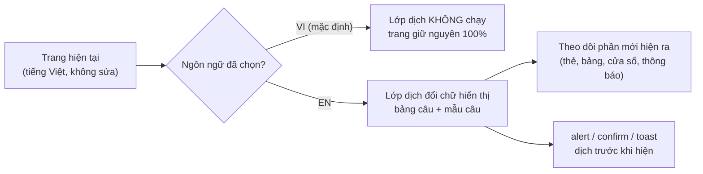
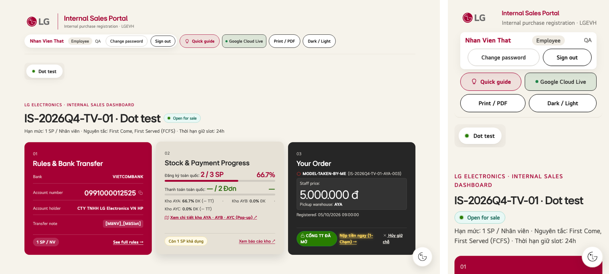

# Thêm tiếng Anh (nút VI/EN): đánh giá khả năng làm & kế hoạch

> **Trạng thái (08/10/2026):** ĐÁNH GIÁ + BẢN THỬ. **Chưa thay đổi web.** Chờ chủ dự án duyệt §6 trước khi làm.
> **Yêu cầu của chủ dự án:**
> - Giữ nguyên bản tiếng Việt, không đổi gì.
> - Thêm nút VI/EN; bản tiếng Anh **dịch đầy đủ**, ngắn gọn, dễ hiểu, **không song ngữ** trên cùng màn hình.
> - Quay lại bản hiện tại được bất cứ lúc nào.
> - Không đổi chức năng đã duyệt.

---

## 0. Kết luận
**Làm được.** Bản thử (§4) đã chứng minh 3 điều:
1. Ở chế độ **VI**, trang **giống hệt** bản hiện tại đến từng phần tử.
2. Ở chế độ **EN**, đầu trang, tab và thẻ đã sang tiếng Anh, **chức năng đăng ký giữ chỗ vẫn chạy**, không có lỗi JS.
3. Có thể tắt toàn bộ bằng **1 công tắc**.

Cách làm đề xuất là **lớp dịch chồng**: không sửa các câu chữ tiếng Việt đang có trong code, chỉ đổi phần chữ hiển thị khi người dùng chọn EN.

**Giới hạn, phải biết trước:**
- Nội dung do PM nhập (tên chương trình, mô tả tình trạng sản phẩm) **vẫn là tiếng Việt**.
- Email tự động và file Excel gửi kế toán **đề xuất giữ tiếng Việt** (xem Q-I1, Q-I2).

---

## 1. Khối lượng (đo trên `v2-final`)
| Nơi có chữ tiếng Việt | Số lượng | Ghi chú |
|---|---|---|
| HTML tĩnh: đoạn chữ | 725 (667 câu khác nhau) | Tab 1, tiêu đề, nhãn form, cửa sổ, hướng dẫn |
| Thuộc tính `placeholder` / `title` / `aria-label` / `alt` | 101 | |
| Chuỗi trong JavaScript | 890 (687 khác nhau) | Gồm 54 `alert`, 16 `confirm`, 59 `showToast`, 7 `showWait`, nhiều đoạn HTML tạo động |
| Dữ liệu demo (chỉ có ở bản demo, bản `portal.html` đã xoá) | khoảng 198 | **Không dịch** |
| Apps Script: câu trả về web hiển thị (`message`) | 107 (303 chuỗi có dấu) | Web hiện thẳng ở 30 chỗ |
| Email tự động | 7 tiêu đề + 6 mẫu nội dung | Máy chủ gửi |
| **Tổng cần dịch cho web** | **≈ 1.350 câu, ≈ 11.500 từ** | Sau khi bỏ trùng |

---

## 2. Rủi ro làm hỏng chức năng (đã đo) và cách tránh
| Rủi ro | Số chỗ | Cách tránh |
|---|---|---|
| **Trạng thái đơn được lưu bằng tiếng Việt** trong Google Sheet (`'Chờ nộp tiền'`, `'Đã khai nộp - chờ đối soát'`…) và **code so sánh trực tiếp** | 80 phép `===` / `!==` · 9 phép `includes` / `indexOf` · máy chủ dùng 21 chỗ | **Không bao giờ dịch giá trị.** Chỉ đổi **chữ hiển thị** trên huy hiệu và nhãn. Dữ liệu, máy chủ, Excel giữ nguyên giá trị tiếng Việt |
| Ô chọn `<option>` có **value** tiếng Việt (bộ lọc trạng thái PM) | 6 | Chỉ dịch chữ hiển thị của option, **giữ nguyên value** |
| **Code đọc lại chữ đang hiển thị** rồi so với tiếng Việt | **2** (bộ lọc tab 3, dòng 13073 & 13075: `row.innerText.includes('Đã Nộp' / 'Chờ Nộp')`) | **Phải sửa 2 dòng này** để so theo giá trị gốc, không theo chữ hiển thị. Đây là thay đổi chức năng duy nhất, rất nhỏ, có test |
| Câu báo lỗi **từ máy chủ** hiện thẳng lên web | 30 chỗ hiển thị · 107 câu | Dịch ở **phía web** bằng bảng đối chiếu câu và mẫu câu. **Không sửa Apps Script** |
| Câu có biến (`Bạn đã đăng ký ${n} sản phẩm…`) | phần lớn trong 890 chuỗi JS | Dịch bằng mẫu câu có chỗ trống. Câu nào không khớp sẽ **còn nguyên tiếng Việt**: đo được (§5), không hỏng chức năng |
| Chữ tiếng Anh dài/ngắn khác tiếng Việt làm vỡ bố cục | — | So ảnh EN ở 1440 / 1024 / 390px; chỉnh câu ngắn lại, không sửa CSS của bản VI |
| Nhận diện biên lai ngân hàng Việt Nam (OCR) | 3 bộ từ khoá | **Giữ nguyên**: biên lai luôn là tiếng Việt |

---

## 3. Cách làm đề xuất: lớp dịch chồng

- **Một file từ điển riêng** `assets/i18n/en.json`: câu tiếng Việt → câu tiếng Anh, cộng các mẫu câu có biến. Sửa lời dịch **không cần đụng code**.
- **Nút VI/EN** đặt cạnh nút "Đêm / Sáng" ở đầu trang và ở màn đăng nhập. Lựa chọn được nhớ trên máy (`localStorage`). Có thể ép bằng link `?lang=en` hoặc `?lang=vi`.
- **Không dịch:** giá trị dữ liệu và trạng thái lưu trên máy chủ, nội dung PM nhập, mã slot, serial, số tiền, ngày giờ, thông tin ngân hàng, nội dung chuyển khoản trong QR.
- **Văn phong:** câu ngắn, từ thông dụng. Bảng thuật ngữ thống nhất, ví dụ:
  - Giữ chỗ → *Reserve*
  - Kho → *Warehouse*
  - Cổng thanh toán → *Payment window*
  - Đối soát → *Payment check*
  - Kết sổ → *Close program*
  - Biên lai → *Receipt*
  - Ưu đãi nội bộ → *Staff deal*
  - Giữ nguyên tên riêng: Jeong-Do, VietQR, LG.com, Slot, PM

---

## 4. Bản thử đã chạy (08/10/2026)
Bản thử dùng lớp dịch chồng với khoảng 45 câu cho đầu trang, tab, đăng nhập và thẻ. Script: [`design/i18n/i18n_overlay_poc.js`](i18n/i18n_overlay_poc.js). Chạy trên **bản sao tạm, không đụng repo**.

| Phép thử | Kết quả |
|---|---|
| Chế độ VI: DOM so với bản gốc (che đồng hồ chạy theo giây) | **Giống hệt** ở màn đăng nhập (875.613 ký tự) và sau đăng nhập (892.178) |
| Chế độ EN: chữ tiếng Việt còn lại ở thanh người dùng + thanh tab | **0** |
| Chế độ EN: đăng ký giữ chỗ (máy chủ giả) | Vẫn gửi `register_product` thành công |
| Lỗi JS (VI và EN) | 0 |
| Chữ tiếng Việt còn hiện trên toàn trang (EN) | 109/133. Đúng như dự kiến, vì bản thử chỉ dịch khoảng 45 câu |

---

## 5. Tiêu chí nghiệm thu (đo được)
1. **VI giống hệt `v2-final`:** DOM và ảnh chụp trùng nhau ở 1920/1440/1280/1024/390px, cả 3 vai trò, sáng và tối (che đồng hồ).
2. **EN đầy đủ:** chữ tiếng Việt còn hiện = **0**, ngoại trừ vùng dữ liệu được đánh dấu "không dịch" (nội dung PM nhập, tên chương trình, mô tả sản phẩm).
3. **Chức năng:** toàn bộ test hồi quy (137 phép kiểm) chạy **ở cả VI và EN**, e2e 165, harness 98: tất cả đạt.
4. **Bộ lọc tab 3** (2 dòng sửa) lọc đúng ở cả VI và EN.
5. Kiểm tay trên 1 điện thoại thật ở chế độ EN: đăng nhập → giữ chỗ → nộp tiền → PM duyệt.

---

## 6. Quay lại bản hiện tại: 3 lớp an toàn
| Mức | Cách | Thời gian |
|---|---|---|
| Từng người | Bấm **VI**, hoặc mở link `?lang=vi` | Tức thì |
| Tất cả người dùng | Đổi **`I18N_ENABLED = false`** → ẩn nút, lớp dịch không chạy, trang về đúng bản hiện tại → build `portal.html` → push | Khoảng 5 phút |
| Bỏ hẳn | Build `portal.html` từ tag **`v2-final`** (hoặc tag của bản ngay trước) | Khoảng 5 phút |

Nhánh riêng `i18n/en` tạo từ `v2-final`. Mỗi bước có tag riêng. Apps Script **không đổi** (chỉ sửa web), nên không phải deploy máy chủ.

---

## 7. Cần chủ dự án quyết định
| # | Câu hỏi | Lựa chọn | Đề xuất |
|---|---|---|---|
| **Q-I1** | Email tự động (máy chủ gửi) | (a) Giữ tiếng Việt · (b) Theo ngôn ngữ người dùng chọn (phải sửa Apps Script, lưu ngôn ngữ mỗi người) | (a) |
| **Q-I2** | File Excel gửi giao hàng / kế toán | (a) Giữ tiêu đề tiếng Việt · (b) Theo ngôn ngữ đang chọn | (a): kế toán và kho dùng tiếng Việt, tránh sai lệch |
| **Q-I3** | Cách ghi tiền khi ở EN | (a) Giữ `1.875.000 đ` · (b) `1,875,000 VND` | (a): thống nhất với số trên biên lai / QR |
| **Q-I4** | Ai duyệt bản dịch **Tab 1 (thư thông báo và quy định)**? Đây là nội dung chính sách | Chủ dự án · HR/Pháp chế · Không cần | Chủ dự án duyệt nhanh. Claude đánh dấu câu nào là chính sách |
| **Q-I5** | Thứ tự với v3 (giao diện điện thoại) | (a) Làm v3 / Đợt 0 trước, rồi EN · (b) EN trước | (a): EN dịch theo chữ mới, tránh dịch 2 lần |
| **Q-I6** | Thời điểm | Trước hay sau mở bán 14/10 | **Sau 14/10**: khối lượng ≈ 11.500 từ cộng kiểm tra toàn bộ, không nên chen vào tuần mở bán |

**Ước lượng sau khi duyệt:**
- Dịch và rà thuật ngữ: khoảng 1,5–2 ngày làm việc.
- Lớp dịch, nút VI/EN, 2 dòng sửa bộ lọc, test cả 2 ngôn ngữ: khoảng 1 ngày.
- Chủ dự án duyệt bản dịch Tab 1: tuỳ Q-I4.
