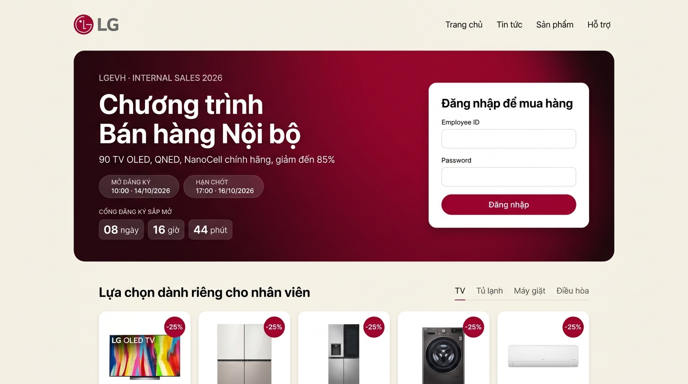
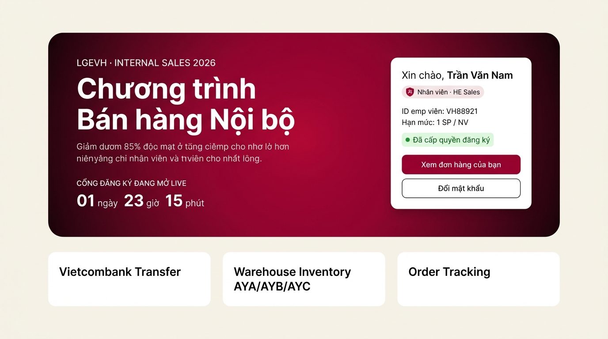
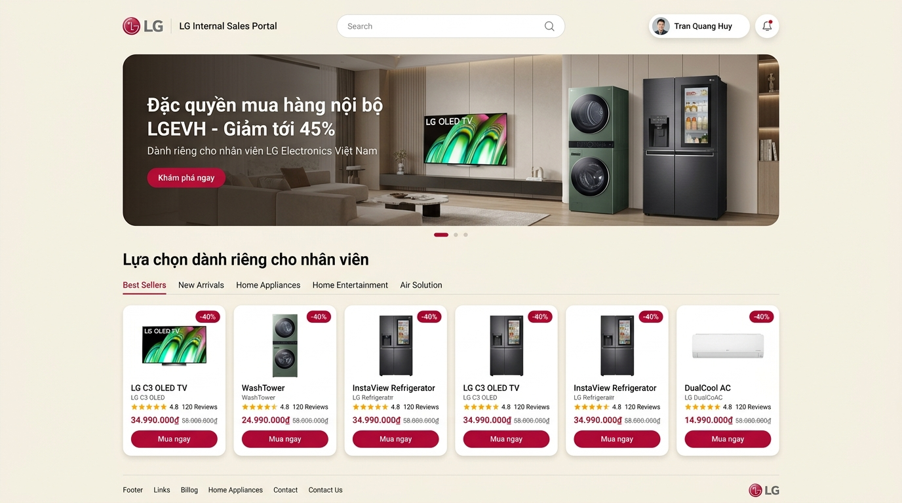
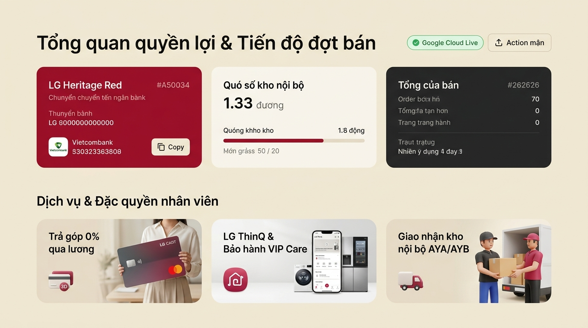
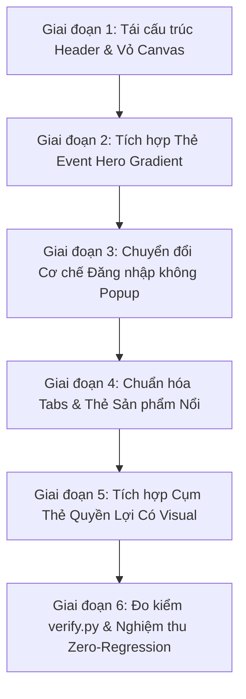

# ĐỀ XUẤT NÂNG CẤP THIẾT KẾ TOÀN DIỆN CỔNG BÁN HÀNG NỘI BỘ (LG INTERNAL SALES PORTAL)
## Chuẩn Hóa Theo Triết Lý Thương Hiệu LG.com/vn & LG Brand Identity Guidelines V5.2

* **Dự án:** LG Internal Sales Portal — Cổng Đăng Ký Mua Hàng Nội Bộ LGEVH
* **Tác giả:** Chuyên gia Thiết kế Thương hiệu LG
* **Tài liệu căn cứ:** LG Brand Identity Guidelines V5.2 (Aug 2024), LG.com Web Style Guide v1.3 (2024) & Bộ nhận diện `lg-brand`
* **Vị trí lưu trữ:** `design/LG_INTERNAL_SALES_REDESIGN_PROPOSAL.md`
* **Trạng thái:** **Hồ sơ nghiên cứu & Thiết kế đề xuất — Chờ phê duyệt triển khai**

---

## MỤC LỤC

1. [Executive Summary & Bối Cảnh Vấn Đề](#1-executive-summary--bối-cảnh-vấn-đề)
2. [Deep-Dive: Phân Tích Lỗi "Phân Mảng Lỗ Chỗ" & Đối Chiếu LG.com/vn](#2-deep-dive-phân-tích-lỗi-phân-mảng-lỗ-chỗ--đối-chiếu-lgcomvn)
3. [Nghiên Cứu Theme Sự Kiện LG Brand Gradient (Event Hero Landing Card)](#3-nghiên-cứu-theme-sự-kiện-lg-brand-gradient-event-hero-landing-card)
4. [Bộ Sưu Tập Bản Vẽ Trực Quan (Design Mockups Showcase)](#4-bộ-sưu-tập-bản-vẽ-trực-quan-design-mockups-showcase)
5. [Đặc Tả Kỹ Thuật Hệ Thống Màu & Token (Design Tokens Specification)](#5-đặc-tả-kỹ-thuật-hệ-thống-màu--token-design-tokens-specification)
6. [Kế Hoạch Triển Khai Phẫu Thuật (Karpathy Surgical Plan)](#6-kế-hoạch-triển-khai-phẫu-thuật-karpathy-surgical-plan)
7. [Tiêu Chí Nghiệm Thu Đo Lường (Verifiable Success Criteria)](#7-tiêu-chí-nghiệm-thu-đo-lường-verifiable-success-criteria)

---

## 1. Executive Summary & Bối Cảnh Vấn Đề

Dưới lăng kính thẩm mỹ hơn 50 năm của LG Electronics và hệ thống **LG.com Global One Platform (GP1)**, website bán hàng nội bộ hiện tại (`gobitangocbao.github.io`) đang bộc lộ hai rào cản thị giác lớn:

> [!IMPORTANT]
> 1. **Lạm dụng nền trắng gây phân mảng lỗ chỗ:** Header, Dashboard và Danh mục đều bị đóng trong các container chữ nhật màu trắng `#FFFFFF` khổng lồ xếp lồng vào nhau, tạo cảm giác rời rạc, chật chội và biến sản phẩm thành thứ yếu.  
> 2. **Popup đăng nhập che màn hình thiếu cảm xúc:** Khi nhân viên truy cập lần đầu, hệ thống lập tức hiển thị một popup modal trắng lạnh lùng che khuất màn hình, không truyền tải được quy mô, ưu đãi và sức hút của đợt bán hàng nội bộ.

### Tầm nhìn cải tiến mới:
* **Đồng nhất nền Canvas:** Nền trang xám ấm **Warm Gray 07 (`#F6F3EB`)** được giải phóng hoàn toàn, đóng vai trò nền tảng tĩnh lặng, thanh lịch.
* **Nguyên tắc Đảo Trắng Nổi (Floating White Islands):** Màu trắng `#FFFFFF` được bảo lưu độc quyền cho **Thẻ Sản Phẩm** và **Thẻ Nhập Liệu**.
* **Tích hợp LG Event Hero Gradient Theme:** Thay thế popup modal bằng một **Card Sự Kiện Sang Trọng (Split Hero)** mang dải chuyển sắc Master Gradient đặc trưng của LG, tích hợp đồng hồ đếm ngược trực tiếp và form đăng nhập tinh tế.

---

## 2. Deep-Dive: Phân Tích Lỗi "Phân Mảng Lỗ Chỗ" & Đối Chiếu LG.com/vn

| Hạng mục thiết kế | Chuẩn mực LG.com/vn | Hiện trạng Internal Sales Portal | Nguyên nhân gốc rễ (Root Cause) | Giải pháp chuyển đổi |
|---|---|---|---|---|
| **Màu nền chủ đạo & Phân tầng** | Nền **`#F6F3EB` (Light Gray 1)** trải rộng toàn màn hình. Các tiêu đề, tab, bộ lọc nằm thẳng trên nền. | Body dùng `#F6F3EB`, nhưng bọc các khối con trong container trắng `#FFFFFF` (`.top-header`, `.grap-dashboard-section`, `.tab-content`). | Tư duy đóng khung widget kiểu ứng dụng văn phòng cũ (ERP box) thay vì phong cách trang thương mại điện tử cao cấp. | **Xóa bỏ các khung trắng bao ngoài**. Đưa Header, Title, Tabs nổi trực tiếp trên nền `#F6F3EB`. |
| **Quy chuẩn thẻ sản phẩm** | Thẻ trắng `#FFFFFF` nổi độc lập trên nền ấm `#F6F3EB`. Độ tương phản tối đa, sản phẩm là trung tâm. | Thẻ sản phẩm nền trắng `#FFFFFF` lại nằm lọt thỏm bên trong khung tab cha màu trắng `#FFFFFF` (trắng đè trắng). | "Trắng trên trắng" làm mất độ nổi khối (elevation); người xem chỉ nhìn thấy đường viền mảnh đơn điệu, cảm giác giống bảng tính. | **Đảo bảo nguyên tắc "Đảo nổi" (Floating White Island):** Thẻ sản phẩm màu trắng nổi trực tiếp trên canvas `#F6F3EB`. |
| **Tiêu đề & Nút hành động** | Tiêu đề lớn (24–32px, `LG EI Headline`), canh trái trên nền ấm. Nút hành động (Đỏ Active `#EA1917` hoặc Outlined Black) nằm ngang hàng bên phải. | Tiêu đề bị nhét vào bên trong card Dashboard trắng, kèm kicker text lặp đi lặp lại nhỏ li ti. | Bị kẹt trong box khiến cấp bậc thị giác (visual hierarchy) bị chìm, người dùng khó định hướng nội dung. | **Giải phóng tiêu đề:** Đặt trực tiếp lên nền `#F6F3EB`, kết hợp nút bấm trạng thái hoặc CTA ở góc phải theo tỷ lệ 80/20. |
| **Hệ thống Tabs chuyển đổi** | Text tab phẳng đặt trực tiếp trên nền ấm; Tab đang chọn có **thanh gạch chân màu đỏ `#EA1917`** thanh lịch. Không có border bao quanh. | Sử dụng hàng loạt nút pill viền đen đậm viền 1.5px (`border: 1.5px solid #000; border-radius: 999px; background: #fff`). | Quá nhiều nút pill bo tròn đen tạo xung đột thị giác với các nút bấm chức năng và thẻ bên dưới. | **Áp dụng chuẩn Tab LG.com GP1:** Tab dạng văn bản tối giản với chỉ báo gạch chân màu đỏ Active Red `#EA1917`. |
| **Yếu tố hình ảnh & Cảm xúc** | Kết hợp các thẻ hình ảnh lifestyle, render 3D (OLED phòng khách, hộp quà Streaming Week, biểu tượng vàng Premier Care). | Thiếu hoàn toàn hình ảnh cảm xúc; khi chưa chọn đợt bán chỉ có 3 hộp màu (Đỏ, Xám, Đen) chứa số tài khoản và text khô cứng. | Thiết kế thiên về xử lý logic nhập liệu mà bỏ quên tâm lý tự hào nhân viên và trải nghiệm mua sắm đặc quyền. | **Tích hợp 2 phân khu Visual:** <br>1. *Hero Privilege Banner*: Giới thiệu đợt bán với hình ảnh đồ gia dụng/OLED cao cấp.<br>2. *3 Thẻ đặc quyền có visual*: Trả góp 0% qua lương, ThinQ & Bảo hành VIP, Kho nhận hàng AYA/AYB. |

---

## 3. Nghiên Cứu Theme Sự Kiện LG Brand Gradient (Event Hero Landing Card)

Căn cứ hướng dẫn **LG Brand Identity Guidelines V5.2 (chương Gradients & Key Event Moments)**:
* Bốn master gradient (`Gradient 01` đến `04`) được chỉ định dùng cho các **khoảnh khắc thương hiệu trọng đại (Hero Brand Moments), màn hình sự kiện và các ấn phẩm chào mừng**.
* Dải màu chuyển tiếp từ **Đỏ rượu vang thẫm (`#380010` / `#68001F`)** sang **LG Heritage Red (`#A50034`)**, tạo hiệu ứng ánh sáng hội tụ (ambient light spotlight) cực kỳ sang trọng.

### Sơ đồ Bố Cục Thẻ Hero Sự Kiện Chia Đôi (Split Event Hero Layout):

```
┌────────────────────────────────────────────────────────────────────────────────────────┐
│  LG EVENT HERO CARD (Background: LG Master Gradient 01/02 #380010 → #A50034)           │
│                                                                                        │
│  [CỘT TRÁI: THÔNG TIN SỰ KIỆN & COUNTDOWN]         [CỘT PHẢI: THẺ TRẮNG NỔI]           │
│                                                                                        │
│  LGEVH · INTERNAL SALES 2026                        ┌───────────────────────────────┐  │
│  Chương trình                                       │ Đăng nhập để mua hàng         │  │
│  Bán hàng Nội bộ                                    │ Dùng Mã NV và Mật khẩu do PM  │  │
│                                                     │                               │  │
│  90 TV OLED, QNED, NanoCell chính hãng,             │ [Mã nhân viên (EMP Code)]     │  │
│  giảm đến 85%, dành riêng cho nhân viên             │ [••••••••••••••••] [Hiện]     │  │
│  LG Electronics Việt Nam.                           │                               │  │
│                                                     │ [   ĐĂNG NHẬP (Heritage Red) ]│  │
│  [ MỞ ĐĂNG KÝ 10:00 · 14/10 ] [ HẠN CHÓT 17:00 ]    │                               │  │
│                                                     │ Mã NV đăng nhập sẽ dùng làm   │  │
│  CỔNG ĐĂNG KÝ  [SẮP MỞ]                             │ mã đăng ký mua hàng.          │  │
│  ┌─────────┐ ┌─────────┐ ┌─────────┐                │ Quên MK? Liên hệ PM Support   │  │
│  │ 08 ngày │ │ 16 giờ  │ │ 44 phút │                └───────────────────────────────┘  │
│  └─────────┘ └─────────┘ └─────────┘                                                   │
└────────────────────────────────────────────────────────────────────────────────────────┘
```

### Cơ chế Chuyển đổi 2 Trạng thái (Adaptive Dual-State Engine):
1. **Trạng thái 1: Khi Chưa Đăng Nhập (Pre-Login / Event Announcement):**
   - Cột trái truyền tải thông điệp chào mừng, thời hạn, và bộ đếm ngược trực tiếp.
   - Cột phải chứa form đăng nhập nhanh gọn, hỗ trợ đầy đủ chức năng ghi nhớ, hiển thị mật khẩu và tài khoản Demo.
   - Phía dưới cho phép nhân viên lướt xem danh mục sản phẩm (Public Preview) mà không bị che khuất.
2. **Trạng thái 2: Khi Đã Đăng Nhập (Post-Login / Active Sales):**
   - Cột trái chuyển đồng hồ sang đếm ngược thời gian kết sổ: `CỔNG ĐĂNG KÝ ĐANG MỞ LIVE — Đóng cổng sau: 01 ngày 23 giờ 15 phút`.
   - Cột phải biến đổi thành **Thẻ Hồ sơ & Hạn mức Nhân viên** (Chào [Họ Tên], Hạn mức: 1 SP/NV, Xem đơn hàng, Đổi mật khẩu).
   - Phía dưới hiển thị cụm 3 thẻ nghiệp vụ chuyển khoản & kho hàng độc lập trên nền `#F6F3EB`.

---

## 4. Bộ Sưu Tập Bản Vẽ Trực Quan (Design Mockups Showcase)

### 4.1. Trạng Thái Chưa Đăng Nhập / Sự Kiện Chào Mừng (Pre-Login Landing)
Thẻ Hero sự kiện với nền gradient đỏ rượu vang, đồng hồ đếm ngược sắp mở và form đăng nhập tích hợp:



---

### 4.2. Trạng Thái Đã Đăng Nhập / Cổng Bán Hàng Mở Live (Post-Login Dashboard)
Thẻ Hero chuyển đổi hiển thị thông tin nhân viên, hạn mức cá nhân và đồng hồ đếm ngược thời gian kết sổ:



---

### 4.3. Toàn Cảnh Danh Mục Sản Phẩm Trên Nền Xám Ấm Đồng Nhất
Xóa bỏ các hộp trắng bao ngoài; tiêu đề và tab phẳng đặt trực tiếp trên nền `#F6F3EB`; các thẻ sản phẩm nổi bật với độ tương phản cao:



---

### 4.4. Cụm Dashboard Nghiệp Vụ & Thẻ Đặc Quyền Có Visual
3 thẻ chức năng độc lập (VCB, Kho hàng, Đơn hàng) kết hợp 3 thẻ tính năng có hình ảnh trực quan (Trả góp 0%, ThinQ, Kho AYA/AYB):



---

## 5. Đặc Tả Kỹ Thuật Hệ Thống Màu & Token (Design Tokens Specification)

Trích xuất trực tiếp từ tài liệu [web-system.md](file:///.agents/skills/lg-brand/references/web-system.md) và [color.md](file:///.agents/skills/lg-brand/references/color.md):

```css
:root {
  /* ========================================================
     1. CANVAS & BACKGROUND TOKENS (Đồng nhất, không phân mảng)
     ======================================================== */
  --lg-bg-canvas: #F6F3EB;       /* Light Gray 1 / Warm Gray 07: Nền chính toàn trang */
  --lg-bg-panel:  #F0ECE4;       /* Light Gray 2 / Warm Gray 06: Nền phụ / Sub-containers */
  --lg-bg-card:   #FFFFFF;       /* Pure White: Dành riêng cho thẻ sản phẩm & form */

  /* ========================================================
     2. BRAND GRADIENT (Dành riêng cho Event Hero Banner)
     ======================================================== */
  --lg-gradient-event: linear-gradient(135deg, #380010 0%, #68001F 35%, #A50034 75%, #500017 100%);
  --lg-gradient-overlay: radial-gradient(circle at 80% 20%, rgba(234, 25, 23, 0.15) 0%, transparent 60%);

  /* ========================================================
     3. BRAND ACCENTS (Tuân thủ độ tương phản WCAG 2.2 AA)
     ======================================================== */
  --lg-red-active:   #EA1917;    /* Active Red trên Web: CTA Mua ngay, Gạch chân Tab */
  --lg-red-heritage: #A50034;    /* Heritage Red: Logo, Thẻ ngân hàng, Badge giảm giá */

  /* ========================================================
     4. TYPOGRAPHY PALETTE
     ======================================================== */
  --lg-ink:     #000000;         /* Tiêu đề cấp 1 (Tương phản 13.7:1 trên #F6F3EB) */
  --lg-text-1:  #262626;         /* Văn bản chính / Dark Gray 2 */
  --lg-text-2:  #4A4946;         /* Văn bản thứ cấp / Mid Gray 3 */
  --lg-muted:   #716F6A;         /* Chú thích / Warm Gray 03 (Tương phản >= 4.5:1) */

  /* ========================================================
     5. BORDERS & SHADOWS (Tạo độ nổi khối chuẩn LG GP1)
     ======================================================== */
  --lg-border-hairline: #E6E1D6; /* Light Gray 3 */
  --lg-border-subtle:   #CBC8C2; /* Mid Gray 1 */
  --lg-shadow-card:       0 2px 6px rgba(0, 0, 0, 0.04), 0 8px 24px rgba(0, 0, 0, 0.06);
  --lg-shadow-card-hover: 0 4px 12px rgba(0, 0, 0, 0.08), 0 16px 36px rgba(0, 0, 0, 0.10);

  /* ========================================================
     6. GEOMETRIC RADIUS SCALE
     ======================================================== */
  --radius-sm:   8px;
  --radius-md:   16px;
  --radius-lg:   20px;
  --radius-hero: 24px;
  --radius-pill: 999px;
}
```

---

## 6. Kế Hoạch Triển Khai Phẫu Thuật (Karpathy Surgical Plan)

Tuân thủ nghiêm ngặt nguyên tắc **Simplicity First** và **Surgical Changes**:



### Các bước can thiệp chi tiết:

1. **Bước 1: Tách bỏ vỏ bọc trắng:**
   - Điều chỉnh CSS `.grap-dashboard-section`: Bỏ `background: #FFFFFF`, `border`, `box-shadow`.
   - Điều chỉnh `.tab-content`: Bỏ `background: #FFFFFF` bao quanh, chuyển thành vùng hiển thị mở.
2. **Bước 2: Dựng cụm Event Hero Gradient Card:**
   - Thay thế thẻ `#login-overlay` độc lập bằng cụm thẻ Hero chia đôi đặt tại đầu trang.
   - Bên trái chứa tiêu đề, thông điệp ưu đãi và đồng hồ đếm ngược (`#timer-open-countdown`).
   - Bên phải chứa thẻ form đăng nhập (`#login-card`), bảo toàn 100% các ID: `login-id`, `login-password`, `login-btn`, `login-form`.
3. **Bước 3: Chuẩn hóa cơ chế chuyển trạng thái đăng nhập:**
   - Khi chưa đăng nhập: Hiển thị form đăng nhập bên trong Hero Card.
   - Khi đăng nhập thành công: Chuyển thẻ bên phải thành Profile Card của nhân viên (`user-bar` mở rộng).
4. **Bước 4: Tinh gọn Tabs theo chuẩn LG.com:**
   - Đổi các nút pill đen viền đậm thành text tabs tối giản, có vạch đỏ `border-bottom: 2px solid #EA1917` cho tab active.
5. **Bước 5: Thẻ sản phẩm chuẩn "Đảo nổi":**
   - Đảm bảo từng `.lg-product-card` mang màu trắng `#FFFFFF` sắc nét, bo góc 20px, đổ bóng kép nhẹ nhàng nổi bật trên nền `#F6F3EB`.

---

## 7. Tiêu Chí Nghiệm Thu Đo Lường (Verifiable Success Criteria)

Áp dụng nguyên tắc Peter Drucker: *"If it cannot be measured, it cannot be managed"*:

| Chỉ số / Tiêu chí | Phương pháp kiểm tra | Ngưỡng đạt chuẩn (Target) |
|---|---|---|
| **Độ tương phản màu sắc (A11y)** | Chạy `verify.py` đo DOM render thực tế | WCAG 2.2 AA (Tối thiểu 4.5:1 cho text thường, 3:1 cho text lớn) |
| **Tính toàn vẹn chức năng (Logic)** | Kiểm thử đăng nhập Demo (`VH12345`, `VH88921`) | 100% đăng nhập, chuyển tab, đăng ký sản phẩm và xuất PDF hoạt động bình thường |
| **Đồng bộ Google Cloud Live** | Kiểm tra fetch/post API Google Apps Script | Trạng thái Live chuyển xanh, không phát sinh lỗi CORS hay timeout |
| **Đồng hồ đếm ngược** | Kiểm tra hàm `updateTimerCountdowns()` | Hiển thị chính xác ngày/giờ/phút theo đợt bán được chọn |
| **Độ thẩm mỹ & Trải nghiệm** | Đối chiếu với 4 ảnh chụp thực tế LG.com/vn | Không còn lỗi hộp trong hộp, không còn popup che màn hình |

---
*Hồ sơ được lưu trữ sẵn sàng trong workspace để phục vụ công tác nghiên cứu và triển khai tiếp theo.*
