# ĐỀ XUẤT NÂNG CẤP GIAO DIỆN v2 — "WARM CANVAS · SEGMENTED · FOCUS CARD"
### LG Internal Sales Portal — chỉ nâng cấp UI, giữ nguyên 100% chức năng và luồng sử dụng

| | |
|---|---|
| Ngày | 05/10/2026 |
| Trạng thái | **Đã duyệt 05/10/2026** (hướng v2, đỏ `#EA1917`, đăng nhập Gradient 04; không có file EI Form; font đã được phép). **GĐ1 đã làm** — xem §11 |
| Áp dụng trên | Tag `v1.4` (bản đang chạy) |
| Căn cứ | lg-brand: `web-system.md` (LG.com Web Style Guide v1.3), `color.md`, `typography.md`, `ei-form.md`, `donts.md` · 7 ảnh tham chiếu LG design system do chủ dự án cung cấp · đề xuất cũ `LG_INTERNAL_SALES_REDESIGN_PROPOSAL.md` · **số đo trên trang thật** |
| Bản mẫu | `v2/prototype/*.html` + ảnh `v2/after_*.png` (dựng bằng font LG EI, logo và Gradient 04 thật; dữ liệu demo thật của app). Mở file HTML cần tạo 2 liên kết cạnh file: `SKILL` → thư mục skill lg-brand, `REPO` → thư mục dự án (font/logo **không** chép vào repo) |

Ký hiệu độ tin cậy: **[ĐO]** đo trên trình duyệt · **[NGUỒN]** có trong tài liệu lg-brand · **[SUY LUẬN]** · **[CHƯA RÕ]**.

---

## 0. Kết luận trong 30 giây

1. Vấn đề lớn nhất của giao diện hiện tại **không phải màu, mà là chữ quá nhỏ và quá nhiều kiểu**: 70 % chữ ≤ 12,5 px, 11 bán kính bo góc, 18 kiểu đổ bóng, 42 chỗ chữ không đạt tương phản WCAG AA, 32 đoạn chữ đang hiện bằng **Arial** thay vì LG EI. **[ĐO]**
2. Hướng đi đề xuất lấy đúng 3 mẫu hình trong ảnh tham chiếu LG anh/chị gửi: **nền ấm liền mạch** (Warm Canvas) · **thanh chọn dạng "segmented"** (track xám + viên trắng) · **thẻ Focus** (thẻ tối, chữ số lớn) — áp vào đúng các khối app đang có, **không thêm chức năng, không đổi ID/luồng**.
3. Đề xuất cũ trong `design/` có 3 điểm **không dùng được**: tự tạo gradient (vi phạm guideline), bỏ popup đăng nhập (đổi luồng UX), và ảnh mẫu do AI vẽ có tính năng không tồn tại. Giữ lại phần đúng: nền ấm + "đảo trắng nổi".
4. Triển khai **từng lớp CSS có công tắc** (`html.ui-v2`) → lùi lại bằng 1 dòng; 5 giai đoạn, mỗi giai đoạn có test đo được.

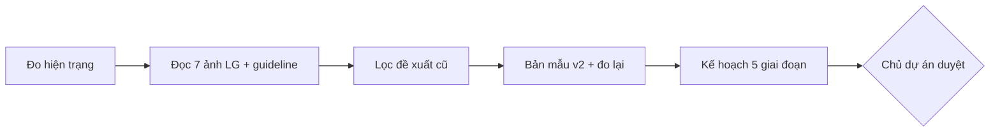

---

## 1. Hiện trạng — số đo trên trang thật (bản demo, đăng nhập Nhân viên + PM, 1440 px) [ĐO]

| Chỉ số | Hiện tại | Chuẩn tham chiếu | Đánh giá |
|---|---|---|---|
| Cỡ chữ phổ biến nhất | **11 px** (49 lần), 12 px (38), 11,5 px (36), 12,5 px (31) | LG.com: body/nút 16 px, tag 14–16 px, menu nhỏ 16 px [NGUỒN] | 🔴 Quá nhỏ, khó đọc trên laptop văn phòng |
| Số cỡ chữ khác nhau | 15 | ~8 bậc trong thang LG.com | 🟠 |
| Font hiển thị **Arial** | 32 đoạn (18 nút + 14 span) | Chỉ LG EI [NGUỒN] | 🔴 Nút bấm không kế thừa font |
| LG EI Headline đậm 700 | 26 chỗ — nhưng trang **chỉ nhúng bản 600** | Không dùng faux bold [NGUỒN] | 🟠 Trình duyệt tự "tô đậm giả" |
| Chữ không đạt AA (≥ 4,5:1) | **42 chỗ**: Warm Gray 03 trên panel Warm Gray 06 (4,26:1) ×28; chữ trắng trên `#CBC8C2` nút "Đã có người giữ chỗ" (1,67:1) ×4; `#8C8A84` (3,11:1); xanh `#2980B9` ngoài bảng màu | 4,5:1 [NGUỒN] | 🔴 |
| Bán kính bo góc | 11 giá trị (2, 3, 4, 6, 8, 10, 12, 16, 999 px, 50 %…) | 4 bậc là đủ | 🟠 |
| Kiểu đổ bóng | 18 | 1–2 | 🟠 |
| Màu chữ khác nhau | 19 | ~6 vai trò | 🟠 |
| Cấu trúc khối | Hộp trắng lồng hộp trắng (header, dashboard, tab đều là khung trắng) | LG.com: nội dung nằm trên nền ấm, chỉ thẻ là trắng | 🟠 |
| Mobile 390 px | Header xếp 6 nút thành 3 hàng trước khi thấy nội dung | — | 🟠 |

| Hiện tại — Danh mục (Nhân viên) | Hiện tại — Bảng điều khiển PM |
|---|---|
| 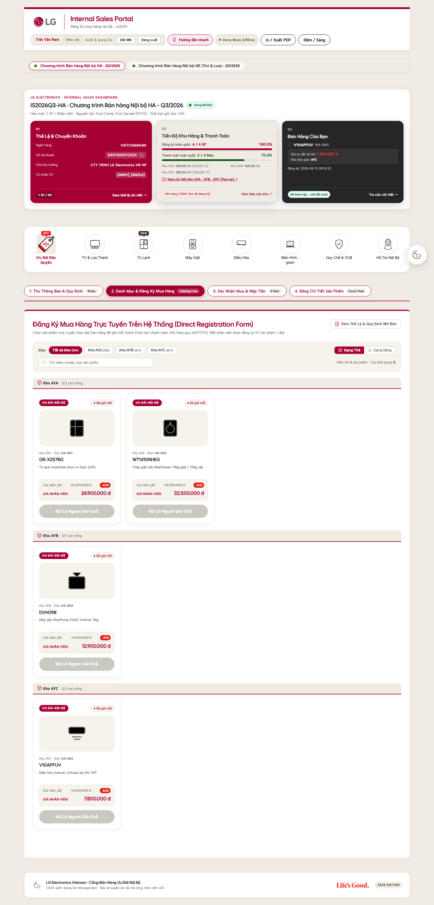 | 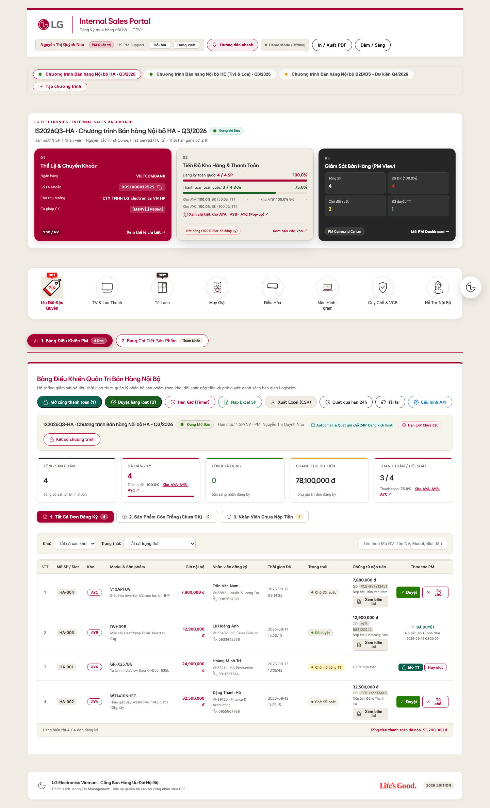 |

---

## 2. Đọc 7 ảnh tham chiếu LG design system

> Nguồn ảnh: chủ dự án cung cấp; **[SUY LUẬN]** là trang giới thiệu hệ thống thiết kế thương hiệu LG. Tôi chỉ lấy **nguyên lý bố cục**, không sao chép hình dạng hay ảnh.

| Ảnh | Quan sát | Nguyên lý rút ra | Áp vào app? |
|---|---|---|---|
| Hero / Connect / Focus Mode — thanh chọn | Track xám ấm, mục đang chọn là **viên trắng** chữ đen; không viền đen | **Segmented control** cho mọi lựa chọn ngang hàng | ✅ Chọn chương trình, 4 tab chính, lọc kho |
| Focus Mode — loa XBoom | **Thẻ tối** trên ảnh, **chữ số rất lớn, nét mảnh** (360 / 10), nhãn nhỏ, CTA viên đỏ | **Thẻ Focus**: 1 con số chính, nhãn phụ, 1 hành động | ✅ Ô 03 "Đơn hàng của bạn", KPI PM |
| Connect Mode — billboard | EI Form cắt ảnh người, nền là chính ảnh đó làm mờ, logo trên-trái, slogan dưới-phải | Bố cục chiến dịch | ❌ App không có ảnh người/sản phẩm thật (xem §5) |
| Hero Mode — tòa nhà Life's Good | Khoảnh khắc thương hiệu toàn khổ | Hero chỉ dùng cho **khoảnh khắc** | ✅ Chỉ màn đăng nhập (Gradient 04 thật) |
| "Design system comes together" | Thẻ bo lớn, nền ấm/trắng/tối luân phiên, CTA viên đỏ, thanh menu dạng viên | **3 loại thẻ** (trắng · ấm · tối) + CTA viên | ✅ |
| "Inspired by the shapes of LG products" | Hình EI sinh ra từ đường cong sản phẩm | EI Form là tài sản cố định | ⚠️ Chỉ dùng khi có file gốc |
| Core State / Connected State | Hình cơ bản đứng riêng; trạng thái nối khi chuyển động | Core không được ghép với nhau [NGUỒN] | ⚠️ Như trên |

---

## 3. Đánh giá đề xuất cũ (`design/LG_INTERNAL_SALES_REDESIGN_PROPOSAL.md`)

| Nội dung đề xuất cũ | Kết luận | Lý do |
|---|---|---|
| Nền `#F6F3EB` liền mạch, bỏ hộp trắng lồng nhau | ✅ **Giữ** | Đúng web-system; trùng số đo §1 |
| "Đảo trắng nổi" — chỉ thẻ là trắng | ✅ **Giữ** | |
| Bộ token màu (Warm Gray, `#EA1917`, `#A50034`) | ✅ Giữ, sửa nhỏ | `#000` trên `#F6F3EB` không phải 13,7:1 (13,7:1 là `#262626`) |
| Gradient `#380010 → #68001F → #A50034 → #500017` viết bằng CSS | ❌ **Bỏ** | Đo 4 gradient gốc: 01 hồng nhạt, 02 cam hồng, 03 đỏ–kem, **04 đen–đỏ `#D30512`**. Dải màu đề xuất **không trùng gradient gốc nào** → là gradient tự tạo, guideline cấm (donts: Gradients #1, #5) [ĐO + NGUỒN]. Thay bằng **file Gradient 04 thật** |
| Bỏ popup đăng nhập, đưa form vào thẻ Hero; cho xem danh mục khi chưa đăng nhập | ❌ **Bỏ** | Đổi luồng UX (yêu cầu giữ nguyên UX) và **lộ giá nội bộ cho người chưa đăng nhập** — đổi chức năng/bảo mật. v2 giữ popup, chỉ đổi nền & thẻ |
| Tab gạch chân đỏ "chuẩn LG.com GP1" | ⚠️ Thay | Không có trong `web-system.md` [CHƯA RÕ]; ảnh tham chiếu anh/chị gửi dùng **segmented** |
| Ảnh mẫu 01–04 | ❌ Không dùng làm đặc tả | [SUY LUẬN] ảnh do AI tạo: chữ tiếng Việt lỗi ("Quó số kho nội bộ", "Giảm dươm 85%"), và có **tính năng không tồn tại**: ô tìm kiếm toàn trang, chuông thông báo, sao đánh giá/120 reviews, "Mua ngay", "Trả góp 0% qua lương", "Bảo hành VIP Care", giao hàng; số liệu "giảm đến 85%/45%" chưa có nguồn |
| 3 thẻ "đặc quyền có visual" | ❌ Bỏ | Quyền lợi không có trong chính sách đợt bán (Thư thông báo ghi "No Warranty") |

---

## 4. Hướng đi v2 — 6 nguyên tắc

| # | Nguyên tắc | Cụ thể |
|---|---|---|
| 1 | **Warm Canvas** | Nền `#F6F3EB` toàn trang. Header, tiêu đề, thanh chọn nằm thẳng trên nền. Bỏ các khung trắng bao ngoài |
| 2 | **3 loại thẻ, không hơn** | Trắng (thông tin & sản phẩm) · Ấm `#F0ECE4` (vùng phụ, giếng ảnh) · **Focus tối `#1A1A1A`** (1 con số quan trọng nhất của người đang xem) |
| 3 | **Segmented thay cho viên viền đen** | Track `#F0ECE4`, mục chọn = viên trắng chữ đen; dùng cho chương trình, 4 tab, lọc kho |
| 4 | **Chữ to, ít bậc** | Sàn 14 px (nhãn, bảng), 16 px (nội dung, nút), số lớn dùng EI Headline Light 48–64 px |
| 5 | **Đỏ chỉ cho hành động** | Active Red `#EA1917` = nút chính (Đăng ký giữ chỗ, Duyệt, Mở cổng TT, Đăng nhập) và cờ % giảm trên nền trắng. Heritage `#A50034` = lỗi/cảnh báo trên nền xám. Bỏ khối đỏ lớn ô 01 (guideline: tránh đỏ thừa) |
| 6 | **Hero chỉ 1 khoảnh khắc** | Màn đăng nhập dùng **Gradient 04 gốc** phủ toàn màn (crop "cover"), thẻ trắng ở giữa. Các màn làm việc không dùng gradient |

| Sau — trang Nhân viên + dải PM (1440 px) | Sau — đăng nhập (Gradient 04 gốc) |
|---|---|
| 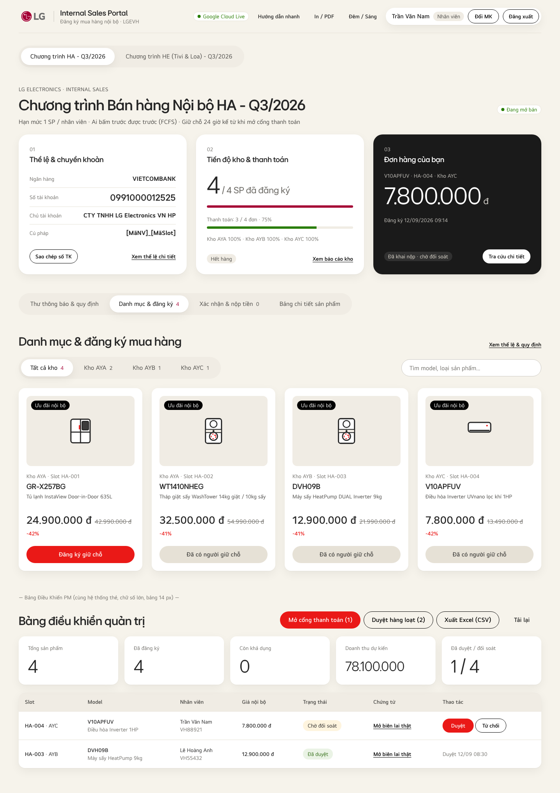 | 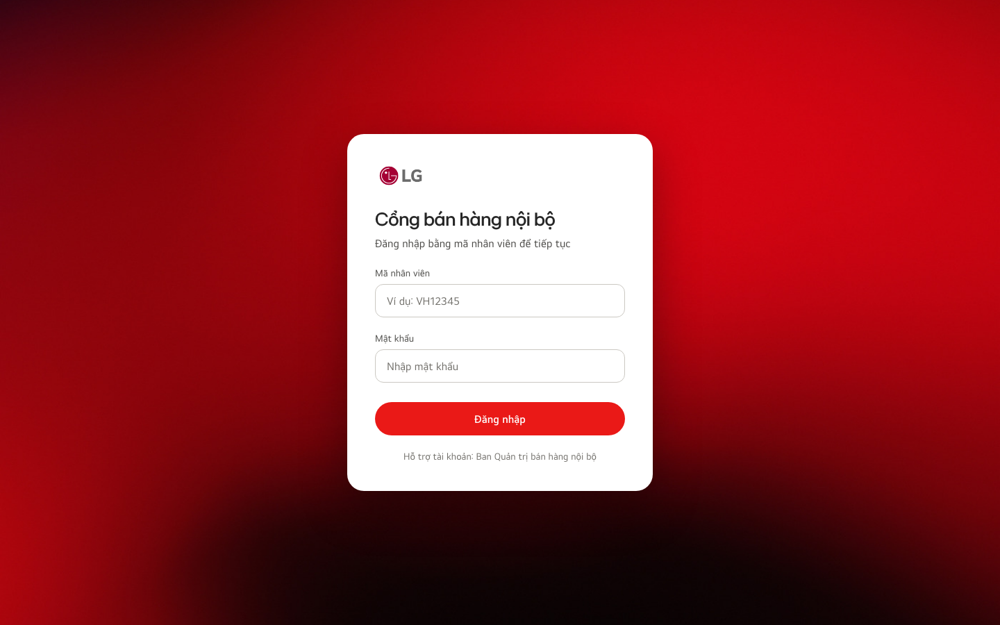 |

| Trước — mobile 390 px | Sau — mobile 390 px |
|---|---|
| 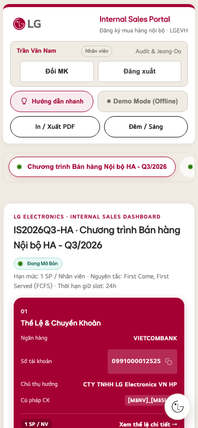 | 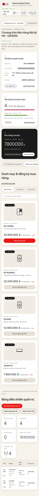 |

**Số đo trên bản mẫu [ĐO]:** 136 đoạn chữ · cỡ nhỏ nhất **14 px** · **0 Arial** · chỉ font LG EI thật đã nạp (không faux bold) · **0 lỗi tương phản** (sau khi tự sửa 1 lỗi: số đếm trên track `#F0ECE4` phải dùng Warm Gray 02) · không cuộn ngang ở 390 px.

---

## 5. Những gì v2 **cố ý không làm**

| Không làm | Vì sao |
|---|---|
| Vẽ EI Form bằng `border-radius`/SVG chép từ ảnh | Guideline cấm mô phỏng EI Form; file gốc không có trong bộ asset [NGUỒN]. **Đề xuất:** xin file EI Form từ cổng asset LG → khi có, dùng cho Tab 1 (Thư thông báo) |
| Ảnh sản phẩm/lifestyle trong thẻ | Dữ liệu `Products` không có cột ảnh (12 cột) — thêm là đổi chức năng. Giữ icon danh mục LG sẵn có, đặt trong "giếng" ấm cho gọn |
| Gradient tự tạo, 2 gradient/trang, gradient trong thẻ | Cấm [NGUỒN] |
| Đổi ID, class mà JS/test dùng, đổi thứ tự/luồng | Giữ chức năng & 58 + 165 + 67 test |
| Logo động, slogan cạnh logo | Cấm [NGUỒN] |
| Tính năng mới (tìm kiếm toàn trang, thông báo, đánh giá…) | Ngoài phạm vi UI |

---

## 6. Đặc tả token & thành phần

### 6.1. Token (mọi giá trị có nguồn)

| Token | Giá trị | Nguồn / số đo |
|---|---|---|
| `--bg` | `#F6F3EB` Light Gray 1 | web-system |
| `--track` / panel | `#F0ECE4` Light Gray 2 | web-system |
| `--line` | `#E6E1D6` Light Gray 3 · `--line-2` `#CBC8C2` (viền input, **không làm chữ** — 1,5:1) | color.md |
| `--ink` | `#262626` (13,7:1 trên nền) | color.md |
| `--body` | `#4A4946` (8,1:1; dùng cho chữ **trong panel xám**) | color.md |
| `--mute` | `#716F6A` — **chỉ trên nền trắng/`#F6F3EB`**, không trên `#F0ECE4` (4,3:1) | color.md + đo |
| `--focus` | `#1A1A1A` Dark Gray 3; chữ phụ trên tối dùng `#CBC8C2` (9,1:1), **không** Warm Gray 03 (3,0:1) | web-system, color.md |
| `--red` | `#EA1917` (web) — chữ trắng trên nó 4,5:1 | color.md |
| `--heritage` | `#A50034` — cờ khuyến mãi/lỗi trên nền xám | web-system |
| Xanh hợp lệ | `#287D00` trên trắng · `#316D15` trên xám | web-system |
| Bo góc | 8 · 16 (thẻ) · 24 (thẻ lớn, hero) · 999 (nút, segmented) | [SUY LUẬN] từ ảnh tham chiếu — guideline không quy định bán kính |
| Bóng | 1 kiểu: `0 1px 2px rgba(0,0,0,.04), 0 8px 24px rgba(0,0,0,.06)` | [SUY LUẬN] |
| Font | Tiêu đề EI Headline **600**; số lớn EI Headline **300**; chữ EI Text 400/600 | typography.md |

### 6.2. Thang chữ (theo LG.com, thu nhỏ cho app làm việc)

| Vai trò | Desktop | Mobile |
|---|---|---|
| Tiêu đề trang | EI Headline 600 · 40/48 | 28/32 |
| Tiêu đề mục | 32/40 | 24/28 |
| Tiêu đề thẻ, tên model | 20/24 | 20/24 |
| Số lớn (Focus, KPI) | EI Headline 300 · 48–64 | 48 |
| Giá nhân viên | EI Text 600 · 28 (Price Large thu gọn) | 24 |
| Nội dung, nút, giá gốc | 16 | 16 |
| Nhãn, bảng, meta | **14 (sàn)** | 14 |

### 6.3. Thành phần

| Thành phần | Hiện tại | v2 |
|---|---|---|
| Header | Khung trắng + 7 nút viền đen chen nhau | Nằm trên nền; logo + tên; trạng thái "Google Cloud Live"; 3 nút phụ dạng chữ; cụm người dùng là 1 viên trắng (tên · vai trò · Đổi MK · Đăng xuất). Mobile: nút phụ vào menu |
| Chọn chương trình | Viên viền đỏ/đen trong khung trắng | Segmented |
| Ô 01 Thể lệ & CK | Khối **đỏ đặc** | Thẻ trắng; **số TK 24 px EI Headline** dễ đọc/chép |
| Ô 02 Tiến độ | Panel xám, chữ 11 px | Thẻ trắng; số lớn "4 / 4 SP"; thanh tiến độ |
| Ô 03 Đơn hàng / PM | Thẻ tối chữ nhỏ | **Thẻ Focus**: số tiền 64 px, 1 trạng thái, 1 nút |
| 4 tab chính | Viên viền đỏ + nhãn phụ nhỏ | Segmented, số đếm 14 px |
| Thẻ sản phẩm | Trắng trong khung trắng, chữ 11–13 px | Thẻ trắng trên nền; giếng ấm chứa icon; model 20 px; giá 28 px; cờ % đỏ; nút 44 px |
| Nút "Đã có người giữ chỗ" | Chữ trắng trên `#CBC8C2` (1,67:1) | Nền `#E6E1D6`, chữ `#4A4946` |
| KPI PM | 5 ô viền màu, số 22 px | 5 thẻ trắng, số 48 px nét mảnh |
| Bảng PM | 11–12 px, nhiều viền | 14 px, đầu bảng nền ấm, trạng thái dạng tag |
| Màn đăng nhập | Thẻ trắng trên trang bị làm mờ | Thẻ trắng trên **Gradient 04 gốc** toàn màn; nút đỏ viên; giữ nguyên các ô, ID, tài khoản demo (chỉ bản demo) |
| Chế độ Đêm | Có | Ánh xạ token tối theo `lg-tokens.css` (nền `#262626`, chữ phụ `#CBC8C2`) |

---

## 7. Kế hoạch triển khai (chỉ làm sau khi duyệt)

**Cách làm an toàn:** thêm **một khối CSS mới** gắn với class `html.ui-v2` (đặt ở cuối `<style>`), không sửa CSS cũ, không đổi ID/class mà JS dùng. Bật bằng 1 dòng; **lùi lại = bỏ class**. Mỗi giai đoạn = 1 tag (v1.5, v1.6…), quy trình như v1.1 (nhánh → test → gộp → build `portal.html`). Không đụng `Code.gs` → không cần deploy Apps Script.

| GĐ | Nội dung | Rủi ro | Kiểm thử thêm | Ước lượng |
|---|---|---|---|---|
| **1. Nền móng** | Token; `button, input, select {font: inherit}` (hết Arial); nhúng EI Headline 300/700 hoặc đổi 700→600 (hết faux bold); sàn chữ 14 px; sửa 42 lỗi tương phản | Thấp — chỉ CSS | Test mới: 0 Arial, 0 lỗi AA, cỡ chữ ≥ 14 px | S |
| **2. Canvas & header** | Bỏ khung trắng bao ngoài; header mới; segmented cho chọn chương trình & 4 tab | Trung bình — vị trí Hướng dẫn (tour) đổi | Kịch bản 12 (khung tour) + chụp ảnh so sánh 1440/390 | M |
| **3. Thẻ dashboard** | Ô 01 trắng, ô 02 số lớn, ô 03 thẻ Focus; KPI PM | Thấp | Ô 02 "Đang tải…/Hết hàng" (Kịch bản 9–10) giữ đúng | M |
| **4. Danh mục & bảng** | Thẻ sản phẩm, nút trạng thái, lọc kho segmented, bảng PM 14 px | Trung bình — bảng PM nhiều cột | Kịch bản giữ chỗ, duyệt, cửa sổ biên lai (Kịch bản 11) | M |
| **5. Đăng nhập & mobile** | Nền Gradient 04 cho popup đăng nhập; header mobile gọn; kiểm chế độ Đêm, In/PDF | Thấp | Kịch bản 13 (chờ 45 s), không cuộn ngang 390 px, in PDF | S |

Sau mỗi GĐ: 3 bộ test hiện có (giao diện 58, e2e 165, máy chủ 67) phải ĐẠT + kiểm thử trên link thật.

---

## 8. Tiêu chí nghiệm thu (đo được)

| Chỉ số | Hiện tại [ĐO] | Mục tiêu | Cách đo |
|---|---|---|---|
| Đoạn chữ dùng Arial | 32 | **0** | Script đếm `getComputedStyle` |
| Chữ dưới 14 px | ~70 % | **0** (trừ chú thích in) | như trên |
| Lỗi tương phản AA | 42 | **0** | như trên, nền đục |
| Bán kính bo góc | 11 | ≤ 4 | như trên |
| Kiểu đổ bóng | 18 | ≤ 2 | như trên |
| Cuộn ngang 390 px | — | Không | `scrollWidth` |
| Chức năng | 58 / 165 / 67 test | Giữ nguyên ĐẠT | 3 bộ test |
| Gradient | — | Chỉ file Gradient 04 gốc, 1 lần, ở đăng nhập | `brand_check.py` |

---

## 9. Điều kiện khiến đề xuất này sai (cần biết trước)

- Nếu đội Brand LG Việt Nam có **bộ UI kit nội bộ riêng** cho công cụ nội bộ → dùng bộ đó thay cho mẫu suy ra từ ảnh tham chiếu.
- Nếu nhân viên chủ yếu dùng **điện thoại** → ưu tiên GĐ 5 lên trước GĐ 2.
- Bán kính bo góc và đổ bóng là **suy luận từ ảnh**, guideline không quy định — Brand có thể yêu cầu khác.
- Màn đăng nhập Gradient 04: guideline cho phép gradient ở "web banner / khoảnh khắc thương hiệu" [NGUỒN]; dùng làm **nền toàn màn** sau popup là diễn giải của tôi — nên hỏi Brand nếu cần chắc chắn.

---

## 10. Cần chủ dự án quyết định

| # | Câu hỏi | Khuyến nghị |
|---|---|---|
| 1 | Duyệt hướng đi v2 và làm theo 5 giai đoạn? | Có — bắt đầu GĐ 1 (rủi ro thấp, lợi ích lớn nhất: chữ đọc được) |
| 2 | Đỏ chính cho web: `#EA1917` (LG.com) thay `#A50034` ở nút chính? | Có — đây là trang web; Heritage giữ cho cờ/lỗi |
| 3 | Đăng nhập dùng Gradient 04 (tối, đỏ) hay Gradient 01 (hồng nhạt, ấm)? | 04 — gần ý tưởng "sự kiện" của đề xuất cũ nhưng là asset thật |
| 4 | Xin file **EI Form** gốc từ cổng asset LG? | Có — để dùng cho Tab 1 sau này; chưa có thì không dùng |
| 5 | ⚠️ **Bản quyền font:** font LG EI đang được nhúng (base64) trong `Mau_Dang_Ky_Internal_Sales_3009.html` / `portal.html` trên **repo GitHub công khai**. lg-brand ghi font cấp phép cho LG Electronics, không chia sẻ ra ngoài công ty | Hỏi Brand/IT LG: chấp nhận, hay chuyển repo sang riêng tư / host nội bộ. Không thuộc phạm vi UI nhưng nên xử lý trước khi mở rộng |

---

## 11. Quyết định của chủ dự án & tiến độ (cập nhật 05/10/2026)

| # | Câu hỏi §10 | Quyết định |
|---|---|---|
| 1 | Hướng v2, 5 giai đoạn | ✅ Duyệt |
| 2 | Nút chính `#EA1917` | ✅ Duyệt |
| 3 | Nền đăng nhập | ✅ **Gradient 04** |
| 4 | File EI Form | Không có → v2 không dùng EI Form |
| 5 | Bản quyền font trên repo công khai | ✅ Chủ dự án đã xin phép — đóng |

### 11.1. Công tắc v2 và cách quay lại v1.4

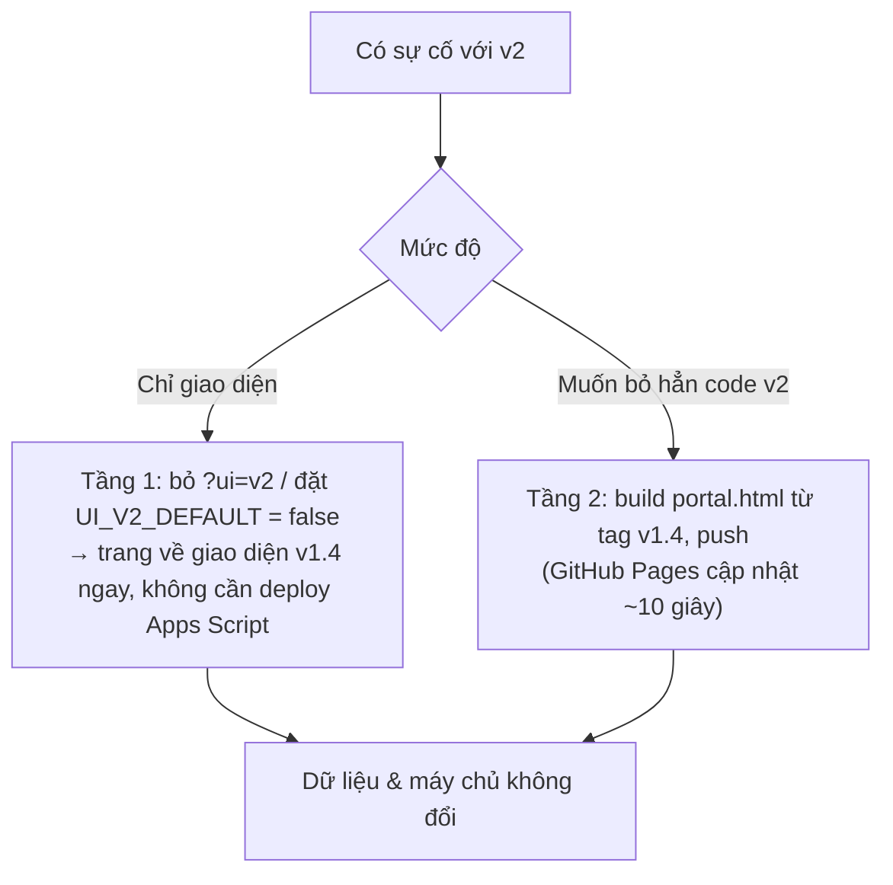

- **Đúng — có thể quay lại v1.4 bất cứ lúc nào.** v2 **chỉ đổi web** (CSS + 1 đoạn script bật/tắt); `apps-script/Code.gs` và Google Sheet **không đổi** → Apps Script vẫn Version 7, không phải lùi máy chủ, không mất dữ liệu.
- Mặc định `UI_V2_DEFAULT = false`: nhân viên **vẫn thấy v1.4** cho tới khi chủ dự án bật. Xem trước: thêm `?ui=v2` vào link (ví dụ `…/portal.html?ui=v2`); `?ui=v1` để chắc chắn xem bản cũ.
- Đã kiểm chứng: tắt v2 → số đo giống hệt v1.4 (216 lỗi tương phản / 266 Arial / 136 tô đậm giả).

### 11.2. Điều chỉnh trình tự (lý do kỹ thuật)

Sàn chữ 14 px **dời sang GĐ2–4**: 70 % chữ nhỏ đến từ class, 30 % từ `style` viết sẵn trong HTML/JS. Tăng cỡ chữ trước khi làm lại viên, bảng, header sẽ cho ra một bản nửa vời (viên chật, bảng xuống dòng). Mỗi thành phần sẽ nhận sàn 14 px **trong giai đoạn làm lại thành phần đó**. LG.com: chữ nhỏ nhất desktop 16 px, mobile cho phép 12 px [NGUỒN web-system] → sàn 14 px là mức hợp lý cho app làm việc.

### 11.3. Kết quả GĐ1 — font & tương phản [ĐO, 12 màn hình: 4 tab Nhân viên + 2 tab PM, Sáng + Đêm]

| Chỉ số | v1.4 (tắt v2) | v2 GĐ1 | |
|---|---|---|---|
| Chữ không đạt tương phản AA | 216 | **0** | ✅ |
| Đoạn chữ Arial | 266 | **0** | ✅ |
| LG EI Headline bị tô đậm giả | 136 | **0** | ✅ |
| Phần tử bị cắt chữ / cuộn ngang (1440 & 390 px) | 0 / không | **0 / không** | ✅ |
| Test giao diện (tắt v2 / **bật v2**) | 64/64 | **64/64** | ✅ |
| e2e · máy chủ | 165 · 67 | 165 · 67 | ✅ |

Cách làm: `:where()` (độ ưu tiên 0) cho `font-family: inherit` → chỉ thay Arial mặc định của trình duyệt, không đè font đã chọn; `font-synthesis: style` → yêu cầu đậm 700 hiển thị bằng nét 600 thật; màu theo bảng tương phản đo sẵn của lg-brand (chữ phụ trong panel xám = Warm Gray 02; chữ nhỏ trên nền tối = Warm Gray 07/04, đỏ chỉ ở viền).

**Phát hiện khi làm:** chế độ Đêm có lỗi từ trước — thẻ hero Tab 1 viết cứng nền trắng nhưng chữ đổi sang sáng (1,1:1, không đọc được). Đã sửa trong lớp v2. Một lần tôi sửa sai (đổi ô 02 sang nền tối ở chế độ Đêm làm lỗi tăng 8 → 69) đã được phát hiện bằng đo và hoàn tác.

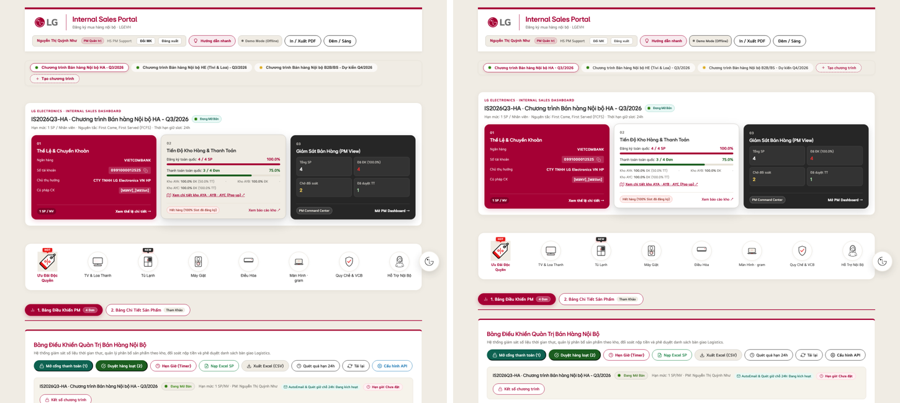

---

## 12. Ảnh sản phẩm — đề xuất (chưa làm, chờ duyệt)

### 12.1. Số đo trên lg.com/vn (05/10/2026) [ĐO]

| Câu hỏi | Kết quả |
|---|---|
| lg.com/vn có trang cho model không? | `sitemap.xml` 4.482 URL: **có 3/4 model demo** (`GR-X257BG`, `WT1410NHEG`, `V10APFUV`); **không có `DVH09B`** |
| Đường dẫn ảnh suy ra từ mã model được không? | **Không** — có hậu tố thay đổi (`gr-x257bg_aeepevn_eavh_vn_c/450x450.png`, `wt1410nheg/gallery/…`, `V10APFUV_ATWGEVH_EAVH_VN_C-450x450.jpg`) → phải tra từng trang |
| Có chặn nhúng ảnh từ trang khác (hotlink) không? | **Không**, hôm nay: Akamai Image Manager, `access-control-allow-origin: *`, ~35 KB/ảnh; không kiểm Referer |
| Ảnh chính (og:image 450×450) dùng được không? | ❌ **2/3 có khuyến mãi LG.com in sẵn trong ảnh** ("Tặng kèm lò vi sóng…", "Tặng máy hút bụi…", "Áp dụng đến hết 30.9.2026", hotline) — **không áp dụng cho bán nội bộ**, dễ gây hiểu nhầm |
| Ảnh đầu bộ sưu tập (gallery) dùng được không? | Tủ lạnh, điều hòa: ảnh sạch nền trắng ✅ · WashTower: cả 2 ảnh lớn đều in combo khuyến mãi, phần còn lại là ảnh cận cảnh ❌ → **chọn tự động không tin được** |

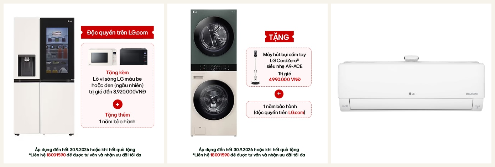

### 12.2. So sánh phương án

| Tiêu chí | A. Nhúng trực tiếp ảnh lg.com (hotlink) | **B. Lưu ảnh đã chọn trong repo** (khuyến nghị) | C. Thêm cột "Ảnh" vào Sheet Products |
|---|---|---|---|
| Đổi chức năng / máy chủ | Không | **Không** | ❌ Có (Code.gs, mẫu Excel, Sheet) — ngoài phạm vi UI |
| Vẫn cần tra từng model | Có | Có (1 lần, có script) | Có (PM nhập link) |
| Ảnh khuyến mãi lẫn vào | Rủi ro cao | **Không** — người chọn từng ảnh | Phụ thuộc PM |
| Model ngừng bán bị gỡ khỏi lg.com (hàng thanh lý hay gặp; `DVH09B` đã vắng) | **Ảnh vỡ** | **Không ảnh hưởng** | Ảnh vỡ nếu là link |
| Phụ thuộc lg.com lúc 10:00 mở bán | Có | Không | Tùy |
| Tốc độ | Phụ thuộc mạng tới lg.com | Cùng máy chủ GitHub Pages, ~30–60 KB/ảnh, tải chậm (lazy) | — |
| Dung lượng repo | 0 | ~90 × 50 KB ≈ 4,5 MB | 0 |

### 12.3. Phương án B — cách làm

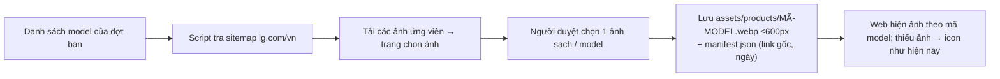

1. `scripts/fetch_product_images.py` (mới, chạy trên máy kỹ thuật): nhận danh sách model → tra `sitemap.xml` → mở trang → lấy ảnh ứng viên (og:image + gallery) → tạo **1 trang HTML chọn ảnh** (mỗi model 1 hàng ảnh nhỏ).
2. Người duyệt (PM / kỹ thuật) bấm chọn ảnh sạch, không chữ khuyến mãi → script lưu `assets/products/<MÃ-MODEL>.webp` (≤ 600 px) và `manifest.json` (nguồn, ngày tải — để truy vết).
3. Web (trong GĐ4): thẻ sản phẩm hiện `assets/products/<MÃ-MODEL>.webp` theo trường `model` đã có; **không có ảnh → hiện icon như hiện tại**. Không đổi dữ liệu, máy chủ, luồng đăng ký.
4. Giếng ảnh để **nền trắng** (ảnh LG nền trắng, có bóng tự nhiên — đặt trên nền xám sẽ lộ khung trắng; lg-brand Product Isolated #6).
5. **Nhãn "Ảnh minh họa"** dưới ảnh: hàng bán nội bộ có thể là hàng thanh lý/lỗi ngoại quan (ví dụ mô tả thật trong Sheet: "thùng xấu thiếu mút xốp, sp trầy xước, móp mặt sau") → ảnh catalogue mới tinh **không được** làm nhân viên hiểu sai tình trạng máy (Jeong-Do).
6. Model không có trên lg.com/vn: giữ icon, hoặc PM gửi ảnh chụp thật.

| Cần quyết định | Khuyến nghị |
|---|---|
| Chọn phương án | **B** |
| Ai chọn ảnh cho mỗi đợt bán | Kỹ thuật chạy script, **PM duyệt** trang chọn ảnh (≈ 1–2 phút / 10 model) |
| Nhãn "Ảnh minh họa" | Có |

### 11.4. Giai đoạn 2 — nền & header & thanh chọn (06/10/2026) + link sản phẩm

| Hạng mục | Kết quả [ĐO] |
|---|---|
| Header, tổng quan, thanh danh mục nằm thẳng trên nền; vùng làm việc = 1 thẻ trắng bo 24 px | ✅ |
| Nền trang `#F6F3EB` (v1.4 thực tế là `#F0ECE4` → trùng màu thanh chọn); chế độ Đêm nền `#1A1A1A` | ✅ |
| Chọn chương trình + 4 tab → segmented (track xám ấm, viên trắng); tab PM đỏ đặc → cùng kiểu | ✅ |
| Desktop: không tab nào bị giấu (thanh xuống dòng); mobile: vuốt ngang | ✅ 1440 / 1280 / 390 px |
| Chữ header & thanh chọn ≥ 14 px (cờ HOT/NEW 12 px = LG.com Tag Small) | ✅ |
| Tương phản AA, 12 màn hình Sáng + Đêm | **0 lỗi** (giữa chừng có 29 lỗi Đêm do chính GĐ2 gây ra — đã sửa hết) |
| Test giao diện tắt / bật v2 · e2e · máy chủ | 75/75 · 75/75 · 165 · 67 |
| Tắt v2 | Giống hệt v1.4 (216 / 266 / 136) |

**Link xem tính năng model** (thay cho ảnh sản phẩm, chủ dự án chọn 06/10): thẻ và bảng sản phẩm có link **"Xem trên LG.com ↗"** tới trang sản phẩm chính thức nếu model có trong sitemap lg.com/vn (mã nội bộ `.ATV`… được bỏ khi tra), không có thì **"Tìm thông tin model ↗"** (Google). Dòng lưu ý: giá, quà tặng, khuyến mãi trên LG.com không áp dụng cho đợt bán nội bộ. Bản đồ link: `assets/content/lgcom_product_links.json` (2.342 model, ~20 KB nén) tạo bằng `python3 scripts/build_product_links.py` — **chạy lại trước mỗi đợt bán** để cập nhật model mới. Độ phủ trên dữ liệu demo: 37/52 model (71 %) có trang LG.com.

⚠️ Giới hạn kiểm chứng: LG.com (Akamai) chặn trình duyệt tự động và sau đó chặn cả máy kiểm thử (HTTP 403) → **chưa mở được link bằng trình duyệt thật của người dùng**; trước đó cùng các trang này trả HTTP 200 với nội dung đúng model. Cần chủ dự án bấm thử 2–3 link trên link xem trước.

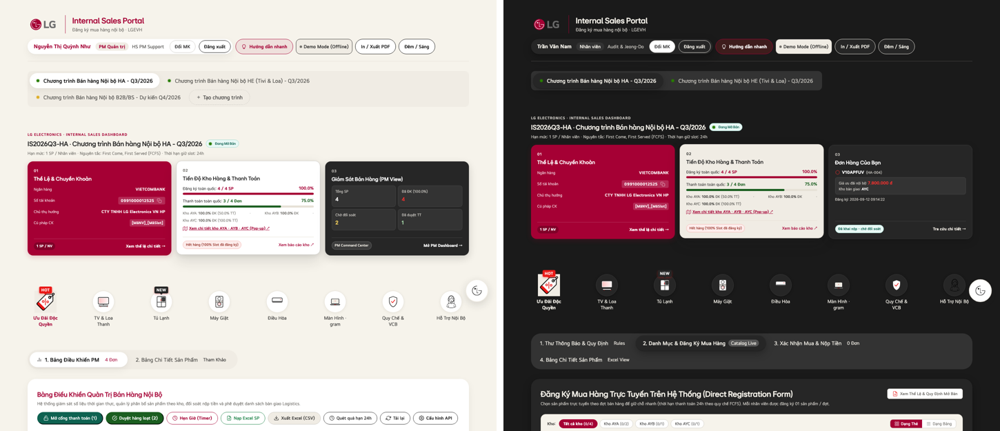

### 11.5. Giai đoạn 3 — 3 thẻ tổng quan + ô số liệu PM (06/10/2026)

| Hạng mục | Kết quả [ĐO] |
|---|---|
| Ô 01: khối đỏ đặc → thẻ trắng; số tài khoản `0991000012525` cỡ 24 px để đọc / chép | ✅ |
| Ô 02: tỉ lệ "4 / 4 SP", "3 / 4 Đơn" và % cỡ 24 px; xanh `#1B5E20` (ngoài bảng màu) → `#287D00` | ✅ |
| Ô 03 (thẻ Focus tối): giá nội bộ 40 px nét mảnh xuống dòng riêng; 4 bộ đếm PM 32 px **giữ 4 màu trạng thái** | ✅ |
| Ô số liệu PM: thẻ trắng bo 16 px, bỏ vạch màu; số 40 px nét mảnh (doanh thu 28 px để không tràn) | ✅ |
| Chữ trong thẻ ≥ 14 px; 0 lỗi tương phản 12 màn hình; không cắt chữ / cuộn ngang 1440 · 1280 · 390 | ✅ |
| Font **LG EI Headline Light** nhúng thêm (+63 KB) dưới **tên riêng** "LG EI Headline Light" → không làm đổi chữ nào khi tắt v2 | ✅ tắt v2 vẫn = v1.4 (216 / 266 / 136) |
| Test giao diện tắt / bật v2 · e2e · máy chủ | 79/79 · 79/79 · 165 · 67 |

Sửa trong lúc làm (đều phát hiện bằng đo / ảnh): quy tắc giá tiền vô tình đổi màu bộ đếm PM "Đã ĐK" (đã giới hạn lại); 25 lỗi tương phản chế độ Đêm do ô KPI / ô 02 (v1.4 giữ 2 thẻ này sáng ở chế độ Đêm — đã giữ nguyên); khai báo font Light sai cú pháp lần đầu (font không nạp — đã sửa và kiểm `document.fonts`).

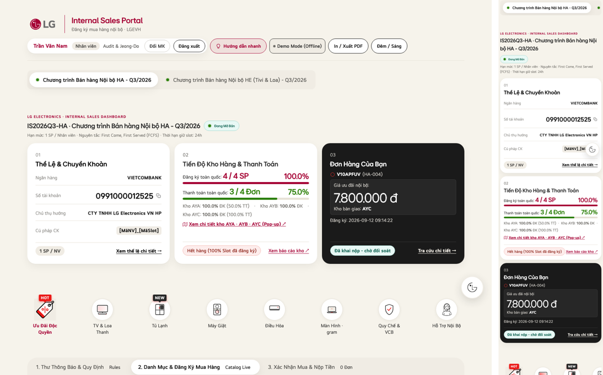

### 11.6. Giai đoạn 4 — danh mục, thẻ sản phẩm, Bảng điều khiển PM (06/10/2026)

| Hạng mục | Kết quả [ĐO] |
|---|---|
| Lọc kho, chọn Thẻ / Bảng → segmented; ô tìm kiếm bo tròn 44 px; tiêu đề kho 20 px | ✅ |
| Thẻ sản phẩm: viền mảnh trong thẻ trắng; model 20 px; mô tả / giá 14 px; **giá nhân viên 24 px dòng riêng (không bẻ chữ "đ")**; cờ "Ưu đãi nội bộ" Active Red (cờ khuyến mãi trên nền trắng — web-system); nút giữ chỗ 48 px | ✅ |
| Bảng PM chữ 14 px, không bẻ dòng nút / giá / mã GD; **vừa khung ở 1440 và 1280 px như v1.4** | ✅ |
| Nút theo vai trò: Active Red = Mở cổng TT, Duyệt hàng loạt, Duyệt, Mở TT; viền đen = Từ chối, Kết sổ, Tải lại, Hẹn giờ, Xuất Excel… → mỗi dòng chỉ còn 1 nút đỏ | ✅ |
| 0 lỗi tương phản 12 màn hình; không cắt chữ / cuộn ngang 1440 · 1280 · 390; Hướng dẫn 9/9 bước khớp 0 px | ✅ |
| Test giao diện tắt / bật v2 · e2e · máy chủ | 82/82 · 82/82 · 165 · 67 |

Sửa trong lúc làm: 28 lỗi tương phản chế độ Đêm — thẻ sản phẩm, bảng PM, khung chương trình **vẫn sáng ở chế độ Đêm như v1.4** nên phải dùng màu cố định thay cho biến tự đổi; 1 quy tắc khớp nhầm huy hiệu "Demo Mode" (đã thu hẹp); giá và nút bị bẻ dòng do chữ to hơn (phát hiện bằng ảnh, đã sửa).

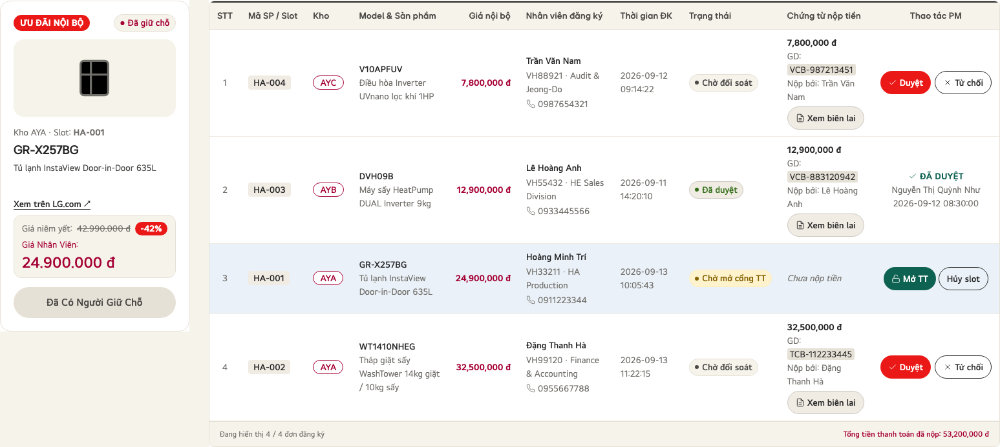

### 11.7. Giai đoạn 5 — màn đăng nhập & mobile (06/10/2026)

| Hạng mục | Kết quả [ĐO] |
|---|---|
| Màn đăng nhập trên **LG Master Gradient 04 — file gốc** (`assets/branding/LGE_Electronics_Gradient_04_RGB.jpg`, sao y bản skill lg-brand, 147 KB, không chỉnh sửa), phủ toàn màn (chỉ cắt khung), logo nằm trên thẻ trắng | ✅ |
| Ảnh gradient **chỉ tải khi bật v2** (tắt v2: không có yêu cầu tải) | ✅ đo yêu cầu mạng |
| Thẻ đăng nhập: bo 24 px, ô nhập 48 px, nút Active Red dạng viên 48 px (cao tự giãn khi hiện "Máy chủ đang khởi động…"); chữ ≥ 14 px | ✅ |
| Mobile: lề trang 16 px (lưới LG.com cỡ S; v1.4 là 6 px), không cuộn ngang 390 px | ✅ |
| Test giao diện tắt / bật v2 · e2e · máy chủ | 87/87 · 87/87 · 165 · 67 |

**Kiểm tra độc lập bằng `verify.py` (lg-brand, chế độ web):** công cụ được thiết kế cho 1 ấn phẩm (slide / poster) nên áp vào cả ứng dụng sinh nhiều kết quả không áp dụng. Phân loại:

| Nhóm | v1.4 | v2 | Ghi chú |
|---|---|---|---|
| Chữ không phải LG EI (`FONT_NOT_LG`) | 5 | **0** | ✅ cải thiện thật |
| Tương phản lấy mẫu điểm ảnh | 20 lỗi + 34 cảnh báo | 45 + 4 | Toàn bộ lỗi v2 là chữ của trang **nằm sau màn đăng nhập** (gradient phủ kín) → không ai nhìn thấy. Sau đăng nhập: đo riêng 12 màn hình = 0 lỗi |
| Màu ngoài bảng màu (cảnh báo) | 179 | 179 | Màu viết sẵn trong phần chưa làm lại (Tab 1 thư thông báo, cửa sổ phụ…) → đề xuất dọn ở v1.2 |
| Lề / cỡ slogan / chồng lớp | như nhau | như nhau | Quy tắc lưới ấn phẩm in, không áp dụng cho web app |

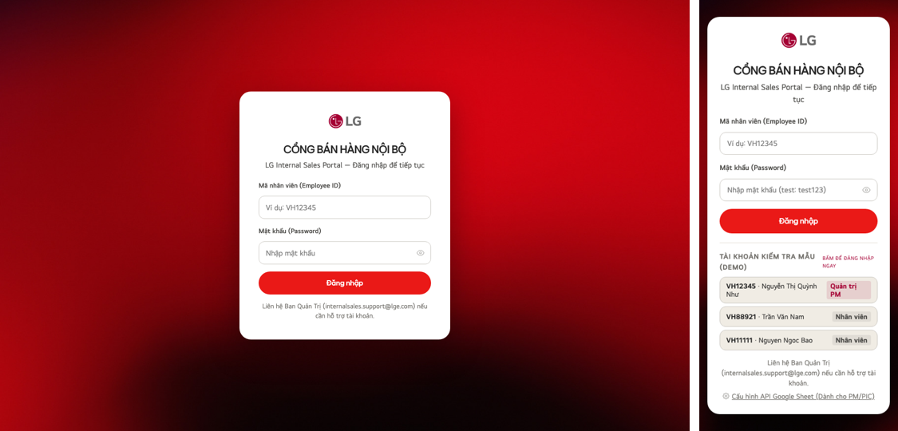

---

## 13. Checklist bật v2 cho toàn bộ nhân viên

| # | Việc | Ai | ☐ |
|---|---|---|---|
| 1 | Xem trước `…/portal.html?ui=v2` trên **máy tính và điện thoại**: đăng nhập, xem danh mục, bấm 2–3 link "Xem trên LG.com", (PM) xem bảng điều khiển, mở cửa sổ biên lai | Chủ dự án + 1 PM | ☐ |
| 2 | Thử chế độ Đêm và In / Xuất PDF trên `?ui=v2` | Chủ dự án | ☐ |
| 3 | Chọn ngày bật: **trước 14/10 ít nhất 2 ngày** (để nhân viên quen) hoặc **sau 16/10** (sau đợt bán) — không bật trong đợt bán | Chủ dự án | ☐ |
| 4 | Kỹ thuật: đổi `var UI_V2_DEFAULT = false;` → `true` trong `Mau_Dang_Ky_Internal_Sales_3009.html`, chạy 3 bộ test, build `portal.html`, gộp `main`, tag, push | Kỹ thuật | ☐ |
| 5 | Kiểm tra link thật sau khi GitHub Pages cập nhật | Kỹ thuật | ☐ |
| 6 | **Quay lại nếu có vấn đề:** người dùng thêm `?ui=v1` (tức thì, từng máy) · hoặc đổi lại `false` + build + push (toàn bộ, ~1 phút sau khi GitHub cập nhật) · hoặc build `portal.html` từ tag `v1.4` | Kỹ thuật | — |
