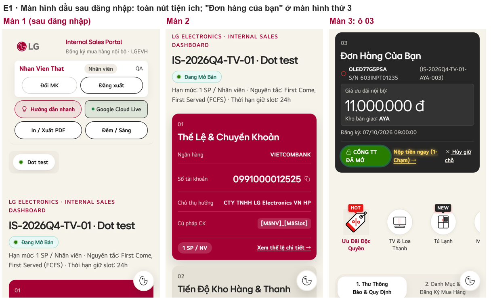
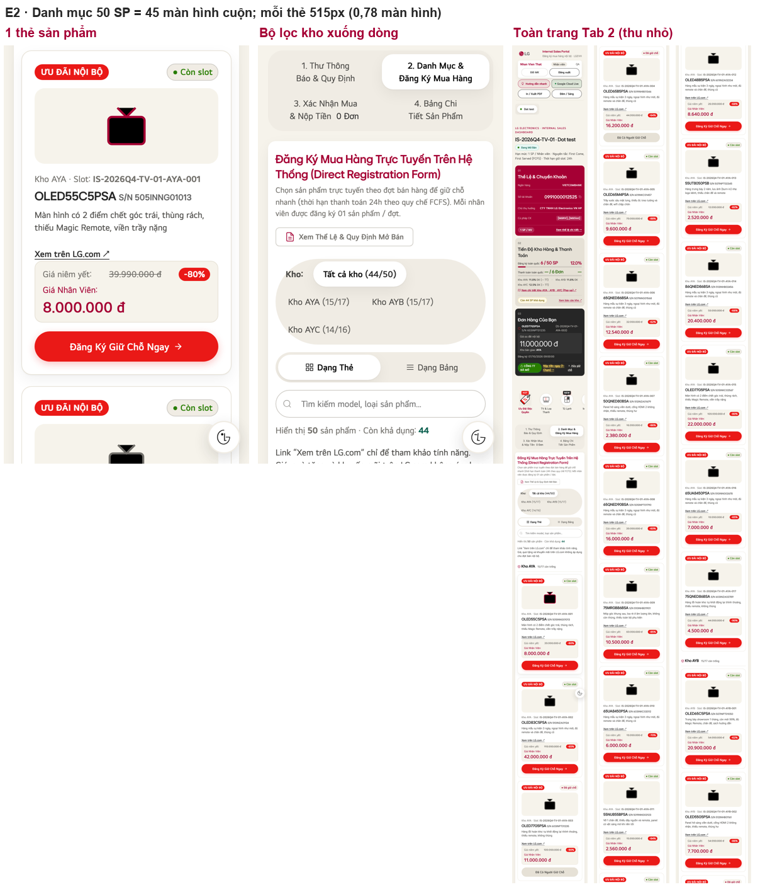
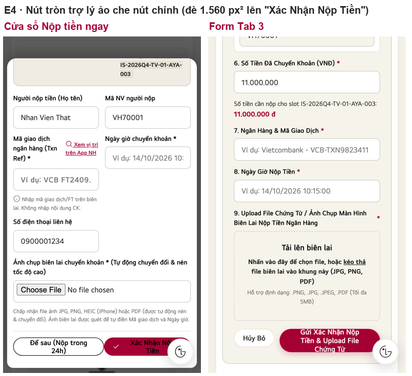
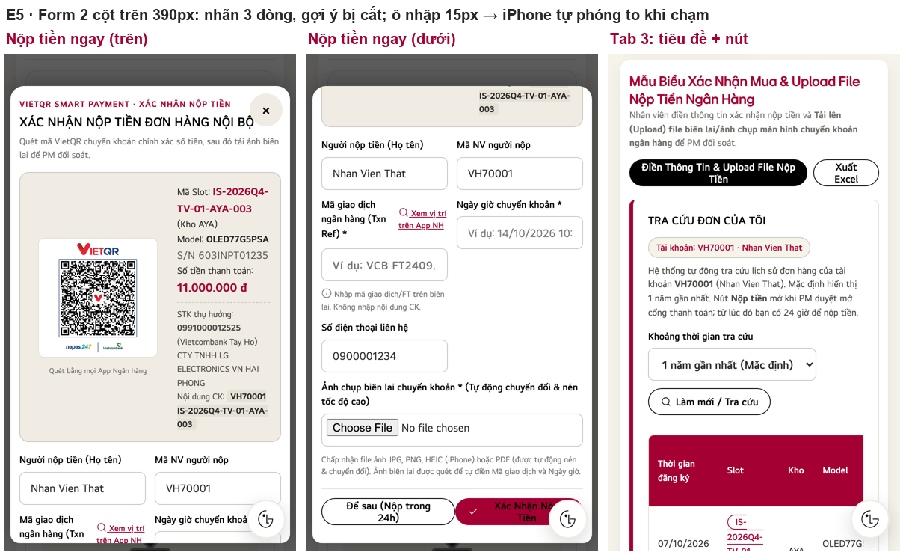
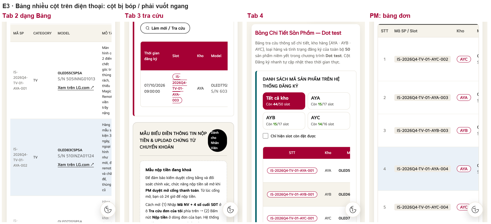
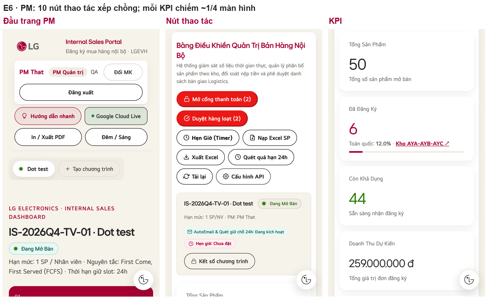
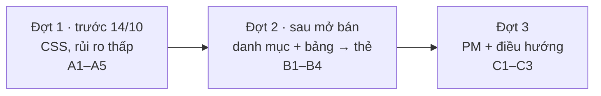

# v3 — Đánh giá giao diện điện thoại & đề xuất cải thiện

> **Trạng thái:** ĐỀ XUẤT, chờ chủ dự án duyệt. Chưa sửa gì trên web.
> **Điểm xuất phát:** tag `v2-final` (= v2.3.1, 07/10/2026). Mọi thay đổi v3 làm trên nhánh mới từ tag này.
> **Bằng chứng:** `design/v3/mobile_audit/` (ảnh chụp iPhone 13, tấm ghép E1–E6, số đo `ip13_metrics.json`, `ip13_measures.json`, `s8_metrics.json`).

---

## 0. Kết luận

Trên điện thoại, web **dùng được nhưng tốn công**. Có 3 vấn đề lớn nhất:

1. **Màn hình đầu tiên không có việc gì để làm.** Sau khi đăng nhập, màn hình đầu chỉ có logo và 6 nút tiện ích. Ô "Đơn hàng của bạn", nơi nhân viên cần nhất, nằm ở màn hình thứ 3 (E1).
2. **Danh mục quá dài.** 50 sản phẩm chiếm **45 màn hình cuộn**, vì mỗi thẻ cao 515px (E2).
3. **Thao tác chính bị cản trở.** Nút tròn trợ lý ảo **đè lên nút "Xác Nhận Nộp Tiền"** (E4). **Mọi ô nhập** dùng chữ 15px nên iPhone **tự phóng to** khi chạm vào. Các bảng nhiều cột bị bóp hoặc phải vuốt ngang (E3).

**Đề xuất:** sửa theo 3 đợt.
- **Đợt 1** (trước 14/10): chỉ sửa CSS, rủi ro thấp, xử lý 5 vấn đề làm chậm việc giữ chỗ và nộp tiền.
- **Đợt 2 và 3** (sau mở bán): danh mục gọn, bảng chuyển thành thẻ, màn hình PM.

**Chỉ thay đổi hiển thị trên điện thoại:** máy tính giữ nguyên, chức năng giữ nguyên.

---

## 1. Phương pháp

| Mục | Chi tiết |
|---|---|
| Thiết bị giả lập | **iPhone 13**: vùng nhìn 390×664 trong Safari (đã trừ thanh địa chỉ và thanh công cụ), có chạm và trình duyệt di động. **Galaxy S8**: 360×740, đại diện máy Android màn nhỏ. Playwright Chromium |
| Bản web | Bản nguồn `v2-final`. Riêng màn hình đăng nhập chụp từ **bản `portal.html` nhân viên dùng** (không có danh sách tài khoản demo) |
| Dữ liệu | Máy chủ giả (không đụng máy chủ thật). Dùng **file mẫu 50 slot TV**; 1 nhân viên có đơn "Chờ nộp tiền"; 1 PM có 6 đơn |
| Số đo tự động | Độ dài trang (tính bằng số màn hình) · nút nhỏ hơn 44px (chuẩn Apple) · chữ nhỏ hơn 14px · **ô nhập nhỏ hơn 16px** (iPhone tự phóng to khi chạm) · khung phải vuốt ngang · phần tử cố định đè lên nội dung |
| Giới hạn [UNCERTAIN] | Đây là giả lập bằng Chromium, **không phải Safari thật**. Hộp thoại xác nhận, bộ chọn file và bàn phím của hệ điều hành trông khác thực tế. **Cần thử trên 1 iPhone và 1 Android thật trước khi phát hành v3** |

---

## 2. Số đo hiện tại (iPhone 13 · Galaxy S8)

| Chỉ số | iPhone 13 | Galaxy S8 | Ngưỡng tốt |
|---|---|---|---|
| Đầu trang (logo + 6 nút + thanh chương trình) | **357px = 54% màn hình đầu** | — | ≤ 120px |
| Vị trí ô "03 Đơn hàng của bạn" | **màn hình thứ 2,0** | — | thấy ngay màn hình 1 |
| Vị trí thanh tab 1–4 | màn hình thứ 2,9 | — | ≤ 1 |
| Độ dài tab 2, 50 sản phẩm (dạng thẻ) | **45 màn hình** | 41,9 | ≤ 15 |
| Chiều cao 1 thẻ sản phẩm | 515px (0,78 màn hình), riêng biểu tượng 120px | — | ≤ 170px |
| Ô nhập nhỏ hơn 16px (iPhone tự phóng to) | **Đăng nhập 2/2 · Nộp tiền ngay 6/6 · Tab 3 11/11** | như iPhone | 0 |
| Nút tròn trợ lý ảo đè nút "Xác Nhận Nộp Tiền" | **1.560px²** | — | 0 |
| Khung phải vuốt ngang | Tab 2 dạng Bảng · Tab 3 tra cứu (724 > 288px) · Tab 4 (1.141 > 288px) · bảng PM (1.293 > 332px) | như iPhone | 0 trên điện thoại |
| Chữ nhỏ hơn 14px trong Tab 4 / Tab 2 dạng Bảng | 524 / 387 | 524 / 387 | ~0 |
| Nút nhỏ hơn 44px (phần lớn cao 40–42px) | Tab 2: 66/134 · PM: 36/54 | như iPhone | nút chính ≥ 48px |
| Cuộn ngang cả trang | Không có ✅ | Không có ✅ | — |

---

## 3. Phát hiện kèm bằng chứng (xếp theo mức ảnh hưởng)

### 3.1 Nhân viên

| # | Vấn đề | Bằng chứng | Ảnh hưởng | Mức |
|---|---|---|---|---|
| N1 | Màn hình đầu chỉ có 6 nút tiện ích (Đổi MK, Đăng xuất, Hướng dẫn, Google Cloud Live, In/PDF, Đêm/Sáng). Ô 03 ở màn hình thứ 2, thanh tab ở màn hình 2,9 |  | Lúc mở bán, việc đầu tiên nhân viên cần (xem đơn, đi tới danh mục) phải cuộn 2–3 màn hình | **Cao** |
| N2 | Ô 03: nút chính **"Nộp tiền ngay" chỉ là đường link chữ vàng**, xuống 2 dòng. "CỔNG TT ĐÃ MỞ" trông giống nút nhưng không bấm được. "Hủy giữ chỗ" là link nhỏ nằm sát bên | `ip13_u04_card03_my_order.png` · số đo: link 128×42px | Dễ bấm nhầm Hủy hoặc bấm vào nhãn trạng thái | **Cao** |
| N3 | Danh mục: mỗi thẻ cao 515px, 50 sản phẩm = 45 màn hình. Bộ lọc kho xuống dòng lệch. Thanh lọc và ô tìm kiếm cuộn mất khi kéo xuống |  | Lúc mở bán, ai đến trước được trước: cuộn càng lâu càng mất slot | **Cao** |
| N4 | Nút tròn trợ lý ảo (52px, cố định góc phải dưới) **đè lên nút chính** của cửa sổ Nộp tiền ngay và form tab 3 |  | Chạm vào "Xác Nhận" lại trúng trợ lý ảo | **Cao** |
| N5 | Ô nhập cỡ 15px: iPhone **tự phóng to cả trang** khi chạm vào, người dùng phải chụm tay thu nhỏ lại | `ip13_metrics.json` → `inputsZoom` | Mỗi ô nhập gây thêm 1 lần phóng to; form tab 3 có 11 ô | **Cao** |
| N6 | Form 2 cột trên màn 390px: nhãn xuống 3 dòng, gợi ý bị cắt ("Ví dụ: 14/10/2026 10:"). Cửa sổ Nộp tiền ngay cao 1,6 màn hình, 2 nút cuối bị chật |  | Khó đọc, dễ nhập sai | Trung bình |
| N7 | Bảng nhiều cột: tab 2 dạng Bảng (mô tả 1 chữ mỗi dòng), tab 3 tra cứu (Slot xuống 5 dòng), tab 4 (phải vuốt ngang) |  | Khó tìm thông tin, không thấy đủ cột | Trung bình |
| N8 | **Thanh danh mục HOT/NEW** (Ưu đãi độc quyền, TV & Loa, Tủ lạnh…) trông như bộ lọc, nhưng bấm vào **chỉ chuyển sang tab 2 và cuộn trang, không lọc**. Trong code có ghi chú `filterCategoryByQuickBar removed — visual-only` | `ip13_u04…` (dưới cùng) · code dòng 3754–3770 | Người dùng nghĩ đã lọc "Tủ lạnh" nhưng vẫn thấy mọi sản phẩm | Trung bình |
| N9 | Tab 3: tiêu đề và mô tả dài, 2 nút đầu trang xuống dòng, nhãn "Dành cho Nhân viên" bị ép thành hình tròn 4 dòng | `ip13_u12…`, `ip13_u13…` | Trông rối, phải cuộn nhiều | Thấp |
| N10 | **Nội dung, không phải giao diện:** tab 1 ghi cứng "90 sản phẩm (43 model)" trong khi danh mục thật có 50 | `ip13_u05_tabs_tab1.png` | Thông tin sai | Thấp (ngoài phạm vi giao diện) |

### 3.2 PM

| # | Vấn đề | Bằng chứng | Mức |
|---|---|---|---|
| P1 | 10 nút thao tác xếp thành 5 hàng; 2 nút quan trọng nhất (Mở cổng thanh toán, Duyệt hàng loạt) to ngang các nút phụ |  | Trung bình |
| P2 | Mỗi chỉ số KPI là 1 thẻ cao khoảng 1/4 màn hình: 4 chỉ số tốn 1 màn hình | `ip13_p03_pm_kpis.png` | Thấp |
| P3 | Bảng đơn rộng 1.293px trên màn 332px: phải vuốt ngang mới thấy Trạng thái và nút Duyệt | `ip13_p04_pm_orders_table.png` | Trung bình |

**Đang tốt, giữ nguyên:** không có cuộn ngang cả trang; thanh tab dạng lưới 2×2 (v2.0.4); hướng dẫn lần đầu hiển thị đúng chỗ (`ip13_u17`); mã VietQR có trong cả 2 nơi nộp tiền.

---

## 4. Đề xuất v3, xếp theo ưu tiên

Nguyên tắc chung:
- Chỉ áp dụng khi màn hình **≤ 719px** (`@media`); máy tính không đổi.
- Không đổi chức năng, ID hay dữ liệu gửi máy chủ.
- Màu, chữ, khoảng cách theo **lg-brand** và hệ thiết kế v2: Heritage Red cho điểm nhấn, Active Red cho nút hành động, Warm Gray, chữ LG EI, tối thiểu 14px.

### Đợt 1: trước 14/10 (chỉ CSS và hiển thị, khoảng 1 ngày làm + test)
| # | Thay đổi | Giải quyết | Chỉ số đích |
|---|---|---|---|
| A1 | **Đầu trang gọn:** logo + tên người dùng + **1 nút "☰ Tài khoản"** mở danh sách (Đổi MK, Đăng xuất, Hướng dẫn, In/PDF, Đêm/Sáng). "Google Cloud Live" thu thành chấm trạng thái nhỏ | N1 | Đầu trang 357px → **≤ 120px** |
| A2 | **Ô 03 lên đầu** khi nhân viên có đơn (thứ tự 03 → 02 → 01). Ô 01 (Thể lệ & Chuyển khoản) thu gọn, chạm để mở | N1 | Ô 03: màn 2,0 → **màn 1** |
| A3 | Ô 03: **"Nộp tiền ngay" thành nút đầy đủ** (Active Red, cao 48px, rộng hết thẻ). "Hủy giữ chỗ" thành nút viền phụ ở dòng riêng. "Cổng TT đã mở" thành nhãn trạng thái phẳng | N2 | Nút chính ≥ 48px, không còn chữ xuống dòng |
| A4 | Nút trợ lý ảo: **ẩn khi đang mở cửa sổ hoặc form nộp tiền**; ở các màn khác thu về 44px và chừa khoảng trống phía dưới trang | N4 | Vùng đè lên nút chính: 1.560px² → **0** |
| A5 | **Ô nhập 16px trên điện thoại** (đăng nhập, Nộp tiền ngay, tab 3, PM) | N5 | Ô nhập < 16px: 19 → **0** |

### Đợt 2: sau mở bán (hiển thị và bố cục)
| # | Thay đổi | Giải quyết | Chỉ số đích |
|---|---|---|---|
| B1 | **Thẻ sản phẩm dạng ngang gọn:** biểu tượng 64px bên trái; Model + S/N + tình trạng (2 dòng) + giá + nút "Giữ chỗ" bên phải | N3 | Thẻ 515px → **≤ 170px**; 50 sản phẩm: 45 → **≤ 15 màn hình** |
| B2 | **Thanh lọc dính trên cùng** khi cuộn (kho cuộn ngang 1 dòng + ô tìm kiếm) | N3 | Lọc được ở bất kỳ vị trí nào khi cuộn |
| B3 | **Bảng chuyển thành thẻ trên điện thoại** cho tab 3 tra cứu, tab 4 và bảng PM: mỗi dòng là 1 thẻ "nhãn: giá trị", nút ở cuối thẻ. Ẩn "Dạng Bảng" ở tab 2 trên điện thoại | N7, P3 | Khung vuốt ngang: 4 → **0**; chữ < 14px ở tab 4: 524 → **~0** |
| B4 | **Form 1 cột** trên điện thoại. Cửa sổ Nộp tiền ngay thành **màn hình đầy đủ**, 2 nút (Để sau · Xác nhận) **cố định ở đáy** | N6 | Nhãn 1 dòng; nút xác nhận luôn nhìn thấy |

### Đợt 3: PM và điều hướng
| # | Thay đổi | Giải quyết |
|---|---|---|
| C1 | PM: 2 nút chính (Mở cổng, Duyệt hàng loạt) to và nổi bật; 8 nút còn lại gom vào "Thêm thao tác ▾" | P1 |
| C2 | KPI dạng lưới 2×2 nhỏ gọn | P2 |
| C3 | Tab 3 gọn lại: rút ngắn mô tả, xếp 2 nút đầu trang dọc, sửa nhãn "Dành cho Nhân viên" | N9 |

---

## 5. Cần chủ dự án quyết định

| # | Câu hỏi | Lựa chọn | Đề xuất |
|---|---|---|---|
| Q1 | Thanh danh mục HOT/NEW (N8) | (a) Ẩn trên điện thoại · (b) Làm thành **bộ lọc thật** (thay đổi chức năng, cần duyệt) | (a) cho đợt 1; (b) cân nhắc ở đợt 2 |
| Q2 | Phạm vi trước ngày 14/10 | (a) Đợt 1 (A1–A5) · (b) Không đổi gì trước mở bán | **(a)**: chỉ CSS, có test và ảnh trước/sau |
| Q3 | Điều hướng tab | (a) Giữ lưới 2×2 ở đầu trang · (b) Thanh tab cố định ở **đáy màn hình** như app | (a); (b) để sau, vì cần dời nút trợ lý ảo |
| Q4 | Số liệu cứng ở tab 1 (N10) | Lấy số sản phẩm thật từ danh mục hay sửa tay | Lấy số thật (nhỏ, nhưng là thay đổi nội dung) |

---

## 6. Cách nghiệm thu mỗi đợt

1. Chạy lại `mobile_audit.py` (iPhone 13 + Galaxy S8): các chỉ số ở §2 phải đạt mục tiêu của đợt đó.
2. Ba bộ test (hồi quy mặc định và `?ui=v1`, e2e, harness) đều đạt. Thêm kịch bản kiểm từng chỉ số điện thoại.
3. **Máy tính không đổi:** so ảnh chụp 1440px trước/sau.
4. **Thử trên máy thật:** 1 iPhone (Safari) và 1 Android (Chrome). Đăng nhập → giữ chỗ → nộp tiền (có chụp biên lai bằng camera) → PM duyệt.

**Khi nào đề xuất này sai:** nếu đa số nhân viên giữ chỗ bằng **máy tính** chứ không phải điện thoại, lợi ích của v3 giảm, và đợt 2–3 nên dời lại. Hiện **chưa có số liệu** về tỷ lệ thiết bị truy cập. Có thể đo nhanh bằng cột "User Agent" của sheet Registrations sau đợt test.
