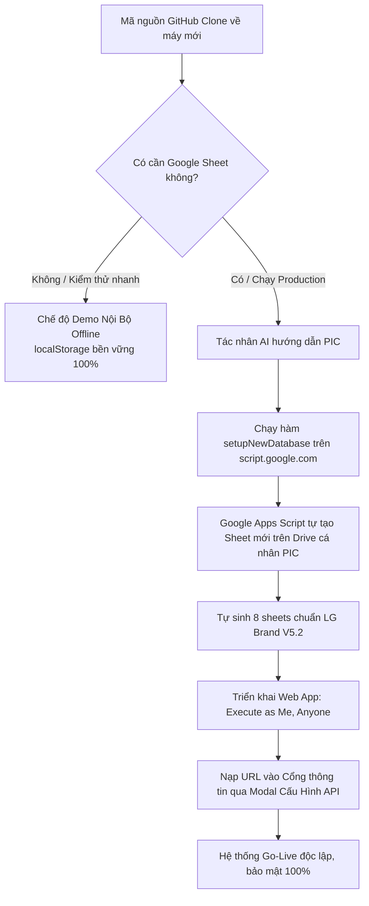

# Hướng Dẫn Tác Nhân AI & PIC: Tự Động Khởi Tạo CSDL Google Sheet Trên Drive Riêng

> **Dành cho:** AI Coding Assistants (Antigravity, Claude, Copilot, ChatGPT) & Kỹ sư phụ trách (PIC - Person In Charge).  
> **Mục tiêu tối thượng:** Đảm bảo **bảo mật tuyệt đối thông tin cá nhân** của tác giả gốc; mọi AI Agent hoặc PIC khi clone mã nguồn từ GitHub về sẽ tự động tạo và vận hành trên Google Sheet nằm trong **Google Drive cá nhân của chính họ**, không phụ thuộc và không chạm vào Drive của bất kỳ ai khác.

---

## 1. Nguyên Tắc Cách Ly Dữ Liệu (Cloud Drive Isolation Principle)



1. **Không chứa thông tin mật mã (Zero Hardcoded Secrets):** Trong toàn bộ mã nguồn Git, không có bất kỳ Google Sheet ID hay Apps Script Web App URL cá nhân nào được hardcode.
2. **Cách ly tuyệt đối (Drive Isolation):** Mỗi máy / mỗi tổ chức triển khai sẽ có một database riêng trên Google Drive của người đó.
3. **Phân định trách nhiệm rõ ràng (Agent vs PIC Boundary):**
   - **Tác nhân AI (AI Agent):** Đọc hiểu mã nguồn, hướng dẫn tường minh từng bước cho PIC, kiểm tra cú pháp, tự động ping kiểm tra kết nối API, tự động nạp cấu hình và xử lý dữ liệu.
   - **Người phụ trách (PIC):** Do cơ chế bảo mật OAuth 2.0 của Google, AI không thể tự đăng nhập vào tài khoản Google của người dùng. PIC chỉ cần thực hiện 2 thao tác cực kỳ đơn giản: **Dán mã Code.gs & bấm Chạy hàm `setupNewDatabase()`**, sau đó cấp quyền và sao chép URL đưa cho Agent.

---

## 2. Quy Trình Vận Hành Dành Cho AI Agent (Agent Standard Operating Procedure - SOP)

Khi một AI Agent mới nhận được yêu cầu từ người dùng (ví dụ: *"Hãy cài đặt hệ thống này hoạt động trên Google Drive của tôi"*), Agent cần tuân theo quy trình chuẩn sau:

### Bước 1: Xác nhận chế độ hiện tại
Kiểm tra xem hệ thống đã có cấu hình API chưa:
- Nếu chưa có: Hệ thống đang chạy an toàn ở **Chế độ Demo Nội Bộ (Offline Demo Mode)** sử dụng `localStorage`. Mọi tính năng đăng ký, đối soát, phân quyền PM/User đều chạy được ngay.
- Thông báo cho PIC: *"Hệ thống hiện đang chạy chế độ Demo Offline. Nếu bạn muốn đồng bộ dữ liệu vào Google Sheet thật trên Google Drive của bạn, tôi sẽ hướng dẫn bạn thiết lập 1-Click tự động trong 2 phút."*

### Bước 2: Hướng dẫn PIC chạy hàm tự động tạo CSDL
Agent gửi đúng đoạn chỉ dẫn ngắn gọn, xúc tích sau cho PIC:

```text
Anh/Chị vui lòng thực hiện 3 bước đơn giản sau để hệ thống tự tạo Google Sheet trên Drive của Anh/Chị:

1. Mở trình duyệt, truy cập https://script.google.com và nhấn nút "Dự án mới" (New project).
2. Mở file apps-script/Code.gs trong thư mục dự án này, copy toàn bộ nội dung và dán đè vào cửa sổ soạn thảo của Google Apps Script.
3. Trên thanh công cụ, tại menu chọn hàm (đang hiện myFunction), chọn hàm:
   👉 setupNewDatabase
   và nhấn nút "Chạy" (Run - biểu tượng tam giác ▶).
4. Google sẽ hỏi cấp quyền Drive & Spreadsheet: Hãy chọn "Xem lại quyền" > Chọn tài khoản của bạn > Bấm "Nâng cao (Advanced)" > Bấm "Đi tới dự án (Không an toàn)" > Bấm "Cho phép (Allow)".
```

### Bước 3: Hàm `setupNewDatabase()` tự động làm những gì?
Hàm `setupNewDatabase()` trong `apps-script/Code.gs` đã được lập trình sẵn để tự động thực thi 100% các việc sau trên Google Drive của PIC:
1. Tạo một tệp Google Spreadsheet mới mang tên: `LG Internal Sales Database`.
2. Tự động khởi tạo và định dạng đầy đủ **8 sheet tabs tiêu chuẩn**:
   - `Registrations`: Quản lý danh sách đăng ký FCFS, timestamp, tình trạng thanh toán.
   - `Slots`: Danh sách mã slot sản phẩm, trạng thái giữ chỗ FCFS.
   - `Config`: Cấu hình hệ thống, thời gian giữ slot 24h, bật tắt AutoEmail.
   - `ActivityLog`: Nhật ký kiểm toán (Audit Trail) chống gian lận Jeong-Do.
   - `Users`: Danh mục tài khoản đăng nhập (PM & Nhân viên), mật khẩu kép.
   - `Programs`: Danh mục các đợt bán hàng đa chương trình (`IS2026Q3-HA`, `IS2026Q3-HE`, `IS2026Q4-BS`), 10 cột chuẩn hóa `PROG_COL`.
   - `Products`: Danh mục sản phẩm chuẩn 12 cột (`ProgramID`, `UniqueCode`, `Kho`, `Category`, `Model`, `Description`, `RRP`, `InternalPrice`, `Qty`, `Status`, `EmpCode`, `Timestamp`), khớp 100% các cột vàng của file mẫu kho vận PM.
   - `AutoEmail`: Mẫu email thông báo tự động chuẩn thương hiệu LG V5.2.
3. Tự động tô màu tiêu đề cột chuẩn mã màu thương hiệu **LG Heritage Red (`#A50034`)**, chữ trắng đậm, cố định hàng 1 (Freeze Row 1), bật bộ lọc dữ liệu tự động.
4. Nạp sẵn dữ liệu mẫu (Seed Data) ban đầu để hệ thống có thể chạy được ngay.
5. In ra màn hình Execution Log: Mã `SPREADSHEET_ID` và đường link mở trực tiếp Sheet.

### Bước 4: Hướng dẫn PIC triển khai Web App
Sau khi `setupNewDatabase` chạy xong, Agent hướng dẫn tiếp:

```text
Tuyệt vời! Google Sheet đã được tự động tạo trong Google Drive của bạn. Bây giờ chỉ cần tạo API:

1. Copy mã SPREADSHEET_ID vừa in ra ở màn hình Nhật ký thực thi (Execution Log).
2. Dán mã đó vào dòng 21 file Code.gs:
   var SPREADSHEET_ID = '<DÁN_MÃ_TẠI_ĐÂY>';
   Bấm Cmd+S (hoặc Ctrl+S) để Lưu.
3. Nhấn nút "Triển khai" (Deploy) ở góc trên bên phải > Chọn "Tùy chọn triển khai mới" (New deployment).
4. Chọn loại: "Ứng dụng web" (Web app).
   - Mô tả: LG Internal Sales API v8
   - Thực thi dưới danh nghĩa (Execute as): Tôi (Me)
   - Ai có quyền truy cập (Who has access): Bất kỳ ai (Anyone)
5. Nhấn "Triển khai" > Copy "URL ứng dụng web" (kết thúc bằng /exec) và gửi lại cho tôi (hoặc dán vào web).
```

### Bước 5: Nạp URL vào Cổng thông tin (Portal)
Khi PIC gửi lại URL Web App:
- **Cách 1 (Tác nhân AI hỗ trợ trực tiếp):** Agent có thể kiểm tra định dạng URL (phải bắt đầu bằng `https://script.google.com/macros/s/` và kết thúc bằng `/exec`).
- **Cách 2 (PIC tự nhập trên Web):**
  1. Mở Cổng thông tin `Mau_Dang_Ky_Internal_Sales_3009.html` trên trình duyệt.
  2. Nhấp vào huy hiệu **`⚪ Demo Mode (Offline)`** trên thanh tiêu đề đầu trang (hoặc nút **`Cấu hình API`** trong Bảng điều khiển Quản trị PM).
  3. Dán Web App URL vào ô nhập liệu.
  4. Bấm **`Kiểm Tra & Lưu Cấu Hình`**. Hệ thống sẽ tự động gửi yêu cầu ping đến máy chủ Google Apps Script. Khi thành công, huy hiệu sẽ chuyển sang **`🟢 Google Cloud Live`**.

### Bước 6: Kích hoạt Bộ quét Giải phóng Slot 24h (1-Click Trigger Installer)
Để tự động giải phóng slot quá hạn 24h và gửi email cảnh báo tự động:
1. Trong giao diện Google Apps Script, tại menu chọn hàm (toolbar), chọn hàm:
   👉 **`setupWatchdogTrigger`** rồi bấm **Chạy (Run)**.
2. Hàm sẽ tự động tạo trình kích hoạt theo giờ (Hourly Time-driven Trigger) chạy ngầm hàm `runExpirationWatchdog` mà PIC không cần cài đặt thủ công trong menu Triggers.

### Bước 7: Xác thực Toàn diện bằng Bộ Kiểm thử Tự động E2E
Sau khi thiết lập, chạy kiểm thử tự động toàn bộ 7 tính năng trọng yếu:
```bash
node tests/run_e2e_tests.js
```
Kết quả kiểm thử đạt **54/54 PASS (100% Success)** đảm bảo không có bất kỳ blindspot nào trước giờ mở bán.

---

## 3. Khuyến Nghị Về Đường Truyền Mạng (Network Policy & Firewall Notice)

> ⚠️ **LƯU Ý ĐẶC BIỆT VỀ HẠ TẦNG MẠNG NHÀ MÁY / VĂN PHÒNG LG:**

- **Hiện tượng:** Tại một số nhà máy (LGEVH Tràng Duệ, Hải Phòng) hoặc khu vực văn phòng có chính sách bảo mật mạng Intranet nghiêm ngặt, tường lửa nội bộ công ty có thể chặn hoặc làm trễ các yêu cầu gọi Webhook bên ngoài gửi đến tên miền `script.google.com` hoặc `drive.google.com`.
- **Giải pháp xử lý tức thì:**
  - Khi nhân viên hoặc PM thực hiện các thao tác quan trọng (giữ chỗ FCFS, tải ảnh biên lai, phê duyệt đơn hàng), nếu thấy thông báo lỗi kết nối hoặc vòng xoay chờ kéo dài quá 10 giây, hãy chuyển sang **Mạng dữ liệu di động (4G/5G)** trên điện thoại hoặc **Wi-Fi cá nhân ngoài mạng công ty**.
  - Cổng thông tin đã tích hợp cơ chế tự động thử lại (Exponential Backoff Retry) và lưu trữ cục bộ Offline (Local Storage Draft), đảm bảo không bao giờ bị mất dữ liệu kê khai của nhân viên ngay cả khi mạng bị ngắt đột ngột.

---

## 4. Bảng Kiểm Tra An Toàn Trước Khi Đẩy Mã Nguồn Lên GitHub (Sanitization Checklist)

Trước khi commit mã nguồn lên GitHub, Agent hoặc PIC cần kiểm tra nhanh các tiêu chí sau:

| STT | Hạng mục kiểm tra | Tiêu chuẩn đạt | Kết quả |
|---|---|---|---|
| 1 | `SPREADSHEET_ID` trong `apps-script/Code.gs` | Để trống chuỗi `''` (hoặc placeholder). Không được hardcode ID cá nhân. | ✅ ĐẠT |
| 2 | `SHEET_API_URL` trong `Mau_Dang_Ky_Internal_Sales_3009.html` | Đọc động từ `localStorage.getItem('LGE_PORTAL_API_URL')`. Không chứa URL thật. | ✅ ĐẠT |
| 3 | Email liên hệ hỗ trợ | Dùng bí danh chính thức chung: `internalsales.support@lge.com`. Không dùng email cá nhân. | ✅ ĐẠT |
| 4 | Tên hiển thị người phụ trách | Dùng đơn vị chung: `Ban Quản Trị Bán Hàng Nội Bộ (Internal Sales PM Team)`. | ✅ ĐẠT |
| 5 | Đường dẫn tệp máy tính | Dùng đường dẫn tương đối (e.g. `docs/...`, `assets/...`). Tuyệt đối không chứa `/Users/<tên_máy>/`. | ✅ ĐẠT |
| 6 | Tài khoản ngân hàng công ty | Tài khoản chính thức của LGEVH (`0991000012525` - Vietcombank), không dùng tài khoản cá nhân. | ✅ ĐẠT |
| 7 | Tệp nhạy cảm (`.env`, `.key`) | Đã khai báo trong `.gitignore`. Không có tệp private key hay credential. | ✅ ĐẠT |
