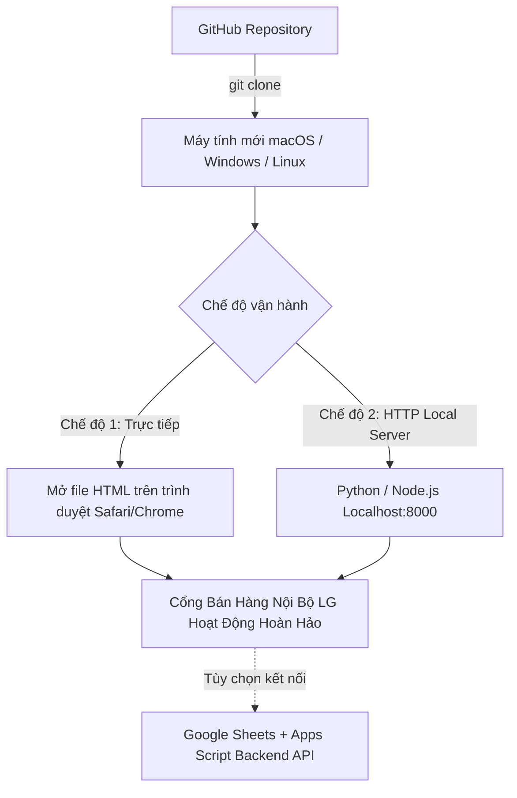

# Hướng dẫn Thiết lập & Chạy Dự án từ GitHub (Zero-Friction Setup Guide)
*Dành cho Kỹ sư, Lập trình viên AI Agent và Quản trị viên hệ thống khi clone về thiết bị mới.*

---

## 1. Giới thiệu tổng quan kiến trúc (Architecture Overview)

Cổng Bán Hàng Nội Bộ LG Electronics Việt Nam (**LG Internal Sales Portal**) được thiết kế theo triết lý **Karpathy Simplicity & Zero-Build Dependency**:
* **Frontend:** Thuần túy Vanilla HTML5, CSS3 và Modern JavaScript (ES6+), được biên soạn tập trung trong 1 tệp duy nhất [`Mau_Dang_Ky_Internal_Sales_3009.html`](Mau_Dang_Ky_Internal_Sales_3009.html) (kèm bộ điều hướng [`index.html`](index.html)).
* **Thư viện đi kèm nội bộ:** Tất cả thư viện lõi (`xlsx.mini.min.js` xử lý Excel và `heic2any.min.js` chuyển đổi ảnh iPhone HEIC) được đóng gói sẵn trong thư mục [`data/`](data/) và nhúng fallback CDN tự động.
* **Bộ nhận diện thương hiệu:** Font chữ **LG EI Text / LG EI Headline** nhúng Base64 chuẩn WOFF; hình động **Digital Logo Play** lưu trữ tại [`assets/digital-logo-play/`](assets/digital-logo-play/).
* **Backend Cloud Database (Tùy chọn):** Google Sheets kết hợp Google Apps Script ([`apps-script/Code.gs`](apps-script/Code.gs)). Có chế độ **Local Demo Fallback** tự hoạt động 100% khi chưa kết nối Google Cloud.



---

## 2. Yêu cầu hệ thống (Prerequisites)

* **Hệ điều hành:** macOS, Windows 10/11, hoặc Linux Ubuntu/Debian.
* **Trình duyệt web:** Google Chrome (Khuyên dùng), Safari, Microsoft Edge, hoặc Firefox phiên bản mới nhất.
* **Công cụ bổ trợ (Không bắt buộc):** Python 3.8+ hoặc Node.js (dùng khi muốn chạy local web server). Không cần cài `npm install` hay trình biên dịch phức tạp.

---

## 3. Hướng dẫn cài đặt từng bước (Step-by-Step Installation)

### Bước 1: Clone mã nguồn từ GitHub về thiết bị

Mở Terminal (macOS/Linux) hoặc PowerShell/Git Bash (Windows) và chạy:

```bash
# Clone repository về máy
git clone <URL_GITHUB_REPOSITORY> "lg-internal-sales-portal"

# Di chuyển vào thư mục dự án
cd "lg-internal-sales-portal"
```

### Bước 2: Kiểm tra tính toàn vẹn của thư mục dự án

Đảm bảo các thư mục cốt lõi tồn tại đầy đủ:
```text
lg-internal-sales-portal/
├── index.html                           # Cổng điều hướng tự động
├── Mau_Dang_Ky_Internal_Sales_3009.html  # Ứng dụng Web chính thức (Core Single-File)
├── apps-script/
│   └── Code.gs                          # Mã nguồn Google Apps Script backend
├── assets/
│   ├── branding/                        # Tài sản thương hiệu LG
│   ├── content/                         # Cấu hình tài khoản ngân hàng & hệ thống
│   ├── digital-logo-play/               # Bộ ảnh động LG Logo Play chính thức
│   ├── images/                          # Banner quảng bá dòng sản phẩm
│   └── templates/                       # File mẫu Excel chuẩn hệ thống
├── data/
│   ├── heic2any.min.js                  # Thư viện xử lý ảnh iPhone
│   ├── xlsx.mini.min.js                 # Thư viện xử lý file Excel
│   ├── LG_Internal_Sales_Database.xlsx  # Bảng tính cơ sở dữ liệu mẫu
│   └── Mau_Danh_Muc_San_Pham_Internal_Sales.xlsx # File mẫu nạp danh mục
├── docs/                                # Toàn bộ tài liệu hướng dẫn & thiết kế
└── README.md                            # Tổng quan dự án
```

### Bước 3: Khởi chạy dự án trên máy cục bộ

Bạn có thể lựa chọn 1 trong 3 phương thức sau:

#### Phương thức 1: Chạy bằng máy chủ cục bộ Python (Khuyên dùng nhất)
```bash
# Chạy máy chủ HTTP tại cổng 8000
python3 -m http.server 8000
```
Mở trình duyệt và truy cập: `http://localhost:8000` (hoặc `http://localhost:8000/Mau_Dang_Ky_Internal_Sales_3009.html`).

#### Phương thức 2: Chạy bằng Node.js / npx
```bash
npx serve .
```
Mở URL được hiển thị trên terminal (thường là `http://localhost:3000`).

#### Phương thức 3: Mở trực tiếp file HTML (Zero-Install)
* Nhấp đúp chuột trực tiếp vào file [`Mau_Dang_Ky_Internal_Sales_3009.html`](Mau_Dang_Ky_Internal_Sales_3009.html) hoặc [`index.html`](index.html).
* Hệ thống được trang bị cơ chế mã hóa Base64 cho file mẫu Excel và font chữ, đảm bảo hoạt động trơn tru ngay cả trên giao thức `file:///` mà không gặp lỗi CORS.

---

## 4. Tài khoản Demo kiểm thử có sẵn (Demo Credentials)

Hệ thống tích hợp sẵn các tài khoản demo để người dùng và quản trị viên có thể kiểm thử ngay *(bảng đã đối chiếu với mã nguồn ngày 05/10/2026 — bản cũ ghi mật khẩu `pm123456`/`emp123456` và mã `VH67890` là không đúng)*:

| Vai trò (Role) | Mã NV (Account) | Mật khẩu mặc định | Họ tên hiển thị | Quyền hạn chính |
|---|---|---|---|---|
| **PM Quản Trị** | `VH12345` | `test123` | Nguyễn Thị Quỳnh Như | Tạo đợt bán, import Excel, mở/kết sổ chương trình, mở cổng nộp tiền, duyệt thanh toán bằng Lightbox, đối soát hàng loạt, xuất báo cáo. |
| **PM Quản Trị** | `VH99999` | `test123` | Nguyen Ngoc Bao | Như trên (dùng thử cô lập đa PM). |
| **Nhân Viên 1** | `VH88921` | `test123` | Trần Văn Nam | Xem catalog, đăng ký giữ chỗ suất máy (Slot), nộp chứng từ ủy nhiệm chi, tra cứu đơn hàng cá nhân. |
| **Nhân Viên 2** | `VH11111` | `test123` | Nguyen Ngoc Bao | Đăng ký thử nghiệm và kiểm thử tính năng giữ chỗ cạnh tranh (FCFS). |
| Nhân viên khác | `VH55432`, `VH33211`, `VH99120` | `test123` | Lê Hoàng Anh, Hoàng Minh Trí, Đặng Thanh Hà | Thử nhiều người cùng lúc. |
| Tài khoản bị khóa | `VH00001` | `disabled` | Test Inactive | Thử thông báo "tài khoản đã bị vô hiệu hóa". |

> **Cách đăng nhập:** màn hình đăng nhập hiện ngay khi mở trang. Gõ Mã NV + mật khẩu, hoặc bấm 1 trong 3 nút đăng nhập nhanh (`VH12345`, `VH88921`, `VH11111`). Đổi tài khoản: bấm **Đăng xuất** ở góc trên bên phải rồi đăng nhập lại.
>
> ⚠️ Tài khoản demo **chỉ có trong bản demo**. Bản chính thức `portal.html` không có, và máy chủ chính thức từ chối phiên đăng nhập demo. Role **ADMIN** chỉ có với tài khoản trong Sheet — xem [`docs/CURRENT_STATE.md`](../CURRENT_STATE.md).

---

## 5. Kết nối Google Sheets Backend thật Trên Drive Cá Nhân (1-Click Tự Động)

> Cẩm nang chuyên sâu dành riêng cho AI Agent & PIC: [docs/01-setup-and-deployment/AGENT_GUIDE_AUTO_SETUP_SHEET.md](docs/01-setup-and-deployment/AGENT_GUIDE_AUTO_SETUP_SHEET.md)

Khi muốn triển khai lên môi trường sản xuất có lưu trữ dữ liệu thật trên Google Drive của bạn mà không động chạm đến mã nguồn Git:

1. **Khởi tạo CSDL tự động 1-Click:**
   * Mở trình duyệt, truy cập `https://script.google.com` và tạo **Dự án mới (New project)**.
   * Sao chép toàn bộ mã nguồn tệp [`apps-script/Code.gs`](apps-script/Code.gs) dán vào cửa sổ soạn thảo.
   * Tại menu chọn hàm, chọn **`setupNewDatabase`** và bấm **Chạy (Run)**.
   * Cấp quyền Google khi được hỏi. Hàm sẽ **tự động tạo tệp Google Sheet "LG Internal Sales Database"** ngay trên Drive của bạn với đầy đủ 8 sheets chuẩn LG Brand V5.2.
2. **Triển khai Web App:**
   * Sao chép mã `SPREADSHEET_ID` được in ra ở cửa sổ nhật ký, dán vào dòng 21 `Code.gs`: `var SPREADSHEET_ID = '<ID_VỪA_TẠO>';` và bấm **Lưu**. *(Từ 05/10/2026 có cách tốt hơn: Project Settings → Script Properties → `SPREADSHEET_ID` = ID vừa tạo, không cần sửa code.)*
   * Bấm **Triển khai (Deploy)** → **Tùy chọn triển khai mới (New deployment)**.
   * Chọn loại: **Ứng dụng web (Web App)** (Execute as: **Tôi / Me**, Who has access: **Bất kỳ ai / Anyone**).
   * Bấm **Triển khai** và sao chép đường dẫn **Web App URL** (Dạng `https://script.google.com/macros/s/.../exec`).
3. **Cấu hình trên giao diện Web (Không cần sửa mã nguồn):**
   * Mở file [`Mau_Dang_Ky_Internal_Sales_3009.html`](Mau_Dang_Ky_Internal_Sales_3009.html) trên trình duyệt.
   * Nhấp vào huy hiệu **`⚪ Demo Mode (Offline)`** trên góc phải thanh tiêu đề (hoặc nút **`Cấu hình API`** trong Tab PM).
   * Dán Web App URL vào ô và bấm **Kiểm Tra & Lưu Cấu Hình**.
   * Hệ thống sẽ ping kiểm tra kết nối và chuyển sang trạng thái **`🟢 Google Cloud Live`**. URL được lưu trong `localStorage` của **riêng trình duyệt này**.
4. **Phát hành cho nhân viên (từ 05/10/2026):** nhân viên không cần làm bước 3. Sinh bản chính thức đã gắn sẵn URL: `python3 scripts/build_production.py --api-url <URL /exec>` → `portal.html`. Trình tự đầy đủ: [`docs/04-v1-hardening/V1_RELEASE_RUNBOOK.md`](../04-v1-hardening/V1_RELEASE_RUNBOOK.md) mục 3.

---

## 6. Xử lý các sự cố thường gặp (Troubleshooting)

1. **Mạng nội bộ nhà máy/văn phòng chặn kết nối Google Apps Script:**
   * *Hiện tượng:* Bấm đăng ký hoặc nộp tiền bị xoay chờ quá 10 giây hoặc báo lỗi mạng.
   * *Khắc phục:* Do tường lửa Intranet một số nhà máy LG chặn Webhook Google. Quý nhân viên và PM vui lòng chuyển sang **mạng dữ liệu di động (4G/5G)** trên điện thoại hoặc **Wi-Fi cá nhân** để kết nối thông suốt. Hệ thống đã có cơ chế lưu nháp Auto-Draft nên không lo bị mất dữ liệu đã nhập.
2. **Trình duyệt báo chặn lưu trữ cục bộ (`localStorage` disabled):**
   * *Hiện tượng:* Không lưu được trạng thái đổi mật khẩu hoặc trạng thái mở bán khi F5.
   * *Khắc phục:* Đảm bảo không mở ở chế độ Ẩn danh (Incognito/Private) có bật chặn cookie bên thứ ba hoặc bật quyền lưu trữ cục bộ trong Cài đặt trình duyệt.
3. **Không tải được file Excel mẫu khi click trên một số thiết bị di động cũ:**
   * Hệ thống đã tích hợp 2 lớp: Tải tự động qua giải mã Blob và Fallback bằng thẻ `<a download>` dẫn trực tiếp đến [`data/Mau_Danh_Muc_San_Pham_Internal_Sales.xlsx`](data/Mau_Danh_Muc_San_Pham_Internal_Sales.xlsx).
4. **Ảnh chuyển khoản iPhone dạng `.heic` không xem được:**
   * Thư viện `data/heic2any.min.js` sẽ tự động chuyển đổi file HEIC thành ảnh JPEG chuẩn trong 1.5 giây ngay tại trình duyệt của nhân viên trước khi hiển thị xem trước.
