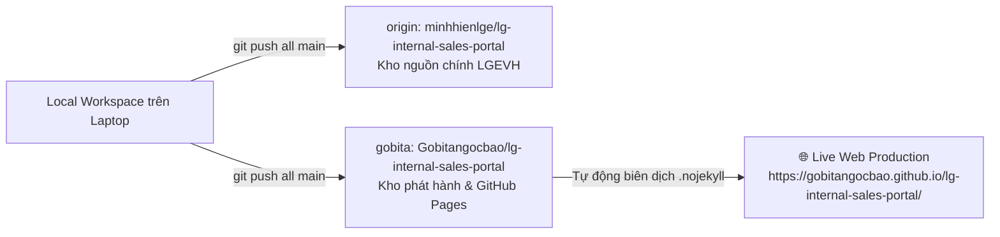
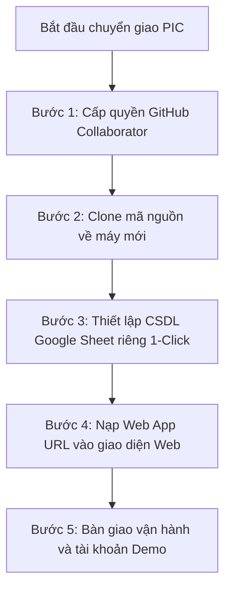

# Cẩm Nang Cấu Hình Git & Quy Trình Bàn Giao PIC (Git Configuration & Handover SOP)

> **Dành cho:** AI Coding Assistants (Antigravity, Claude, Copilot, ChatGPT), Lập trình viên cộng tác và Kỹ sư phụ trách dự án (PIC - Person In Charge).  
> **Mục tiêu:** Lưu trữ đầy đủ thông tin hệ thống Git, quy trình đồng bộ giữa các AI Agent, kịch bản chia sẻ cho đồng nghiệp hiệu chỉnh và quy trình bàn giao kỹ thuật trơn tru khi chuyển PIC mới mà **tuyệt đối không làm lộ dữ liệu cá nhân hay gián đoạn dịch vụ**.

---

## 1. Kiến Trúc Kho Lưu Trữ Kép (Dual-Remote Git Architecture)

Hệ thống mã nguồn được kết nối song song với 2 remote repository nhằm đáp ứng vừa lưu trữ nội bộ an toàn, vừa phục vụ máy chủ phát hành trực tuyến (GitHub Pages):



### Bảng thông số cấu hình mạng Git:

| Thuộc tính | Giá trị cấu hình | Ý nghĩa & Vai trò |
|---|---|---|
| **Remote 1 (`origin`)** | `https://github.com/minhhienlge/lg-internal-sales-portal.git` | Kho lưu trữ chính của chủ dự án LG Electronics Việt Nam. |
| **Remote 2 (`gobita`)** | `https://github.com/Gobitangocbao/lg-internal-sales-portal.git` | Kho phát hành công khai phục vụ máy chủ GitHub Pages Live. |
| **Remote Kép (`all`)** | Chứa cả 2 URL `origin` và `gobita` | Cho phép đẩy mã nguồn lên **đồng thời cả 2 kho** chỉ với 1 câu lệnh `git push all main`. |
| **Nhánh mặc định (Branch)** | `main` | Nhánh sản xuất chính thức của toàn bộ dự án. |
| **Website Go-Live** | `https://gobitangocbao.github.io/lg-internal-sales-portal/` | Đường dẫn trực tuyến công khai kiểm thử trên mọi thiết bị. |
| **Trang đích điều hướng** | `index.html` → `Mau_Dang_Ky_Internal_Sales_3009.html` | Tự động chuyển hướng không giật trang, giữ nguyên query URL. |
| **Cấu hình Static Host** | Tệp `.nojekyll` tại thư mục gốc | Bỏ qua trình biên dịch Jekyll của GitHub, giữ nguyên 100% cấu trúc tệp tĩnh. |

---

## 2. Quy Trình Làm Việc Dành Cho AI Agent (Agent Standard Operating Procedure)

Mỗi khi một AI Agent tiếp nhận phiên làm việc mới trên workspace này, hãy tuân thủ nghiêm ngặt **5 bước tiêu chuẩn** sau:

### Bước 1: Kéo cập nhật mới nhất trước khi chỉnh sửa
```bash
# Luôn đồng bộ dữ liệu mới nhất từ remote chính
git pull origin main
```

### Bước 2: Nguyên tắc chỉnh sửa mã nguồn (Karpathy Discipline)
- **Surgical Changes (Chỉnh sửa phẫu thuật):** Chỉ sửa đúng tệp và khối code liên quan trực tiếp đến yêu cầu của người dùng. Không xóa các file cấu trúc trong `assets/` hay `docs/`.
- **Giữ nguyên nhận diện LG BI V5.2:**
  - Màu Đỏ Heritage: `#A50034`
  - Màu Đỏ Active: `#EA1917` cho giao diện web (biến `--lg-red` trong trang; LG.com Web Style Guide) · `#FD312E` cho ấn phẩm BI (in ấn, slide). *(Bản cũ ghi `#FD003A` — không thuộc bảng màu LG, đã sửa 05/10/2026 theo skill `lg-brand`.)*
  - Nền Xám ấm Warm Gray 06: `#F0ECE4`
  - Phông chữ chuẩn: `LG EI Text` & `LG EI Headline`
- **Không bao giờ hardcode dữ liệu bí mật (Zero-Hardcode):**
  - Không điền Google Sheet ID thật vào `apps-script/Code.gs` (để trống chuỗi `''`). *Hiện trạng 05/10/2026: dòng 21 vẫn đang có ID thật — dùng Script Property `SPREADSHEET_ID` để có thể để trống (xem `docs/CURRENT_STATE.md` mục 7).*
  - Không hardcode Web App URL trong `Mau_Dang_Ky_Internal_Sales_3009.html` (để đọc động qua `localStorage`). Ngoại lệ có chủ đích: `portal.html` (bản chính thức) do `scripts/build_production.py` gắn URL — **không sửa tay** file nguồn để gắn URL.
- **Không tự ý đổi chức năng đã duyệt** và tôn trọng **Vùng Bất Khả Xâm Phạm** (`docs/03-architecture-and-analysis/IMPROVEMENT_PLAN_PROPOSAL.md` §3B). Mọi thay đổi chạm luồng Admin / PM / Nhân viên phải được duyệt và ghi vào `docs/04-v1-hardening/README.md`.

### Bước 3: Kiểm thử tự động trước khi đóng gói
**Bắt buộc từ 05/10/2026** — 2 bộ kiểm thử chạy code thật (phải xanh 100%):
```bash
node tests/backend_gas_harness.js
python3 tests/cloud_mode_regression.py
node tests/run_e2e_tests.js
```
Và kiểm tra nhanh (cũ, vẫn dùng):
```bash
# Kiểm tra cú pháp và đảm bảo không có đường dẫn tuyệt đối máy tính còn sót lại
python3 -c "
with open('Mau_Dang_Ky_Internal_Sales_3009.html') as f: c = f.read()
assert 'top-api-badge' in c, 'Missing API badge'
assert 'api-config-modal' in c, 'Missing API modal'
assert 'AKfycbwb' not in c, 'Hardcoded URL leaked!'
assert '/Users/' not in c, 'Local absolute path leaked!'
print('Verification PASS 100%')
"
```

### Bước 4: Tạo Commit chuẩn mực
Ghi chú commit rõ ràng theo chuẩn Conventional Commits:
```bash
git add .
git commit -m "feat(portal): mô tả ngắn gọn tính năng mới bổ sung"
# hoặc
git commit -m "fix(brand): chỉnh sửa giao diện theo chuẩn LG BI V5.2"
```

### Bước 4b: Làm việc trên nhánh & điểm khôi phục (áp dụng từ bản v1)
- Thay đổi lớn làm trên **nhánh riêng** (vd. `v1-hardening`), **không** sửa trực tiếp `main`.
- Trước khi sửa, tạo điểm khôi phục: `git tag -a checkpoint-<tên>-<YYYYMMDD> -m "..."`. Điểm hiện có: `checkpoint-pre-v1-hardening-20261005` (+ nhánh `backup/pre-v1-hardening-20261005`).
- Gộp vào `main` và đẩy lên 2 remote **chỉ khi chủ dự án duyệt**: `git switch main && git merge --no-ff v1-hardening && git push all main`.

### Bước 5: Đẩy lên cả 2 remote chỉ bằng 1 lệnh
```bash
# Đẩy đồng thời lên cả origin (minhhienlge) và gobita (Gobitangocbao)
git push all main
```
*Lưu ý: Nếu remote `all` chưa được nhận diện, có thể chạy lần lượt:*
```bash
git push origin main && git push gobita main
```

---

## 3. Quy Trình Bàn Giao Kỹ Thuật Khi Chuyển PIC Mới (Handover SOP)

Khi chuyển giao dự án cho một Kỹ sư phụ trách mới (PIC), hãy cung cấp cẩm nang này cùng quy trình 5 bước:



### Bước 1: Phân quyền truy cập trên GitHub
1. Quản trị viên truy cập trang cài đặt repository:
   - `https://github.com/minhhienlge/lg-internal-sales-portal/settings/access`
2. Bấm **Add people** > Nhập tài khoản GitHub hoặc email của PIC mới > Chọn quyền **Write (hoặc Admin)**.
3. PIC mới chấp nhận lời mời qua email hoặc thông báo GitHub.

### Bước 2: Clone mã nguồn về thiết bị của PIC mới
PIC mới mở Terminal (macOS/Linux) hoặc Git Bash (Windows) và thực hiện:
```bash
# Clone mã nguồn
git clone https://github.com/minhhienlge/lg-internal-sales-portal.git

# Di chuyển vào thư mục dự án
cd lg-internal-sales-portal

# Thiết lập remote kép để sau này push đồng bộ 1 chạm
git remote add gobita https://github.com/Gobitangocbao/lg-internal-sales-portal.git
git remote add all https://github.com/minhhienlge/lg-internal-sales-portal.git
git remote set-url --add --push all https://github.com/minhhienlge/lg-internal-sales-portal.git
git remote set-url --add --push all https://github.com/Gobitangocbao/lg-internal-sales-portal.git
```

### Bước 3: Tạo CSDL Google Sheet độc lập cho PIC mới (Zero-Pervasive-Access)
> ⚠️ **NGUYÊN TẮC AN TOÀN:** PIC mới **KHÔNG ĐƯỢC DÙNG CHUNG GOOGLE DRIVE** của người tiền nhiệm để tránh lẫn lộn dữ liệu cá nhân.

PIC mới đọc tài liệu [`docs/01-setup-and-deployment/AGENT_GUIDE_AUTO_SETUP_SHEET.md`](AGENT_GUIDE_AUTO_SETUP_SHEET.md):
1. Truy cập `https://script.google.com` bằng tài khoản Google của chính PIC mới > Tạo **Dự án mới (New project)**.
2. Dán mã từ `apps-script/Code.gs` vào.
3. Chọn hàm **`setupNewDatabase`** và bấm **Chạy (Run)**.
4. Google Apps Script sẽ **tự động tạo một bảng tính Google Sheet mới tên `LG Internal Sales Database`** nằm ngay trên Drive của PIC mới với đủ 8 sheets chuẩn nhận diện LG Heritage Red `#A50034`.
5. Dán `SPREADSHEET_ID` vừa in ra vào dòng 21 `Code.gs` và triển khai **Web App (Execute as: Me, Anyone)**.

### Bước 4: Nạp API URL vào giao diện
1. Mở Cổng thông tin trên trình duyệt (`Mau_Dang_Ky_Internal_Sales_3009.html` hoặc link Go-Live).
2. Nhấp vào huy hiệu **`⚪ Demo Mode (Offline)`** ở góc trên bên phải thanh tiêu đề (hoặc nút **`Cấu hình API`** trong Tab PM).
3. Dán URL Web App vừa tạo > Bấm **Kiểm Tra & Lưu Cấu Hình**.
4. Trạng thái chuyển sang **`🟢 Google Cloud Live`**. Dữ liệu được lưu an toàn trong trình duyệt của PIC mới.

### Bước 5: Bàn giao danh sách tài khoản Demo kiểm thử
PIC mới có thể bắt đầu vận hành ngay với các tài khoản thử nghiệm:
- **Tài khoản Quản lý (PM):** `VH12345` / Mật khẩu: `test123` (Nguyễn Thị Quỳnh Như)
- **Tài khoản Nhân viên (User):** `VH88921` / Mật khẩu: `test123` (Trần Văn Nam)
- ⚠️ Các tài khoản này chỉ dùng trong **bản demo**. Trên Sheet chính thức, mọi tài khoản dùng mật khẩu `test123` (công khai trong repo) phải đổi mật khẩu hoặc xóa trước go-live. Role **ADMIN** gán trong tab `Users` — xem `docs/04-v1-hardening/V1_RELEASE_RUNBOOK.md` mục 4b.

---

## 4. Bảng Lệnh Tra Cứu Nhanh (Git Cheat Sheet Cho PIC & Agent)

| Thao tác mong muốn | Câu lệnh thực thi |
|---|---|
| **Kiểm tra trạng thái branch & remote** | `git status` và `git remote -v` |
| **Kéo mã nguồn mới nhất từ kho chính** | `git pull origin main` |
| **Đẩy code lên đồng thời cả 2 kho** | `git push all main` |
| **Đẩy riêng cho từng kho** | `git push origin main` và `git push gobita main` |
| **Kiểm tra nhật ký commit gần nhất** | `git log -n 5 --oneline` |
| **Kiểm tra trạng thái máy chủ GitHub Pages** | `gh api repos/Gobitangocbao/lg-internal-sales-portal/pages/builds/latest` |
| **Chạy Web Server cục bộ thử nghiệm** | `python3 -m http.server 8000` |

---

## 5. Danh Mục Liên Hệ & Kênh Hỗ Trợ Dự Án

- **Đơn vị chủ quản nghiệp vụ:** Ban Quản Trị Bán Hàng Nội Bộ (Internal Sales PM Team / HS PM Support).
- **Hộp thư tiếp nhận yêu cầu hỗ trợ:** `internalsales.support@lge.com` (màn hình đăng nhập). Nút "Hỗ trợ" trong trang ghi `minhhien.hoang@lge.com` theo chỉ định của chủ dự án 05/10/2026 — chờ chốt 1 đầu mối (`docs/CURRENT_STATE.md` mục 9).
- **Tài khoản ngân hàng thụ hưởng chính thức:**
  - Ngân hàng: **Vietcombank (VCB)** — Chi nhánh Tây Hồ, Hà Nội *(giao diện & email ghi "Tây Hồ"; `assets/content/bank_accounts.json` ghi "Tây Hà Nội" — chờ Tài chính xác nhận)*
  - Số tài khoản: **`0991000012525`**
  - Đơn vị thụ hưởng: **CTY TNHH LG ELECTRONICS VN HP**
