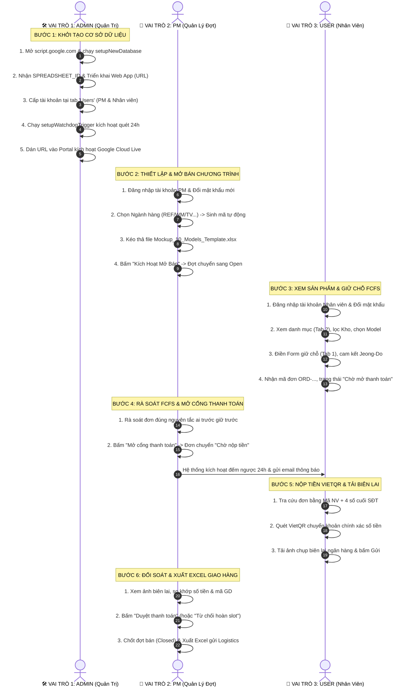

# CẨM NANG HƯỚNG DẪN KIỂM THỬ THỰC TẾ TOÀN TRÌNH (E2E WALKTHROUGH)
## Hệ Thống Đăng Ký Bán Hàng Nội Bộ LG (LG Internal Sales Portal)

> **Dành cho:** Người dùng phổ thông, Ban Quản trị Bán hàng Nội bộ (PM), và Kỹ sư Quản trị Hệ thống (Admin).  
> **Mục tiêu:** Giúp bất kỳ ai, kể cả người không rành công nghệ, có thể tự mình thiết lập và trải nghiệm kiểm thử toàn diện một hệ thống bán hàng thực tế khép kín qua 3 vai trò: **Admin $\rightarrow$ PM $\rightarrow$ User**.  
> **Tài nguyên mẫu đính kèm:** `data/Mockup_10_Models_Internal_Sales_Template.xlsx` (10 model sản phẩm LG cao cấp).

---

## TỔNG QUAN LUỒNG VẬN HÀNH 3 VAI TRÒ



---

## PHẦN 1: DÀNH CHO VAI TRÒ 1 — QUẢN TRỊ VIÊN HỆ THỐNG (ADMIN)
*(Thời gian thực hiện: ~2 phút)*

Mục tiêu của Admin là **tạo ra một hệ thống Google Sheet hoàn toàn độc lập trên Google Drive cá nhân** của bạn, lấy đường link kết nối API và cấp tài khoản cho người tham gia.

### Bước 1.1: Tạo CSDL Google Sheet 1-Click
1. Mở trình duyệt web, truy cập: **[https://script.google.com](https://script.google.com)**.
2. Nhấn nút **Dự án mới (New project)** ở góc trên bên trái.
3. **Lấy nội dung mã nguồn Apps Script:**
   - **Vị trí tệp:** Nằm tại thư mục `apps-script/` $\rightarrow$ tệp [`Code.gs`](file:///Users/macbook/Documents/antigravity/AI%20study/LG%20other/Internal%20sales%20platform/apps-script/Code.gs) (đường dẫn đầy đủ: `/Users/macbook/Documents/antigravity/AI study/LG other/Internal sales platform/apps-script/Code.gs`).
   - **Cách 1 (Nhanh nhất):** Nhấp trực tiếp vào liên kết tệp này: 👉 **[apps-script/Code.gs](file:///Users/macbook/Documents/antigravity/AI%20study/LG%20other/Internal%20sales%20platform/apps-script/Code.gs)** để mở mã nguồn trong trình soạn thảo $\rightarrow$ Nhấn `Cmd + A` (chọn toàn bộ 1.798 dòng) $\rightarrow$ Nhấn `Cmd + C` để Copy.
   - **Cách 2 (Sao chép 1-Click bằng Terminal):** Mở cửa sổ Terminal và gõ lệnh sau để hệ thống tự động nạp toàn bộ mã nguồn vào khay nhớ tạm (Clipboard) của máy:
     ```bash
     cat "apps-script/Code.gs" | pbcopy
     ```
   - Sau đó, quay lại cửa sổ trình duyệt `script.google.com`, xóa chữ `function myFunction() {...}` có sẵn và nhấn `Cmd + V` để dán đè toàn bộ vào.
4. Nhấn **Lưu (Ctrl+S / Cmd+S)**.
5. Trên thanh công cụ, tại ô chọn hàm (đang hiện `myFunction`), nhấp chọn:
   👉 **`setupNewDatabase`** $\rightarrow$ rồi nhấn nút **Chạy (Run ▶)**.
6. Khi Google hỏi cấp quyền truy cập:
   - Nhấn *Xem lại quyền* $\rightarrow$ Chọn email Google của bạn.
   - Nhấn *Nâng cao (Advanced)* $\rightarrow$ Nhấn *Đi tới dự án (Không an toàn)* $\rightarrow$ Nhấn *Cho phép (Allow)*.
7. **Kết quả:** Sau vài giây, Google Apps Script sẽ tự động tạo một Google Sheet mang tên **`LG Internal Sales Database`** ngay trên Google Drive của bạn với đầy đủ 8 tab chuẩn hóa.

### Bước 1.2: Triển khai Web App (Lấy đường dẫn API)
1. Nhìn vào màn hình *Nhật ký thực thi (Execution Log)* bên dưới, copy chuỗi ký tự **`SPREADSHEET_ID`** vừa in ra (ví dụ: `1A2b3C...`).
2. Quay lại dòng 21 của `Code.gs`, dán mã đó vào:
   ```javascript
   var SPREADSHEET_ID = '<DÁN_MÃ_VỪA_COPY_VÀO_ĐÂY>';
   ```
   Bấm **Lưu (Ctrl+S / Cmd+S)**.
3. Nhấp nút **Triển khai (Deploy)** ở góc trên bên phải $\rightarrow$ Chọn **Tùy chọn triển khai mới (New deployment)**:
   - Loại (Type): Nhấp bánh răng ⚙️ $\rightarrow$ Chọn **Ứng dụng web (Web app)**.
   - Mô tả: `LG Internal Sales API v8.2`.
   - Thực thi dưới danh nghĩa (Execute as): **Tôi (Me)**.
   - Ai có quyền truy cập (Who has access): **Bất kỳ ai (Anyone)**.
4. Nhấp nút **Triển khai** $\rightarrow$ Sao chép **URL ứng dụng web** (đường link kết thúc bằng `/exec`).

### Bước 1.3: Cấp tài khoản tại tab `Users`
1. Mở file Google Sheet `LG Internal Sales Database` trên Google Drive của bạn.
2. Chuyển sang trang tính **`Users`**:
   - Cột A (`User_ID`): Nhập Mã nhân viên (ví dụ: `PM01`, `NV01`, `NV02`).
   - Cột B (`Password`): Gõ trực tiếp mật khẩu ban đầu dạng chữ thường (ví dụ: `admin123` cho PM, `123456` cho NV).
   - Cột C (`Role`): Điền `PM` (quản lý) hoặc `USER` (nhân viên).
   - Cột D (`Name`): Họ tên đầy đủ.
   - Cột E (`Email`): Hộp thư nhận thông báo.
   - Cột F (`Division`): Khối phòng ban (ví dụ: `HS PM Support`, `R&D`, `Sales`).
   - Cột G (`Status`): Điền `Active`.

### Bước 1.4: Kích hoạt Bộ quét Tự động 24h (1-Click Trigger)
1. Quay lại màn hình Google Apps Script, tại ô chọn hàm, chọn hàm:
   👉 **`setupWatchdogTrigger`** $\rightarrow$ Nhấn **Chạy (Run ▶)**.
2. Hệ thống sẽ tự động kích hoạt trình chạy ngầm mỗi giờ để kiểm tra và thu hồi các slot quá hạn 24h mà Admin không cần thao tác thêm.

### Bước 1.5: Kích hoạt Cổng thông tin (Portal)
1. Mở tệp `Mau_Dang_Ky_Internal_Sales_3009.html` trên trình duyệt.
2. Nhấp vào huy hiệu **`⚪ Demo Mode (Offline)`** ở góc trên cùng bên phải.
3. Dán URL Web App (lấy ở Bước 1.2) vào ô nhập liệu $\rightarrow$ Nhấn **Kiểm Tra & Lưu Cấu Hình**.
4. Huy hiệu chuyển sang **`🟢 Google Cloud Live`** $\rightarrow$ Hệ thống đã sẵn sàng 100%!

---

## PHẦN 2: DÀNH CHO VAI TRÒ 2 — QUẢN LÝ NGÀNH HÀNG (PM)
*(Tạo đợt bán hàng, duyệt mở cổng thanh toán, đối soát biên lai & xuất Excel kho)*

### Bước 2.1: Đăng nhập & Đổi mật khẩu cá nhân
1. Trên thanh tiêu đề trang, nhấp **Đăng nhập**.
2. Nhập Mã NV (ví dụ: `PM01`) và mật khẩu được cấp (`admin123`).
3. Đăng nhập thành công, góc trên sẽ hiển thị huy hiệu đỏ **`PM Quản trị`**.
4. Để bảo mật, PM nhấp vào nút **`🔑 Đổi MK`** trên thanh header:
   - Nhập mật khẩu cũ $\rightarrow$ Nhập mật khẩu mới (ví dụ: `PmSecure@2026`).
   - Bấm **Cập nhật** $\rightarrow$ Hệ thống tự động băm SHA-256 kèm Salt và đồng bộ về CSDL.

### Bước 2.2: Khởi tạo Đợt Bán Hàng Mới bằng Excel Mẫu
1. Nhấp sang **Tab 5 (⚙️ Quản Trị PM)**.
2. Nhấp nút **`+ Tạo đợt bán mới`** (hoặc *Thiết lập đợt bán*). Cửa sổ popup sẽ xuất hiện:
   - **Ngành hàng / Phân khúc:** Nhấp chọn phân khúc (ví dụ: `TV · Tivi OLED / QNED / UHD`).
   - **Mã đợt bán:** Hệ thống sẽ **tự động điền mã chuẩn hóa** `IS-2026Q4-TV-01` (có tích xanh `✓ Mã hợp lệ`).
   - **Tên chương trình:** Hệ thống tự sinh `Đợt Bán Hàng Nội Bộ Q4/2026 – Ngành Tivi OLED & QNED`.
   - **Thời gian bắt đầu / Kết thúc:** Nhấp nút chọn nhanh `+7 Ngày tới` hoặc tự chọn ngày.
   - **Hạn mức:** Mặc định `1` sản phẩm / nhân viên.
3. **Kéo thả File Danh mục Sản phẩm:**
   - Kéo file mẫu **`data/Mockup_10_Models_Internal_Sales_Template.xlsx`** thả vào khung nét đứt màu đỏ (hoặc bấm vào để chọn file).
   - Hệ thống lập tức đọc file, lọc bỏ các cột điểm số kỹ thuật nội bộ và hiển thị thông báo:  
     *`✓ Đã nạp thành công 10 sản phẩm từ file Excel!`*
4. Nhấn **`🚀 Kích Hoạt Mở Bán`** $\rightarrow$ Chương trình mới chuyển sang trạng thái **`Open`**.

### Bước 2.3: Giám sát Đăng ký & Mở cổng Thanh toán 24h
1. Khi nhân viên đăng ký giữ chỗ, danh sách trong Bảng Quản Trị PM sẽ nhảy số tức thì (nhờ cơ chế Adaptive Polling 6–8s).
2. Các đơn mới đăng ký ban đầu sẽ có trạng thái: **`Đã đăng ký - Chờ mở thanh toán`**.
   *(Lợi ích: Tránh nhân viên chuyển tiền trước khi PM kiểm soát số lượng, hạn chế tối đa việc phải hoàn tiền kế toán).*
3. Khi PM đã rà soát xong danh sách theo nguyên tắc FCFS (ai nhanh giữ trước):
   - Nhấn nút màu tím: **`🔓 Mở cổng thanh toán (N đơn)`** trên thanh công cụ.
   - Toàn bộ các đơn đăng ký trước đó sẽ chuyển trạng thái sang **`Chờ nộp tiền`**.
   - Đồng hồ đếm ngược 24h chính thức kích hoạt kể từ giây phút này.

### Bước 2.4: Đối soát Biên lai Ngân hàng
1. Khi nhân viên chuyển khoản và tải ảnh biên lai lên hệ thống, trạng thái đơn sẽ chuyển sang **`Đã khai nộp - chờ đối soát`**.
2. PM nhấp nút **`🔍 Xem Biên Lai`** trên từng đơn:
   - Màn hình popup phóng to hình ảnh ủy nhiệm chi/biên lai chuyển khoản.
   - Kiểm tra: Tên tài khoản nhận (Công ty TNHH LG Electronics VN Hải Phòng), Số tiền và Cú pháp chuyển khoản.
3. Nếu hợp lệ: Bấm **`✓ Duyệt Thanh Toán`** $\rightarrow$ Đơn chuyển sang `Đã duyệt thanh toán` (chốt thành công).
4. Nếu sai sót: Bấm **`✕ Từ Chối / Bổ Sung`** (nhập lý do: sai số tiền, mờ biên lai) $\rightarrow$ Slot được hoàn trả hoặc yêu cầu nộp lại.

### Bước 2.5: Đóng Đợt & Xuất Danh Sách Giao Hàng
1. Khi hết hạn đăng ký, PM đổi trạng thái chương trình sang **`Closed`**.
2. Nhấn nút **`📥 Xuất Excel Bàn Giao Logistics`**:
   - Hệ thống tải về file Excel tổng hợp các đơn đã duyệt thanh toán đầy đủ Mã NV, Tên, Số điện thoại, Địa chỉ giao hàng, Kho xuất (AYA/AYB/AYC), Model và Serial chính xác để kho xuất hàng.

---

## PHẦN 3: DÀNH CHO VAI TRÒ 3 — NHÂN VIÊN MUA HÀNG (USER)
*(Xem hàng, giữ chỗ FCFS, thanh toán VietQR & tra cứu tiến độ)*

### Bước 3.1: Đăng nhập & Đổi mật khẩu cá nhân
1. Nhân viên truy cập portal, nhấp **Đăng nhập** ở góc trên.
2. Nhập Mã NV (ví dụ: `NV01`) và mật khẩu được cấp ban đầu (`123456`).
3. Đổi mật khẩu cá nhân qua nút **`🔑 Đổi MK`** để bảo mật quyền lợi mua hàng.

### Bước 3.2: Khám phá Danh mục Sản phẩm (Tab 2)
1. Nhấp sang **Tab 2 (💻 Danh Mục & Đặt Hàng)**.
2. Sử dụng thanh công cụ trực quan:
   - **Bộ lọc kho:** Nhấp `Kho AYA` (Hải Phòng), `Kho AYB` (Hưng Yên), hoặc `Kho AYC`.
   - **Tìm kiếm:** Gõ tên model (ví dụ: `OLED`, `InstaView`, `WashTower`).
3. Đọc kỹ thông tin sản phẩm trên thẻ card:
   - Phân hạng chất lượng: `Loại A` (như mới) hoặc `Loại B` (hộp cũ/xước dăm).
   - Tình trạng chi tiết: Đọc mô tả thực tế từ kho (ví dụ: *Cấn nhẹ cạnh hông 1mm, khay kính nguyên bản*).
   - Giá nội bộ (đã giảm 50% - 65% so với giá niêm yết hãng RRP).
4. Chọn được sản phẩm ưng ý $\rightarrow$ Nhấn nút đỏ **`🛒 Đăng Ký Mua`**.

### Bước 3.3: Gửi Đơn Đăng Ký Giữ Chỗ FCFS (Tab 1)
1. Hệ thống tự động chuyển sang Form đăng ký tại Tab 1 và điền sẵn Model + Mã Slot ID.
2. Nhân viên kiểm tra và điền các trường còn lại:
   - Số điện thoại liên hệ nhận hàng.
   - Địa chỉ giao hàng chi tiết (nhà riêng hoặc công ty).
   - Tích chọn ô cam kết:  
     *`☑ Tôi cam kết tuân thủ quy định Jeong-Do Management: Mua sử dụng cá nhân, không bán lại cho bên thứ ba.`*
3. Nhấn nút **`Gửi Đăng Ký Mua Hàng`**:
   - Hệ thống ghi nhận giữ chỗ theo mili-giây máy chủ.
   - Màn hình hiện thông báo chúc mừng kèm Mã đơn hàng dạng `ORD-20261004-xxxx-xxxx`.
   - Trạng thái đơn lúc này là: **`Đã đăng ký - Chờ mở thanh toán`**.

### Bước 3.4: Chuyển Khoản VietQR 1-Chạm & Tải Biên Lai (Tab 3)
1. Khi PM mở cổng thanh toán, nhân viên nhận được thông báo trạng thái đơn chuyển sang: **`Chờ nộp tiền`** (có 24h để thanh toán).
2. Nhấp sang **Tab 3 (✅ Tra Cứu & Xác Nhận Nộp Tiền)**:
   - Tại khung tra cứu, nhập: **Mã NV** + **4 số cuối SĐT** $\rightarrow$ Bấm *Tìm kiếm*.
   - Đơn hàng xuất hiện $\rightarrow$ Bấm nút màu xanh **`💳 Nộp Tiền Ngay`**.
3. **Thanh toán VietQR siêu tốc:**
   - Hệ thống mở popup hiển thị mã QR ngân hàng Vietcombank đã nạp sẵn chính xác 100% số tiền và cú pháp chuyển khoản (không cần gõ tay).
   - Mở app ngân hàng bất kỳ (VCB, Techcombank, MB, Momo...) quét mã QR $\rightarrow$ Xác nhận chuyển khoản.
4. **Tải biên lai:**
   - Chụp màn hình thông báo chuyển khoản thành công trên app ngân hàng.
   - Kéo ảnh thả vào ô tải biên lai (hệ thống tự động nén ảnh xuống dưới 300KB mượt mà).
   - Nhập Mã giao dịch ngân hàng $\rightarrow$ Bấm **`Xác Nhận Nộp Tiền`**.
5. Đơn hàng chuyển sang trạng thái: **`Đã khai nộp - chờ đối soát`**.

### Bước 3.5: Theo dõi Tiến Độ Giao Hàng
1. Nhân viên có thể vào lại Tab 3 bất kỳ lúc nào để tra cứu.
2. Khi PM đối soát xong, trạng thái cập nhật thành: **`Đã duyệt thanh toán`**.
3. Nhân viên yên tâm chờ bộ phận Logistics điều phối xe giao hàng tận nơi theo địa chỉ đã đăng ký.

---

## BẢNG THÔNG TIN 10 MODEL SẢN PHẨM MẪU (TEST DATA)
*(Trích từ file `data/Mockup_10_Models_Internal_Sales_Template.xlsx`)*

| Slot | Model | Ngành | Kho | Hạng | Tình trạng kiểm tra thực tế | Giá Niêm Yết (RRP) | Giá Bán Nội Bộ | Tiết Kiệm |
|:---:|:---|:---:|:---:|:---:|:---|:---:|:---:|:---:|
| **#001** | `OLED65C4PSA.ATV` | TV | AYA | A | Trưng bày showroom, xước dăm cực nhẹ, đủ remote Magic | 52.900.000 đ | **23.805.000 đ** | -55% |
| **#002** | `75QNED86TSA.ATV` | TV | AYA | A | Thùng carton ngoài rách góc, máy nguyên seal màn hình | 38.900.000 đ | **18.672.000 đ** | -52% |
| **#003** | `GR-X257BG.AMCPLVN` | REF | AYB | B | Cấn nhẹ cạnh hông 1mm, kính InstaView gõ 2 lần sáng đèn | 48.990.000 đ | **20.575.800 đ** | -58% |
| **#004** | `GR-B256BL.APZPLVN` | REF | AYB | A | Hộp xốp cũ, khay kính chịu lực đầy đủ nguyên bản 100% | 24.500.000 đ | **12.250.000 đ** | -50% |
| **#005** | `WT1410NHEG.ABWPLVN` | WM | AYC | A | Mẫu nội bộ, bảng Center Control bóng đẹp không vết xước | 42.990.000 đ | **18.915.600 đ** | -56% |
| **#006** | `FV1412S3BA.ABKPLVN` | WM | AYC | B | Mất sách HDSD giấy, xước nhẹ nắp trên, động cơ AI DD 10 năm | 17.490.000 đ | **8.220.300 đ** | -53% |
| **#007** | `LDT14BGA.ABMPLVN` | Kitchen | AYC | A | Thùng carton xấu, mặt trước đen mờ Matte Black mới 99% | 26.900.000 đ | **11.567.000 đ** | -57% |
| **#008** | `MH6535GIS.BSEPLVN` | Kitchen | AYC | B | Xước dăm tay nắm, đĩa xoay và vỉ nướng inox nguyên túi | 4.890.000 đ | **1.711.500 đ** | -65% |
| **#009** | `V10APIUV.ATV` | RAC | AYA | B | Dàn nóng trầy sơn vỏ ngoài nhẹ, dàn lạnh mới 100% nguyên tem | 14.290.000 đ | **6.573.400 đ** | -54% |
| **#010** | `16Z90R-G.AH78A5` | PC | AYA | A | Máy lưu kho nội bộ IT, pin sạc 1 lần test, phím Anh - Hàn | 45.990.000 đ | **18.396.000 đ** | -60% |

---

## DANH MỤC TÀI LIỆU LIÊN QUAN TRONG HỆ THỐNG

- **File giao diện web chính thức:** [Mau_Dang_Ky_Internal_Sales_3009.html](Mau_Dang_Ky_Internal_Sales_3009.html)
- **Mã nguồn Backend Google Apps Script:** [apps-script/Code.gs](apps-script/Code.gs)
- **Tệp Excel mẫu 10 sản phẩm để PM nạp đợt:** [data/Mockup_10_Models_Internal_Sales_Template.xlsx](data/Mockup_10_Models_Internal_Sales_Template.xlsx)
- **Kịch bản kiểm thử tự động E2E (54 tiêu chí pass 100%):** [tests/run_e2e_tests.js](tests/run_e2e_tests.js)
- **Hồ sơ bàn giao chi tiết cho chuyên viên:** [docs/03-architecture-and-analysis/HANDOVER.md](docs/03-architecture-and-analysis/HANDOVER.md)
