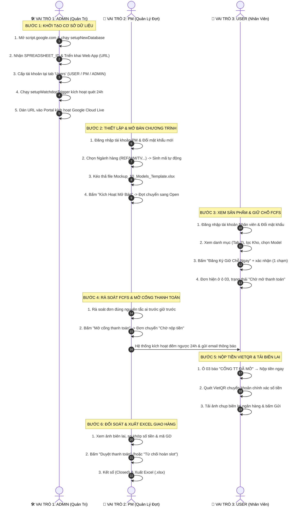

# CẨM NANG HƯỚNG DẪN KIỂM THỬ THỰC TẾ TOÀN TRÌNH (E2E WALKTHROUGH)
## Hệ Thống Đăng Ký Bán Hàng Nội Bộ LG (LG Internal Sales Portal)

> **Dành cho:** Người dùng phổ thông, Ban Quản trị Bán hàng Nội bộ (PM), và Kỹ sư Quản trị Hệ thống (Admin).  
> **Mục tiêu:** Giúp bất kỳ ai, kể cả người không rành công nghệ, có thể tự mình thiết lập và trải nghiệm kiểm thử toàn diện một hệ thống bán hàng thực tế khép kín qua 3 vai trò: **Admin $\rightarrow$ PM $\rightarrow$ User**.  
> **Tài nguyên mẫu đính kèm:** `data/Mockup_10_Models_Internal_Sales_Template.xlsx` (10 model sản phẩm LG cao cấp).

> 📌 **Đã đối chiếu với giao diện & mã nguồn ngày 05/10/2026 (bản v1).** Các chỗ sửa được đánh dấu *"(cập nhật 05/10)"*. Thông tin hiện hành: [`docs/CURRENT_STATE.md`](../CURRENT_STATE.md). Lưu ý: kiểm thử trên Sheet đang **bật email tự động** sẽ gửi email thật — tắt email (công tắc của ADMIN) hoặc dùng email test `@example.com` trước khi thử.

---

## TỔNG QUAN LUỒNG VẬN HÀNH 3 VAI TRÒ



---

## PHẦN 1: DÀNH CHO VAI TRÒ 1 — QUẢN TRỊ VIÊN HỆ THỐNG (ADMIN)
*(Thời gian thực hiện: ~2 phút)*

Mục tiêu của Admin là **tạo ra một hệ thống Google Sheet hoàn toàn độc lập trên Google Drive cá nhân** của bạn, lấy đường link kết nối API và cấp tài khoản cho người tham gia.

### Bước 1.1: Tạo CSDL Google Sheet 1-Click
1. Mở trình duyệt web, truy cập: **[https://script.google.com](https://script.google.com)**.
2. Nhấn nút **Dự án mới (New project)** ở góc trên bên trái.
3. **Lấy nội dung mã nguồn Apps Script:**
   - **Vị trí tệp:** thư mục `apps-script/` $\rightarrow$ tệp [`apps-script/Code.gs`](../../apps-script/Code.gs) (đường dẫn tương đối tính từ thư mục gốc của repo).
   - **Cách 1 (Nhanh nhất):** Mở tệp [`apps-script/Code.gs`](../../apps-script/Code.gs) trong trình soạn thảo $\rightarrow$ Nhấn `Cmd + A` (chọn toàn bộ) $\rightarrow$ Nhấn `Cmd + C` để Copy.
   - **Cách 2 (Sao chép 1-Click bằng Terminal):** Mở cửa sổ Terminal và gõ lệnh sau để hệ thống tự động nạp toàn bộ mã nguồn vào khay nhớ tạm (Clipboard) của máy:
     ```bash
     cat "apps-script/Code.gs" | pbcopy
     ```
   - Sau đó, quay lại cửa sổ trình duyệt `script.google.com`, xóa chữ `function myFunction() {...}` có sẵn và nhấn `Cmd + V` để dán đè toàn bộ vào.
4. Nhấn **Lưu (Ctrl+S / Cmd+S)**.
5. Trên thanh công cụ, tại ô chọn hàm (đang hiện `myFunction`), nhấp chọn:
   👉 **`setupNewDatabase`** $\rightarrow$ rồi nhấn nút **Chạy (Run ▶)**.
6. Khi Google hỏi cấp quyền truy cập:
   - Nhấn *Xem lại quyền* $\rightarrow$ Chọn email Google của bạn.
   - Nhấn *Nâng cao (Advanced)* $\rightarrow$ Nhấn *Đi tới dự án (Không an toàn)* $\rightarrow$ Nhấn *Cho phép (Allow)*.
7. **Kết quả:** Sau vài giây, Google Apps Script sẽ tự động tạo một Google Sheet mang tên **`LG Internal Sales Database`** ngay trên Google Drive của bạn với đầy đủ 8 tab chuẩn hóa.

### Bước 1.2: Triển khai Web App (Lấy đường dẫn API)
1. Nhìn vào màn hình *Nhật ký thực thi (Execution Log)* bên dưới, copy chuỗi ký tự **`SPREADSHEET_ID`** vừa in ra (ví dụ: `1A2b3C...`).
2. *(Cách khuyến nghị từ 05/10)* Project Settings → Script Properties → thêm `SPREADSHEET_ID` = mã vừa copy. Hoặc cách cũ: quay lại dòng 21 của `Code.gs`, dán mã đó vào:
   ```javascript
   var SPREADSHEET_ID = '<DÁN_MÃ_VỪA_COPY_VÀO_ĐÂY>';
   ```
   Bấm **Lưu (Ctrl+S / Cmd+S)**.
3. Nhấp nút **Triển khai (Deploy)** ở góc trên bên phải $\rightarrow$ Chọn **Tùy chọn triển khai mới (New deployment)**:
   - Loại (Type): Nhấp bánh răng ⚙️ $\rightarrow$ Chọn **Ứng dụng web (Web app)**.
   - Mô tả: `LG Internal Sales API v8.2`.
   - Thực thi dưới danh nghĩa (Execute as): **Tôi (Me)**.
   - Ai có quyền truy cập (Who has access): **Bất kỳ ai (Anyone)**.
4. Nhấp nút **Triển khai** $\rightarrow$ Sao chép **URL ứng dụng web** (đường link kết thúc bằng `/exec`).

### Bước 1.3: Cấp tài khoản tại tab `Users`
1. Mở file Google Sheet `LG Internal Sales Database` trên Google Drive của bạn.
2. Chuyển sang trang tính **`Users`** — *(cập nhật 05/10: thứ tự cột dưới đây khớp với máy chủ; bản cũ ghi `Role` ở cột C là **sai** và sẽ làm tài khoản bị phân quyền nhầm)*:
   - Cột A (`ID`): Mã nhân viên (ví dụ: `PM01`, `NV01`, `NV02`).
   - Cột B (`Password`): Mật khẩu ban đầu dạng chữ (mật khẩu tạm, **riêng từng người, ≥ 10 ký tự** — không dùng chuỗi số đơn giản). Người dùng tự đổi sau khi đăng nhập.
   - Cột C (`Name`): Họ tên đầy đủ.
   - Cột D (`Department`): Phòng ban (ví dụ: `HS PM Support`, `R&D`, `Sales`).
   - Cột E (`Phone`): Số điện thoại.
   - Cột F (`Email`): Hộp thư nhận thông báo.
   - Cột G (`Role`): `USER` (nhân viên), `PM` (quản lý đợt bán) hoặc `ADMIN` (toàn quyền + công tắc email).
   - Cột H (`Status`): `Active`.
   - Chi tiết: [`USERS_SHEET_TEMPLATE.md`](../01-setup-and-deployment/USERS_SHEET_TEMPLATE.md).

### Bước 1.4: Kích hoạt Bộ quét Tự động 24h (1-Click Trigger)
1. Quay lại màn hình Google Apps Script, tại ô chọn hàm, chọn hàm:
   👉 **`setupWatchdogTrigger`** $\rightarrow$ Nhấn **Chạy (Run ▶)**.
2. Hệ thống sẽ tự động kích hoạt trình chạy ngầm mỗi giờ để kiểm tra và thu hồi các slot quá hạn 24h mà Admin không cần thao tác thêm.

### Bước 1.5: Kích hoạt Cổng thông tin (Portal)
1. Mở tệp `Mau_Dang_Ky_Internal_Sales_3009.html` trên trình duyệt.
2. Nhấp vào huy hiệu **`⚪ Demo Mode (Offline)`** ở góc trên cùng bên phải.
3. Dán URL Web App (lấy ở Bước 1.2) vào ô nhập liệu $\rightarrow$ Nhấn **Kiểm Tra & Lưu Cấu Hình**.
4. Huy hiệu chuyển sang **`🟢 Google Cloud Live`** $\rightarrow$ trình duyệt này đã nối máy chủ.
5. *(cập nhật 05/10)* Bước 1–4 chỉ áp dụng cho **bản demo** trên máy của người kiểm thử. Bản phát hành cho nhân viên là `portal.html` (tự nối máy chủ, không có tài khoản demo): `python3 scripts/build_production.py --api-url <URL>` — xem [`V1_RELEASE_RUNBOOK.md`](../04-v1-hardening/V1_RELEASE_RUNBOOK.md) mục 3.

---

## PHẦN 2: DÀNH CHO VAI TRÒ 2 — QUẢN LÝ NGÀNH HÀNG (PM)
*(Tạo đợt bán hàng, duyệt mở cổng thanh toán, đối soát biên lai & xuất Excel kho)*

### Bước 2.1: Đăng nhập & Đổi mật khẩu cá nhân
1. Màn hình **đăng nhập** hiện ngay khi mở trang.
2. Nhập Mã NV (ví dụ: `PM01`) và mật khẩu được cấp (`admin123`).
3. Đăng nhập thành công, góc trên hiển thị huy hiệu đỏ **`PM Quản trị`** (tài khoản role ADMIN hiển thị **`Admin hệ thống`**).
4. Để bảo mật, PM nhấp vào nút **`🔑 Đổi MK`** trên thanh header:
   - Nhập mật khẩu cũ $\rightarrow$ Nhập mật khẩu mới (ví dụ: `PmSecure@2026`).
   - Bấm **Cập nhật** $\rightarrow$ Hệ thống tự động băm SHA-256 kèm Salt và đồng bộ về CSDL.

### Bước 2.2: Khởi tạo Đợt Bán Hàng Mới bằng Excel Mẫu
1. PM được đưa thẳng vào tab **`1. Bảng Điều Khiển PM`** *(cập nhật 05/10: bản cũ gọi là "Tab 5")*.
2. Nhấp nút **`+ Tạo chương trình`** trên thanh chọn chương trình phía trên. Cửa sổ popup sẽ xuất hiện:
   - **Ngành hàng / Phân khúc:** Nhấp chọn phân khúc (ví dụ: `TV · Tivi OLED / QNED / UHD`).
   - **Mã đợt bán:** Hệ thống sẽ **tự động điền mã chuẩn hóa** `IS-2026Q4-TV-01` (có tích xanh `✓ Mã hợp lệ`).
   - **Tên chương trình:** Hệ thống tự sinh `Đợt Bán Hàng Nội Bộ Q4/2026 – Ngành Tivi OLED & QNED`.
   - **Thời gian bắt đầu / Kết thúc:** Nhấp nút chọn nhanh `+7 Ngày tới` hoặc tự chọn ngày.
   - **Hạn mức:** Mặc định `1` sản phẩm / nhân viên.
3. **Kéo thả File Danh mục Sản phẩm:**
   - Kéo file mẫu **`data/Mockup_10_Models_Internal_Sales_Template.xlsx`** thả vào khung nét đứt màu đỏ (hoặc bấm vào để chọn file).
   - Hệ thống lập tức đọc file, lọc bỏ các cột điểm số kỹ thuật nội bộ và hiển thị thông báo:  
     *`✓ Đã nạp thành công 10 sản phẩm từ file Excel!`*
4. Nhấn **`🚀 Kích Hoạt Mở Bán`** $\rightarrow$ Chương trình mới chuyển sang trạng thái **`Open`**.

### Bước 2.3: Giám sát Đăng ký & Mở cổng Thanh toán 24h
1. Khi nhân viên đăng ký giữ chỗ, bấm nút **`Tải lại`** trên Bảng Điều Khiển PM để xem danh sách mới nhất *(cập nhật 05/10: ở chế độ máy chủ, bảng PM **không** tự làm mới; polling 6–8 giây chỉ áp dụng cho danh mục của nhân viên)*.
2. Các đơn mới đăng ký ban đầu sẽ có trạng thái: **`Đã đăng ký - Chờ mở thanh toán`**.
   *(Lợi ích: Tránh nhân viên chuyển tiền trước khi PM kiểm soát số lượng, hạn chế tối đa việc phải hoàn tiền kế toán).*
3. Khi PM đã rà soát xong danh sách theo nguyên tắc FCFS (ai nhanh giữ trước):
   - Nhấn nút màu tím: **`🔓 Mở cổng thanh toán (N đơn)`** trên thanh công cụ.
   - Toàn bộ các đơn đăng ký trước đó sẽ chuyển trạng thái sang **`Chờ nộp tiền`**.
   - Đồng hồ đếm ngược 24h chính thức kích hoạt kể từ giây phút này.

### Bước 2.4: Đối soát Biên lai Ngân hàng
1. Khi nhân viên chuyển khoản và tải ảnh biên lai lên hệ thống, trạng thái đơn sẽ chuyển sang **`Đã khai nộp - chờ đối soát`**.
2. PM nhấp nút **`Xem Biên Lai`** trên từng đơn:
   - Màn hình popup phóng to hình ảnh ủy nhiệm chi/biên lai chuyển khoản.
   - Kiểm tra: Tên tài khoản nhận (Công ty TNHH LG Electronics VN Hải Phòng), Số tiền và Cú pháp chuyển khoản.
3. Nếu hợp lệ: Bấm **`Duyệt Thanh Toán Này`** (trong cửa sổ xem biên lai) $\rightarrow$ Đơn chuyển sang `Đã duyệt thanh toán`. Nhiều đơn: nút **`Duyệt hàng loạt`** — hệ thống báo đúng số đơn máy chủ đã duyệt.
4. Nếu sai sót: Bấm **`Từ Chối Đơn`** (nhập lý do: sai số tiền, mờ biên lai) $\rightarrow$ Đơn chuyển `Từ chối`, slot được trả về kho.

### Bước 2.5: Đóng Đợt, Xóa Đợt An Toàn & Xuất Danh Sách Giao Hàng
1. **Phân quyền Độc lập Đa PM (Multi-PM Isolation):**
   - Mỗi tài khoản PM chỉ nhìn thấy và quản trị **các chương trình do chính mình tạo ra**.
   - Nếu là tài khoản PM mới tinh (chưa tạo chương trình nào), hệ thống sẽ hiển thị trạng thái ban đầu sạch sẽ cùng nút **`+ Tạo chương trình`** để khởi tạo đợt đầu tiên.
   - Nhân viên mua hàng (USER) khi đăng nhập sẽ nhìn thấy **toàn bộ các chương trình đang Mở bán (`Open`)** từ tất cả các PM thuộc mọi ngành hàng.
2. **Quy tắc Xóa Đợt Bán vs Kết Sổ (Tuân thủ Kiểm toán Jeong-Do):**
   - **Xóa hoàn toàn (0 đơn):** Nếu đợt bán vừa tạo thử hoặc đang ở trạng thái Nháp/Mở nhưng **chưa có bất kỳ nhân viên nào đăng ký giữ chỗ (0 đơn)**, PM có thể bấm nút **`🗑️ Xóa đợt bán (0 đơn)`** để xóa sạch vĩnh viễn khỏi hệ thống và database Google Sheet.
   - **Khóa xóa khi đã có giao dịch ( $\ge 1$ đơn):** Nếu đợt bán đã phát sinh đơn đăng ký hoặc giao dịch chuyển khoản, hệ thống sẽ **khóa chặt tính năng xóa** nhằm bảo toàn tính liêm chính kiểm toán thuế và đối soát dòng tiền Vietcombank. PM chỉ được phép bấm **`🔒 Kết sổ chương trình (Closed)`**.
3. **Xuất danh sách:**
   - PM nhấn nút **`Xuất Excel`** (file `.xlsx`) trên Bảng Điều Khiển PM.
   - *(cập nhật 05/10, đối chiếu code)* File CSV gồm **22 cột** (STT, Mã Slot, Kho, Ngành hàng, Model, Mô tả, Giá nội bộ, Mã NV, Họ tên, Bộ phận, SĐT, Địa chỉ giao hàng, Thời gian ĐK, Trạng thái, Người nộp, Mã NV nộp, Số tiền, Mã GD, Thời gian nộp, PM duyệt bởi, Ngày duyệt, Ghi chú), chứa **mọi đơn** của chương trình đang chọn — lọc theo cột *Trạng thái* nếu chỉ cần đơn đã duyệt. File **không có cột Serial**; cột *Địa chỉ giao hàng* thường trống vì luồng giữ chỗ 1-chạm không hỏi địa chỉ (xem `CURRENT_STATE.md` mục 9).

---

## PHẦN 3: DÀNH CHO VAI TRÒ 3 — NHÂN VIÊN MUA HÀNG (USER)
*(Xem hàng, giữ chỗ FCFS, thanh toán VietQR & tra cứu tiến độ)*

### Bước 3.1: Đăng nhập & Đổi mật khẩu cá nhân
1. Nhân viên mở link portal — màn hình **đăng nhập** hiện ngay.
2. Nhập Mã NV (ví dụ: `NV01`) và mật khẩu tạm Admin cấp riêng cho bạn.
3. Đổi mật khẩu cá nhân qua nút **`🔑 Đổi MK`** để bảo mật quyền lợi mua hàng.

### Bước 3.2: Khám phá Danh mục Sản phẩm (Tab 2)
1. Chọn đợt bán trên **thanh chương trình** phía trên, rồi nhấp sang tab **`2. Danh Mục & Đăng Ký Mua Hàng`**.
2. Sử dụng thanh công cụ trực quan:
   - **Bộ lọc kho:** Nhấp `Kho AYA`, `Kho AYB`, hoặc `Kho AYC` *(vị trí địa lý của từng kho đang chờ PM xác nhận — các tài liệu cũ ghi khác nhau)*.
   - **Tìm kiếm:** Gõ tên model (ví dụ: `OLED`, `InstaView`, `WashTower`).
3. Đọc kỹ thông tin sản phẩm trên thẻ card:
   - Phân hạng chất lượng: `Loại A` (như mới) hoặc `Loại B` (hộp cũ/xước dăm).
   - Tình trạng chi tiết: Đọc mô tả thực tế từ kho (ví dụ: *Cấn nhẹ cạnh hông 1mm, khay kính nguyên bản*).
   - Giá nội bộ (đã giảm 50% - 65% so với giá niêm yết hãng RRP).
4. Chọn được sản phẩm ưng ý $\rightarrow$ Nhấn nút đỏ **`Đăng Ký Giữ Chỗ Ngay`** trên thẻ sản phẩm.

### Bước 3.3: Xác nhận giữ chỗ FCFS (1 chạm) — *cập nhật 05/10, đối chiếu code*
1. Hộp xác nhận hiện Model, mô tả, giá nội bộ, kho $\rightarrow$ bấm **OK**. Thông tin nhân viên (Mã NV, họ tên, bộ phận, SĐT) lấy tự động từ tài khoản đăng nhập — **không có form nhập tay**.
2. Kết quả:
   - **Thành công:** thông báo *"Đăng ký thành công sản phẩm …"*, trạng thái **`Đã đăng ký - Chờ mở thanh toán`**, đơn hiện ngay ở ô **"03 Đơn Hàng Của Bạn"**. Hệ thống **không** sinh mã đơn dạng `ORD-…` (bản cũ ghi có — không đúng); mã định danh là **Mã Slot**.
   - **Có người nhanh hơn:** thông báo *"đã có người đăng ký trước"*, slot đó chuyển "Đã có người giữ" ngay trên màn hình $\rightarrow$ chọn sản phẩm khác.
3. Cam kết Jeong-Do: luồng 1 chạm hiện **không** có ô tích riêng; máy chủ ghi "Đồng ý" vào cột Cam kết. Nội dung cam kết nằm ở Tab 1 (Thư thông báo & Quy định) — đang chờ chủ dự án quyết định có thêm ô tích hay không (`CURRENT_STATE.md` mục 9).
4. Đổi ý trước khi khai nộp tiền: bấm **`Hủy giữ chỗ`** ở ô 03 — slot trả về kho ngay.

### Bước 3.4: Chuyển Khoản VietQR 1-Chạm & Tải Biên Lai (Tab 3)
1. Khi PM mở cổng thanh toán, ô **"03 Đơn Hàng Của Bạn"** chuyển sang **`CỔNG TT ĐÃ MỞ`** (tự kiểm tra lại mỗi 60 giây) và trạng thái đơn là **`Chờ nộp tiền`** — có **24 giờ** tính từ lúc cổng mở.
2. Nộp tiền bằng một trong hai cách:
   - Ô 03: bấm **`Nộp tiền ngay (1-Chạm) →`**; hoặc
   - Tab **`3. Xác Nhận Mua & Nộp Tiền`**: khi đã đăng nhập, hệ thống tự tra cứu đơn của bạn (không cần nhập Mã NV + 4 số cuối SĐT) $\rightarrow$ bấm **`Nộp tiền`** trên dòng đơn.
3. **Thanh toán VietQR siêu tốc:**
   - Hệ thống mở popup hiển thị mã QR ngân hàng Vietcombank đã nạp sẵn chính xác 100% số tiền và cú pháp chuyển khoản (không cần gõ tay).
   - Mở app ngân hàng bất kỳ (VCB, Techcombank, MB, Momo...) quét mã QR $\rightarrow$ Xác nhận chuyển khoản.
4. **Tải biên lai:**
   - Chụp màn hình thông báo chuyển khoản thành công trên app ngân hàng.
   - Kéo ảnh thả vào ô tải biên lai (hệ thống tự động nén ảnh xuống dưới 300KB mượt mà).
   - Nhập Mã giao dịch ngân hàng $\rightarrow$ Bấm **`Xác Nhận Nộp Tiền`**.
5. Đơn hàng chuyển sang trạng thái: **`Đã khai nộp - chờ đối soát`**.

### Bước 3.5: Theo dõi Tiến Độ Giao Hàng
1. Nhân viên có thể vào lại Tab 3 bất kỳ lúc nào để tra cứu.
2. Khi PM đối soát xong, trạng thái cập nhật thành: **`Đã duyệt thanh toán`**.
3. Nhận hàng: email duyệt thanh toán hiện hướng dẫn *"mang thẻ nhân viên LG đến kho … để làm thủ tục nhận sản phẩm theo lịch thông báo của PM"*. Hình thức giao / nhận chính thức do PM thông báo *(cập nhật 05/10: bản cũ ghi "giao tận nơi theo địa chỉ đã đăng ký" — mâu thuẫn với email; chờ chủ dự án chốt)*.

---

## BẢNG THÔNG TIN 10 MODEL SẢN PHẨM MẪU (TEST DATA)
*(Trích từ file `data/Mockup_10_Models_Internal_Sales_Template.xlsx`)*

| Slot | Model | Ngành | Kho | Hạng | Tình trạng kiểm tra thực tế | Giá Niêm Yết (RRP) | Giá Bán Nội Bộ | Tiết Kiệm |
|:---:|:---|:---:|:---:|:---:|:---|:---:|:---:|:---:|
| **#001** | `OLED65C4PSA.ATV` | TV | AYA | A | Trưng bày showroom, xước dăm cực nhẹ, đủ remote Magic | 52.900.000 đ | **23.805.000 đ** | -55% |
| **#002** | `75QNED86TSA.ATV` | TV | AYA | A | Thùng carton ngoài rách góc, máy nguyên seal màn hình | 38.900.000 đ | **18.672.000 đ** | -52% |
| **#003** | `GR-X257BG.AMCPLVN` | REF | AYB | B | Cấn nhẹ cạnh hông 1mm, kính InstaView gõ 2 lần sáng đèn | 48.990.000 đ | **20.575.800 đ** | -58% |
| **#004** | `GR-B256BL.APZPLVN` | REF | AYB | A | Hộp xốp cũ, khay kính chịu lực đầy đủ nguyên bản 100% | 24.500.000 đ | **12.250.000 đ** | -50% |
| **#005** | `WT1410NHEG.ABWPLVN` | WM | AYC | A | Mẫu nội bộ, bảng Center Control bóng đẹp không vết xước | 42.990.000 đ | **18.915.600 đ** | -56% |
| **#006** | `FV1412S3BA.ABKPLVN` | WM | AYC | B | Mất sách HDSD giấy, xước nhẹ nắp trên, động cơ AI DD 10 năm | 17.490.000 đ | **8.220.300 đ** | -53% |
| **#007** | `LDT14BGA.ABMPLVN` | Kitchen | AYC | A | Thùng carton xấu, mặt trước đen mờ Matte Black mới 99% | 26.900.000 đ | **11.567.000 đ** | -57% |
| **#008** | `MH6535GIS.BSEPLVN` | Kitchen | AYC | B | Xước dăm tay nắm, đĩa xoay và vỉ nướng inox nguyên túi | 4.890.000 đ | **1.711.500 đ** | -65% |
| **#009** | `V10APIUV.ATV` | RAC | AYA | B | Dàn nóng trầy sơn vỏ ngoài nhẹ, dàn lạnh mới 100% nguyên tem | 14.290.000 đ | **6.573.400 đ** | -54% |
| **#010** | `16Z90R-G.AH78A5` | PC | AYA | A | Máy lưu kho nội bộ IT, pin sạc 1 lần test, phím Anh - Hàn | 45.990.000 đ | **18.396.000 đ** | -60% |

---

## DANH MỤC TÀI LIỆU LIÊN QUAN TRONG HỆ THỐNG

- **File giao diện web:** [Mau_Dang_Ky_Internal_Sales_3009.html](../../Mau_Dang_Ky_Internal_Sales_3009.html) (bản demo / nguồn) · bản chính thức `portal.html` sinh bằng `scripts/build_production.py`
- **Mã nguồn Backend Google Apps Script:** [apps-script/Code.gs](../../apps-script/Code.gs)
- **Tệp Excel mẫu 10 sản phẩm để PM nạp đợt:** [data/Mockup_10_Models_Internal_Sales_Template.xlsx](../../data/Mockup_10_Models_Internal_Sales_Template.xlsx)
- **Kiểm thử tự động (05/10/2026):** `tests/backend_gas_harness.js` (63/63, chạy Code.gs thật), `tests/cloud_mode_regression.py` (32/32, chạy trang thật), `tests/run_e2e_tests.js` (164/164, dò chuỗi)
- **Thông tin hiện hành & việc còn mở:** [docs/CURRENT_STATE.md](../CURRENT_STATE.md)
- **Hồ sơ bàn giao chi tiết cho chuyên viên:** [docs/03-architecture-and-analysis/HANDOVER.md](../03-architecture-and-analysis/HANDOVER.md)
