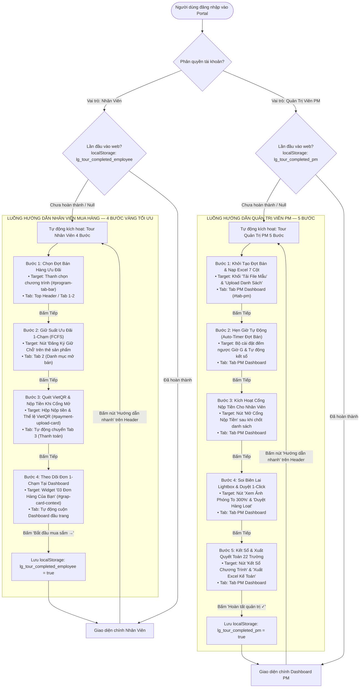
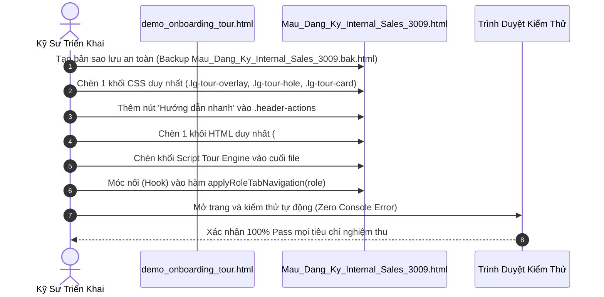

# KẾ HOẠCH TRIỂN KHAI & ĐẶC TẢ LUỒNG HƯỚNG DẪN TƯƠNG TÁC
## (ONBOARDING SPOTLIGHT TOUR GUIDANCE FLOW PLAN)
### Cổng Đăng Ký Mua Hàng Nội Bộ — LG Electronics Việt Nam Hải Phòng (LGEVH)

> **Trạng thái tài liệu:** Đã phê duyệt giao diện mẫu (UI/UX Locked) — Trình duyệt Kế hoạch Luồng Tương Tác  
> **Phiên bản:** 1.0 (Ban hành theo chuẩn Quản trị McKinsey & Kỷ luật Kỹ thuật Karpathy Epistemic)  
> **Tài liệu tham chiếu:** [`PM_AND_USER_OPERATIONAL_GUIDE.md`](PM_AND_USER_OPERATIONAL_GUIDE.md), [`Mau_Dang_Ky_Internal_Sales_3009.html`](../../Mau_Dang_Ky_Internal_Sales_3009.html), [`demo_onboarding_tour.html`](../../demo_onboarding_tour.html)

---

## 1. TÓM TẮT ĐIỀU HÀNH & NGUYÊN TẮC THIẾT KẾ

### 1.1. Bối cảnh & Sự cần thiết
Cổng Bán Hàng Nội Bộ LG vận hành theo mô hình phân quyền kép:
- **Nhân viên (User):** Cần thao tác cực nhanh trong các đợt mở bán chớp nhoáng (FCFS 24 Giờ), chọn đúng kho, hiểu rõ hạn mức và nộp biên lai VietQR đúng cú pháp mà không phạm lỗi quy chế Jeong-Do.
- **Quản trị viên (PM):** Cần nắm vững chu trình quản lý đợt bán: khởi tạo danh mục 7 cột, cài đặt hẹn giờ tự động, mở cổng thanh toán, đối soát ảnh chụp chuyển khoản qua Lightbox và kết sổ báo cáo 22 trường.

Tính năng **Onboarding Spotlight Tour** được thiết kế nhằm giải quyết bài toán đào tạo người dùng 1-chạm (Zero-Training Adoption), giúp nhân viên và PM thao tác chính xác ngay từ lần đầu tiên mà không cần tài liệu giấy hay người hướng dẫn trực tiếp.

### 1.2. Thước đo thành công có thể định lượng (Verifiable Success Metrics)
Theo nguyên lý quản trị Peter Drucker *"If it cannot be measured, it cannot be managed"*, kế hoạch hướng dẫn phải đạt được các chỉ số sau:

| Chỉ số (KPI) | Hiện trạng (Baseline) | Mục tiêu sau triển khai Tour | Phương pháp đo lường |
| :--- | :---: | :---: | :--- |
| **Tỷ lệ nhân viên chuyển khoản sai cú pháp** | ~8.5% các đợt bán | **< 0.5%** | Thống kê trường `Mã GD / Cú pháp nộp` trên Google Sheets. |
| **Thời gian trung bình hoàn thành đơn FCFS** | 3 phút 45 giây | **< 1 phút 15 giây** | Thời gian từ lúc mở web đến khi nhận mã giữ chỗ. |
| **Số lượt yêu cầu IT/PM hỗ trợ cách sử dụng** | ~40 yêu cầu/đợt bán | **< 3 yêu cầu/đợt bán** | Log tin nhắn kênh nội bộ & hotline HR/IT. |
| **Tỷ lệ hoàn thành Onboarding lần đầu** | 0% (chưa có) | **> 90%** | Theo dõi trạng thái `localStorage.getItem('lg_tour_completed_*')`. |

### 1.3. Ba nguyên tắc kỹ thuật bất biến (Karpathy Non-Negotiable Rules)
1. **Kiến trúc tách rời, không xâm lấn (Non-Invasive Decoupled Overlay):** Module tour chỉ sử dụng lớp phủ tọa độ động (`fixed overlay`). Không được phép can thiệp, biến đổi cấu trúc DOM, mã nguồn nghiệp vụ hoặc luồng xử lý API mua hàng hiện có trong [`Mau_Dang_Ky_Internal_Sales_3009.html`](../../Mau_Dang_Ky_Internal_Sales_3009.html).
2. **Khoét lỗ quang học 100% trong suốt (Zero Blur Optical Cutout):** Tuyệt đối không dùng `backdrop-filter: blur` trên lớp phủ toàn màn hình. Spotlight hole sử dụng `box-shadow: 0 0 0 9999px rgba(18, 18, 18, 0.75)`, bảo toàn 100% độ sắc nét điểm ảnh Retina và độ tương phản của nội dung bên dưới.
3. **Đồng bộ nhận diện thương hiệu LG (LG Brand System Alignment):**
   - Hoạt ảnh tại tiêu đề: Độc quyền sử dụng **LG Digital Logo Play** (`LGE_Electronics_Digital_Logo_Play_Transparent_Black_Wink.gif`).
   - Icon ngành hàng: Bộ GIF chính thức từ CDN LG.com và vector SVG 2.0px chuẩn GP1 Style Guide.
   - Typography & Palette: Phông chữ LG EI, vạch chỉ báo đỏ Heritage Red `#A50034`, điểm nhấn Active Red `#EA1917` và Dark Charcoal `#262626`. Không sử dụng emoji hệ thống.

---

## 2. SƠ ĐỒ LUỒNG TỔNG THỂ (END-TO-END FLOW ARCHITECTURE)



---

## 3. ĐẶC TẢ CHI TIẾT TỪNG BƯỚC HƯỚNG DẪN (STEP-BY-STEP SPECIFICATIONS)

### 3.1. Luồng 1: Hướng Dẫn Nhân Viên Mua Hàng (Employee Tour — 4 Bước Vàng)

Mục tiêu: Đảm bảo nhân viên thao tác nhanh, chọn đúng chương trình, giữ chỗ FCFS thành công và nộp tiền chuẩn xác mà không gặp lỗi nhận thức. *(Chi tiết phân tích tại `docs/02-user-and-pm-guide/PROPOSAL_USER_FLOW_OPTIMIZATION.md`)*.

| Bước | Định danh phần tử (`Target Selector`) | Tự động chuyển Tab | Biểu tượng LG (`Motion Icon`) | Nội dung Tiêu đề & Diễn giải (`Title & Body`) | Ghi chú mẹo chuẩn văn hóa LG (`Pro Tip Box`) | Nút điều hướng |
| :---: | :--- | :---: | :---: | :--- | :--- | :---: |
| **1/4** | `#program-tab-bar` *(Thanh chọn chương trình)* | Giữ tại Header / Tab 1 | `ico_promotions_ani.gif` *(Đợt bán mới)* | **CỬA NGÕ MUA SẮM<br>Chọn Đợt Mở Bán Ưu Đãi Bạn Cần**<br>Bấm vào các thanh chương trình trên cùng (Gia dụng HA, Tivi & Loa HE, Thiết bị IT...) để xem đúng danh sách sản phẩm ưu đãi dành riêng cho đợt mở bán đó. | *Mỗi chương trình có hạn mức và thời gian mở bán riêng, hãy chọn đúng đợt bạn có nhu cầu.* | `Bỏ qua`<br>`Tiếp →` |
| **2/4** | `.product-card:first-child .btn-register, .product-card:first-child` | Tự động chuyển `Tab 2` | `cat_instaview_refrigerator.svg` | **KHÓA MÁY NHANH (FCFS)<br>Bấm Giữ Chỗ Để Khóa Máy Riêng 24H**<br>Áp dụng nguyên tắc ai nhanh hơn được trước (FCFS). Khi chọn được máy ưng ý, bấm ngay "Đăng Ký Giữ Chỗ" để hệ thống khóa suất riêng cho bạn trong 24 giờ, không sợ người khác mua mất. | *Bạn có thể kiểm tra tồn kho theo từng kho (Hải Phòng AYA, Hà Nội AYB, Hưng Yên AYC) ngay trên thẻ sản phẩm.* | `Quay lại`<br>`Tiếp →` |
| **3/4** | `#payment-upload-card` | Tự động chuyển `Tab 3` | `cat_vcb_security.svg` *(Bảo mật VCB)* | **CHUYỂN KHOẢN VCB PHÁP NHÂN<br>Quét VietQR & Nộp Biên Lai Khi Cổng Mở**<br>Chuyển khoản đúng tài khoản pháp nhân LGEVH tại Vietcombank với cú pháp `[MãNV]_[MãSlot]`. Lưu ý: Cổng nộp tiền mở sau 2 giờ để đối soát đơn; khi mở bạn chỉ cần tải ảnh chụp biên lai lên. | *Có sẵn mã VietQR tự điền số tiền và cú pháp chuẩn, quét bằng app ngân hàng trong 5 giây siêu an toàn.* | `Quay lại`<br>`Tiếp →` |
| **4/4** | `#grap-card-context` *(Widget Đơn hàng của bạn)* | Tự động cuộn lên đầu trang | `ico_membership_44.svg` *(Hội viên VIP)* | **THEO DÕI ĐƠN 1-CHẠM<br>Theo Dõi & Hủy Đơn Ngay Tại Dashboard**<br>Bạn đã đăng nhập nên không cần gõ lại Mã NV hay SĐT. Mọi thông tin đơn hàng, tiến độ duyệt tiền và nút "Hủy Giữ Chỗ" (để đổi máy khác) đều hiển thị tự động ngay tại ô này! | *Nếu cần xem lại hướng dẫn, bấm nút "Hướng dẫn nhanh" trên thanh Header bất cứ lúc nào!* | `Quay lại`<br>`Bắt đầu mua sắm →` |

---

### 3.2. Luồng 2: Hướng Dẫn Quản Trị Viên Đợt Bán (PM Tour — 5 Bước Vàng)

Mục tiêu: Chuẩn hóa quy trình vận hành đợt bán nội bộ cho PM theo trình tự vòng đời chiến dịch, bảo đảm tính minh bạch Jeong-Do và tối ưu hóa thời gian kế toán.

| Bước | Định danh phần tử (`Target Selector`) | Tự động chuyển Tab | Biểu tượng LG (`Motion Icon`) | Nội dung Tiêu đề & Diễn giải (`Title & Body`) | Ghi chú mẹo chuẩn văn hóa LG (`Pro Tip Box`) | Nút điều hướng |
| :---: | :--- | :---: | :---: | :--- | :--- | :---: |
| **1/5** | `#btn-create-program-tab, .program-tab-create` | Toàn cục (Global) | `ico_epc.svg` *(Danh mục & Đợt bán)* | **KHỞI TẠO ĐỢT BÁN<br>Tạo Đợt Bán & Nạp File Excel**<br>Bấm vào đây để tạo đợt bán mới. Tải file mẫu 7 cột, điền danh sách model và kéo thả vào để kích hoạt mở bán cho toàn công ty. | *Hệ thống có sẵn nút chọn nhanh thời gian (+7 ngày, +14 ngày, cuối tháng) cực kỳ tiện lợi.* | `Bỏ qua`<br>`Tiếp →` |
| **2/5** | `#btn-allow-payment-header` | Tự động chuyển sang `Tab PM` | `cat_vcb_security.svg` *(Khiên bảo mật VCB)* | **QUẢN TRỊ THANH TOÁN<br>Bật Cổng Nộp Tiền Chuyển Khoản**<br>Sau khi nhân viên đăng ký giữ chỗ máy thành công, bấm nút này để cho phép nhân viên quét mã VietQR nộp tiền ngay vào tài khoản LG. | *Giúp nhân viên chủ động thanh toán sớm mà không phải chờ hết giờ khóa tạm thời.* | `Quay lại`<br>`Tiếp →` |
| **3/5** | `#btn-batch-approve-header` | Giữ nguyên `Tab PM` | `ico_lg-thinq_44.svg` *(Smart ThinQ)* | **ĐỐI SOÁT & PHÊ DUYỆT<br>Soi Biên Lai 300% & Duyệt 1-Click**<br>Bấm vào ảnh biên lai để phóng to 300% soi rõ mã giao dịch ngân hàng. Sau đó bấm nút này để duyệt hàng trăm đơn trong 1 giây. | *Hệ thống tự động gửi Email xác nhận thành công cho nhân viên ngay khi PM bấm duyệt.* | `Quay lại`<br>`Tiếp →` |
| **4/5** | `#btn-pm-expired-check` | Giữ nguyên `Tab PM` | `ico_offer2_ani.gif` *(Vận hành động)* | **KIỂM SOÁT TỒN KHO<br>Thu Hồi Suất Quá Hạn 24 Giờ**<br>Nhân viên giữ chỗ quá 24h không nộp tiền sẽ bị thu hồi suất. Bấm nút này để hủy đơn quá hạn và trả máy về kho cho người khác mua. | *Có thể bấm nút "Hẹn Giờ (Timer)" bên cạnh nếu muốn hệ thống tự động quét mỗi ngày.* | `Quay lại`<br>`Tiếp →` |
| **5/5** | `#btn-pm-export-csv, #pm-banner-controls` | Giữ nguyên `Tab PM` | `ico_vertical3_44.svg` *(Quyết toán chuẩn)* | **BÁO CÁO & QUYẾT TOÁN<br>Kết Sổ Chương Trình & Xuất Quyết Toán**<br>Khi hết đợt bán, bấm "Kết Sổ" để khóa cổng đăng ký. Sau đó bấm "Xuất Excel" để tải file đầy đủ 22 trường nộp Giám đốc Tài chính và Kế toán kho LGEVH. | *Toàn bộ dữ liệu sau khi kết sổ sẽ được niêm phong chống sửa đổi trái phép.* | `Quay lại`<br>`Hoàn tất quản trị ✓` |

---

## 4. ĐẶC TẢ KỸ THUẬT & QUẢN TRỊ TRẠNG THÁI (STATE ENGINE CONTRACT)

### 4.1. Hợp đồng dữ liệu `localStorage`
Hệ thống sử dụng bộ khóa phân định theo vai trò nhằm chống làm phiền người dùng:

```javascript
// Khóa kiểm tra trạng thái hoàn thành tour
const TOUR_STORAGE_KEYS = {
  employee: 'lg_tour_completed_employee', // 'true' | null
  pm: 'lg_tour_completed_pm'              // 'true' | null
};

// Hàm kiểm tra tự động kích hoạt
function shouldAutoLaunchTour(role) {
  const key = TOUR_STORAGE_KEYS[role];
  return !localStorage.getItem(key);
}

// Hàm đánh dấu đã hoàn thành
function markTourCompleted(role) {
  const key = TOUR_STORAGE_KEYS[role];
  localStorage.setItem(key, 'true');
}
```

### 4.2. Cơ chế kích hoạt chủ động (On-Demand Header Launch)
Trên thanh Header của Portal (nằm trong khối `.header-actions`), đặt nút kích hoạt vĩnh viễn:
```html
<button type="button" class="btn-tour-header" id="btn-header-tour" onclick="startCurrentRoleTour()" title="Xem lại tour hướng dẫn sử dụng nhanh">
  <svg width="15" height="15" viewBox="0 0 24 24" fill="none" stroke="currentColor" stroke-width="2" stroke-linecap="round" stroke-linejoin="round" style="vertical-align: -2px; margin-right: 2px;">
    <path d="M12 2a7 7 0 0 0-7 7c0 2.38 1.19 4.47 3 5.74V17a2 2 0 0 0 2 2h4a2 2 0 0 0 2-2v-2.26c1.81-1.27 3-3.36 3-5.74a7 7 0 0 0-7-7z"></path>
    <path d="M9 21h6"></path>
  </svg>
  <span>Hướng dẫn nhanh</span>
</button>
```
* **Hành vi:** Khi người dùng bấm nút này bất kỳ lúc nào, hệ thống kiểm tra vai trò hiện tại (`currentUser.role`) và kích hoạt lại tour tương ứng từ Bước 1 mà không xóa dữ liệu đang thao tác trên form.

### 4.3. Thuật toán định vị thông minh & Chống tràn khung nhìn (Auto-Placement Engine)
Thuật toán tính toán vị trí thẻ tooltip (`.lg-tour-card`) dựa trên 4 biến đo lường từ DOM (`getBoundingClientRect()`):
1. **Khoảng cách dọc:** Ưu tiên đặt thẻ ngay bên dưới spotlight với khoảng đệm `offset = 14px`.
2. **Lật ngược thông minh (Flip up):** Nếu khoảng trống bên dưới không đủ `cardHeight + 20px`, thẻ tự động chuyển vị trí lên trên phần tử (`top = rect.top - cardHeight - offset`), đồng thời đảo chiều mũi tên chỉ thị (Caret flip).
3. **Cuộn mượt mà có tính toán (`scrollIntoView` với `scrollPadding`):** Khi chuyển bước, hàm cuộn cửa sổ đưa mục tiêu vào vùng trung tâm màn hình:
   ```javascript
   targetEl.scrollIntoView({ behavior: 'smooth', block: 'center' });
   ```
4. **Hỗ trợ thao tác bàn phím (Accessibility):**
   - Phím `→` hoặc `Enter`: Bước tiếp theo.
   - Phím `←`: Quay lại bước trước.
   - Phím `Esc`: Thoát khỏi hướng dẫn ngay lập tức.

---

## 5. KẾ HOẠCH TÍCH HỢP TỪNG BƯỚC VÀO TRANG CHÍNH (`Mau_Dang_Ky_Internal_Sales_3009.html`)

Quy trình tích hợp tuân thủ nghiêm ngặt nguyên tắc phẫu thuật của Karpathy (Surgical Patching):



### 5.1. Các điểm neo cần chèn (Injection Points):
1. **CSS Block:** Chèn tại thẻ `<style>` của trang chính, chứa toàn bộ biến màu `--lg-heritage`, `--lg-red`, `--radius-lg` và animation `lgSpotlightPulse`.
2. **HTML Header:** Bổ sung nút `#btn-header-tour` vào bên trái cụm tài khoản người dùng (`#user-profile-badge`).
3. **HTML Overlay:** Chèn cấu trúc container của tour vào ngay trước thẻ đóng `</body>`:
   ```html
   <div class="lg-tour-overlay" id="lg-tour-overlay">
     <div class="lg-tour-hole" id="lg-tour-hole"></div>
     <div class="lg-tour-card" id="lg-tour-card" role="dialog" aria-modal="true">
       ...
     </div>
   </div>
   ```
4. **JS Engine Integration:** Gọi kiểm tra tự động tour sau khi quá trình xác thực phiên làm việc (`checkAuthSession()`) hoàn tất:
   ```javascript
   setTimeout(() => {
     const role = (currentUser && currentUser.role === 'PM') ? 'pm' : 'employee';
     if (shouldAutoLaunchTour(role)) {
       startTour(role);
     }
   }, 500);
   ```

### 5.2. Kế hoạch phòng ngừa rủi ro & Rollback tức thì (Zero-Blast-Radius)
Trong trường hợp phát sinh bất kỳ xung đột nào ngoài dự kiến:
- Biến cờ toàn cục (Kill-Switch): Đặt cờ `const ENABLE_ONBOARDING_TOUR = false;`.
- Khi cờ này mang giá trị `false`, toàn bộ module tour tự động ngắt kết nối và giải phóng bộ nhớ, hệ thống cổng bán hàng tiếp tục vận hành bình thường 100% mà không bị gián đoạn dù chỉ 1 giây.

---

## 6. DANH MỤC TIÊU CHÍ NGHIỆM THU (VERIFIABLE ACCEPTANCE CHECKLIST)

| STT | Hạng mục kiểm thử | Điều kiện nghiệm thu thành công | Đánh giá |
| :---: | :--- | :--- | :---: |
| 1 | **Tự động nhận diện vai trò** | Nhân viên vào web thấy Tour 4 bước; PM vào web thấy Tour 5 bước. | [ ] |
| 2 | **Độ sắc nét quang học** | Chữ, giá tiền, số tài khoản VietQR trong lỗ khoét không có bất kỳ hiệu ứng làm mờ nào. | [ ] |
| 3 | **Tự động chuyển Tab** | Bước 3 của Nhân viên tự động mở Tab Thanh toán; Bước 1 của PM tự động mở Tab PM Dashboard. | [ ] |
| 4 | **Tính thích ứng Dark Mode** | Khi đổi nền tối, viền spotlight chuyển sang Active Red `#EA1917`, thẻ tooltip đổi nền `#1E1E1E`. | [ ] |
| 5 | **Bộ nhớ đệm thông minh** | Bấm "Bắt đầu mua sắm" hoặc "Bỏ qua", f5 tải lại trang không tự bật lại; bấm nút Header vẫn mở lại được. | [ ] |
| 6 | **Chuẩn nhận diện LG Brand** | Đầu thẻ hiển thị đúng GIF Digital Logo Play; không xuất hiện emoji hệ điều hành trong các nút bấm. | [ ] |
| 7 | **Tương thích thiết bị di động** | Thẻ tooltip tự co giãn (`width: calc(100vw - 32px)`) không bị tràn khỏi màn hình điện thoại. | [ ] |
| 8 | **Độ an toàn mã nguồn** | Không có lỗi JavaScript runtime nào trên Developer Console (`0 uncaught errors`). | [ ] |

---
*Tài liệu này là căn cứ kỹ thuật chính thức để người dùng rà soát và phê duyệt trước khi tiến hành tích hợp mã nguồn vào cổng bán hàng chính thức.*
