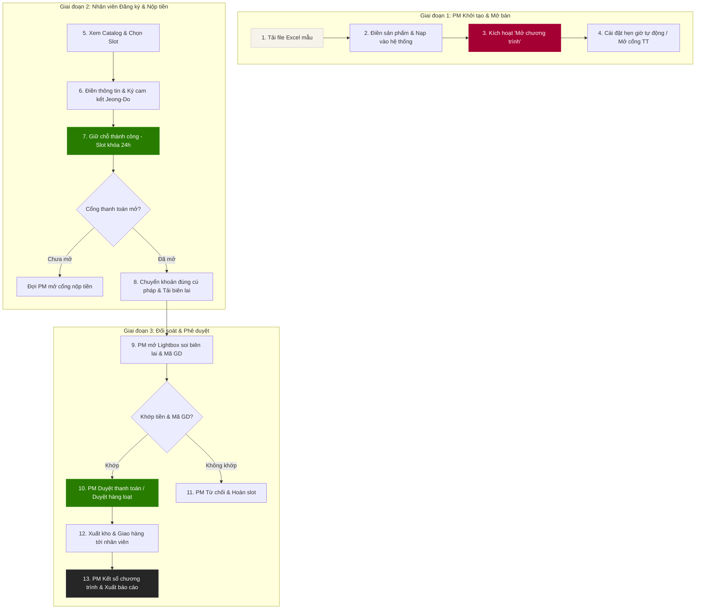
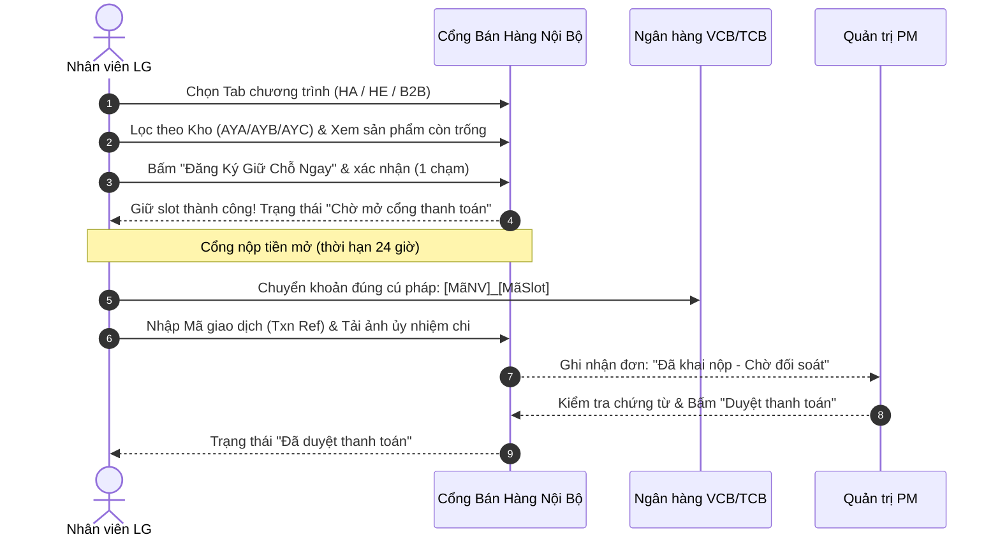
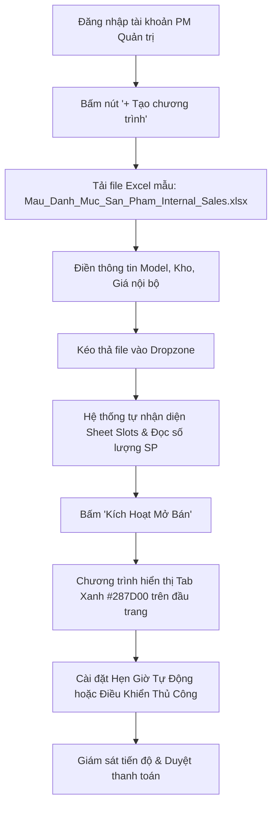

# Cẩm Nang Vận Hành & Hướng Dẫn Sử Dụng Toàn Diện
### LG Internal Sales Portal — Dành cho Nhân Viên (User) & Quản Trị Viên (PM)

*Tài liệu hướng dẫn trực quan kèm sơ đồ quy trình chi tiết giúp bất kỳ ai cũng có thể sử dụng thành thạo hệ thống mà không cần người hướng dẫn trực tiếp.*

---

## 1. Sơ đồ Chu trình Bán hàng Toàn diện (End-to-End Sales Lifecycle)

---

## PHẦN A: HƯỚNG DẪN DÀNH CHO NHÂN VIÊN (END-USER)

### Bước 1: Khám phá danh mục & Tìm kiếm sản phẩm
1. **Chọn chương trình:** Tại thanh Tab trên cùng, chọn chương trình đang mở bán (có chấm tròn xanh lá):
   * *Gia dụng (HA):* Tủ lạnh InstaView, Tháp giặt sấy WashTower, Máy sấy HeatPump, Điều hòa.
   * *Nghe nhìn (HE):* Tivi OLED evo, Tivi QNED, Loa thanh Soundbar, Loa XBOOM.
   * *B2B / Màn hình (BS):* Màn hình UltraWide, Ergo UltraFine, gram +view, Bảng One:Quick.
2. **Lọc theo vị trí kho:** Bấm chọn các tab kho hàng để tìm sản phẩm gần địa bàn công tác *(⚠️ vị trí địa lý dưới đây chưa được PM xác nhận — các tài liệu khác ghi khác; xem `docs/CURRENT_STATE.md` mục 9)*:
   * **Kho AYA (Miền Bắc):** Hải Phòng / Hà Nội.
   * **Kho AYB (Miền Trung):** Đà Nẵng.
   * **Kho AYC (Miền Nam):** TP. Hồ Chí Minh / Bình Dương.
3. **Kiểm tra tình trạng suất máy:**
   * Thẻ hiển thị **"Có sẵn" (Available):** Bấm nút màu đỏ `Đăng Ký Giữ Chỗ Ngay`.
   * Thẻ hiển thị **"Đã giữ chỗ" (Registered):** Đã có đồng nghiệp khác đăng ký trước.

---

### Bước 2: Xác nhận giữ chỗ (1 chạm) — *cập nhật 05/10/2026, đối chiếu giao diện*
1. Sau khi bấm `Đăng Ký Giữ Chỗ Ngay`, hộp xác nhận hiện Mã Model, mô tả, giá nội bộ, kho → bấm **OK**.
2. **Không có form nhập tay:** Mã NV, họ tên, bộ phận, SĐT lấy tự động từ tài khoản đăng nhập.
3. **Cam kết Jeong-Do:** nội dung cam kết ở Tab `1. Thư Thông Báo & Quy Định`. Luồng 1 chạm hiện **không** có ô tích riêng; máy chủ ghi "Đồng ý" vào hồ sơ đơn *(chờ chủ dự án quyết định có thêm ô tích hay không)*.
4. Kết quả:
   * Thành công → trạng thái `Đã đăng ký - Chờ mở thanh toán`, đơn hiện ở ô **03 Đơn Hàng Của Bạn**. **Đồng hồ 24 giờ chưa chạy** — chỉ bắt đầu khi PM mở cổng thanh toán.
   * Có đồng nghiệp nhanh hơn vài giây → thông báo *"đã có người đăng ký trước"*, slot chuyển "Đã giữ chỗ" ngay → chọn sản phẩm khác.

---

### Bước 3: Nộp tiền chuyển khoản & Khai báo chứng từ
1. **Kiểm tra trạng thái mở cổng thanh toán:**
   * Khi ô 03 hiện **`CỔNG TT ĐÃ MỞ`** và nút **`Nộp tiền ngay (1-Chạm) →`** (ô 03 tự kiểm tra lại mỗi 60 giây), bạn bắt đầu chuyển khoản. Bạn có **24 giờ** tính từ lúc cổng mở.
2. **Thông tin ngân hàng thụ hưởng chính thức của LG:**
   * **Ngân hàng:** Vietcombank *(tên chi nhánh chưa thống nhất: giao diện & email ghi "Tây Hồ", tài liệu này trước đây ghi "Tây Hà Nội" — chờ Tài chính xác nhận; số tài khoản bên dưới thống nhất ở mọi nơi)*.
   * **Số tài khoản:** `0991000012525` *(Bấm icon sao chép nhanh trên web)*.
   * **Tên chủ tài khoản:** `CTY TNHH LG Electronics VN HP`.
   * **Số tiền:** Chuyển chính xác 100% số tiền hiển thị trên đơn hàng.
   * **Cú pháp chuyển khoản:** dùng **mã VietQR** trong cửa sổ nộp tiền — mã đã điền sẵn số tiền và nội dung `MãNV MãSlot` (VD: `VH88921 HA-001`). *(Lưu ý: ô 01 trên trang ghi dạng `[MãNV]_[MãSlot]` có gạch dưới — chờ chủ dự án chốt 1 dạng.)*
3. **Khai báo chứng từ lên hệ thống:**
   * Bấm **`Nộp tiền ngay (1-Chạm) →`** tại ô 03, hoặc nút **`Nộp tiền`** trên dòng đơn ở Tab 3 (khi đã đăng nhập, Tab 3 tự tra cứu đơn của bạn).
   * Nhập **Mã giao dịch ngân hàng (Txn Ref / Mã tham chiếu)** từ app ngân hàng của bạn *(Có nút "Xem hướng dẫn tìm mã GD" cho từng ngân hàng VCB, TCB, MB, VietinBank)*.
   * Kéo thả hoặc tải lên **Ảnh chụp màn hình biên lai chuyển khoản thành công** *(Hỗ trợ mọi định dạng JPG, PNG và tự động chuyển đổi ảnh HEIC từ iPhone)*.
   * Bấm **"Xác Nhận Nộp Tiền"**.

---

### Bước 4: Theo dõi đơn hàng & Hủy giữ chỗ khi cần
* **Theo dõi:** Đơn hàng sẽ chuyển sang trạng thái `"Đã khai nộp - chờ đối soát"`. Sau khi PM / kế toán kiểm tra xong, trạng thái đổi thành `"Đã duyệt thanh toán"`.
* **Hủy giữ chỗ:** Nếu bạn đổi ý hoặc muốn chọn model khác:
  * Vào Thẻ 03 (*Đơn Hàng Của Bạn*).
  * Bấm nút **"Hủy giữ chỗ"**. Suất máy sẽ lập tức được trả về kho khả dụng cho đồng nghiệp khác và hạn mức 1 SP của bạn được hoàn lại.
  * *(Lưu ý — **cập nhật v1, 05/10/2026**: chỉ tự hủy được khi đơn đang **"Đã đăng ký - Chờ mở thanh toán"** hoặc **"Chờ nộp tiền"** và **chưa khai nộp tiền**. Đã khai nộp tiền thì liên hệ PM phụ trách để xử lý — tránh phát sinh hoàn tiền. Quy tắc cũ "chưa được PM phê duyệt" không còn áp dụng.)*

---

## PHẦN B: HƯỚNG DẪN DÀNH CHO QUẢN TRỊ VIÊN ĐỢT BÁN (PM)

### Bước 1: Khởi tạo chương trình mới & Nạp danh mục từ Excel
1. Đăng nhập bằng tài khoản PM (Mã `VH12345`).
2. Trên thanh Tab chương trình, bấm nút `+ Tạo chương trình`.
3. Điền thông tin cơ bản:
   * **Ngành hàng / Phân khúc → Mã đợt bán:** chọn phân khúc, hệ thống **tự sinh mã** dạng `IS-<Năm>Q<Quý>-<PHÂN KHÚC>-<STT>` (VD: `IS-2026Q4-TV-01`) và báo trùng nếu mã đã tồn tại.
   * **Tên hiển thị:** VD: `Đợt Bán Hàng Nội Bộ Q4/2026 – Gia Dụng HA`.
   * **Thời gian mở bán & kết thúc:** Có các nút bấm nhanh `+7 Ngày`, `+14 Ngày`, `Hết tháng này`.
   * **Hạn mức:** Mặc định `1 SP / Nhân viên`.
4. **Tải và sử dụng file Excel mẫu chuẩn:**
   * Bấm nút **"Tải file mẫu Excel (.xlsx)"** ở góc trên khung nạp hoặc bấm link nhắc nhở bên trong khung.
   * Mở file mẫu vừa tải về (`Mau_Danh_Muc_San_Pham_Internal_Sales.xlsx`), điền danh sách máy của bạn theo 7 cột chuẩn.
5. **Kéo thả file Excel vào hệ thống:**
   * Thả file vào khung nét đứt.
   * Hệ thống tự động phân tích cấu trúc, nhận diện sheet và hiển thị bảng xem trước (Số lượng SP, Model, Giá).
6. Bấm nút màu đỏ: **"Kích Hoạt Mở Bán"**. Đợt bán sẽ xuất hiện ngay trên thanh Tab với chấm xanh hoạt động.

---

### Bước 2: Cài đặt Hẹn Giờ Tự Động (Automation Timer)

> ⚠️ **Quan trọng — đối chiếu code 05/10/2026:** hẹn giờ được **lưu trong trình duyệt của PM** và **chỉ chạy khi PM đang mở trang, đã đăng nhập và đang chọn đúng chương trình đó**. Tắt máy / đóng trang / mở trên máy khác → hẹn giờ **không chạy**. Ngày mở bán: PM nên **thao tác tay** (mở cổng, kết sổ) hoặc giữ một máy luôn mở trang. Watchdog 24 giờ (hủy đơn quá hạn) chạy trên máy chủ nên **không** bị ảnh hưởng.

1. Trên thanh nút của Bảng Điều Khiển PM, bấm nút **"Hẹn Giờ (Timer)"** (icon đồng hồ).
2. Thiết lập 3 mốc thời gian tự động:
   * **Hẹn giờ Mở bán:** Tự động mở chương trình khi đến giờ G.
   * **Hẹn giờ Mở cổng thanh toán:** Tự động cho phép nhân viên nộp tiền sau khi đã hoàn thành đợt đăng ký giữ chỗ.
   * **Hẹn giờ Kết sổ:** Tự động khóa cổng, ngăn chặn các đăng ký phát sinh sau hạn định.
3. Bấm **"Lưu Cấu Hình Hẹn Giờ"**. Hệ thống kích hoạt đồng hồ đếm ngược và hiển thị thẻ trạng thái nhấp nháy trên banner.

---

### Bước 3: Đối soát thanh toán bằng Modal Phóng to Lightbox

> ✅ **Từ v1.2 (05/10/2026):** cửa sổ này chỉ hiện biên lai **thật** — ảnh vừa tải lên, hoặc nút **"Mở biên lai thật ↗"** (file trên Google Drive, cần quyền xem thư mục "Bien lai nop tien"), hoặc dòng "Chưa có ảnh biên lai trong hệ thống". Bản trước v1.2 hiện hình minh họa "Giao dịch thành công" — **không phải biên lai thật**. Luôn đối chiếu sao kê ngân hàng trước khi duyệt.
1. Mở tab **`1. Bảng Điều Khiển PM`**. Bảng ở chế độ máy chủ **không tự làm mới** — bấm **`Tải lại`** để thấy đơn mới.
2. Khi có nhân viên nộp tiền, đơn hàng hiển thị tại bảng danh sách với trạng thái `"Đã khai nộp - chờ đối soát"`.
3. **Soi kỹ chứng từ bằng Lightbox:**
   * Bấm vào nút ảnh thumbnail biên lai.
   * Hộp thoại Lightbox mở ra toàn màn hình, hỗ trợ:
     * **Phóng to (Zoom In):** Lên đến 300% để soi rõ từng con số trong mã giao dịch ngân hàng.
     * **Xoay ảnh (Rotate):** Xoay 90°, 180° đối với các ảnh chụp ngang/ngược từ điện thoại.
     * **Đối chiếu thông tin:** Hiển thị song song Mã NV, Tên NV, Số tiền cần nộp, Số tiền thực nộp và Mã GD ngân hàng.
4. **Phê duyệt:**
   * Bấm nút màu xanh **`Duyệt Thanh Toán Này`** ngay bên trong Lightbox để hoàn tất xác nhận đơn.
   * Hoặc bấm **`Từ Chối Đơn`** (kèm lý do) để hủy giao dịch và hoàn trả slot về kho khả dụng.

---

### Bước 4: Duyệt thanh toán hàng loạt 1-Click (Batch Approve)
* Khi đợt bán có hàng trăm đơn nộp tiền cùng lúc:
  1. Kiểm tra tài khoản ngân hàng của công ty qua sao kê kế toán.
  2. Bấm nút xanh lá **`Duyệt hàng loạt (N)`** trên thanh nút Bảng Điều Khiển PM.
  3. Xác nhận số lượng đơn cần duyệt. Hệ thống chuyển các đơn `Đã khai nộp - chờ đối soát` sang `Đã duyệt thanh toán`, **chờ máy chủ xác nhận** rồi báo *"Máy chủ đã duyệt X / Y đơn"* và tự tải lại bảng. Duyệt hàng loạt **không** tự so khớp sao kê — PM chịu trách nhiệm đối chiếu ở bước 1.

---

### Bước 5: Kết sổ đợt bán & Xuất báo cáo
1. Khi hết thời hạn đăng ký, bấm nút màu đỏ **"Kết sổ chương trình"**.
2. **Xuất dữ liệu quyết toán:**
   * Bấm nút **`Xuất Excel (CSV)`** tại Bảng Điều Khiển PM (file gồm **mọi đơn** của chương trình đang chọn; lọc theo cột Trạng thái nếu chỉ cần đơn đã duyệt).
   * File xuất ra chứa đầy đủ 22 trường thông tin: Mã đợt, Mã NV, Họ tên, Phòng ban, Model, Kho, Số tiền, Mã GD ngân hàng, Giờ nộp, Người phê duyệt, sẵn sàng nộp cho Giám đốc Tài chính và Kế toán kho LGEVH.

---

## PHẦN C: CẬP NHẬT BẢN V1 CHÍNH THỨC (05/10/2026)

> Chi tiết kỹ thuật và lý do: [`docs/04-v1-hardening/`](../04-v1-hardening/README.md). Phần này chỉ mô tả những gì người dùng **thấy và làm khác đi**.

### C.1. Nhân viên

| Tình huống | Bản v1 hoạt động thế nào |
|---|---|
| Vào hệ thống | Dùng **link chính thức** do PM/Admin gửi (`…/portal.html`). Đăng nhập bằng Mã NV + mật khẩu được cấp — **không cần cấu hình gì**. Bản chính thức không có tài khoản demo. |
| Xem danh mục | Trạng thái "Còn trống / Đã có người giữ" lấy trực tiếp từ máy chủ và tự cập nhật khoảng **6–8 giây** một lần khi bạn đang ở Tab Danh mục. |
| Bấm giữ chỗ nhưng vừa có người nhanh hơn | Hệ thống báo *"đã có người đăng ký trước"* và **cập nhật ngay** các slot đã hết trên màn hình. Không bao giờ có 2 người cùng giữ 1 slot — chọn sản phẩm khác. |
| Ô "03 Đơn Hàng Của Bạn" | Hiện **đơn thật** của bạn từ máy chủ. Khi đơn đang chờ PM mở cổng, ô này tự kiểm tra lại mỗi 60 giây — khi PM mở cổng sẽ hiện **"CỔNG TT ĐÃ MỞ"** và nút **"Nộp tiền ngay"**. |
| Hủy giữ chỗ | Có hiệu lực thật trên máy chủ, slot trả về kho cho đồng nghiệp ngay. Chỉ hủy được **trước khi khai nộp tiền** (xem Bước 4). |
| Thấy "Đang kết nối máy chủ…" | Máy chủ Google đang chậm (thường vài phút đầu mở bán). Trang tự thử lại sau 15 giây, hoặc bấm **Thử lại ngay**. Nếu mạng công ty chặn, chuyển sang 4G/5G. Dữ liệu của bạn không bị mất. |
| Báo "phiên đăng nhập không khớp / không hợp lệ" | Đăng xuất rồi đăng nhập lại. |
| Ô 02 ghi "Đang tải…" | Máy chủ đang gửi danh mục (lượt đầu có thể mất 15–40 giây). Chờ — **không** phải hết hàng. "Hết hàng" chỉ hiện khi danh mục đã tải xong và mọi slot đã có người giữ. |

### C.2. PM

| Tình huống | Bản v1 hoạt động thế nào |
|---|---|
| Bật/tắt email tự động | **Chỉ tài khoản ADMIN** thấy nút **"Email tự động [BẬT/TẮT]"** trên thanh nút Bảng Điều Khiển PM. PM cần đổi thì liên hệ ADMIN. Hướng dẫn: [`V1_RELEASE_RUNBOOK.md` mục 4](../04-v1-hardening/V1_RELEASE_RUNBOOK.md). |
| Duyệt hàng loạt | Hệ thống chờ máy chủ xác nhận rồi mới báo **"Máy chủ đã duyệt X / Y đơn"**, sau đó tự tải lại bảng. Nếu máy chủ lỗi: không đơn nào bị đánh dấu duyệt nhầm — bấm lại. |
| Đơn nhân viên tự hủy | Hiện trạng thái **"Đã hủy bởi nhân viên"**, slot đã trả về kho. |
| Tài khoản demo | Chỉ dùng trong **bản demo** để đào tạo. Không thao tác được trên máy chủ chính thức. |
| Phạm vi dữ liệu | PM chỉ thấy đơn của **chương trình mình phụ trách**, kể cả khi chưa chọn chương trình (sửa 05/10). Cần xem chương trình của PM khác → nhờ ADMIN. |
| Hẹn giờ đặt trên bản demo | **Không** mang sang bản chính thức (`portal.html`), và ngược lại. Hẹn giờ cho đợt bán thật phải đặt lại trên `portal.html` (sửa 05/10). |

### C.3. ADMIN (role mới, 05/10/2026)

| Tình huống | Bản v1 hoạt động thế nào |
|---|---|
| Đăng nhập | Giao diện giống PM, thanh người dùng ghi **"Admin hệ thống"**. |
| Quản lý chương trình | Thấy và thao tác **mọi chương trình** của mọi PM (mở cổng, duyệt, từ chối, kết sổ…). Mọi thao tác ghi `ActivityLog`. |
| Cài đặt hệ thống | Nút **"Email tự động [BẬT/TẮT]"** — rê chuột xem số email còn gửi được hôm nay. |
| Gán / bỏ quyền | Admin sửa cột `Role` trong tab `Users` (`ADMIN` / `PM` / `USER`). Chi tiết: [`V1_RELEASE_RUNBOOK.md` mục 4b](../04-v1-hardening/V1_RELEASE_RUNBOOK.md). |

## BẢNG TRA CỨU MÃ MÀU TRẠNG THÁI CHUẨN THƯƠNG HIỆU LG

| Ký hiệu màu | Mã HEX chuẩn | Trạng thái hiển thị | Ý nghĩa vận hành |
|---|---|---|---|
| **Chấm Xanh Lá** | `#287D00` | `Đang Mở Bán` | Chương trình đang hoạt động, nhân viên được đăng ký. |
| **Chấm Vàng Toast** | `#DEAD25` | `Dự Thảo` / `Chờ đối soát` | Chương trình chưa mở bán hoặc đơn hàng đang chờ PM duyệt tiền. |
| **Icon Khóa Xám** | `#716F6A` | `Đã Kết Sổ` | Chương trình đã đóng, không tiếp nhận thêm đăng ký. |
| **Đỏ Heritage** | `#A50034` | Nút bấm chính / Header | Màu sắc nhận diện danh tính cao cấp của tập đoàn LG Electronics. |
