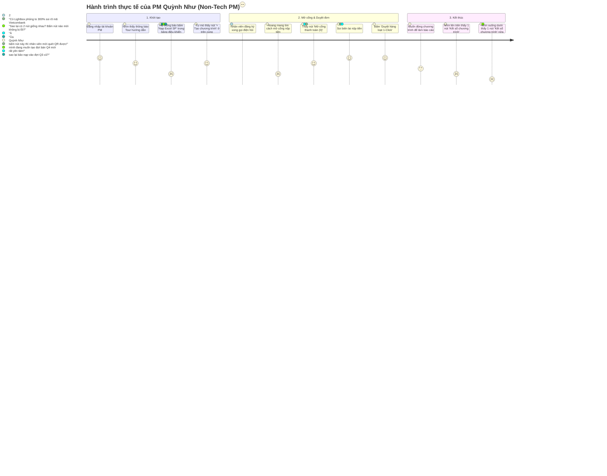
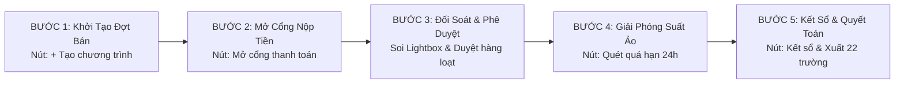

# ĐỀ XUẤT TỐI ƯU HÓA FLOW HƯỚNG DẪN QUẢN TRỊ PM & GIẢI PHÁP TRIỆT TIÊU ĐIỂM TRÙNG LẶP UX

> **📌 Trạng thái (cập nhật 05/10/2026):** ✅ **Đã triển khai** (dòng "Chờ phê duyệt" bên dưới là trạng thái cũ): tour PM 5 bước khớp mục 5; mục 6 — `#pm-controls` tự ẩn khi đang ở tab Bảng Điều Khiển PM. Hướng dẫn hiện hành: [`PM_AND_USER_OPERATIONAL_GUIDE.md`](PM_AND_USER_OPERATIONAL_GUIDE.md); thông tin hiện hành: [`docs/CURRENT_STATE.md`](../CURRENT_STATE.md).

## (PM ONBOARDING FLOW & UX REDUNDANCY OPTIMIZATION PROPOSAL)

**Dự án:** LG Internal Sales Platform (Cổng Bán Hàng Nội Bộ LG Electronics Việt Nam)  
**Tác giả:** Senior IT Developer & UX Lead  
**Tài liệu tham chiếu:** [`ONBOARDING_TOUR_GUIDANCE_FLOW_PLAN.md`](./ONBOARDING_TOUR_GUIDANCE_FLOW_PLAN.md) | [`PM_AND_USER_OPERATIONAL_GUIDE.md`](./PM_AND_USER_OPERATIONAL_GUIDE.md)  
**Ngày lập:** 04/10/2026  
**Trạng thái:** Chờ phê duyệt (Pending Approval)

---

## 1. TÓM TẮT ĐIỀU HÀNH (EXECUTIVE SUMMARY)

Dựa trên phản hồi thực tế của Quản trị viên (PM) và quá trình kiểm thử thực tế trên hệ thống [`Mau_Dang_Ky_Internal_Sales_3009.html`](../../Mau_Dang_Ky_Internal_Sales_3009.html), đội ngũ phát triển đã tiến hành phân tích sâu và nhận định:

> **Kết luận sơ bộ:** Cả 2 nhận xét của bạn là **HOÀN TOÀN CHÍNH XÁC (100% Valid & Spot-on)** cả về mặt luồng nghiệp vụ thực tế lẫn tâm lý học trải nghiệm người dùng (UX Psychology). 
> 
> Bản thiết kế hướng dẫn PM cũ đang gặp 3 vấn đề lớn:
> 1. **Lệch pha điểm xuất phát (Origin Misalignment):** Hướng dẫn PM bấm "Nạp Excel SP" trong dashboard thay vì bấm "+ Tạo chương trình" trên thanh điều hướng đỉnh trang.
> 2. **Dư thừa điểm chạm gây phân vân (UX Cognitive Redundancy):** Nút "Kết sổ chương trình" xuất hiện đồng thời ở cả thanh đỉnh trang (`#pm-controls`) và trong banner dashboard (`#pm-banner-controls`), gây bối rối cho người dùng không rành công nghệ.
> 3. **Bỏ sót nút then chốt trong chu trình bán:** Chưa hướng dẫn nút **"Mở cổng thanh toán"** — nếu PM không bấm nút này, nhân viên dù giữ được slot cũng không thể quét QR nộp tiền.

---

## 2. NHẬP VAI QUẢN TRỊ VIÊN (ROLEPLAY COGNITIVE AUDIT)

### 2.1. Hồ sơ người dùng giả lập (Persona Profile)
* **Họ tên:** Nguyễn Thị Quỳnh Như
* **Vai trò:** Product / Promotion Manager (Ngành hàng Gia dụng HA, LG Electronics).
* **Năng lực công nghệ:** Trung bình - yếu. Thao tác chính hàng ngày là Excel, Outlook, Teams. Rất ngại các giao diện phức tạp có nhiều nút bấm trùng nhau hoặc nhiều thuật ngữ code/hệ thống.
* **Tâm lý & Áp lực:** 
  * Áp lực bán hết suất kho thanh lý nhưng phải đúng hạn mức và minh bạch.
  * Rất sợ thao tác sai: Sợ kết sổ nhầm khi nhân viên chưa mua xong; sợ nạp sai giá làm công ty thất thoát; sợ xuất file sai bị Giám đốc Tài chính từ chối.
  * **Hành vi đọc:** Lướt nhanh qua giao diện, không đọc văn bản dài quá 2 câu, tìm kiếm các chỉ dẫn trực quan dạng "Bấm vào đây để làm việc X".

### 2.2. Hành trình thực tế của PM Quỳnh Như khi lần đầu đăng nhập hệ thống



---

## 3. PHÂN TÍCH SÂU 2 NHẬN ĐỊNH CỦA NGƯỜI DÙNG

### 3.1. Nhận định 1: Bước 1/5 nên là "Tạo chương trình" ở trên cùng hay "Nạp Excel SP" ở Dashboard?

* **Đánh giá:** **BẠN HOÀN TOÀN ĐÚNG.**
* **Bằng chứng kỹ thuật thực tế:**
  1. Nút `+ Tạo chương trình` trên thanh Program Tab Bar (`.program-tab-create`) kích hoạt modal `#create-program-modal` (Màn hình Wizard 1-Screen). Tại đây, PM có thể:
     * Nhập Mã đợt bán (VD: `IS2026Q4-HA`) và Tên hiển thị.
     * Chọn thời gian mở/đóng bằng nút nhanh (+7 ngày, +14 ngày, cuối tháng).
     * Thiết lập hạn mức (1 SP / NV).
     * **Tải file Excel mẫu 7 cột chuẩn** (`downloadExcelTemplate`).
     * **Kéo thả file Excel trực tiếp vào khung dropzone**.
     * Bấm **[Kích Hoạt Mở Bán]**.
     => Đây là **điểm bắt đầu trọn vẹn (True Inception)** của vòng đời đợt bán hàng nội bộ.
  2. Trong khi đó, nút `Nạp Excel SP` (`#btn-pm-import-catalog`) trong tab `Bảng Điều Khiển PM` mở modal `#import-modal`, chỉ có tác dụng cập nhật/bổ sung sản phẩm cho chương trình **đang được chọn**.
* **Hậu quả nếu giữ hướng dẫn cũ:** PM mới vào sẽ không biết làm sao để tạo ra một đợt bán mới; họ tưởng rằng bắt buộc phải ghi đè sản phẩm vào đợt bán cũ.

### 3.2. Nhận định 2: Sự trùng lặp nút "Kết sổ chương trình" & "Tạo chương trình"

* **Đánh giá:** **BẠN HOÀN TOÀN ĐÚNG — GÂY CONFUSION RÕ RỆT.**
* **Hiện trạng cấu trúc HTML/DOM:**
  * **Vị trí 1 (Global Header Controls):** `<div id="pm-controls">` nằm ngay dưới thanh chuyển tab chương trình (`#program-tab-bar`), render nút:
    ```html
    <button class="pm-action-btn pm-btn-close">Kết sổ chương trình</button>
    ```
  * **Vị trí 2 (Dashboard Banner Controls):** `<div id="pm-banner-controls">` nằm trong thẻ thông tin chương trình của Tab PM (`#pm-banner`), render nút:
    ```html
    <button class="btn-pm-action btn-pm-outline">Kết sổ chương trình</button>
    ```
* **Tại sao lập trình viên trước đây lại để 2 nút?**
  * Lập trình viên muốn: Dù PM đang đứng ở Tab 2 (Chi Tiết Sản Phẩm) hay Tab 1 (Bảng Điều Khiển PM), PM vẫn bấm kết sổ được ở thanh đỉnh trang.
  * Tuy nhiên, khi PM đang ở Tab 1 (nơi họ dành 90% thời gian làm việc), **hai nút này nằm cách nhau chưa đầy 100 pixel trên cùng một tầm mắt**.
* **Giải pháp đề xuất cho giao diện & Hướng dẫn:**
  1. **Trên Giao Diện (UI Polish):** Khi PM đang ở Tab `Bảng Điều Khiển PM`, tự động ẩn `#pm-controls` trên đỉnh (hoặc chỉ hiển thị khi PM chuyển sang các Tab khác ngoài quản trị). Chỉ giữ lại **một nút duy nhất** tại `#pm-banner-controls`.
  2. **Trong Tour Hướng Dẫn:** Lấy **nút `+ Tạo chương trình` ở trên thanh Tab Bar làm Bước 1**, và lấy **khối `Báo Cáo & Quyết Toán (Kết sổ / Xuất Excel)` làm Bước 5**. Điều này tạo ra một hành trình khép kín: **Khởi đầu ở trên cùng -> Vận hành ở giữa -> Kết thúc ở dưới**.

---

## 4. CÁC BLINDSPOTS & ĐIỂM KHÓ HIỂU KHÁC ĐƯỢC PHÁT HIỆN QUA AUDIT

Qua quá trình rà soát toàn bộ hệ thống bán hàng nội bộ của LG, chúng tôi phát hiện thêm 3 điểm mù (blindspots) cần được khắc phục:

| STT | Blindspot phát hiện | Hệ quả đối với PM mới | Giải pháp điều chỉnh |
| :---: | :--- | :--- | :--- |
| **B-01** | **Bỏ quên bước "Mở cổng thanh toán"** | Nhân viên giữ slot FCFS thành công nhưng không thấy nút nộp tiền QR (bị hệ thống khóa 2h). Nhân viên sẽ liên tục khiếu nại PM. | Đưa nút `Mở cổng thanh toán` (`#btn-allow-payment-header`) vào **Bước 2** trong chu trình quản trị. |
| **B-02** | **Bước "Hẹn giờ (Timer)" bị đặt quá sớm** | Tính năng hẹn giờ tự động là nâng cao (Advanced). Ép PM học hẹn giờ ở Bước 2 khiến họ cảm thấy hệ thống phức tạp và quá tải. | Chuyển hẹn giờ thành mẹo bổ trợ (Tip/Pro-feature) ở bước kết thúc hoặc trong phần mở rộng, nhường chỗ cho các thao tác tác nghiệp hàng ngày. |
| **B-03** | **Chưa hướng dẫn cách xử lý đơn quá hạn 24h** | Suất máy bị giữ ảo bởi nhân viên không chuyển khoản, làm mất cơ hội mua của người khác. | Tích hợp hướng dẫn nút `Quét quá hạn 24h` (`triggerExpiredCheck`) vào bước kiểm soát kho và slot giữ chỗ. |

---

## 5. BẢN THIẾT KẾ LẠI: 5 BƯỚC VÀNG QUẢN TRỊ PM (THE 5 GOLDEN MILESTONES)

Thiết kế lại toàn bộ 5 bước hướng dẫn theo đúng trình tự thời gian vòng đời chiến dịch (Campaign Lifecycle):



### Chi tiết nội dung 5 Bước mới (Súc tích, Chuẩn Brand LG, Dành cho người không rành công nghệ):

#### BƯỚC 1/5: KHỞI TẠO ĐỢT BÁN HÀNG MỚI
* **Đối tượng spotlight (Target):** `.program-tab-create` (Nút `+ Tạo chương trình` trên thanh bar đầu trang).
* **Tab hiển thị:** Global (Bất kỳ tab nào).
* **Badge:** `BƯỚC 1/5 · QUẢN TRỊ PM`
* **Kicker:** `KHỞI TẠO ĐỢT BÁN`
* **Tiêu đề:** `Tạo Đợt Bán & Nạp Danh Mục Sản Phẩm`
* **Nội dung (Tối đa 2 câu):** Bấm vào đây để tạo đợt bán mới. Tải file Excel mẫu 7 cột, điền danh sách model và kéo thả vào để kích hoạt mở bán cho toàn công ty.
* **Mẹo (Tip):** Hệ thống có sẵn nút chọn nhanh thời gian (+7 ngày, +14 ngày, cuối tháng) cực kỳ tiện lợi.
* **Icon:** `ico_epc.svg`

#### BƯỚC 2/5: MỞ CỔNG TIẾP NHẬN NỘP TIỀN
* **Đối tượng spotlight (Target):** `#btn-allow-payment-header` (Nút `Mở cổng thanh toán (X)` màu xanh lục bảo).
* **Tab hiển thị:** Tự động chuyển về `#tab-pm` (`Bảng Điều Khiển PM`).
* **Badge:** `BƯỚC 2/5 · QUẢN TRỊ PM`
* **Kicker:** `QUẢN TRỊ THANH TOÁN`
* **Tiêu đề:** `Bật Cổng Nộp Tiền Chuyển Khoản`
* **Nội dung (Tối đa 2 câu):** Sau khi nhân viên đăng ký giữ chỗ máy thành công, bấm nút này để cho phép nhân viên quét mã VietQR nộp tiền ngay vào tài khoản LG.
* **Mẹo (Tip):** Giúp nhân viên chủ động hoàn tất thanh toán nhanh mà không phải chờ đợi qua giờ.
* **Icon:** `ico_lock.svg`

#### BƯỚC 3/5: SOI BIÊN LAI LIGHTBOX & DUYỆT 1-CLICK
* **Đối tượng spotlight (Target):** `#btn-batch-approve-header` (Nút `Duyệt hàng loạt (X)` màu xanh lá).
* **Tab hiển thị:** `#tab-pm`.
* **Badge:** `BƯỚC 3/5 · QUẢN TRỊ PM`
* **Kicker:** `ĐỐI SOÁT & PHÊ DUYỆT`
* **Tiêu đề:** `Soi Biên Lai 300% & Duyệt Hàng Loạt`
* **Nội dung (Tối đa 2 câu):** Bấm vào ảnh biên lai của nhân viên để phóng to 300% soi rõ mã giao dịch ngân hàng. Sau đó bấm nút này để duyệt hàng trăm đơn trong 1 giây.
* **Mẹo (Tip):** Hệ thống tự động gửi Email xác nhận thành công cho nhân viên ngay khi PM bấm duyệt.
* **Icon:** `ico_view.svg`

#### BƯỚC 4/5: THU HỒI SUẤT ẢO & GIẢI PHÓNG KHO
* **Đối tượng spotlight (Target):** Nút `Quét quá hạn 24h` và Tab đếm đơn chưa nộp tiền.
* **Tab hiển thị:** `#tab-pm`.
* **Badge:** `BƯỚC 4/5 · QUẢN TRỊ PM`
* **Kicker:** `KIỂM SOÁT TỒN KHO`
* **Tiêu đề:** `Thu Hồi Suất Quá Hạn 24 Giờ`
* **Nội dung (Tối đa 2 câu):** Theo quy chế bán hàng nội bộ, nhân viên giữ chỗ quá 24h không nộp tiền sẽ bị thu hồi suất. Bấm nút này để hủy đơn quá hạn và trả máy về kho cho người khác mua.
* **Mẹo (Tip):** Có thể bấm nút "Hẹn Giờ (Timer)" bên cạnh nếu muốn hệ thống tự động quét mỗi ngày.
* **Icon:** `ico_timer.svg`

#### BƯỚC 5/5: KẾT SỔ ĐỢT BÁN & XUẤT BÁO CÁO 22 TRƯỜNG
* **Đối tượng spotlight (Target):** Cụm `.btn-pm-export, #pm-banner-controls` (Nút Kết sổ trong banner và Nút Xuất Excel CSV).
* **Tab hiển thị:** `#tab-pm`.
* **Badge:** `BƯỚC 5/5 · HOÀN TẤT QUẢN TRỊ`
* **Kicker:** `BÁO CÁO & QUYẾT TOÁN`
* **Tiêu đề:** `Kết Sổ Chương Trình & Xuất Quyết Toán`
* **Nội dung (Tối đa 2 câu):** Khi hết đợt bán, bấm "Kết Sổ" để khóa cổng đăng ký. Sau đó bấm "Xuất Excel" để tải file đầy đủ 22 trường nộp Giám đốc Tài chính và Kế toán kho LGEVH.
* **Mẹo (Tip):** Toàn bộ dữ liệu sau khi kết sổ sẽ được niêm phong chống sửa đổi trái phép.
* **Icon:** `ico_download.svg`

---

## 6. KẾ HOẠCH XỬ LÝ ĐIỂM TRÙNG LẶP NÚT BẤM (UI DEDUPLICATION)

Để loại bỏ hoàn toàn cảm giác bối rối "2 nút giống hệt nhau":

```mermaid
graph TD
    subgraph Hiện Tại (Duplicate Risk)
        A1[Top Bar: #pm-controls -> Nút Kết Sổ 1]
        A2[Dashboard Banner: #pm-banner-controls -> Nút Kết Sổ 2]
        A1 -.->|Nằm cùng trên 1 màn hình| A2
    end
    
    subgraph Đề Xuất Tối Ưu (Smart Context Visibility)
        B1[Đang ở Tab 'Bảng Điều Khiển PM'] -->|Tự động ẩn #pm-controls trên đỉnh| B2[Chỉ hiện DUY NHẤT nút Kết sổ trong Banner]
        B3[Đang ở Tab khác: Bảng Chi Tiết SP] -->|Tự động hiện #pm-controls trên đỉnh| B4[Cho phép PM kết sổ nhanh từ xa]
    end
```

* **Quy tắc hiển thị thông minh:**
  1. Khi PM đang mở Tab **`Bảng Điều Khiển PM`**: Ẩn thanh `#pm-controls` trên đỉnh trang (`display: none`). Toàn bộ quyền điều khiển chiến dịch được gom về một mối duy nhất tại `#pm-banner-controls`.
  2. Khi PM chuyển sang Tab **`Bảng Chi Tiết Sản Phẩm`**: Hiển thị thanh `#pm-controls` trên đỉnh trang để PM có thể theo dõi trạng thái và kết sổ mà không cần phải chuyển lại tab.
  3. **Độ an toàn kỹ thuật:** Không xóa bất kỳ hàm nào, chỉ điều khiển CSS `display` theo sự kiện `switchTab()`, đảm bảo **Zero Regression 100%**.

---

## 7. TIÊU CHÍ NGHIỆM THU (VERIFIABLE SUCCESS CRITERIA)

Tuân thủ nguyên tắc đo lường của Peter Drucker: *"If it cannot be measured, it cannot be managed"*:

1. **Khả năng định vị hố sáng quang học (Optical Hole Cutout):**
   * Bước 1 spotlight chính xác nút `+ Tạo chương trình` trên thanh đầu trang (không bị lệch tọa độ khi cuộn trang).
   * Bước 2 spotlight chính xác nút `Mở cổng thanh toán (X)` màu lục bảo.
   * Bước 3, 4, 5 spotlight đúng các khối chức năng tương ứng mà không bị che khuất bởi navbar.
2. **Kiểm thử trải nghiệm trên Chrome CDP (Port 9222):**
   * 0 Console Errors / Exceptions khi chạy qua toàn bộ 5 bước.
   * Tự động chuyển tab mượt mà (`tab-pm` tự kích hoạt từ bước 2).
   * Chụp đầy đủ 5 ảnh kiểm chứng thực tế tại từng bước.
3. **An toàn hệ thống:**
   * Luôn duy trì bản backup byte-for-byte trước khi sửa.
   * Tích hợp công tắc bật/tắt an toàn (`ENABLE_ONBOARDING_TOUR`).

---

*Tài liệu đã sẵn sàng để trình duyệt và nhận phản hồi từ Ban Quản trị trước khi tiến hành cập nhật mã nguồn.*
