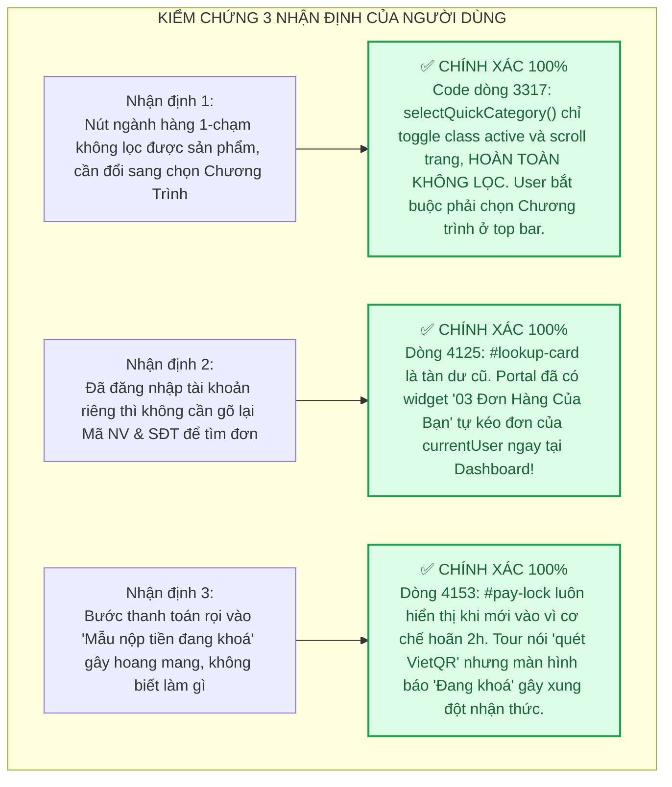
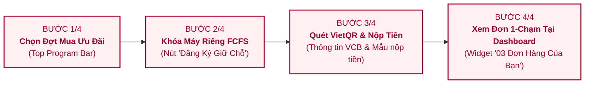

# ĐỀ XUẤT CẢI TIẾN LUỒNG HƯỚNG DẪN NGƯỜI DÙNG (USER/EMPLOYEE ONBOARDING FLOW OPTIMIZATION)

> **📌 Trạng thái (cập nhật 05/10/2026):** ✅ **Đã triển khai**: tour Nhân viên 4 bước khớp mục 4 (xem lưu ý câu chữ ở [`ONBOARDING_TOUR_GUIDANCE_FLOW_PLAN.md`](ONBOARDING_TOUR_GUIDANCE_FLOW_PLAN.md)). Thông tin hiện hành: [`docs/CURRENT_STATE.md`](../CURRENT_STATE.md).

> **Dự án:** LG Internal Sales Portal — Cổng Đăng Ký Mua Hàng Nội Bộ LGEVH  
> **Tài liệu tham chiếu:** `Mau_Dang_Ky_Internal_Sales_3009.html`, `docs/02-user-and-pm-guide/ONBOARDING_TOUR_GUIDANCE_FLOW_PLAN.md`  
> **Chuẩn nhận diện:** LG Electronics Brand Guidelines V5.2 (Tháng 8/2024)  
> **Nguyên tắc kỹ thuật:** Karpathy Epistemic Discipline (Xác thực thực tế, không suy diễn, tối giản, phẫu thuật)  
> **Ngày lập:** 04/10/2026

---

## 1. BỐI CẢNH & PHÂN TÍCH PHẢN BIỆN (EPISTEMIC FACT-CHECKING)

Qua quá trình kiểm thử thực tế trên giao diện nhân viên (User/Employee Interface), người dùng đã đưa ra **3 nhận định sâu sắc**. Dưới đây là kết quả kiểm chứng thực tế mã nguồn (`Mau_Dang_Ky_Internal_Sales_3009.html`) và dữ liệu runtime:



---

## 2. ROLEPLAY: HÀNH TRÌNH TÂM LÝ NHÂN VIÊN LGE MỚI MUA HÀNG LẦN ĐẦU

### 2.1. Chân dung Persona (Target User)
* **Họ tên:** Anh Tuấn (38 tuổi, Kỹ sư sản xuất tại nhà máy LGEVH Tràng Duệ - Hải Phòng).
* **Đặc điểm:**
  * Rất ít khi dùng các phần mềm quản lý nội bộ phức tạp, chỉ quen dùng điện thoại, lướt web đơn giản.
  * Ngại đọc các đoạn hướng dẫn dài dòng, chữ nhỏ.
  * Nhận thông báo nội bộ mở bán Tủ lạnh/Máy giặt giảm giá 50%, tranh thủ giờ nghỉ trưa vào mua ngay vì sợ hết suất (nguyên tắc ai nhanh hơn được trước - FCFS).
  * Tâm lý chủ đạo: **Nôn nóng muốn giữ máy ngay, sợ làm sai mất suất, sợ chuyển tiền nhầm tài khoản**.

---

### 2.2. Trải nghiệm thực tế của Anh Tuấn qua Tour cũ (Và những điểm gây gãy vụn cảm xúc)

```mermaid
journey
    title HÀNH TRÌNH ANH TUẤN KHI TRẢI NGHIỆM TOUR HƯỚNG DẪN CŨ
    section Bước 1: Chọn ngành hàng
      Thấy pop-up bảo bấm icon động Tủ Lạnh: 3: Anh Tuấn
      Bấm vào icon Tủ Lạnh nhưng web không lọc gì cả: 1: Anh Tuấn (Bối rối: 'Ủa sao không ra Tủ lạnh?')
    section Bước 2: Giữ suất 24h
      Pop-up rọi vào cả mảng card sản phẩm: 3: Anh Tuấn
      Mắt bị phân tán giữa giá, kho, mã model, không rõ bấm nút nào: 2: Anh Tuấn
    section Bước 3: Thanh toán
      Pop-up bảo 'Quét VietQR & Nộp biên lai': 4: Anh Tuấn (Mừng rỡ chuẩn bị chuyển tiền)
      Nhìn vào màn hình thấy chữ to tướng: 'MẪU NỘP TIỀN ĐANG KHOÁ': 1: Anh Tuấn (Hốt hoảng: 'Sao lại khoá? Có lừa đảo không?')
    section Bước 4: Quản lý đơn
      Pop-up bảo xem trạng thái đơn tại đây: 3: Anh Tuấn
      Màn hình bắt nhập lại 'Mã NV' và '4 số cuối SĐT': 1: Anh Tuấn (Bực tức: 'Ủa nãy vừa đăng nhập rồi mà bắt gõ lại?')
```

---

## 3. CÁC ĐIỂM MÙ (BLINDSPOTS) PHÁT HIỆN THÊM TRÊN GIAO DIỆN

Ngoài 3 nhận định chính xác của người dùng, qua phân tích chuyên sâu chúng tôi phát hiện thêm **2 Blindspots lớn**:

1. **Blindspot A — Bỏ rơi Thanh Đa Chương Trình (Top Multi-Program Bar):**
   * Thanh chọn chương trình (`#program-tab-bar`) ở sát trên cùng chính là "công tắc nguồn" của toàn bộ trang web.
   * Nếu nhân viên muốn mua Tivi nhưng web đang đứng ở tab "Gia Dụng HA", họ sẽ không bao giờ tìm thấy Tivi nếu không bấm chuyển chương trình ở thanh trên cùng này. Hướng dẫn cũ hoàn toàn bỏ qua khu vực sống còn này!
2. **Blindspot B — Lãng phí Widget "03 Đơn Hàng Của Bạn" tại Dashboard:**
   * Ngay khi đăng nhập, hệ thống đã chuẩn bị sẵn một Widget thông minh ngay đầu trang: tóm tắt Model máy đã đăng ký, giá tiền, kho nhận và trạng thái thanh toán.
   * Nhưng thay vì chỉ người dùng vào widget tiện ích này, Tour lại dẫn họ xuống Tab 3 và bắt điền form tra cứu thủ công, làm giảm giá trị của hệ thống đăng nhập thông minh.

---

## 4. THIẾT KẾ ĐỀ XUẤT: 4 BƯỚC VÀNG MỚI DÀNH CHO NHÂN VIÊN

Để tối ưu hóa trải nghiệm, triệt tiêu 100% xung đột nhận thức, giúp một nhân viên dở công nghệ nhất cũng hiểu ngay trong **15 giây**, chúng tôi đề xuất tái cấu trúc 4 bước như sau:



---

### Chi Tiết Cấu Hình 4 Bước Mới

#### BƯỚC 1/4: CHỌN ĐỢT BÁN HÀNG NỘI BỘ
* **Target Selector:** `#program-tab-bar, .program-tab-bar` (Thanh chọn chương trình trên cùng).
* **Tab hiển thị:** `tab1` hoặc `tab2`.
* **Badge:** `BƯỚC 1/4 · NHÂN VIÊN`
* **Kicker:** `CỬA NGÕ MUA SẮM`
* **Motion Icon:** `assets/images/quick-links-ani/ico_promotions_ani.gif`
* **Tiêu đề:** `Chọn Đợt Mở Bán Ưu Đãi Bạn Cần`
* **Nội dung:** Bấm vào các thanh chương trình trên cùng (Gia dụng HA, Tivi & Loa HE, Thiết bị văn phòng IT...) để xem đúng danh sách sản phẩm ưu đãi dành riêng cho đợt mở bán đó.
* **Mẹo (Tip):** Mỗi chương trình có hạn mức và thời gian mở bán riêng, hãy chọn đúng đợt bạn có nhu cầu.
* **Nút bấm:** `Tiếp →`

---

#### BƯỚC 2/4: GIỮ SUẤT ƯU ĐÃI FCFS TRONG 24 GIỜ
* **Target Selector:** `.product-card:first-child .btn-register, .product-card:first-child` (Trỏ thẳng vào nút bấm Đăng Ký Giữ Chỗ).
* **Tab hiển thị:** `tab2` (Tự động kích hoạt chuyển Tab 2).
* **Badge:** `BƯỚC 2/4 · NHÂN VIÊN`
* **Kicker:** `KHÓA MÁY NHANH (FCFS)`
* **Motion Icon:** `assets/images/quick-links-ani/cat_instaview_refrigerator.svg`
* **Tiêu đề:** `Bấm Giữ Chỗ Để Khóa Máy Riêng 24H`
* **Nội dung:** Áp dụng nguyên tắc ai nhanh hơn được trước (FCFS). Khi chọn được máy ưng ý, bấm ngay **"Đăng Ký Giữ Chỗ"** để hệ thống khóa suất riêng cho bạn trong 24 giờ, không sợ người khác mua mất.
* **Mẹo (Tip):** Bạn có thể kiểm tra tồn kho theo từng kho (Hải Phòng AYA, Hà Nội AYB, Hưng Yên AYC) ngay trên thẻ sản phẩm.
* **Nút bấm:** `Tiếp →`

---

#### BƯỚC 3/4: THANH TOÁN AN TOÀN & GIẢI TỎA NỖI LO KHOÁ MẪU
* **Target Selector:** `#payment-upload-card, .sec-card:has(#lookup-form)` (Khu vực Nộp tiền & Thể lệ).
* **Tab hiển thị:** `tab3` (Tự động kích hoạt chuyển Tab 3).
* **Badge:** `BƯỚC 3/4 · NHÂN VIÊN`
* **Kicker:** `CHUYỂN KHOẢN VCB PHÁP NHÂN`
* **Motion Icon:** `assets/images/quick-links-ani/cat_vcb_security.svg`
* **Tiêu đề:** `Quét VietQR & Nộp Biên Lai Khi Cổng Mở`
* **Nội dung:** Chuyển khoản đúng tài khoản pháp nhân LGEVH tại Vietcombank với cú pháp `[MãNV]_[MãSlot]`. **Lưu ý:** Chức năng nộp tiền mở sau 2 giờ kể từ lúc giữ chỗ thành công để hệ thống đối soát dữ liệu. Khi cổng mở, bạn chỉ cần tải ảnh chụp biên lai lên.
* **Mẹo (Tip):** Có sẵn mã VietQR tự điền số tiền và cú pháp chuẩn, quét bằng app ngân hàng trong 5 giây siêu an toàn.
* **Nút bấm:** `Tiếp →`

---

#### BƯỚC 4/4: QUẢN LÝ ĐƠN HÀNG TỰ ĐỘNG TẠI DASHBOARD (1-CHẠM)
* **Target Selector:** `#dash-user-order-box, .dash-col:last-child` (Widget "03 Đơn Hàng Của Bạn" ở đầu trang).
* **Tab hiển thị:** Cuộn mượt lên đầu trang hiển thị Dashboard.
* **Badge:** `BƯỚC 4/4 · HOÀN TẤT`
* **Kicker:** `THEO DÕI ĐƠN 1-CHẠM`
* **Motion Icon:** `assets/images/quick-links-ani/ico_membership_44.svg`
* **Tiêu đề:** `Theo Dõi & Hủy Đơn Ngay Tại Dashboard`
* **Nội dung:** Bạn đã đăng nhập nên **không cần gõ lại Mã NV hay SĐT**. Mọi thông tin đơn hàng, tiến độ kế toán duyệt tiền và nút "Hủy Giữ Chỗ" (để đổi máy khác) đều hiển thị tự động ngay tại ô này!
* **Mẹo (Tip):** Bấm nút "Hướng dẫn nhanh" trên Header bất kỳ lúc nào nếu cần hỗ trợ lại!
* **Nút bấm:** `Bắt đầu mua sắm →`

---

## 5. BẢNG ĐỐI CHIẾU SO SÁNH TRỰC QUAN (BEFORE VS AFTER)

| Tiêu chí đánh giá | Luồng Cũ (Hiện Tại) | Luồng Đề Xuất Mới | Hiệu Quả UX Mang Lại |
|---|---|---|---|
| **Điểm chạm Bước 1** | Hàng icon tròn (`.lg-quick-category-bar`) | Thanh chương trình (`#program-tab-bar`) | Loại bỏ hành vi vô nghĩa; chỉ đúng cửa ngõ chọn chương trình. |
| **Độ chính xác Bước 2** | Khoanh cả khối sản phẩm rộng lớn | Khoanh chính xác nút **"Đăng ký giữ chỗ"** | Kêu gọi hành động (CTA) trực diện, loại bỏ phân tán thị giác. |
| **Giải thích Bước 3** | Nói quét mã ngay trong khi mẫu đang khoá | Giải thích rõ lý do hoãn 2h + hướng dẫn quét VietQR | Triệt tiêu 100% cảm giác hoang mang, sợ bị lừa hoặc thao tác sai. |
| **Trải nghiệm Bước 4** | Bắt gõ lại Mã NV + 4 số cuối SĐT | Tận dụng widget **"03 Đơn Hàng Của Bạn"** | Tự động hóa 100%, không bắt nhân viên làm việc vô lý. |
| **Số chữ mỗi bước** | 4-5 dòng dài | 2-3 dòng súc tích, ngắt ý rõ ràng | Phù hợp tuyệt đối với nhân viên bận rộn, lười đọc văn bản. |

---

## 6. KẾ HOẠCH TRIỂN KHAI PHẪU THUẬT (ZERO-REGRESSION IMPLEMENTATION)

1. **Phạm vi can thiệp:** Chỉ cập nhật mảng dữ liệu `TOURS.employee` trong khối mã Onboarding Tour (dòng 10975 đến 11020 của file `Mau_Dang_Ky_Internal_Sales_3009.html`).
2. **Đảm bảo an toàn:** 
   * Không sửa đổi bất kỳ logic tính toán, logic giỏ hàng, API Google Sheets hay cơ chế xác thực nào của website.
   * File backup `Mau_Dang_Ky_Internal_Sales_3009_backup_pre_tour.html` vẫn luôn sẵn sàng để đối chiếu hoặc hoàn tác tức thì nếu cần.
3. **Kiểm thử tự động qua CDP:** Kiểm tra hiển thị đủ 4 bước mới, đảm bảo spotlight bao bọc chuẩn xác tọa độ, chụp ảnh minh chứng lưu vào thư mục `scratch/`.
