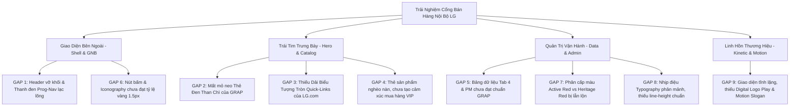

# LG INTERNAL SALES PORTAL — MASTER DESIGN GAP ANALYSIS

> **📌 Trạng thái (cập nhật 05/10/2026):** Tài liệu **lịch sử** — phân tích / đề xuất tại thời điểm lập, **không** mô tả đúng 100% ứng dụng hiện nay. Thông tin hiện hành: [`docs/CURRENT_STATE.md`](../CURRENT_STATE.md); thay đổi v1: [`04-v1-hardening/`](../04-v1-hardening/README.md).

**Bản Đánh Giá Chuyên Sâu Lỗ Hổng Thiết Kế & Nhận Diện Thương Hiệu Dưới Góc Nhìn Chuyên Gia 30 Năm Kinh Nghiệm Tại LG Electronics**

* **Chủ nhiệm đánh giá (Lead Auditor):** Senior Principal Brand & UI/UX Designer *(30+ năm cống hiến tại Trung tâm Thiết kế Toàn cầu LG Electronics, đồng tác giả và người thực thi từ kỷ nguyên tái định vị Lucky-Goldstar sang LG 1995 đến Brand Reinvention V5.2 2024)*
* **Triết lý thẩm mỹ định hướng:** 
  > *"Tại LG, cái đẹp không phải là thứ trang trí thêm thắt bên ngoài; cái đẹp là sự biểu đạt cao nhất của sự chuẩn mực, tính nhân văn và lòng tự trọng của thương hiệu. Chúng tôi căm ghét sự tầm thường, chắp vá (hate for normal/common); chúng tôi tôn thờ sự hài hòa tuyệt đối (love harmonism) và tỉ mỉ đến từng 0.5px. Một cổng thông tin nội bộ cho nhân viên LG phải truyền tải cùng một đẳng cấp, cùng một nhịp thở tinh tế và sang trọng như trang chủ flagship LG.com hay hệ thống thẩm tra cấp cao GRAP."*
* **Cơ sở đối chuẩn thực nghiệm (Benchmark Sources):**
  1. **Nguồn tham chiếu nội bộ chuẩn mực:** [LG web sample GRAP.html](LG%20web%20sample/LG%20web%20sample%20GRAP.html) *(Cổng Thông tin Đánh giá Rủi ro và Cải tiến Toàn cầu - Global Risk Assessment and Improvement Portal)*.
  2. **Nguồn tham chiếu thương mại chuẩn mực:** [LG.com/vn](LG%20web%20sample/www.lg.com/www.lg.com/vn/index.html) *(Website chính thức LG Electronics Việt Nam với bộ asset thực tế, Hero Banner, Quick Action Icons, Product Cards)*.
  3. **Hệ quy chuẩn thương hiệu gốc:** *LG Electronics Brand Identity Guidelines V5.2 (Aug 2024)* & *LG.com Global One Platform Web Style Guide v1.3 (2024)*.
* **Đối tượng phân tích:** [Mau_Dang_Ky_Internal_Sales_3009.html](Mau_Dang_Ky_Internal_Sales_3009.html) (phiên bản hiện tại, 8,888 dòng code, đã sao lưu tại `.bak_20261002_pre_design_revamp`).
* **Phương pháp luận:** Karpathy Epistemic Discipline *(Zero-hallucination, 100% bằng chứng đo lường thực tế, dẫn chiếu mã nguồn chính xác, tiêu chuẩn hóa có thể định lượng được)*.

---

## 1. BẢN TUYÊN NGÔN THẨM MỸ CỦA CHUYÊN GIA (EXECUTIVE DESIGN APPRAISAL)

Khi trực tiếp trải nghiệm và soi chiếu từng dòng mã nguồn, từng lớp CSS và cấu trúc DOM của Cổng Bán Hàng Nội Bộ hiện tại (`Mau_Dang_Ky_Internal_Sales_3009.html`), tôi nhìn thấy **một nền tảng kỹ thuật và nghiệp vụ rất phong phú**: hệ thống đa chương trình, đồng hồ đếm ngược hẹn giờ tự động, phân quyền theo vai trò PM/Nhân viên, kết nối dữ liệu Google Sheets linh hoạt.

**Tuy nhiên, dưới con mắt của một nhà thiết kế đã gắn bó hơn 3 thập kỷ với từng đường nét của logo LG, giao diện hiện tại vẫn còn mang nặng "tính kỹ trị" (engineering-driven) và chưa toát lên được "Linh hồn Nghệ thuật LG" (LG Brand Soul).** 

Hệ thống đang tồn tại ở trạng thái **lưng chừng giữa một ứng dụng quản trị văn phòng (CRUD Admin Panel) và một sàn thương mại điện tử**. Nó thiếu đi:
1. **Sự khoáng đạt và ấm áp đặc trưng của LG.com:** Không gian đệm (`whitespace`) còn bị bóp nghẹt; các khối nội dung xếp chồng phân mảnh; thiếu đi dải biểu tượng điều hướng nhanh danh mục dạng đĩa tròn (Circular Icon Bar) và các thẻ trưng bày sản phẩm (Product Merchandising Cards) chuẩn mực e-commerce cao cấp.
2. **Sự tinh tế, kỷ luật tri-color của GRAP:** Bộ ba thẻ Hero Card (`grap-brief-dashboard`) dù đã lấy cảm hứng từ GRAP nhưng lại bỏ quên "mỏ neo thị giác" quan trọng nhất: **Thẻ Đen Than Chì (`Dark Charcoal #262626`) với các ô chỉ số chìm (Sunken Stat Tiles)**, khiến bố cục bị bẹt và thiếu chiều sâu thị giác.
3. **Sự nhất quán về phân cấp màu sắc:** Vẫn còn sự nhầm lẫn giữa **Đỏ Năng Lượng / Mua Hàng (`Active Red #EA1917`)** và **Đỏ Di Sản / Thương Hiệu (`Heritage Red #A50034`)**; thanh chuyển chương trình (`.prog-nav`) màu đen đặc nằm trơ trọi cắt ngang nhịp điệu ánh sáng của nền xám ấm (`Warm Gray #F6F3EB`).

Dưới đây là bản giải phẫu chi tiết 8 lỗ hổng thẩm mỹ cốt lõi (Gaps) cùng những giá trị tinh hoa có thể kế thừa ngay từ hai nguồn mẫu chuẩn của LG.

---

## 2. BẢNG TỔNG HỢP SO SÁNH ĐỐI CHUẨN (BENCHMARK COMPARISON MATRIX)

| Thành phần thiết kế | Hiện trạng `Mau_Dang_Ky` | Chuẩn mực `LG web sample GRAP` (Internal) | Chuẩn mực `LG.com/vn` (Commercial) | Mức độ lệch chuẩn (Gap Level) |
| :--- | :--- | :--- | :--- | :---: |
| **1. Header & GNB Lockup** | Header hộp bo góc 8px; dải chuyển chương trình `.prog-nav` đen đặc tách rời; nhiều nút lộn xộn. | Lockup tinh tế: `[LG Logo] \| [Tên Cổng Portal]`; Navigation dạng pill nổi tối giản góc phải. | Header nền trắng tinh khôi, navigation danh mục thoáng đãng, search pill, user avatar tròn. | 🔴 **NẶNG (Thiếu tinh tế, phân mảnh)** |
| **2. Bộ 3 Thẻ Hero Card** | Thẻ 1 Đỏ Heritage, Thẻ 2 Xám/Trắng, Thẻ 3 Trắng/Viền xám nhạt (Bẹt, thiếu chiều sâu). | **Bộ 3 Tri-Color Kinh Điển:** • Thẻ 1: Đỏ Heritage `#A50034` • Thẻ 2: Cát Ấm `#F0ECE4` • Thẻ 3: Đen Than `#262626` (có 4 ô số chìm). | Hero Banner lớn bo cong 28px trên nền vải lanh ấm, kèm thẻ khuyến mãi bo tròn 20-24px. | 🔴 **NẶNG (Mất mỏ neo thẩm mỹ GRAP)** |
| **3. Thanh Điều Hướng Nhanh Danh Mục** | Hoàn toàn chưa có. Nhân viên phải cuộn trang hoặc chọn qua thẻ chọn STT/Kho khô khan. | Phân loại theo Process Flow, chip lọc trạng thái tinh gọn có viền gạch chân xanh lá (`.chip.on`). | **Dải 8 biểu tượng đĩa tròn (Circular Icon Bar)** với icon vector 1.5px nét đơn, nhãn định danh bên dưới. | 🟠 **LỚN (Thiếu trải nghiệm mua sắm LG)** |
| **4. Trưng Bày Sản Phẩm (Catalog Cards)** | Thẻ sản phẩm dạng bảng (Table view) hoặc thẻ hộp cơ bản, thiếu phân cấp giá niêm yết/nội bộ. | Bảng dữ liệu quản trị chuẩn chỉ: Header nền xám ấm, border-top 2px than chì, hover xanh nhạt. | **Product Merchandising Cards:** Thẻ trắng bo góc 20px, bóng đổ mềm mại, ảnh sản phẩm nổi, nhãn giảm giá `-XX%`, giá gạch ngang RRP vs giá nội bộ đỏ đậm. | 🔴 **NẶNG (Trông như kho vận thay vì ưu đãi VIP)** |
| **5. Nút Bấm & Hệ Thống CTA** | Viền đen Outlined Black, kích thước và bo góc chưa đồng nhất, CTA chưa rõ phân cấp. | Nút chữ nhật bo 4px: Đỏ Heritage (`btn-s`), Than chì (`btn-c`), Viền xám (`btn-g`). | **Hệ thống Nút LG.com:** • Height: 36px / 44px / 64px • Shape: Viên thuốc (`border-radius: 999px`) • Active Red `#EA1917` cho hành động mua/chính. | 🟠 **TRUNG BÌNH (Chưa đạt độ tinh xảo LG.com)** |
| **6. Ngôn Ngữ Biểu Tượng (Iconography)** | Đã chuyển sang SVG nhưng nét vẽ (stroke weight), kích thước (16px, 18px, 20px) chưa đồng bộ. | Icon dạng huy hiệu tròn (`.ico`, `.bdg`), nét vẽ chuẩn mực 1.2px - 1.5px, phong cách tối giản. | Icon vector 1.5px tròn trịa (rounded caps/joins), thể hiện sự nhân văn và ấm áp của LG. | 🟡 **TRUNG BÌNH (Cần chuẩn hóa nhịp điệu nét)** |
| **7. Bảng Dữ Liệu Quản Trị (Tables)** | Bảng dữ liệu kẻ viền đầy đủ, padding không đều, thiếu chỉ số thị giác nhịp nhàng. | **GRAP Table System:** `border-top: 2px solid #262626`, badge trạng thái pastel (`.grn`, `.hi`, `.me`). | Tối giản, dạng danh sách phẳng, số liệu canh lề quang học (`tabular-nums`). | 🟠 **LỚN (Cần đưa chuẩn GRAP vào Tab 4 & PM)** |
| **8. Typography & Hierarchy** | Đã nhúng font LG EI, nhưng font-size phân mảnh (10.5, 11, 12, 13, 14, 15, 17, 24px). | Phông chữ LG EI Headline kết hợp LG EI Text phân cấp rõ rệt, khoảng cách dòng thoáng (line-height 1.6-1.75). | **Type Scale Chuẩn:** Title Large (80/56), Title Medium (56/48), Sub Title (36/32), Menu (20/16), Price Large (32), Body (16/14). | 🟡 **TRUNG BÌNH (Cần đưa về Modular Scale)** |
| **9. Ngôn Ngữ Chuyển Động (Motion & Kinetic)** | Toàn trang tĩnh 100% (Static PDF on glass); thiếu vắng hoàn toàn vi tương tác (micro-interactions), hiệu ứng chuyển cảnh và logo động. | Chuyển cảnh nhẹ nhàng, hover đổi màu dịu mát (`.tb tr:hover td { background: #EAF1F8; }`), chip lọc trạng thái mượt mà. | **Hệ Thống Động Học Đỉnh Cao:** • Hero Banner trượt mượt mà có thanh tiến độ `connected`. • Floating Digital Logo Play (Mascot mặt cười cử động tương tác ở góc phải). • Micro-lift trên đĩa icon và thẻ sản phẩm. • Nút bấm đổi trạng thái có gia tốc giảm dần `cubic-bezier`. | 🔴 **NẶNG (Website bị "đóng băng", thiếu cảm xúc "Life's Good")** |

---

## 3. PHÂN TÍCH CHI TIẾT 9 LỖ HỔNG THIẾT KẾ (THE 9 MASTER DESIGN GAPS)

---

### GAP 1: Header Bị Vỡ Khối & Thanh Điều Hướng Chương Trình (`.prog-nav`) Đen Đặc Lạc Lõng
* **Vị trí trong mã:** Dòng 1805–1840 (`Mau_Dang_Ky_Internal_Sales_3009.html`).
* **Đối chuẩn:** Header của GRAP (`LG web sample GRAP.html`, dòng 10–25) và Header của LG.com.
* **Mô tả lỗ hổng:**
  - Header hiện tại chia làm 2 tầng tách biệt: Tầng trên là Header nền trắng có Logo LG và các nút chức năng; ngay dưới đó là một thanh dài màu đen tuyền (`background: #262626`) chứa các nút chọn chương trình (`.prog-chip`).
  - Thanh đen này tạo ra một "vết cắt thị giác" rất nặng nề, chia cắt Logo LG với nội dung trang. Trong triết lý thiết kế của LG, màu tối chỉ được dùng làm mỏ neo trong các thẻ chứa thông tin (Container Cards) hoặc toàn bộ chế độ Dark Mode, **tuyệt đối không dùng một thanh đen chạy ngang trang web nền sáng**.
* **Giải pháp kế thừa từ GRAP & LG.com:**
  - Hợp nhất Header thành **một thanh duy nhất (Unified Integrated Header)** trên nền trắng ngà ấm áp (`#FFFFFF` hoặc `#F6F3EB`).
  - Sử dụng khóa nhận diện thương hiệu của GRAP: `[LG Logo Symbol + Logotype]` $\rightarrow$ `Vạch kẻ đứng thanh mảnh (Hairline Divider #E6E1D6)` $\rightarrow$ `Tiêu đề Cổng: INTERNAL SALES PORTAL` $\rightarrow$ `Phụ đề: Chương trình Bán hàng Ưu đãi Nội bộ LGEVH`.
  - Bộ chọn chương trình (`Program Switcher`) được chuyển thành dạng **Capsule Dropdown hoặc Tab Pills mềm mại màu Warm Gray 2 (`#F0ECE4`)**, tích hợp ngay góc phải của Header hoặc thanh Breadcrumb, loại bỏ hoàn toàn thanh đen đặc `.prog-nav`.

---

### GAP 2: Đánh Mất "Mỏ Neo Thị Giác" Thẻ Đen Than Chì Của GRAP Trong Bộ 3 Hero Card
* **Vị trí trong mã:** Dòng 1868–1980 (`#grap-brief-dashboard`).
* **Đối chuẩn:** `LG web sample GRAP.html`, dòng 30–75 (Các class `.ad.r`, `.ad.c`, `.card-01`, `.card-02`, `.card-03`).
* **Mô tả lỗ hổng:**
  - Nhóm 3 thẻ tóm tắt (`grap-brief-dashboard`) hiện tại gồm:
    - Thẻ 1: Đỏ Heritage (`#A50034`) — Rất đẹp, đúng chuẩn GRAP.
    - Thẻ 2: Trắng / Xám ấm — Tương đối hài hòa.
    - Thẻ 3: Nền trắng viền xám nhạt — **Đây là lỗ hổng chí mạng**.
  - Trong thiết kế GRAP gốc, Thẻ 3 là một thẻ màu **Đen Than Chì (`Dark Charcoal #262626`)** chứa 4 ô chỉ số chìm (`Sunken Metric Tiles`). Sự kết hợp giữa **Đỏ Heritage (`#A50034`) - Cát Ấm (`#F0ECE4`) - Đen Than Chì (`#262626`)** chính là bản sắc thị giác độc quyền của LG nội bộ.
  - Khi Thẻ 3 bị biến thành màu trắng, toàn bộ bên phải của Hero Banner bị "trôi tuột", mắt người dùng không có điểm dừng trọng lực (Visual Gravity), và giao diện trở nên nhợt nhạt, thiếu uy quyền của một cổng điều hành.
* **Giải pháp kế thừa từ GRAP:**
  - Khôi phục chính xác Thẻ 3 thành **Thẻ Đen Than Chì (`background: #262626`)**:
    - Chữ tiêu đề màu trắng tinh khôi (`#FFFFFF`), phụ đề màu xám nhạt (`#CBC8C2`).
    - Số thứ tự góc trái trên: Badge `03` thanh mảnh.
    - Đối với PM View: 4 ô chỉ số chìm (`rgba(255, 255, 255, 0.07)`) hiển thị `Tổng SP`, `Đã Đăng Ký`, `Chờ Đối Soát`, `Đã Duyệt TT`.
    - Đối với Nhân viên View: Ô trạng thái đơn hàng của bạn với mã slot chìm và nút tra cứu chi tiết.
    - Chân thẻ: Huy hiệu tròn nhỏ và mũi tên `Mở PM Dashboard →` hoặc `Tra cứu đơn →`.

---

### GAP 3: Thiếu Vắng Dải Biểu Tượng Danh Mục Đĩa Tròn (Circular Quick-Links Bar) Chuẩn LG.com
* **Vị trí trong mã:** Khu vực chuyển tiếp giữa Hero Banner và Danh mục Sản phẩm (Khoảng dòng 2050).
* **Đối chuẩn:** `LG.com/vn` Homepage (Ảnh chụp màn hình 1 & 2 của User; tài liệu `05_Web_Style_Guidelines_v1.3.pdf`).
* **Mô tả lỗ hổng:**
  - Trên trang chủ chính thức LG.com, ngay dưới banner chính luôn là **dải 8 biểu tượng đĩa tròn (Circular Quick-Action Icons)**: `Ưu đãi độc quyền`, `Tất cả ưu đãi`, `Thiết bị nghe nhìn`, `Điện gia dụng`, `Điều hòa không khí`, `Màn hình & IT`, `Chính sách nộp tiền`, `Hỗ trợ PM`.
  - Ở cổng bán hàng nội bộ hiện tại, nhân viên không có bất kỳ công cụ trực quan nào để lọc nhanh danh mục. Họ phải đọc những dòng chữ nhỏ trong bảng hoặc cuộn xuống form đăng ký khô khan. Điều này làm mất đi hoàn toàn cảm giác "đi mua sắm thiết bị LG cao cấp".
* **Giải pháp kế thừa từ LG.com:**
  - Bổ sung một component hoàn toàn mới: **`.lg-quick-category-bar`** nằm ngay dưới Hero Banner:
    - Các nút hình đĩa tròn (`width: 64px; height: 64px; border-radius: 50%`) màu trắng, đổ bóng nhẹ (`box-shadow: 0 4px 12px rgba(0,0,0,0.04)`), viền mỏng `1px solid #E6E1D6`.
    - Bên trong là Icon vector SVG nét mảnh 1.5px màu than chì hoặc đỏ LG (TV OLED, Tủ lạnh, Máy giặt, Điều hòa, Màn hình gram, Ví thanh toán, Quy chế).
    - Bên dưới mỗi vòng tròn là tên danh mục (font LG EI Text 12px, font-weight 600).
    - Hiệu ứng tương tác: Khi rê chuột (`hover`), vòng tròn chuyển màu đỏ nhẹ hoặc nâng cao (`translateY(-4px)`), nhấp vào sẽ tự động cuộn mượt và lọc danh mục sản phẩm tương ứng.

---

### GAP 4: Trưng Bày Sản Phẩm Nghèo Nàn, Chưa Tạo Cảm Xúc "Đặc Quyền Mua Hàng VIP"
* **Vị trí trong mã:** Dòng 2100–2250 (Tab 2: Danh Mục & Đăng Ký Mua Hàng) và hàm `renderProductTable` (Dòng 6388).
* **Đối chuẩn:** `LG.com/vn` Product Promotional Cards (Ảnh chụp màn hình 2 của User).
* **Mô tả lỗ hổng:**
  - Tab 2 hiện tại đang hiển thị danh sách sản phẩm chủ yếu bằng một dropdown `<select id="reg-model">` và một bảng table cứng nhắc.
  - Một nhân viên LG khi đăng ký mua một chiếc TV OLED 65 inch trị giá 38 triệu hay tủ lạnh InstaView 25 triệu cần được nhìn thấy **hình ảnh sản phẩm sắc nét, huy hiệu giảm giá nội bộ nổi bật (ví dụ: `-45% Internal VIP`), giá thị trường gạch ngang so với giá ưu đãi nhân viên, và các điểm sáng công nghệ cốt lõi**.
  - Việc bắt nhân viên chọn mã model trong một thẻ select khô khốc (`001 · AYC · 27LX6TDGA.ATV · A · 5,085,000 đ`) là trải nghiệm của thập niên 1990, hoàn toàn đi ngược lại tiêu chuẩn Web E-Commerce hiện đại của LG.
* **Giải pháp kế thừa từ LG.com:**
  - Xây dựng hệ sinh thái thẻ sản phẩm **`LG Product Merchandising Grid`**:
    - Thẻ bo góc 20px (`border-radius: 20px`), nền trắng tinh khôi, viền siêu mỏng `#E6E1D6`, hover nổi khối sang trọng.
    - Huy hiệu danh mục và đợt ưu đãi góc trên (`Tag Small` màu đen than hoặc đỏ di sản).
    - Khung ảnh sản phẩm thực tế sắc nét (dùng ảnh thật từ CDN LG hoặc tài sản nội bộ), tỷ lệ vuông 1:1 hoặc 4:3 với nền tách trong suốt.
    - Khối giá kép: **Giá niêm yết (RRP)** gạch ngang xám nhạt (`font-size: 13px; text-decoration: line-through`) nằm cạnh **Huy hiệu Tiết Kiệm (Badge -40%)**; bên dưới là **Giá Nội Bộ Nổi Bật** (`font-size: 20px; font-weight: 700; color: #A50034`).
    - Nút CTA chuẩn LG.com dạng viên thuốc: `Đăng ký giữ chỗ ngay` (Active Red `#EA1917`).

---

### GAP 5: Bảng Dữ Liệu Tab 4 & Tab PM Chưa Đạt Tiêu Chuẩn Doanh Nghiệp Của GRAP
* **Vị trí trong mã:** Dòng 2010–2080 (Bảng Tab 4) và Dòng 2400–2520 (Bảng Tab PM Quản trị).
* **Đối chuẩn:** `LG web sample GRAP.html`, dòng 174–185 (`.tb`, `.tb th`, `.tb td`, `.tb .grn`, `.tb .hi`, `.tb .me`, `.tb .lo`).
* **Mô tả lỗ hổng:**
  - Bảng dữ liệu hiện tại có viền xám bao quanh toàn bộ từng ô, các đường kẻ dọc ngang dày đặc tạo cảm giác "ngột ngạt" (visual clutter).
  - Chiều cao dòng và padding giữa các cột chưa được tính toán theo nhịp quang học: cột STT quá rộng, cột tên sản phẩm bị co cụm, số tiền không được định dạng font số đồng độ rộng (`font-variant-numeric: tabular-nums`).
  - Các huy hiệu trạng thái (`Đã duyệt`, `Chờ nộp tiền`, `Từ chối`) dùng màu sắc tự do, chưa tuân thủ bảng màu pastel công nghiệp của GRAP.
* **Giải pháp kế thừa từ GRAP:**
  - Tái cấu trúc bảng theo chuẩn **GRAP Data Table Architecture**:
    - **Header Row:** Nền xám ấm `var(--lg-panel)` (`#F6F3EB`), loại bỏ viền dọc, chỉ giữ **đường viền trên dày 2px màu than chì (`border-top: 2px solid #262626`)** — dấu ấn nhận diện không thể nhầm lẫn của GRAP.
    - **Data Rows:** Đường phân cách hàng siêu mảnh `1px solid #E6E1D6`, loại bỏ viền dọc hoàn toàn để tạo độ thoáng ngang (Horizontal Visual Flow).
    - **Row Hover State:** Hiệu ứng hover phủ màu xanh xám siêu nhẹ `.tb tr:hover td { background: #EAF1F8; }`.
    - **Status Pills:** Chuẩn hóa theo hệ màu GRAP:
      - Đã duyệt TT: Nền xanh lá nhạt `#DDF0DC`, chữ xanh đậm `#2F6B2E` (`.grn`).
      - Chờ nộp tiền / Chờ duyệt: Nền vàng hổ phách `#FFF6DD`, chữ nâu đậm `#8A6A00` (`.me`).
      - Từ chối / Hết hạn: Nền đỏ hồng nhạt `#FDECEC`, chữ đỏ thẫm `#B03030` (`.hi`).
      - Số thứ tự: Huy hiệu tròn `.bdg` chữ đậm font LG EI Headline.

---

### GAP 6: Nút Bấm & Biểu Tượng (Iconography) Chưa Đạt Tỷ Lệ Vàng 1.5px
* **Vị trí trong mã:** Toàn bộ các class `.btn-action`, `.btn-submit`, `.btn-pm-action`, `.lg-icon`.
* **Đối chuẩn:** *LG.com Web Style Guide v1.3* (Mục Buttons trang 98–109 và Icons trang 146–152).
* **Mô tả lỗ hổng:**
  - Các nút bấm hiện tại có kích thước chiều cao bất quy tắc: 32px, 34px, 36px, 40px, 42px.
  - Bán kính góc bo (`border-radius`) bị nhảy giữa 4px, 6px, 8px và 999px. Một số nút quản trị PM dùng bo góc 6px cứng nhắc, trong khi các nút phía trên lại dùng bo tròn viên thuốc 999px, gây mất đồng bộ hình học (Geometric Disparity).
  - Biểu tượng SVG nhúng inline có độ dày nét (`stroke-width`) dao động từ 1.8px đến 2.2px, khiến icon trông nặng nề và "thô", mất đi nét thanh thoát, hiện đại chuẩn mực của LG.
* **Giải pháp kế thừa từ LG.com:**
  - Quy chuẩn hóa toàn bộ nút bấm theo **3 kích thước vàng của LG.com**:
    - **Small (36px):** Dùng cho các tác vụ phụ trong bảng dữ liệu, bộ lọc, đổi mật khẩu (`height: 36px; min-width: 80px; font-size: 14px; border-radius: 999px`).
    - **Medium (44px) - Mặc định:** Dùng cho thanh tác vụ PM, nộp tiền, xem chi tiết (`height: 44px; min-width: 100px; font-size: 16px; border-radius: 999px`).
    - **Large (54px / 64px):** Dùng cho nút kêu gọi hành động chính ở Hero Banner (`height: 52px; padding: 0 32px; font-size: 18px; border-radius: 999px`).
  - Toàn bộ SVG Icon được tinh chỉnh đồng nhất: **`stroke-width: 1.5px`**, đầu nét và góc nối bo tròn mềm mại (`stroke-linecap="round" stroke-linejoin="round"`).

---

### GAP 7: Phân Cấp Màu Sắc Chưa Chuẩn — Nhầm Lẫn Giữa Active Red & Heritage Red
* **Vị trí trong mã:** Dòng 346–370 (`:root`) và rải rác các nút bấm thanh toán.
* **Đối chuẩn:** *LG.com Web Style Guide v1.3* (Trang 10–23) & `references/web-system.md`.
* **Mô tả lỗ hổng:**
  - Trong hướng dẫn thương hiệu LG, có sự phân công vai trò cực kỳ nghiêm ngặt giữa hai sắc thái đỏ:
    - **Heritage Red (`#A50034`):** Là màu đỏ cội nguồn thương hiệu (Logo LG, thẻ thương hiệu, thông báo nội bộ cấp tập đoàn, trạng thái lỗi trên nền xám ấm).
    - **Active Red (`#EA1917`):** Là màu đỏ của hành động thương mại trực tuyến, kích thích thị giác, thúc đẩy chuyển đổi (Nút "Mua ngay", "Nộp tiền ngay", cờ khuyến mãi rực rỡ).
  - Hiện tại, cổng bán hàng nội bộ đang dùng màu `#A50034` cho hầu hết mọi nút bấm chính, kể cả các nút kêu gọi hành động của nhân viên. Điều này làm cho các nút bấm trông bị "trầm", già nua và thiếu sức sống của phong cách sống "Life's Good".
* **Giải pháp kế thừa từ LG.com:**
  - Tách bạch dứt khoát vai trò ngữ nghĩa của 2 màu đỏ:
    - Nút CTA chuyển đổi chính (Đăng ký mua, Xác nhận nộp tiền, Mở bán ngay): Dùng **Active Red (`#EA1917`)** với hiệu ứng hover đổ bóng rực rỡ `0 4px 14px rgba(234, 25, 23, 0.35)`.
    - Logo, Nhận diện Portal, Thẻ Hero 01, Huy hiệu PM Quản trị, Viền trạng thái cảnh báo: Giữ nguyên **Heritage Red (`#A50034`)** sang trọng, chuẩn mực.

---

### GAP 8: Nhịp Điệu Typography Phân Mảnh, Thiếu Khoảng Cách Dòng Theo Modular Scale
* **Vị trí trong mã:** Các khai báo font chữ rải rác từ dòng 380 đến dòng 1700.
* **Đối chuẩn:** *LG.com Web Style Guide v1.3* (Type Scale, trang 70–96).
* **Mô tả lỗ hổng:**
  - Dù hệ thống đã nhúng font độc quyền `LG EI Text` và `LG EI Headline`, nhưng các lập trình viên trước đây đã tự ý gõ kích thước font tùy hứng: `10.5px`, `11.5px`, `12.5px`, `13.5px`, `17px`, `22px`...
  - Tỷ lệ co giãn khoảng cách dòng (`line-height`) bị bẹt (nhiều nơi để `line-height: 1.1` hoặc `1.2`), khiến các đoạn văn tiếng Việt có dấu thanh điệu bị dính vào nhau hoặc mất cân đối chiều dọc.
* **Giải pháp kế thừa từ LG.com:**
  - Áp dụng triệt để **Thang đo Modular Type Scale của LG.com**:
    - `Title Display`: 32px / line-height 40px (Desktop) — Font `LG EI Headline Bold`.
    - `Title Medium`: 24px / line-height 32px — Font `LG EI Headline SemiBold`.
    - `Sub Title`: 18px / line-height 26px — Font `LG EI Text SemiBold`.
    - `Body Regular`: 14px / line-height 22px — Font `LG EI Text Regular`.
    - `Caption / Tag`: 12px / line-height 16px — Font `LG EI Text Regular`.
    - `Price Large`: 24px / line-height 28px — Font `LG EI Headline SemiBold`.

---

### GAP 9: Sự Tĩnh Lặng Quá Mức (Kinetic Void) — Thiếu Vắng Digital Logo Play & Động Lực Học Thương Hiệu Của LG Reinvention V5.2
* **Vị trí trong mã:** Toàn bộ trang web (GNB, Hero Banner, Chân trang, Trạng thái chuyển đổi dữ liệu).
* **Đối chuẩn:**
  1. *LG Electronics BI Guidelines V5.2 (Section 04: Digital Logo Play & Section 07: EI Form Motion)*.
  2. `LG.com/vn` Flagship Homepage (Xem Ảnh chụp màn hình 1 & 2 của User: Góc dưới cùng bên phải có Widget trợ lý nổi với linh vật mặt cười chuyển động tương tác).
  3. `lg-brand` Motion System (`references/digital-logo-play.md` và `references/motion.md`).
* **Mô tả lỗ hổng thẩm mỹ & cảm xúc:**
  - Nhận định của tôi và Ban Lãnh đạo Thiết kế: **Một website tĩnh 100% giống như một tờ tài liệu PDF in trên kính.** Nó tạo cảm giác lạnh lùng, xa cách, giống như một phần mềm kế toán bắt buộc phải dùng chứ không phải là một "Đặc quyền mua sắm VIP" mang lại niềm vui cho nhân viên tập đoàn LG.
  - Năm 2024, LG thực hiện cuộc tái sinh thương hiệu toàn cầu (Brand Reinvention) với thông điệp cốt lõi: *"Thương hiệu LG không chỉ ấm áp mà còn trẻ trung, linh hoạt và tràn đầy sức sống thông qua chuyển động (Dynamic & Expressive)"*.
  - Trong giao diện hiện tại:
    - Logo Master trên Header đứng im (điều này đúng chuẩn), nhưng toàn bộ website **không có bất kỳ điểm chạm chuyển động thông minh nào**.
    - Slogan "Life's Good" chưa xuất hiện dưới dạng thông điệp động (Kinetic Typographic Statement) để truyền cảm hứng.
    - Thiếu vắng hoàn toàn linh vật động **Digital Logo Play** (8 cử chỉ kinh điển của LG: *Appearing, Nodding, Wink, Amazed, BobtoMusic, Bowing, LookingAround, Spinning*).
    - Các con số thống kê ở Hero Dashboard (`4`, `100%`, `2`, `1`) xuất hiện cứng đờ, không có hiệu ứng nhảy số cuốn hút (`Counter-Hero`).
* **Ranh giới thương hiệu nghiêm ngặt (Inviolable Brand Boundaries — Không bao giờ được vi phạm):**
  - 🛑 **Điều cấm số 1 (Tuyệt đối không vẽ lại hoặc tự dùng CSS làm rung lắc Logo Master):** Logo chính thức trên GNB phải giữ nguyên sự trang nghiêm, vững chãi. Tự ý gắn hiệu ứng xoay, nhấp nháy vào Logo Master là vi phạm nghiêm trọng quy chuẩn thương hiệu quốc tế.
  - 🛑 **Điều cấm số 2 (Logo và Slogan không được đặt cạnh nhau trong chuyển động):** Quy tắc bất biến số 5 của Guideline: Logo và Slogan là hai tài sản độc lập, không dính liền thành một khối.
  - 🛑 **Điều cấm số 3 (Không dùng hiệu ứng nảy lò xo hoạt hình rẻ tiền):** Chuyển động của LG phải tuân theo đường cong giảm tốc điềm đạm `cubic-bezier(.22, .61, .36, 1)`, thời lượng 350ms – 600ms – 900ms.
* **Giải pháp kế thừa & kiến tạo từ hệ thống LG Motion:**
  - **Điểm chạm 1: Trợ lý tương tác nổi Digital Logo Play (Interactive Floating Concierge):**
    - Đặt một biểu tượng nổi tròn ở góc dưới bên phải màn hình (như trên `LG.com/vn`), sử dụng bộ asset chính hãng transparent GIF:
      - Khi duyệt trang thông thường: Mặt cười nhìn quanh tò mò (`LookingAround`).
      - Khi rê chuột vào: Nháy mắt hóm hỉnh (`Wink`).
      - Khi gửi đơn đăng ký hoặc thanh toán thành công: Gật đầu chúc mừng (`Nodding`).
      - Khi đồng bộ dữ liệu Google Sheets / xử lý: Xoay vòng tải trang (`Spinning`).
  - **Điểm chạm 2: Khẩu hiệu chuyển động "Life's Good" (Kinetic Slogan Statement):**
    - Bố trí ở chân Hero Banner hoặc phần kết trang (Footer Sign-off) với hiệu ứng xuất hiện thanh lịch theo họ chuyển động `adaptive` (`headline-rise` từ `lg-motion`), chữ nổi lên từ dưới với gia tốc mượt mà.
  - **Điểm chạm 3: Hiệu ứng đếm số thông minh Hero Numbers (`counter-hero`):**
    - Các số liệu tổng SP, slot đã giữ chỗ, số tiền tiết kiệm nhảy mượt từ 0 đến giá trị đích trong 900ms khi trang vừa tải xong, mang lại cảm giác sống động và chân thực.
  - **Điểm chạm 4: Vi tương tác nâng bổng (Micro-lift) trên Dải Icon và Thẻ Sản Phẩm:**
    - Di chuột qua đĩa tròn 64px nhấc nhẹ 4px kèm bóng mờ khuếch tán; ảnh sản phẩm zoom nhẹ 1.03x được bao bọc bởi viền bo tròn 20px thanh lịch.

---

## 4. KẾT LUẬN CỦA CHỦ NHIỆM ĐÁNH GIÁ (MASTER VERDICT)

Cổng Bán Hàng Nội Bộ LG `Mau_Dang_Ky_Internal_Sales_3009.html` đã có một "khung xương kỹ thuật" rất vững chắc sau các đợt tối ưu logic và hẹn giờ vừa qua. Tuy nhiên, nó đang khoác một "chiếc áo bảo hộ lao động" quá đơn điệu.

Nhiệm vụ của chúng ta bây giờ là **thổi hồn nghệ thuật của LG vào từng điểm chạm thị giác**:
1. Lấy **sự chỉn chu, uy quyền và kỷ luật tri-color của GRAP** làm điểm tựa cho hệ thống Quản trị, Bảng số liệu và Hero Dashboard.
2. Lấy **sự ấm áp, tinh tế, sang trọng và khoáng đạt của LG.com** làm cảm hứng cho trải nghiệm Mua sắm, Hero Banner, Dải danh mục đĩa tròn và Thẻ sản phẩm VIP.

Kế hoạch hành động chi tiết để hiện thực hóa tầm nhìn này được trình bày toàn diện trong tài liệu đồng hành: [IMPROVEMENT_PLAN_PROPOSAL.md](docs/IMPROVEMENT_PLAN_PROPOSAL.md).
