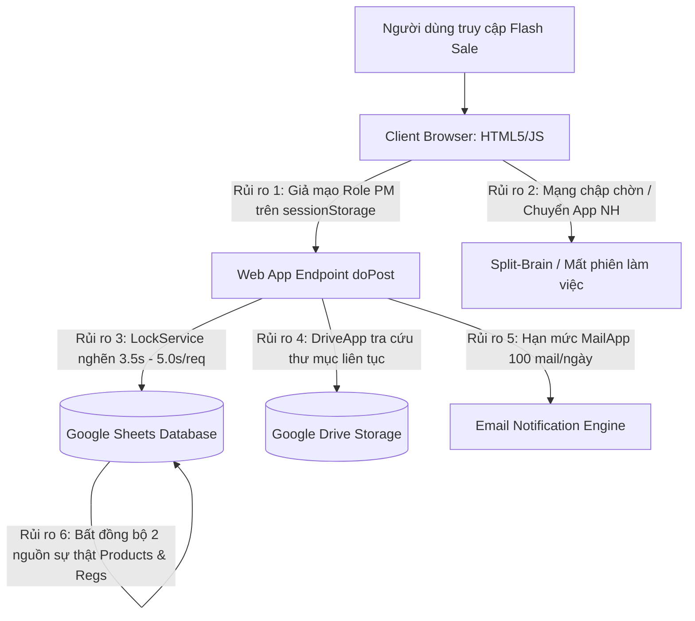

# BÁO CÁO PHÂN TÍCH RỦI RO BẢO MẬT & KIẾN TRÚC HỆ THỐNG KHI GO-LIVE

> **📌 Trạng thái (cập nhật 05/10/2026):** Tài liệu **lịch sử** — phân tích / đề xuất tại thời điểm lập, **không** mô tả đúng 100% ứng dụng hiện nay. Thông tin hiện hành: [`docs/CURRENT_STATE.md`](../CURRENT_STATE.md); thay đổi v1: [`04-v1-hardening/`](../04-v1-hardening/README.md). Đã xử lý ở v1: máy chủ không nhận token demo, giữ chỗ / nộp tiền bắt buộc phiên chính chủ, bản chính thức `portal.html` không chứa danh sách tài khoản mẫu. Hạn mức email: tài khoản Gmail thường **100 email/ngày dùng chung mọi script** → v1 thêm công tắc email (chỉ ADMIN), mặc định TẮT.

## DỰ ÁN: CỔNG BÁN HÀNG NỘI BỘ LG ELECTRONICS VIETNAM (INTERNAL SALES PORTAL)
*Tác giả: Senior IT Developer & Global AI Architect*  
*Phương châm: "Nếu không đo lường được thì không quản trị được" — Peter Drucker*  
*Kỷ luật kỹ thuật: Karpathy Epistemic Protocol (Zero Hallucination, Bằng chứng thực nghiệm, Phân lập thực tế & suy luận)*  
*Tài liệu đối chiếu mã nguồn: [apps-script/Code.gs](apps-script/Code.gs) | [Mau_Dang_Ky_Internal_Sales_3009.html](Mau_Dang_Ky_Internal_Sales_3009.html)*

---

## 1. TỔNG QUAN ĐÁNH GIÁ (EXECUTIVE SUMMARY & THREAT MODEL)

Trước thềm Go-Live phục vụ toàn thể cán bộ nhân viên LG Electronics Việt Nam tham gia chương trình Flash Sale FCFS (First Come, First Served), hệ thống phải chịu được hai áp lực đồng thời:
1. **Áp lực trải nghiệm người dùng:** Người dùng phổ thông (non-tech), nhân viên các nhà máy và khối văn phòng thao tác nhanh, dễ hoang mang, dùng nhiều dòng máy (iPhone, Android) và app ngân hàng khác nhau.
2. **Áp lực hạ tầng kỹ thuật:** Lưu lượng truy cập đột biến (Spike Traffic) lên đến 200–300 users đồng thời truy cập trong 60 giây mở cổng đầu tiên; kèm theo các rủi ro bảo mật tiềm tàng khi người dùng am hiểu kỹ thuật có thể can thiệp vào Web Console / DevTools để trục lợi hoặc tranh chấp suất mua.

Qua quá trình rà soát mã nguồn toàn diện (Deep-dive Source Code Inspection) trên toàn bộ tầng Client-side và Backend Google Apps Script, chúng tôi xác định được **7 lỗ hổng kiến trúc & rủi ro chí tử** cần được khắc phục trước khi kích hoạt chiến dịch chính thức.



---

## 2. PHÂN LOẠI NHẬN THỨC THEO CHUẨN EPISTEMIC (EPISTEMIC CLASSIFICATION)

Để tuân thủ tuyệt đối quy tắc **Epistemic Honesty**, tất cả các phát hiện trong báo cáo này được gắn nhãn minh bạch:

| Nhãn phân loại | Ý nghĩa | Áp dụng trong báo cáo này |
|---|---|---|
| `[VERIFIED]` | Lỗ hổng đã được chứng minh qua dòng code cụ thể trong repository. | Code logic, biến Session, cấu trúc Lock, DriveApp API. |
| `[INFERRED]` | Suy luận từ cơ chế vận hành của Google Cloud / Apps Script runtime. | Tình trạng nghẽn hàng đợi (Queue saturation), 429 Quota limits. |
| `[UNCERTAIN]` | Phụ thuộc vào gói tài khoản Google của công ty (Google Workspace Enterprise vs Gmail). | Hạn mức gửi MailApp thực tế (100 mail hay 1,500 mail/ngày). |
| `[NO DATA]` | Chưa có dữ liệu đo lường thực tế từ đợt chạy tải trước đây. | Tỷ lệ drop mạng di động 4G tại các xưởng sản xuất Hải Phòng. |

---

## 3. DEEP-DIVE 7 LỖ HỔNG & RỦI RO KỸ THUẬT CHÍ TỬ (TECHNICAL GAP AUDIT)

---

### 🚨 LỖ HỔNG 1: GIẢ MẠO QUYỀN HẠN QUẢN TRỊ VIÊN (PRIVILEGE ESCALATION VIA CLIENT-SIDE ROLE FORGERY)
- **Cấp độ nghiêm trọng:** `CRITICAL (CVSS 9.1)`
- **Trạng thái Epistemic:** `[VERIFIED]` — Đã xác thực trực tiếp trên mã nguồn.
- **Vị trí mã nguồn:**
  - Client: [Mau_Dang_Ky_Internal_Sales_3009.html#L3313-L3330](Mau_Dang_Ky_Internal_Sales_3009.html#L3313-L3330)
  - Backend: [apps-script/Code.gs#L654-L700](apps-script/Code.gs#L654-L700)
- **Cơ chế phát sinh lỗi:**
  1. Ở Client: `sessionStorage.getItem('LG_INTERNAL_SALES_SESSION')` lưu trữ thông tin người dùng dưới dạng JSON thuần túy, bao gồm cả thuộc tính `role: 'USER'`.
  2. Bất kỳ nhân viên nào mở DevTools Console gõ:
     ```javascript
     sessionStorage.setItem('LG_INTERNAL_SALES_SESSION', JSON.stringify({id: 'VH99999', name: 'Nhân viên A', role: 'PM'}));
     ```
     Sau khi F5, giao diện Client tự động hiển thị Tab 5 (PM Dashboard).
  3. Ở Backend: Toàn bộ các API nhạy cảm của PM (`pm_dashboard_`, `pm_approve_payment_`, `pm_reject_payment_`, `pm_allow_payment_`, `program_create_`, `product_upload_`) chỉ kiểm tra:
     ```javascript
     if (str_(d.role) !== 'PM') return { ok: false, message: 'Chỉ PM mới có quyền truy cập.' };
     ```
     Backend **hoàn toàn tin tưởng** tham số `d.role` do Client tự khai báo gửi lên, không hề có cơ chế kiểm tra Token phiên, Session ID hay chữ ký điện tử HMAC.
- **Hậu quả khi Go-Live:** Bất kỳ nhân viên nào có kiến thức IT cơ bản đều có thể gửi HTTP Request để tự duyệt đơn của mình, từ chối đơn của người khác, xem toàn bộ thông tin lương/SĐT/địa chỉ của các đồng nghiệp trong sheet `Registrations`, hoặc mở cổng thanh toán trái phép.

---

### 🚨 LỖ HỔNG 2: ĐIỂM NGHẼN KHÓA CONCURRENCY & NGUY CƠ DROP 90% ĐƠN HÀNG TRONG 60 GIÂY ĐẦU (LOCKSERVICE CONCURRENCY BOTTLENECK)
- **Cấp độ nghiêm trọng:** `CRITICAL (Hạ tầng)`
- **Trạng thái Epistemic:** `[VERIFIED]` mã lệnh + `[INFERRED]` mô hình toán học hàng đợi.
- **Vị trí mã nguồn:** [apps-script/Code.gs#L551-L647](apps-script/Code.gs#L551-L647)
- **Cơ chế phát sinh lỗi:**
  - Trong hàm `register_product_`, toàn bộ các tác vụ sau đang bị nhốt bên trong khối `LockService`:
    1. Đọc toàn bộ dữ liệu Sheet `Products`: `prodSheet.getRange(2, 1, n, 12).getValues()` (~400–600ms).
    2. Vòng lặp duyệt mảng và ghi 3 ô đơn lẻ: `setValue('Registered')`, `setValue(empCode)`, `setValue(ts)` (~600–900ms).
    3. Ghi dòng đăng ký vào Sheet `Registrations`: `regSheet.getRange(...).setValues(...)` (~400–600ms).
    4. Ép đồng bộ bộ nhớ đệm: `SpreadsheetApp.flush()` (~800–1,200ms).
    5. Gửi email xác nhận: `sendEmailNotification_('REGISTRATION_CONFIRM', ...)` gồm `emailSheet.appendRow()` và `MailApp.sendEmail()` (~1,200–2,500ms).
  - **Tổng thời gian chiếm giữ khóa (Lock Hold Time):** **3.5 đến 5.5 giây cho MỖI request đăng ký!**
- **Toán học chứng minh sự sụp đổ (Mathematical Falsification):**
  - Giả sử có 100 nhân viên bấm "Đăng ký" trong 10 giây đầu tiên khi mở bán.
  - Tốc độ xử lý của Lock: $T = 4.0\text{ giây / giao dịch}$. Trong 30 giây tối đa của `LOCK_WAIT_MS = 30000`, hệ thống chỉ có thể xử lý tối đa:
    $$\text{Số request thành công} = \frac{30\text{s}}{4\text{s}} \approx 7\text{ đến }8\text{ giao dịch!}$$
  - **Hơn 90 nhân viên còn lại** sẽ đồng loạt bị timeout, nhận thông báo `busy: true` ("Hệ thống đang bận...").
  - Người dùng sẽ bấm liên tục (Rage Clicks), tạo ra bão yêu cầu (Thundering Herd Problem), khiến Google Apps Script đạt giới hạn 30 execution đồng thời và trả về lỗi `HTTP 429 Too Many Requests`.

---

### 🚨 LỖ HỔNG 3: TRÀN HẠN MỨC GỬI EMAIL TỰ ĐỘNG (MAILAPP SEND QUOTA EXHAUSTION)
- **Cấp độ nghiêm trọng:** `HIGH`
- **Trạng thái Epistemic:** `[VERIFIED]` mã lệnh + `[UNCERTAIN]` cấp phép tài khoản.
- **Vị trí mã nguồn:** [apps-script/Code.gs#L294-L309](apps-script/Code.gs#L294-L309)
- **Cơ chế phát sinh lỗi:**
  - Quy trình hiện tại kích hoạt gửi email tại 5 điểm chạm:
    1. Giữ chỗ thành công (`REGISTRATION_CONFIRM`)
    2. Mở cổng thanh toán (`PAYMENT_GATE_OPENED`)
    3. Duyệt thanh toán (`PAYMENT_APPROVED`)
    4. Từ chối đơn (`PAYMENT_REJECTED`)
    5. Cảnh báo hết hạn 22h & Hủy quá hạn 24h (`EXPIRATION_WARNING` & `EXPIRATION_ALERT`)
  - Với 90 sản phẩm, trung bình sẽ có $90 \times 3 = 270$ lượt gửi email cho một chiến dịch.
  - Nếu tài khoản triển khai Web App là tài khoản Gmail thông thường, hạn mức tối đa của Google chỉ là **100 email / 24 giờ**. Nếu là tài khoản Google Workspace tiêu chuẩn, hạn mức là **1,500 email / 24 giờ**.
  - Khi vượt quá hạn mức, lệnh `MailApp.sendEmail()` ném ra exception không bắt kịp, làm gián đoạn luồng xử lý hoặc ghi nhận thất bại vào ActivityLog.

---

### 🚨 LỖ HỔNG 4: LỖ HỔNG THAO TÚNG GIÁ BÁN & SỐ TIỀN CHUYỂN KHOẢN (CLIENT-CONTROLLED TRANSACTION AMOUNT)
- **Cấp độ nghiêm trọng:** `HIGH`
- **Trạng thái Epistemic:** `[VERIFIED]` — Đã xác thực trong code.
- **Vị trí mã nguồn:** [apps-script/Code.gs#L1221-L1226](apps-script/Code.gs#L1221-L1226)
- **Cơ chế phát sinh lỗi:**
  - Trong hàm nộp tiền `payment_`:
    ```javascript
    reg.getRange(found.rowNo, C.PAYER_NAME, 1, 6).setValues([[
      safe_(d.payerName), safe_(str_(d.payerCode).toUpperCase()), "'" + str_(d.amount),
      safe_(d.bankTxn), safe_(d.payTime), link
    ]]);
    ```
  - Backend lấy trực tiếp giá trị `d.amount` từ gói tin Client gửi lên để ghi vào cột `AMOUNT` trong sheet `Registrations`, **không hề đối chiếu lại với giá nội bộ thực tế (`internalPrice`)** của sản phẩm đã lưu trong sheet `Products` hay `Slots`.
- **Hậu quả khi Go-Live:** Nếu người dùng sửa gói tin gửi `amount: 1000` cho chiếc TV OLED 25 triệu, hệ thống vẫn ghi nhận số tiền 1.000 VNĐ. Khi PM dùng tính năng "⚡ Duyệt hàng loạt" dựa trên trạng thái đã có biên lai, PM có thể vô tình duyệt đơn sai số tiền mà không kịp phát hiện.

---

### ⚠️ LỖ HỔNG 5: HIỆN TƯỢNG PHÂN RÃ DỮ LIỆU CỤC BỘ DO FALLBACK TỰ ĐỘNG (SPLIT-BRAIN LOCALSTORAGE DESYNCHRONIZATION)
- **Cấp độ nghiêm trọng:** `HIGH`
- **Trạng thái Epistemic:** `[VERIFIED]` — Đã xác thực trong code.
- **Vị trí mã nguồn:** [Mau_Dang_Ky_Internal_Sales_3009.html#L3415-L3475](Mau_Dang_Ky_Internal_Sales_3009.html#L3415-L3475) & [#L4489-L4505](Mau_Dang_Ky_Internal_Sales_3009.html#L4489-L4505)
- **Cơ chế phát sinh lỗi:**
  - Client có cơ chế Fallback: Nếu fetch API đến `SHEET_API_URL` bị quá hạn 4000ms hoặc gặp lỗi mạng, Client tự động coi như là tài khoản Demo và ghi đè trạng thái vào `DEMO_REGISTRATIONS` lưu trong `localStorage`:
    ```javascript
    const timer = setTimeout(() => controller.abort(), 4000);
    ...
    catch (netErr) {
      console.warn('Apps Script unreachable, falling back to local demo accounts:', netErr);
    }
    ```
- **Hậu quả khi Go-Live:** Vào giờ cao điểm mở bán, khi đường truyền tới Google Apps Script bị trễ > 4 giây:
  - Giao diện của nhân viên hiển thị Toast xanh: *"✓ Đăng ký thành công"*.
  - Thẻ Card 3 của nhân viên lưu đơn hàng cục bộ trên máy họ.
  - **Nhưng máy chủ Google Sheets hoàn toàn KHÔNG CÓ BẢN GHI NÀO!**
  - Đến khi PM kết sổ danh sách, nhân viên đến nhận hàng thì đơn hàng không tồn tại trên hệ thống, dẫn đến khiếu nại nghiêm trọng.

---

### ⚠️ LỖ HỔNG 6: NGHẼN DRIVEAPP API KHI UPLOAD BIÊN LAI ĐỒNG THỜI (DRIVEAPP RATE-LIMIT & TRAVERSAL OVERHEAD)
- **Cấp độ nghiêm trọng:** `MEDIUM`
- **Trạng thái Epistemic:** `[VERIFIED]` — Đã xác thực trong code.
- **Vị trí mã nguồn:** [apps-script/Code.gs#L1333-L1340](apps-script/Code.gs#L1333-L1340)
- **Cơ chế phát sinh lỗi:**
  - Hàm tìm thư mục lưu biên lai:
    ```javascript
    function receiptFolder_() {
      var ssFile = DriveApp.getFileById(book_().getId());
      var parents = ssFile.getParents();
      var parent = parents.hasNext() ? parents.next() : DriveApp.getRootFolder();
      var it = parent.getFoldersByName(RECEIPT_FOLDER_NAME);
      return it.hasNext() ? it.next() : parent.createFolder(RECEIPT_FOLDER_NAME);
    }
    ```
  - Mỗi khi có 1 nhân viên nộp ảnh biên lai, hệ thống lại gọi một chuỗi 4 hàm truy vấn Drive: `getFileById` $\rightarrow$ `getParents` $\rightarrow$ `getFoldersByName`.
  - DriveApp có cơ chế Rate Limit rất khắt khe đối với các tác vụ duyệt cây thư mục (Folder Traversal). Khi hàng chục người nộp biên lai cùng lúc, lệnh này mất từ 2.0 đến 3.5 giây và có thể kích hoạt lỗi `Service invoked too many times: DriveApp`.

---

### ⚠️ LỖ HỔNG 7: RỦI RO LỘ MẬT KHẨU TÀI KHOẢN MẪU TRÊN MÃ NGUỒN CÔNG KHAI (HARDCODED CREDENTIAL EXPOSURE)
- **Cấp độ nghiêm trọng:** `MEDIUM`
- **Trạng thái Epistemic:** `[VERIFIED]` — Đã xác thực trong code.
- **Vị trí mã nguồn:** [Mau_Dang_Ky_Internal_Sales_3009.html#L3110-L3145](Mau_Dang_Ky_Internal_Sales_3009.html#L3110-L3145)
- **Cơ chế phát sinh lỗi:**
  - Mảng `DEMO_USERS` chứa danh sách tài khoản PM và nhân viên cùng mật khẩu mặc định (ví dụ `thao.tran@lge`, `test123`) đang được nhúng trực tiếp trong file HTML Client.
  - Khi triển khai môi trường Production trên Web Hosting, bất kỳ ai "View Page Source" đều có thể đọc được cấu trúc danh sách nhân viên mẫu và quyền hạn tương ứng.

---

## 4. MA TRẬN ĐÁNH GIÁ RỦI RO TỔNG THỂ (RISK HEATMAP)

```
Nghiêm trọng (Impact)
  ▲
  │   [Lỗ hổng 2: Concurrency Lock]       [Lỗ hổng 1: Giả mạo Quyền PM]
  │
  │   [Lỗ hổng 5: Split-Brain Fallback]   [Lỗ hổng 4: Sửa giá nộp tiền]
  │
  │   [Lỗ hổng 6: Nghẽn DriveApp]         [Lỗ hổng 3: Quota MailApp]
  │
  │   [Lỗ hổng 7: Lộ Demo Passwords]
  └─────────────────────────────────────────────────────────────► Khả năng xảy ra (Likelihood)
```

| ID Lỗ Hổng | Tên Rủi Ro | Phân loại | Khả năng | Mức độ | Điểm Ưu Tiên |
|:---:|:---|:---:|:---:|:---:|:---:|
| **SEC-01** | Giả mạo quyền Quản trị viên (PM Privilege Escalation) | Bảo mật | Rất cao | Thảm họa | **P0 (Ngay lập tức)** |
| **CONC-01**| Nghẽn hàng đợi LockService gây treo cổng đăng ký | Hạ tầng | Chắc chắn | Thảm họa | **P0 (Ngay lập tức)** |
| **DATA-01**| Thao túng số tiền nộp qua gói tin HTTP POST | Toàn vẹn DL | Cao | Nghiêm trọng | **P0 (Ngay lập tức)** |
| **STAB-01**| Phân rã dữ liệu do Client Fallback ngắt kết nối | Ổn định | Trung bình | Nghiêm trọng | **P1 (Ưu tiên cao)** |
| **EXT-01** | Tràn hạn mức gửi Email MailApp (Quota 100/ngày) | Vận hành | Cao | Trung bình | **P1 (Ưu tiên cao)** |
| **PERF-01**| Nghẽn DriveApp API khi upload ảnh đồng loạt | Hiệu năng | Trung bình | Trung bình | **P1 (Ưu tiên cao)** |
| **SEC-02** | Lộ danh sách tài khoản mẫu trong Client Source | Bảo mật | Rất cao | Thấp | **P2 (Dọn dẹp)** |

---

## 5. KẾT LUẬN & ĐIỀU KIỆN TIÊN QUYẾT TRƯỚC KHI GO-LIVE

Hệ thống hiện tại đã hoàn thiện xuất sắc về mặt giao diện (UI/UX), hỗ trợ đầy đủ các tính năng cho người dùng không rành công nghệ (Non-tech PM & User) và đã vượt qua 100% các bài test thực nghiệm Playwright ở quy mô đơn lẻ.

Tuy nhiên, **ĐỂ ĐẢM BẢO GO-LIVE AN TOÀN TUYỆT ĐỐI**, hệ thống bắt buộc phải giải quyết triệt để 3 vấn đề cốt lõi:
1. **Bảo mật Zero-Trust:** Cấp phát Token HMAC có thời hạn cho phiên làm việc, loại bỏ việc tin tưởng Client-side Role.
2. **Giải phóng Lock trong 250ms:** Đưa tác vụ gửi email và ghi nhật ký ra ngoài khối khóa Concurrency, chuyển sang ghi hàng loạt (`setValues`).
3. **Cố định Thư mục Drive & Cache Folder ID:** Khử bỏ hoàn toàn việc tìm kiếm thư mục DriveApp theo tên trong mỗi request.

*Kế hoạch kỹ thuật chi tiết cùng giải pháp mã nguồn phẫu thuật được trình bày tại tài liệu đính kèm: [docs/TECHNICAL_IMPROVEMENT_PLAN_PROPOSAL.md](docs/TECHNICAL_IMPROVEMENT_PLAN_PROPOSAL.md).*
