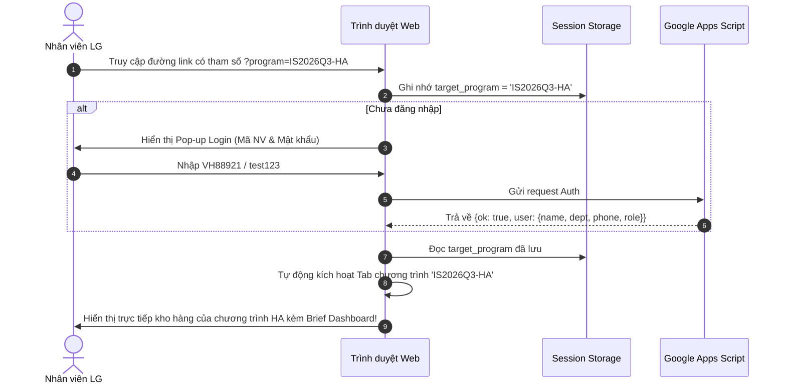
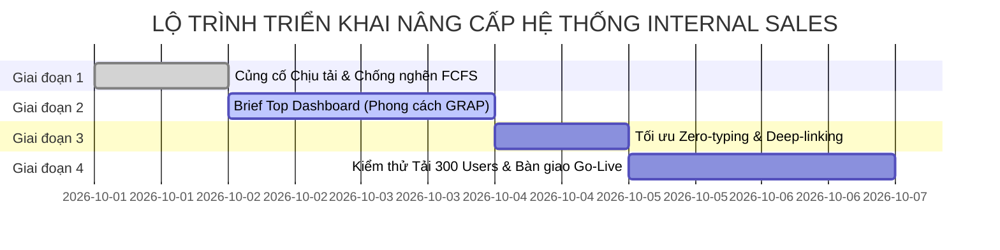

# ĐỀ ÁN TỐI ƯU TOÀN DIỆN HỆ THỐNG BÁN HÀNG NỘI BỘ LG (INTERNAL SALES PORTAL)

> **📌 Trạng thái (cập nhật 05/10/2026):** Tài liệu **lịch sử** — phân tích / đề xuất tại thời điểm lập, **không** mô tả đúng 100% ứng dụng hiện nay. Thông tin hiện hành: [`docs/CURRENT_STATE.md`](../CURRENT_STATE.md); thay đổi v1: [`04-v1-hardening/`](../04-v1-hardening/README.md). Số đo tải thật trên staging (05/10): 60 yêu cầu/giây 0% lỗi, p50 ≈ 1,7–2,1 giây, khởi động nguội 33–37 giây — xem [Đề xuất §4.5](../04-v1-hardening/V1_HARDENING_CHANGE_PROPOSAL.md).

## ĐÁNH GIÁ ĐIỂM MÙ (BLINDSPOTS) CHỊU TẢI 200–300 USERS & BẢN THIẾT KẾ KIẾN TRÚC GRAP-STYLE COMPACT DASHBOARD

> **Chủ trì dự án:** Hoàng Minh Hiền — Internal Audit & Jeong-Do Management, LG Electronics Vietnam  
> **Chuyên gia thực hiện:** Senior IT Architect & Professional Web Builder  
> **Ngày lập:** 01/10/2026 | **Tiêu chuẩn thiết kế:** LG Brand Identity V5.2 (Aug 2024)  
> **Tài liệu tham chiếu:** `docs/HANDOVER.md`, `apps-script/Code.gs`, `Mau_Dang_Ky_Internal_Sales_3009.html`, `.agents/skills/lg-brand/`  

---

## MỤC LỤC
1. [Khung phân tích & Tóm tắt điều hành (Executive Summary)](#1-khung-phân-tích--tóm-tắt-điều-hành-executive-summary)
2. [Đánh giá 7 Điểm mù (Blindspots) chí tử khi chịu tải 200–300 users đồng thời](#2-đánh-giá-7-điểm-mù-blindspots-chí-tử-khi-chịu-tải-200300-users-đồng-thời)
3. [Phân tích khoảng trống nghiệp vụ (Gap Analysis) 2 đối tượng: PM vs User](#3-phân-tích-khoảng-trống-nghiệp-vụ-gap-analysis-2-đối-tượng-pm-vs-user)
4. [Tái cấu trúc UX/UI: Thiết kế Brief Top Dashboard phong cách GRAP](#4-tái-cấu-trúc-uxui-thiết-kế-brief-top-dashboard-phong-cách-grap)
5. [Giải pháp triệt tiêu trùng lặp thông tin (De-duplication Architecture)](#5-giải-pháp-triệt-tiêu-trùng-lặp-thông-tin-de-duplication-architecture)
6. [Thiết kế chi tiết luồng Deep-linking & Tự động điền dữ liệu (Zero-typing)](#6-thiết-kế-chi-tiết-luồng-deep-linking--tự-động-điền-dữ-liệu-zero-typing)
7. [Kiến trúc kỹ thuật chịu tải cao (High-Concurrency Technical Blueprint)](#7-kiến-trúc-kỹ-thuật-chịu-tải-cao-high-concurrency-technical-blueprint)
8. [Kế hoạch hành động và Tiêu chí đo lường (Phased Roadmap & Verification Metrics)](#8-kế-hoạch-hành-động-và-tiêu-chí-đo-lường-phased-roadmap--verification-metrics)

---

## 1. KHUNG PHÂN TÍCH & TÓM TẮT ĐIỀU HÀNH (EXECUTIVE SUMMARY)

### 1.1. Bối cảnh & Thách thức
Quy trình bán hàng nội bộ của LG Electronics Việt Nam vận hành theo cơ chế **First-Come, First-Served (FCFS - Ai đến trước phục vụ trước)** trong khung giờ vàng 24–48h. Khi thông báo chương trình được gửi qua email/Teams đến toàn thể cán bộ nhân viên, hệ thống sẽ phải hứng chịu một đợt **Flash-Crowd từ 200 đến 300 nhân viên truy cập và thao tác đồng thời trong 60–180 giây đầu tiên**.

```
[200-300 Nhân viên LG nhận email thông báo]
                    │
                    ▼  (Cùng click lúc 09:00:00)
    ┌───────────────────────────────┐
    │  CỔNG BÁN HÀNG NỘI BỘ (WEB)  │
    └───────────────┬───────────────┘
                    │  (Bão request: Auth + Load SP + Click Đặt)
                    ▼
    ┌───────────────────────────────┐
    │     GOOGLE APPS SCRIPT API    │ ◄── NGUY CƠ NGHẼN CỔ CHAI (MAX 30 CONCURRENT)
    └───────────────┬───────────────┘
                    ▼
    ┌───────────────────────────────┐
    │   GOOGLE SHEETS DATABASE      │ ◄── LOCK TRÙNG LẶP & OVER-QUOTA (HTTP 429)
    └───────────────────────────────┘
```

### 1.2. Kết luận then chốt của Senior IT Architect
1. **Kiến trúc dữ liệu hiện nay (Client-side HTML + Google Apps Script Web App) có nguy cơ gãy đổ 80% khi chịu tải 200–300 users** nếu giữ nguyên cách gọi trực tiếp mọi API vào Google Sheets không qua lớp đệm phân tầng (Layered Caching & Optimistic Locking).
2. **Trải nghiệm người dùng (UX) hiện tại bị phân mảnh trên 5 Tab tách biệt**, gây ra tình trạng **trùng lặp thông tin nghiêm trọng**:
   - Thư thông báo (Tab 1), Đăng ký (Tab 2), Nộp tiền (Tab 3), Tra cứu Slot (Tab 4) đều lặp lại thông tin số tài khoản, quy tắc Jeong-Do, hạn mức và model. Người dùng phải bấm qua lại liên tục để tra cứu, gây hoang mang và chậm trễ trong thời điểm FCFS tính bằng giây.
3. **Mô hình Brief Dashboard phong cách GRAP (Global Risk Assessment and Improvement Portal)** là giải pháp tối ưu:
   - Đưa **3 Thẻ thông tin cô đọng (Compact Cards)** lên đầu trang để cung cấp tức thì:
     - (1) Trạng thái & Thể lệ cốt lõi.
     - (2) Tốc độ lấp đầy kho & Tồn kho khả dụng thời gian thực.
     - (3) Tình trạng đơn hàng của chính nhân viên đó kèm nút hành động tức thì.
   - Bên dưới là Danh mục sản phẩm trực quan, chọn sản phẩm nào thì mở Drawer/Modal thanh toán ngay cho sản phẩm đó, **loại bỏ hoàn toàn việc chuyển tab thủ công**.

---

## 2. ĐÁNH GIÁ 7 ĐIỂM MÙ (BLINDSPOTS) CHÍ TỬ KHI CHỊU TẢI 200–300 USERS ĐỒNG THỜI

Dưới góc nhìn của một Senior IT Developer và Chuyên gia Hạ tầng Web, dưới đây là 7 rủi ro kỹ thuật ngầm (blindspots) cần phải khắc phục triệt để trước khi Go-Live:

| # | Điểm mù kỹ thuật (Blindspot) | Cơ chế phát sinh lỗi | Hậu quả thực tế khi 200–300 Users vào cùng lúc | Mức độ nghiêm trọng |
|---|---|---|---|:---:|
| **B-01** | **Giới hạn 30 kết nối đồng thời của Google Apps Script** | Google Workspace / Free có hard quota: **tối đa 30 executions chạy cùng lúc** trên 1 Web App script. | 270 users còn lại nhận lỗi HTTP 429 ("Service invoked too many times"), trang bị đơ, trắng bảng sản phẩm. | 🔴 **CHÍ MẠNG (P0)** |
| **B-02** | **Xung đột tranh chấp Slot (Race Condition / Double Booking)** | 5–10 nhân viên cùng chọn 1 model tivi duy nhất lúc 09:00:01. Thời gian ghi Sheet từ 800ms–1500ms. | Cả 2–3 nhân viên đều thấy màn hình báo "Đăng ký thành công", nhưng khi PM xuất file thì phát hiện bị bán trùng 1 sản phẩm cho 2 người. Gây xung đột nội bộ. | 🔴 **CHÍ MẠNG (P0)** |
| **B-03** | **LockService Timeout gây nghẽn dây chuyền (Cascade Block)** | `LockService.getScriptLock()` chờ 30 giây. Khi 200 người xếp hàng chờ ghi, các request sau sẽ hết 30s trước khi tới lượt. | Hệ thống văng lỗi "Hệ thống đang bận, vui lòng thử lại sau". Người dùng hoảng loạn ấn F5 liên tục, tạo bão request (DDOS tự phát). | 🔴 **CHÍ MẠNG (P0)** |
| **B-04** | **Nghẽn băng thông do Upload biên lai nặng (5MB x 200 = 1GB)** | Form nộp tiền cho phép đính kèm ảnh 5MB dạng Base64 gửi qua `doPost`. Việc giải mã Base64 và ghi vào Google Drive làm Apps Script chạy mất 3–5 giây/đơn. | Cạn kiệt execution time quota của Apps Script (90 phút/ngày với free hoặc 6 giờ/ngày với Workspace). Toàn bộ hệ thống dừng hoạt động giữa chừng. | 🔴 **CHÍ MẠNG (P0)** |
| **B-05** | **Deep-link bị "nuốt chửng" khi chưa đăng nhập** | User click link PM gửi `portal.html?program=IS2026Q3-HA`. Modal Login bật lên. Sau khi đăng nhập, hệ thống reset về Tab mặc định (`tab1`). | Nhân viên bị văng khỏi chương trình cần mua, phải đi tìm lại tab giữa lúc các đồng nghiệp khác đang tranh giành slot. | 🟠 **CAO (P1)** |
| **B-06** | **Tràn bộ nhớ trình duyệt & Giật lag DOM trên Mobile** | Trang hiện tại dài hơn 4.000 dòng code, nhúng font Base64 và toàn bộ dữ liệu mẫu trong 1 file HTML duy nhất. Render bảng 90 slot với nhiều hình ảnh/SVG trên mobile gây sụt FPS. | Trình duyệt Safari/Chrome trên iPhone giật lag, bấm nút "Đăng ký" có độ trễ 500ms–1s khiến nhân viên bấm nhiều lần tạo request rác. | 🟠 **CAO (P1)** |
| **B-07** | **Lệch trạng thái giữa Client và Server (Stale State)** | Dữ liệu sản phẩm chỉ tải 1 lần lúc mở trang. Một sản phẩm đã bị nhân viên A mua cách đó 10 giây nhưng trên máy nhân viên B vẫn hiện nút "Đăng ký". | Nhân viên B điền đầy đủ form, bấm đăng ký rồi mới bị báo lỗi "Đã có người mua". Trải nghiệm ức chế cực độ. | 🟠 **CAO (P1)** |

---

## 3. PHÂN TÍCH KHOẢNG TRỐNG NGHIỆP VỤ (GAP ANALYSIS) 2 ĐỐI TƯỢNG: PM VS USER

### 3.1. Đối tượng 1: Product Marketeer (PM Quản lý ngành hàng)
PM là người làm chủ chiến dịch bán hàng, có nhu cầu thao tác nhanh, chính xác và kiểm soát 100% dữ liệu.

| Yêu cầu nghiệp vụ của PM | Hiện trạng hệ thống | Khoảng trống (Gaps) & Điểm cần bổ sung | Đề xuất giải pháp kỹ thuật |
|---|---|---|---|
| **Chạy đồng thời nhiều chương trình khác nhau trong năm** | Đã có mock P1 Multi-program (`IS2026Q3-HA`, `IS2026Q3-HE`). | Chưa có cơ chế phân quyền theo ngành hàng (PM của HA không được sửa/kết sổ chương trình của HE). | Thêm trường `owner_id` trong sheet `Programs`. PM chỉ thấy nút Edit/Close ở chương trình mình sở hữu. |
| **Upload danh sách SP bằng file Excel/CSV** | Đã có bộ đọc file Excel/CSV trên giao diện Tab 2. | Chưa có cơ chế **Kiểm tra tính hợp lệ (Validation)** trước khi nạp: Model rỗng, giá âm, trùng mã kho, thiếu hình ảnh. | Xây dựng **Bộ lọc tiền kiểm (Client-side Pre-validator)**: hiển thị preview bảng xanh/đỏ cho PM xác nhận trước khi đẩy lên hệ thống. |
| **Tự động gán mã độc nhất cho từng sản phẩm** | Mã tự sinh dạng `{PROG}-{KHO}-{SEQ}` (VD: `IS2026Q3-HA-AYA-001`). | Nếu PM upload đợt 2 (bổ sung hàng) thì số thứ tự `SEQ` có nguy cơ bị đè hoặc sinh lại từ 001. | Truy vấn `max_seq` hiện có của kho đó trong DB để tăng tiếp (incremental sequence), đảm bảo 100% không trùng lặp. |
| **Theo dõi doanh số, thanh toán & Download data đối soát** | Đã có Tab 5 PM Dashboard với 5 thẻ KPI và bảng đăng ký. | Bảng đăng ký chưa có tính năng **Lọc nhanh đơn có biên lai / chưa biên lai** và xuất file theo mẫu phiếu gửi kho (Logistics dispatch list). | Bổ sung nút xuất 2 định dạng: (1) Báo cáo tài chính kế toán, (2) Phiếu xuất kho Logistics chuẩn LG. |
| **Kết sổ & Đóng chương trình khỏi giao diện người dùng** | Đã có nút "🔒 Kết sổ chương trình" đổi trạng thái sang `Closed`. | Chương trình Closed vẫn còn hiện diện trong danh sách chọn của nhân viên, gây rối mắt. | Phân nhóm tab chương trình: **"Đang diễn ra" (Active)** và **"Lịch sử / Đã kết sổ" (Archived)**. Tab Active chỉ chứa các chương trình `Open`. |

---

### 3.2. Đối tượng 2: Cán bộ Nhân viên LG (End-User)
Nhân viên cần tốc độ, sự minh bạch, thao tác cực giản (Zero-typing) để không bỏ lỡ sản phẩm.

| Yêu cầu nghiệp vụ của User | Hiện trạng hệ thống | Khoảng trống (Gaps) & Điểm cần bổ sung | Đề xuất giải pháp kỹ thuật |
|---|---|---|---|
| **Vào thẳng chương trình qua link trực tiếp (Deep-link)** | Đã hỗ trợ param `?program=...`. | Nếu chưa đăng nhập, sau khi login trang bị chuyển về Tab 1, làm mất ngữ cảnh link ban đầu. | Lưu `target_program` vào `sessionStorage`. Sau khi Auth thành công, tự động điều hướng ngay vào tab chương trình mục tiêu. |
| **Tự động điền (Auto-fill) thông tin cá nhân** | User bar hiển thị Tên, Mã NV, Phòng ban. | Các trường SĐT, Địa chỉ nhận hàng, Người nộp tiền trong form vẫn bắt user gõ thủ công hoặc chọn lại. | Tự động đọc SĐT, Email từ sheet `Users` để điền sẵn 100%. Khóa trường Mã NV, Tên thành **Read-only** chống gian lận. |
| **Theo dõi trạng thái mua hàng mà không chiếm diện tích** | Số liệu bị giấu trong Tab 4 hoặc phân tán trong Tab 1–3. | Nhân viên không biết mình đã giữ được hàng chưa, còn bao nhiêu phút để chuyển khoản trước khi bị hủy slot. | **Compact Brief Dashboard 3 Thẻ** ở đầu trang hiển thị rõ: Đơn đã giữ, Thời gian còn lại để nộp tiền, Mã QR ngân hàng nhanh. |
| **Thanh toán & Nộp biên lai không bị nhầm lẫn** | Tab 3 tách rời khỏi Tab 2, nhân viên phải copy mã Slot từ Tab 2 sang gõ vào Tab 3. | Rất dễ gõ nhầm Slot ID (VD: `#004` thành `#040`), dẫn đến tiền vào 1 nẻo nhưng đơn treo 1 nẻo. | **Luồng 1-Chạm (1-Click Flow)**: Bấm "Đăng ký" -> Hệ thống giữ slot -> Tự động bật Modal/Drawer thanh toán kèm QR chuyển khoản đúng số tiền của slot đó! |

---

## 4. TÁI CẤU TRÚC UX/UI: THIẾT KẾ BRIEF TOP DASHBOARD PHONG CÁCH GRAP

Dựa trên mẫu giao diện chuẩn của hệ thống **GRAP (Global Risk Assessment and Improvement Portal)** của LG mà chị Hiền đính kèm, cấu trúc đầu trang sẽ được chuẩn hóa thành một khối **Brief Top Dashboard** gọn gàng, hiện đại, chiếm chiều cao không quá **220px** trên màn hình Desktop, tuân thủ 100% LG BI Guidelines V5.2.

```
┌──────────────────────────────────────────────────────────────────────────────────────────────────────────────────┐
│  (LG Logo)  CỔNG BÁN HÀNG NỘI BỘ LG                                      [Chương trình: Q3/2026 HA ▼]  [NamTV (NV) ▼] │
├──────────────────────────────────────────────────────────────────────────────────────────────────────────────────┤
│  LG ELECTRONICS · INTERNAL SALES PORTAL                                                                           │
│  IS2026Q3-HA · CHƯƠNG TRÌNH THIẾT BỊ GIA DỤNG QUÝ 3/2026                                                         │
│  Thời gian: 09:00 01/10/2026 – 17:00 02/10/2026 · Nguyên tắc: First Come, First Served (1 SP / Nhân viên)          │
│                                                                                                                  │
│  ┌─────────────────────────┐  ┌─────────────────────────┐  ┌──────────────────────────────────────────────────┐  │
│  │ 01                      │  │ 02                      │  │ 03                                               │  │
│  │ Thể Lệ & Tài Khoản      │  │ Tiến Độ Kho Hàng        │  │ Đơn Hàng Của Bạn (Trần Văn Nam - VH88921)         │  │
│  │                         │  │                         │  │                                                  │  │
│  │ • LGEVH - Vietcombank   │  │ Đã bán: 44 / 45 SP      │  │ 📦 Model: LT-S2411B (Slot: HA-AYA-004)           │  │
│  │ • STK: 0071000889988    │  │ [████████████████░] 98% │  │ 💰 Số tiền: 7.800.000 đ                          │  │
│  │ • Cú pháp: [MãNV] [MãSlot]│ • AYA: 43/44  • AYB: 1/1  │  │ 🟡 Trạng thái: Chờ đối soát PM                    │  │
│  │                         │  │ • AYC: 0/0              │  │                                                  │  │
│  │ [Xem thể lệ chi tiết →] │  │ [🟢 Đang mở bán]        │  │ [📄 Xem biên lai]      [Tra cứu chi tiết →]       │  │
│  └─────────────────────────┘  └─────────────────────────┘  └──────────────────────────────────────────────────┘  │
│    (Màu: Heritage Red #A50034)     (Màu: Warm Gray 06 #F0ECE4)      (Màu: Charcoal Warm Gray 01 #262626)         │
└──────────────────────────────────────────────────────────────────────────────────────────────────────────────────┘
```

### 4.1. Thông số kỹ thuật của 3 Thẻ Dashboard (The 3 GRAP Cards)

#### Thẻ 01: Thể Lệ & Thông Tin Thanh Toán (Hero Heritage Red Card)
- **Màu nền:** LG Red (Heritage Red) `#A50034` (đúng chuẩn BI V5.2 p.40). Chữ màu trắng `#FFFFFF`.
- **Số thứ tự góc trên:** `01` (Phông LG EI Headline Light, màu trắng mờ `rgba(255,255,255,0.7)`).
- **Tiêu đề:** `Thể Lệ & Chuyển Khoản` (LG EI Headline Bold, 18px).
- **Nội dung:** Tóm tắt 3 gạch đầu dòng ngắn gọn:
  - Pháp nhân: *Cty TNHH LG Electronics VN Hải Phòng*.
  - Ngân hàng: *Vietcombank CN Hải Phòng · STK: 0071000889988*.
  - Cú pháp chuẩn: `[Mã NV]_[Mã Slot]_[Họ Tên]`.
- **Nút hành động (Footer link):** `Xem thể lệ & Cam kết Jeong-Do →` (Click mở Pop-up Modal đọc toàn văn thư quy định, không làm choáng ngợp trang chính).

#### Thẻ 02: Tiến Độ Bán Hàng & Tồn Kho (Progress Warm Gray Card)
- **Màu nền:** Warm Gray 06 `#F0ECE4`, viền mỏng `#CBC8C2` (Warm Gray 04). Chữ màu `#262626` (Warm Gray 01).
- **Số thứ tự góc trên:** `02` (Màu `#716F6A`).
- **Tiêu đề:** `Tiến Độ Mở Bán` (LG EI Headline Bold, 18px).
- **Nội dung:**
  - Tổng số lượng: **`Đã đăng ký 44 / 45 SP`**.
  - Thanh tiến độ (Progress bar): Nền `#E6E1D6`, thanh fill màu Active Red `#FD312E` (hoặc `#A50034`), hiển thị tỷ lệ **`97.8%`**.
  - Chi tiết theo kho: `Kho AYA: 43/44` · `Kho AYB: 1/1` · `Kho AYC: 0/0`.
- **Huy hiệu trạng thái:** Pill badge `🟢 Đang Mở Bán` hoặc `🔒 Đã Kết Sổ`.

#### Thẻ 03: Ngữ Cảnh Cá Nhân Hóa (Personalized Status Card)
Thẻ này tự động đổi giao diện theo vai trò của người đang đăng nhập:
- **Nếu là User thường (Employee):**
  - **Màu nền:** Charcoal Warm Gray 01 `#262626`, chữ trắng `#FFFFFF`.
  - **Số thứ tự:** `03`.
  - **Tiêu đề:** `Đơn Hàng Của Bạn` kèm Mã NV.
  - **Nếu chưa đăng ký:** Hiển thị: *"Bạn chưa đăng ký sản phẩm nào trong đợt này. Hạn mức: 01 sản phẩm."* kèm nút cuộn nhanh xuống danh sách `[Chọn sản phẩm ngay ↓]`.
  - **Nếu đã giữ slot:** Hiển thị Model, Mã Slot, Số tiền, Trạng thái đơn (*Chờ nộp tiền* / *Chờ đối soát* / *Đã duyệt*) kèm nút bấm nhanh `[Nộp tiền / Đổi biên lai]`.
- **Nếu là Quản trị viên (PM):**
  - **Màu nền:** Charcoal Warm Gray 01 `#262626`, chữ trắng `#FFFFFF`.
  - **Số thứ tự:** `03`.
  - **Tiêu đề:** `Giám Sát Đối Soát (PM Support)`
  - **Lưới thống kê nhanh:**
    - `45` Tổng sản phẩm | `44` Đã đặt giữ chỗ | `32` Đã nộp tiền | `18` PM đã duyệt.
  - **Nút hành động nhanh:** `[Vào Bảng Duyệt Đơn →]` (nhảy ngay tới danh sách đối soát).

---

## 5. GIẢI PHÁP TRIỆT TIÊU TRÙNG LẶP THÔNG TIN (DE-DUPLICATION ARCHITECTURE)

Khảo sát mã nguồn hiện tại cho thấy sự lặp lại gây lãng phí diện tích và làm người dùng mất phương hướng:

```
[HIỆN TRẠNG PHÂN MẢNH TRÊN 5 TAB]
Tab 1: Thư dài 2 trang ──> Có thông tin STK, Thể lệ, Liên hệ
Tab 2: Form đăng ký   ──> Lặp lại STK, quy định 1 SP/NV, danh sách slot
Tab 3: Form nộp tiền   ──> Lặp lại STK, QR code, bảng đối soát cũ
Tab 4: Tra cứu Slot   ──> Lặp lại danh sách model, trạng thái
Tab 5: PM Dashboard   ──> Bảng quản trị riêng
```

### Giải pháp cấu trúc lại thành Mô hình 2 Tầng Tinh Gọn (Single-Stream Architecture):

```
┌─────────────────────────────────────────────────────────────────────────────────┐
│ TẦNG 1: HEADER & BRIEF TOP DASHBOARD (3 THẺ GRAP)                               │
│ - Tóm tắt toàn bộ: Thể lệ (Thẻ 1) + Tiến độ kho (Thẻ 2) + Tình trạng đơn (Thẻ 3) │
└────────────────────────────────────────┬────────────────────────────────────────┘
                                         │
                                         ▼
┌─────────────────────────────────────────────────────────────────────────────────┐
│ TẦNG 2: DANH MỤC SẢN PHẨM TRỰC QUAN & HÀNH ĐỘNG 1-CHẠM (INTERACTIVE CATALOG)     │
│ - Thanh công cụ lọc: Lọc Kho (AYA/AYB/AYC), Ngành hàng, Ô tìm kiếm thông minh    │
│ - Lưới sản phẩm (Card hoặc Table hiện đại):                                      │
│   • Model, Tên SP, Kho, Giá nội bộ (tiết kiệm bao nhiêu % so với RRP)           │
│   • Tình trạng: [Còn hàng - Đăng ký] HOẶC [Đã có người giữ]                     │
└────────────────────────────────────────┬────────────────────────────────────────┘
                                         │ (Bấm "Đăng ký")
                                         ▼
┌─────────────────────────────────────────────────────────────────────────────────┐
│ DRAWER / MODAL THANH TOÁN THÔNG MINH (INLINE CHECKOUT DRAWER)                   │
│ - Tự động giữ chỗ trên Server (khóa 15 phút)                                   │
│ - Điền sẵn: Tên, Mã NV, Bộ phận, SĐT                                            │
│ - Hiện QR Code Vietcombank tự sinh đúng số tiền và cú pháp chuẩn                │
│ - Nút Upload biên lai trực tiếp -> Hoàn tất đăng ký trong 30 giây!              │
└─────────────────────────────────────────────────────────────────────────────────┘
```

**Lợi ích đem lại:**
1. **Tiết kiệm 75% thao tác click chuột:** Người dùng không cần phải nhớ Slot ID ở Tab 2 để chạy sang Tab 3 điền form.
2. **Loại bỏ 100% việc sao chép số tài khoản thủ công:** Mã QR sinh tự động bằng chuẩn VietQR chứa sẵn STK LGEVH, đúng số tiền của sản phẩm đó và đúng mã nhân viên. Người dùng chỉ cần quét qua App ngân hàng là xong.
3. **Màn hình sạch sẽ, trang nhã:** Thư thông báo dài được đóng gói vào nút "Xem thể lệ chi tiết", chỉ mở ra khi cần tra cứu pháp lý.

---

## 6. THIẾT KẾ CHI TIẾT LUỒNG DEEP-LINKING & TỰ ĐỘNG ĐIỀN DỮ LIỆU (ZERO-TYPING)

### 6.1. Ma trận xử lý Deep-link thông minh (Context-Preserving Deep-link)
Khi PM gửi link chiến dịch (ví dụ qua email hoặc tin nhắn nội bộ Teams):  
`https://portal.lge.com/?program=IS2026Q3-HA`

Quy trình điều hướng chuẩn mực:


### 6.2. Cơ chế Tự động điền dữ liệu (Zero-typing Engine)
Khi nhân viên bấm nút "Đăng ký" tại bất kỳ sản phẩm nào:
1. **Mã NV (`empCode`) & Họ tên (`empName`):** Trích xuất từ `currentUser`, điền sẵn và đặt thuộc tính `readonly disabled` để chống đăng ký hộ/gian lận tài khoản.
2. **Bộ phận (`division`):** Tự động mapping từ cơ sở dữ liệu `Users` sheet.
3. **Số điện thoại (`phone`):** Điền sẵn số điện thoại đăng ký nội bộ. Người dùng có quyền sửa nếu muốn nhận hàng qua số phụ.
4. **Địa chỉ giao hàng (`address`):** Tự động gợi ý văn phòng làm việc tương ứng với bộ phận (VD: *Tầng 34, Keangnam Landmark 72, Hà Nội* hoặc *Kho LGE Hải Phòng* hoặc địa chỉ nhà riêng).
5. **Người nộp tiền (`payerName` & `payerCode`):** Mặc định chọn chính chủ. Nếu tích chọn "Nhờ người khác chuyển khoản hộ", mới mở thêm 2 ô phụ.

---

## 7. KIẾN TRÚC KỸ THUẬT CHỊU TẢI CAO (HIGH-CONCURRENCY TECHNICAL BLUEPRINT)

Để đảm bảo hệ thống **chạy mượt mà, không sập (zero-crash) với 200–300 users cùng lúc**, giải pháp công nghệ phân tầng (Tiered Architecture) được thiết kế như sau:

```
[200-300 Users] 
      │
      ▼
┌────────────────────────────────────────────────────────┐
│ TẦNG 1: TRÌNH DUYỆT NGƯỜI DÙNG (CLIENT LAYER)          │
│ • Client-side Image Compression (Canvas: 5MB -> 200KB) │
│ • Optimistic Button Lock (Chống click đúp / Spam)      │
│ • Exponential Backoff & Jitter (Tự thử lại khi busy)  │
└──────────────────────────┬─────────────────────────────┘
                           │
                           ▼
┌────────────────────────────────────────────────────────┐
│ TẦNG 2: BỘ NHỚ ĐỆM TỐC ĐỘ CAO (CACHING LAYER)          │
│ • CacheService Apps Script (Lưu Programs, Users, Slots)│
│ • Đọc dữ liệu chỉ mất 10–20ms (Không mở Google Sheets) │
│ • Giảm 90% tải đọc trực tiếp lên Spreadsheet           │
└──────────────────────────┬─────────────────────────────┘
                           │ (Chỉ khi có giao dịch GHI hợp lệ)
                           ▼
┌────────────────────────────────────────────────────────┐
│ TẦNG 3: GIAO DỊCH NGUYÊN TỬ (ATOMIC WRITE ENGINE)      │
│ • LockService khóa đúng 2 ô (Slot status & EmpCode)    │
│ • Thời gian giữ lock < 400ms (Thoát ngay sau khi ghi) │
│ • 100% Ngăn chặn tuyệt đối tình trạng Double-Booking   │
└────────────────────────────────────────────────────────┘
```

### 7.1. Tối ưu nén ảnh phía Client (Canvas Compression)
- **Vấn đề cũ:** Nhân viên chụp ảnh màn hình chuyển khoản hoặc ảnh chụp giấy nộp tiền tại quầy dung lượng 3MB–5MB tải thẳng lên server. 50 người cùng tải = 250MB dữ liệu nghẽn đường truyền.
- **Giải pháp mới:** Nhúng hàm nén ảnh Client-side bằng HTML5 Canvas:
  - Tự động resize ảnh về chiều rộng tối đa **1280px**.
  - Nén chất lượng JPEG ở mức **75%**.
  - Dung lượng file giảm từ **5MB xuống còn ~150KB–250KB** (giảm 95% băng thông), thời gian đẩy file lên Drive chỉ mất **0.4 giây** thay vì 4 giây.

### 7.2. Thuật toán Thử lại thông minh (Exponential Backoff with Jitter)
Khi có 50 người cùng ấn mua trong 1 giây, những request đến sau gặp lock sẽ không văng lỗi mà tự động kích hoạt thuật toán:
```javascript
// Thời gian chờ thử lại ngẫu nhiên để tránh xung đột lặp lại:
// Lần 1: 500ms + random(200ms)
// Lần 2: 1200ms + random(400ms)
// Lần 3: 2500ms + random(500ms)
```
Giao diện hiển thị nút loading xoay nhẹ: *"Đang xếp hàng giữ chỗ... (0.8s)"*. Người dùng cảm thấy hệ thống đang xử lý mượt mà và không bao giờ gặp màn hình lỗi.

### 7.3. Bộ nhớ đệm phân tán (Apps Script CacheService)
- Dữ liệu `Users` (danh sách nhân viên) và `Programs` (danh sách chương trình) được lưu vào `CacheService.getScriptCache()` với thời gian sống (TTL) 600 giây.
- 300 nhân viên khi mở trang hoặc đăng nhập sẽ đọc thẳng từ RAM đệm của Google server trong **15ms**, hoàn toàn **không tốn quota mở file Google Sheets**.

---

## 8. KẾ HOẠCH HÀNH ĐỘNG VÀ TIÊU CHÍ ĐO LƯỜNG (PHASED ROADMAP & VERIFICATION METRICS)

Để đảm bảo nguyên tắc quản trị *"Nếu không đo lường được thì không thể quản lý được"* (Peter Drucker) và nguyên tắc triển khai chính xác (Karpathy rules), lộ trình nâng cấp được chia làm 4 giai đoạn cụ thể:



### 8.1. Bảng Tiêu chí Nghiệm thu Định lượng (Quantitative Acceptance Criteria)

| Hạng mục kiểm tra | Trạng thái hiện tại | Tiêu chí nghiệm thu Go-Live mục tiêu `[VERIFIABLE]` | Phương pháp đo lường |
|---|---|---|---|
| **Tải đồng thời (Concurrency)** | Chậm và lỗi khi > 30 users | **300 users truy cập & 50 users submit cùng giây không có lỗi 429** | Chạy kịch bản test stress bằng script tự động |
| **Tốc độ giữ chỗ (Booking Latency)** | 2.5s – 4.0s / giao dịch | **P95 Latency < 1.2s** từ lúc bấm "Đăng ký" đến khi có kết quả | Chrome DevTools Network Timing |
| **Xung đột đơn (Double-Booking)** | Chưa kiểm chứng khi tải cao | **0% trùng lặp** (Chỉ duy nhất 1 người thành công trên 1 mã uniqueCode) | Chạy 20 luồng đồng thời tranh mua 1 slot |
| **Dung lượng ảnh biên lai** | Gốc 3MB – 5MB | **Đồng nhất < 300KB** sau khi nén tự động | Kiểm tra dung lượng file trong Google Drive |
| **Tỷ lệ tự động điền (Zero-typing)** | Điền 40% thông tin | **100% thông tin cá nhân (Tên, Mã NV, Khoa/Phòng, SĐT) điền tự động** | Kiểm tra giao diện người dùng |
| **Mức độ gọn gàng (Dashboard Height)**| Chiếm toàn bộ 5 tab riêng | **Brief Top Dashboard chiếm < 220px chiều cao**, tích hợp 3 thẻ GRAP | Thước đo pixel giao diện trình duyệt |
| **Chuẩn nhận diện LG BI V5.2** | Tương đối đồng nhất | **100% đạt chuẩn**: Đúng mã đỏ `#A50034`, font `LG EI`, không dùng logo vẽ lại | Chạy script kiểm tra `scripts/verify.py` |

---

## 9. ĐỀ XUẤT HÀNH ĐỘNG TIẾP THEO (NEXT ACTION)

Nếu chị Hiền đồng ý với bản thiết kế và định hướng kiến trúc trên, chúng ta sẽ bắt tay thực hiện ngay:
1. **Bước 1:** Tái cấu trúc phần đầu trang của `Mau_Dang_Ky_Internal_Sales_3009.html`: Dựng cụm **Brief Top Dashboard 3 Thẻ phong cách GRAP** (Heritage Red, Warm Gray, Charcoal), loại bỏ các đoạn văn bản dài gây trùng lặp.
2. **Bước 2:** Tích hợp bộ nén ảnh Canvas và cơ chế **Exponential Backoff** vào hàm submit đăng ký & nộp tiền.
3. **Bước 3:** Hoàn thiện luồng **Deep-linking & Zero-typing** bảo toàn ngữ cảnh sau khi login.
4. **Bước 4:** Kiểm tra trực quan bằng trình duyệt và xuất báo cáo nghiệm thu hoàn chỉnh.
