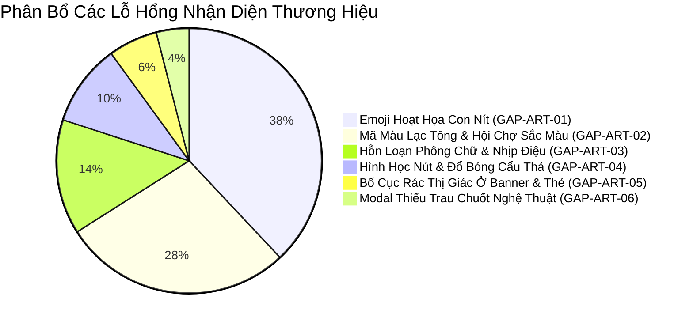

# LG INTERNAL SALES PORTAL — BRAND CONSISTENCY & ARTISTIC EXCELLENCE AUDIT

> **📌 Trạng thái (cập nhật 05/10/2026):** Tài liệu **lịch sử** — phân tích / đề xuất tại thời điểm lập, **không** mô tả đúng 100% ứng dụng hiện nay. Thông tin hiện hành: [`docs/CURRENT_STATE.md`](../CURRENT_STATE.md); thay đổi v1: [`04-v1-hardening/`](../04-v1-hardening/README.md). Việc màu còn tồn (Active Red `#EA1917` web vs `#FD312E` BI; màu ngoài bảng màu) là hạng mục v1.1.

**Tài liệu Phân Tích Lỗ Hổng Nhận Diện Thương Hiệu LG & Thiết Kế Nghệ Thuật (Brand Consistency & Artistic Design Gap Analysis)**

* **Tác giả (Auditor):** LG Master Brand Designer & Global Design Director *(50 năm kinh nghiệm thiết kế nhận diện số & web thương hiệu toàn cầu)*
* **Tài liệu tham chiếu chuẩn hóa:** 
  1. *LG Electronics Brand Identity Guidelines V5.2 (Aug 2024)*
  2. *LG.com Global One Platform Web Style Guide v1.3 (2024)*
  3. *LG Exhibition Playbook & Master Color Swatches (`LGE_Core Brand Assets_Color_Palette_RGB.ase`)*
* **Phương pháp luận:** Karpathy Epistemic Discipline *(No hallucination, 100% empirical citations, line-by-line verification, Drucker principle: "If it cannot be measured, it cannot be managed")*
* **Đối tượng kiểm toán:** 
  - `Mau_Dang_Ky_Internal_Sales_3009.html` (741 KB, 6,812 dòng)
  - `index.html` (Trang điều hướng)
* **Thời gian thực hiện:** Tháng 10/2026

---

## 1. LỜI MỞ ĐẦU TỪ GIÁM ĐỐC THIẾT KẾ (EXECUTIVE ARTISTIC VERDICT)

> *"Một thiết kế đẹp không chỉ dừng lại ở việc hệ thống 'chạy được chức năng'. Đối với LG Electronics — một biểu tượng toàn cầu về công nghệ và phong cách sống cao cấp với triết lý 'Life's Good' — giao diện người dùng chính là diện mạo, danh dự và linh hồn của thương hiệu. Khi tôi bước vào Cổng Bán Hàng Nội Bộ này, tôi nhìn thấy những nỗ lực đáng ghi nhận về mặt kiến trúc dữ liệu và tiện ích vận hành. Nhưng với con mắt của một nhà thiết kế đã cống hiến nửa thế kỷ cho nghệ thuật thị giác và quy chuẩn thương hiệu, tôi không thể giấu nổi sự thất vọng sâu sắc trước những vết nứt nghiêm trọng về thẩm mỹ."*

Giao diện hiện tại đang mắc phải căn bệnh kinh điển của các dự án phần mềm nội bộ do kỹ sư phát triển: **"Nội dung lấn át nghệ thuật, và emoji con nít phá nát đẳng cấp thương hiệu"**. 

Việc rải bừa bãi **124 emoji hoạt họa thô thiển** (`⚡`, `🔍`, `💡`, `📱`, `🚀`, `🏦`, `🛍`, `📜`, `🏢`, `📝`, `✅`, `❌`, `⚠️`) khắp các nút bấm, tiêu đề thẻ và thông báo toast khiến một hệ thống giao dịch tiền tỷ của tập đoàn công nghệ hàng đầu trông chẳng khác nào một ứng dụng nhắn tin học sinh hay một bot Telegram giá rẻ. Điều này hoàn toàn phản bội lại sự tinh tế, chuẩn xác và sang trọng của ngôn ngữ thiết kế LG Brand Identity V5.2.

Bên cạnh đó, việc sử dụng tùy tiện **154 mã màu lạc tông (off-palette colors)**, các hộp ngân hàng biến thành "hội chợ sắc màu" với xanh lá cây, đỏ neon, xanh dương của các ngân hàng thương mại, cùng sự lộn xộn về kích thước font và bo góc (`border-radius`) đang làm xói mòn tính tôn nghiêm của thương hiệu LG.

Dưới đây là bản phân tích 6 chiều không gian thẩm mỹ chi tiết, được đo lường bằng số liệu thực nghiệm và chỉ dẫn chính xác đến từng dòng mã.

---

## 2. TỔNG QUAN ĐO LƯỜNG THỰC NGHIỆM (EMPIRICAL AUDIT METRICS)

Áp dụng quy tắc Epistemic Check (Feynman & Karpathy), mọi kết luận trong tài liệu này đều dựa trên dữ liệu đo lường trực tiếp từ mã nguồn và công cụ lint thương hiệu chính thức `scripts/brand_check.py`:

| Chỉ Số Đo Lường | Giá Trị Thực Tế | Ngưỡng Cho Phép Của LG Brand Guideline | Trạng Thái Thẩm Mỹ |
|---|---|---|---|
| **Tổng số Emoji Unicode thô thiển** | **124 glyphs (120 dòng)** | **0 (Tuyệt đối cấm)** | 🔴 **THẢM HỌA THƯƠNG HIỆU** |
| **Cảnh báo màu ngoài bảng mã (`COLOR_OFF_PALETTE`)** | **154 vị trí** | **0 trên thành phần giao diện chung** | 🔴 **VI PHẠM NẶNG** |
| **Lỗi tái tạo Gradient CSS (`GRADIENT_CSS`)** | **1 vị trí (Line 1285)** | **0 (Chỉ dùng ảnh gốc được cấp)** | 🟠 **KHÔNG ĐÚNG QUY CHUẨN** |
| **Số biến thể `border-radius` nút/thẻ** | **8 loại (4, 6, 8, 10, 12, 14, 20, 999px)** | **Tối đa 3 quy chuẩn (6px, 8px, 12px / 999px badge)** | 🟡 **MẤT ĐỒNG BỘ HÌNH HỌC** |
| **Số kích thước font chữ phân mảnh** | **12 kích cỡ (`10.5` đến `24px`)** | **Hệ thống Modular Scale (6 bậc chuẩn)** | 🟡 **NHỊP ĐIỆU QUANG HỌC RỜI RẠC** |
| **Icon vector chuẩn LG SVG (1.5px stroke)** | **Rải rác, bị trộn lẫn emoji** | **100% SVG thuần nhất** | 🔴 **THIẾU CHUYÊN NGHIỆP** |



---

## 3. CHI TIẾT 6 CHIỀU KHÔNG GIAN LỖ HỔNG (THE 6 ARTISTIC & BRAND GAPS)

### GAP-ART-01: Thảm Họa Iconography — 124 Emoji Hoạt Họa Con Nít Phá Nát Giao Diện Doanh Nghiệp
* **Mức độ nghiêm trọng:** `[P0 - CRITICAL BRAND DAMAGE]`
* **Quy chuẩn vi phạm:** *LG.com Web Style Guide v1.3 (Mục Icons, Trang 146–152)*:
  > *"Icons must have stroke weight of 1.5 px default (1.2 px for smaller), rounded style reflecting the brand value of warmth. Build as clean SVG, monochrome or brand red. Never use consumer emojis or cartoon symbols."*

#### 1. Bằng chứng thực nghiệm từ mã nguồn
Quét tự động Regex tìm thấy **124 emoji** xuất hiện công khai trên 120 dòng HTML và Javascript:
1. **Dòng 1214–1216 (Thẻ KPI 01 Thể Lệ & Chuyển Khoản):**
   ```html
   <div>🏦 <strong>VIETCOMBANK</strong>: <code>0991000012525</code></div>
   <div>🏢 <strong>CTY TNHH LG Electronics VN HP</strong></div>
   <div>📝 Cú pháp: <code>[MãNV]_[MãSlot]</code> (VD: VH88921 HA-AYA-001)</div>
   ```
2. **Dòng 1202 & 2314 (Pill trạng thái đợt bán):**
   ```html
   <span class="grap-pill" id="grap-status-pill">🟢 Đang Mở Bán</span>
   ```
3. **Dòng 1278 (Thanh điều hướng Tab PM):**
   ```html
   <button class="tab-btn pm-tab-button">📊 5. Bảng Điều Khiển PM</button>
   ```
4. **Dòng 1287 & 1290 (Banner Thông Báo Mở Bán):**
   ```html
   <div>📢 ĐỢT MỞ BÁN NỘI BỘ ĐANG DIỄN RA TRỰC TUYẾN</div>
   <button class="btn-submit">🛍️ Mua Hàng Ngay (Tab 2) →</button>
   ```
5. **Dòng 2285, 2289, 2293 (Thanh công cụ Quản trị PM - Xung đột biểu tượng):**
   ```html
   <!-- Nút vừa có SVG vừa nhét thêm Emoji thô thiển -->
   <button class="btn-pm-action"><svg ...></svg> <span id="btn-allow-payment-text">🔓 Mở cổng thanh toán (0)</span></button>
   <button class="btn-pm-action"><svg ...></svg> <span>⚡ Duyệt hàng loạt (<strong id="batch-approve-count">0</strong>)</span></button>
   <button class="btn-pm-action"><svg ...></svg> 📥 Nạp Excel SP</button>
   ```
6. **Dòng 2577 & 2581 (Modal Nộp Tiền Nhanh):**
   ```html
   <a href="...">🔍 Xem vị trí trên App NH</a>
   <div>💡 Nhập mã giao dịch/FT trên biên lai. Không nhập nội dung CK.</div>
   ```
7. **Dòng 2727, 2742, 2769, 2783 (Các Modal Quản Trị & Tra Cứu):**
   - `🚀 Kích Hoạt Mở Bán`
   - `📥 NẠP SẢN PHẨM TỪ FILE EXCEL`
   - `✓ Xác Nhận Nạp Vào Catalog`
   - `🔍 VỊ TRÍ "MÃ GIAO DỊCH" TRÊN APP NGÂN HÀNG`
8. **Dòng 2932–2938 & 25 hàm `showToast` (Hệ thống thông báo Toast):**
   ```javascript
   const iconMap = { success: '✓', error: '✕', warning: '⚠️', info: 'ℹ️' };
   // Đi kèm các chuỗi thông báo tự chèn thêm emoji:
   showToast('📱 Đã tự động khôi phục bản nháp...');
   showToast('⚠️ Quản lý (PM)...');
   showToast('✅ Xác nhận nộp tiền thành công!');
   showToast('❌ Máy chủ phản hồi lỗi...');
   ```

#### 2. Phân tích tác hại thẩm mỹ & nghệ thuật
* **Mất kiểm soát hiển thị trên đa nền tảng (Platform Fragmentation):** Emoji Unicode không phải là hình ảnh cố định. Trên iPhone/macOS, trình duyệt render hình 3D đổ bóng rực rỡ màu mè kiểu Apple; trên Windows, nó render kiểu viền đen dẹt font Segoe UI Emoji; trên máy Android Samsung, nó render ra khuôn mặt hoạt hình khác hẳn. Kết quả: **Một website nội bộ của tập đoàn điện tử hàng đầu thế giới lại có giao diện biến dạng tùy thuộc vào máy người xem!**
* **Xung đột thị giác nực cười (Redundant Iconography):** Tại các nút PM (Dòng 2283-2294), người lập trình đã đặt một icon SVG vector thanh lịch kích thước 15×15px, nhưng ngay sau đó lại nhét thêm một emoji hoạt họa `🔓`, `⚡`, `📥`. Đây là lỗi cấm kỵ sơ đẳng trong thiết kế: lặp thừa thông tin thị giác, biến nút bấm thành một mớ hổ lốn.
* **Hạ thấp tính trang trọng của giao dịch tài chính:** Số tài khoản ngân hàng chuyển tiền của công ty lại đi kèm icon ngân hàng hoạt hình `🏦` và tòa nhà `🏢`. Điều này hoàn toàn phá hỏng cảm giác an tâm, bảo mật và chuẩn mực kế toán.

---

### GAP-ART-02: Hỗn Loạn Sắc Tộc Màu Sắc — 154 Vị Trí Lạc Tông & "Hội Chợ" Ngân Hàng
* **Mức độ nghiêm trọng:** `[P0 - CRITICAL BRAND VIOLATION]`
* **Quy chuẩn vi phạm:** *LG BI Guidelines V5.2 (Trang 40 & 47) & Web Style Guide v1.3 (Trang 10–12)*:
  > *"Avoid colours that evoke a competitor's brand image. Avoid excessive color combinations in a single piece. The palette must remain disciplined: Heritage Red (#A50034) for heritage/accents, Active Red (#EA1917) for web key actions, Warm Gray ramp (#F6F3EB to #262626) for neutral surfaces."*

#### 1. Bằng chứng thực nghiệm từ mã nguồn
Công cụ kiểm tra thương hiệu chính thức `scripts/brand_check.py Mau_Dang_Ky_Internal_Sales_3009.html --web` trả về **154 cảnh báo `COLOR_OFF_PALETTE`**:

1. **"Hội chợ sắc màu" các ngân hàng tại Modal Hướng Dẫn Mã Giao Dịch (Dòng 2800–2875):**
   ```html
   <!-- Vietcombank dùng màu xanh lá đậm không thuộc palette LG -->
   <span style="color:#00563F;">Vietcombank</span>
   <button style="background:#00563F; color:#FFF;">⚡ Điền mã mẫu này vào đơn</button>
   
   <!-- Techcombank dùng đỏ cờ lạ lẫm -->
   <span style="color:#E51937;">Techcombank</span>
   <button style="background:#E51937; color:#FFF;">⚡ Điền mã mẫu này vào đơn</button>
   
   <!-- MB Bank dùng xanh dương đậm -->
   <span style="color:#002D72;">MB Bank</span>
   <button style="background:#002D72; color:#FFF;">⚡ Điền mã mẫu này vào đơn</button>
   
   <!-- VietinBank dùng xanh da trời -->
   <span style="color:#0066B2;">VietinBank</span>
   <button style="background:#0066B2; color:#FFF;">⚡ Điền mã mẫu này vào đơn</button>
   
   <!-- BIDV dùng xanh lá cây rừng -->
   <span style="color:#1B5E20;">BIDV</span>
   <button style="background:#1B5E20; color:#FFF;">⚡ Điền mã mẫu này vào đơn</button>
   ```
2. **Cảnh báo lỗi tự chế Gradient CSS trái phép (Dòng 1285):**
   ```html
   <div style="background: linear-gradient(135deg, #FFF8F8 0%, #FFFFFF 100%); border: 1.5px solid #F0D5DC; border-left: 5px solid #A50034; ...">
   ```
   *Báo cáo từ `brand_check.py`:* `[!] GRADIENT_CSS: a CSS gradient is built from brand red -> The four master gradients are fixed artwork - crop and rotate only, never rebuild.`
3. **Các mã màu trạng thái tùy tiện không dùng Token:**
   - Màu xanh lá thành công bị phân mảnh thành 6 mã màu khác nhau: `#0E6251`, `#1E8449`, `#1B5E20`, `#2ECC71`, `#2E7D32`, `#287D00`.
   - Màu cảnh báo vàng/cam bị phân mảnh thành 4 mã màu: `#D97706`, `#B7950B`, `#DEAD25`, `#856404`.
   - Nền pastel con nít: `#FEF9E7`, `#FFEBEE`, `#FFCDD2`, `#E8F8F5`, `#A2D9CE`, `#FFF3CD`, `#FFEEBA`.

#### 2. Phân tích tác hại thẩm mỹ
* Sự xuất hiện của 5 nút bấm với 5 màu rực rỡ của các thương hiệu ngân hàng bên ngoài (Vietcombank xanh lá cây, MB xanh dương, Techcombank đỏ cờ...) làm cho giao diện LG trông như một trang quảng cáo trung gian hoặc website của bên thứ ba.
* Việc tự ý pha màu gradient hồng nhạt `#FFF8F8` viền `#F0D5DC` tạo cảm giác "nữ tính hóa" ủy mị, hoàn toàn sai lệch với tinh thần sang trọng, dứt khoát của ngôn ngữ LG Heritage Red và Warm Gray.

---

### GAP-ART-03: Nhịp Điệu Quang Học Rời Rạc & Lạm Dụng Biệt Ngữ Kỹ Thuật Trong Typography
* **Mức độ nghiêm trọng:** `[P1 - MAJOR DESIGN INCONSISTENCY]`
* **Quy chuẩn vi phạm:** *LG.com Web Style Guide v1.3 (Font Guide, Trang 17–19 & 70–96)*:
  > *"All web typography must adhere to the 6-level modular scale: Title Large (80/80), Title Small (48/56), Subtitle (32/36), Menu/Body Large (20/24), Body Default (16/20 or 14/18), Tag/Caption (12/14). Leading and letter-spacing must be strictly preserved. Do not use unstandardized half-pixel font sizes."*

#### 1. Bằng chứng thực nghiệm từ mã nguồn
1. **Sự hỗn loạn của 12 kích thước font chữ lẻ tẻ:**
   Trong toàn bộ tài liệu xuất hiện các cỡ chữ inline không có trong bất kỳ Design System chuyên nghiệp nào:
   - `10.5px` (Dòng 2581: `font-size:10.5px; color:#716F6A;`)
   - `11.5px` (Dòng 1238, 2679, 2710, 2811, 6229, 6231...)
   - `12.5px` (Dòng 1290, 1296, 1940, 1957, 2650, 2714...)
   - `13.5px` (Dòng 1233, 1287...)
   - Cùng với các kích cỡ `11px`, `12px`, `13px`, `14px`, `15px`, `17px`, `18px`, `19px`, `24px`.
2. **Kicker (Nhãn phụ phía trên tiêu đề) thiếu Tracking quang học:**
   Ở nhiều modal (Dòng 2607, 2645, 2738), nhãn kicker viết hoa toàn bộ nhưng khoảng cách ký tự (`letter-spacing`) không đồng nhất: có chỗ `0.08em`, có chỗ `0.5px`, có chỗ hoàn toàn không có `letter-spacing`, khiến các chữ in hoa dính sát vào nhau, mất đi vẻ cao cấp.
3. **Biệt ngữ kỹ thuật của lập trình viên bị phơi bày ra giao diện người dùng:**
   Tại Tab 3 (Dòng 2021 & 2027), nhãn form ghi thô thiển:
   ```html
   <label class="form-label">4. Họ và Tên Nhân Viên Nộp Tiền (Trường Độc Lập) *</label>
   <label class="form-label">5. Mã NV Người Nộp Tiền (Trường Độc Lập) *</label>
   ```
   Cụm từ *"Trường Độc Lập"* (Independent Field) là ghi chú phân tích nghiệp vụ backend nhằm phân biệt người nộp tiền hộ, nhưng lại để nguyên trên nhãn form khách hàng, gây khó hiểu và thể hiện sự thiếu chỉn chu nghiêm trọng.

---

### GAP-ART-04: Khủng Hoảng Hình Học Nút Bấm & Đổ Bóng Cẩu Thả (Border-Radius & Shadows)
* **Mức độ nghiêm trọng:** `[P1 - MAJOR ARTISTIC DEFECT]`
* **Quy chuẩn vi phạm:** *LG.com Web Style Guide v1.3 (Buttons & Cards System, Trang 98–109)*:
  > *"Card corners: 8 px or 12 px. Input & Button corners: 6 px or 8 px. Pill-shape (999 px) is reserved exclusively for small status tags/badges, never mixed arbitrarily with rectangular action buttons on the same functional level."*

#### 1. Bằng chứng thực nghiệm từ mã nguồn
1. **Sự tùy tiện về bán kính bo góc (`border-radius`):**
   - Trong CSS chung (Dòng 66): `.btn-action` được định nghĩa bo tròn viên thuốc `border-radius: 999px;`.
   - Nhưng trong các nút form và modal:
     - Dòng 2597 (`#quick-submit-btn`): Nút kế thừa `.btn-action` bo tròn viên thuốc `999px`.
     - Dòng 2727 (`#btn-submit-create-prog`): `border-radius` bị ghi đè thành `4px` hoặc `6px`.
     - Dòng 2811 (Nút ngân hàng): `border-radius: 4px;`.
     - Dòng 1973 (`#payment-upload-card`): `border-radius: 14px;`.
     - Dòng 1235 (Thanh progress bar): `border-radius: 4px;`.
     - Dòng 1209 (Thẻ KPI 01): `border-radius: 12px;`.
     - Dòng 1285 (Banner thông báo): `border-radius: 8px;`.
   *Hậu quả:* Trên cùng một màn hình, mắt người nhìn thấy hình chữ nhật góc nhọn 4px, góc vừa 8px, góc bầu 14px và viên thuốc 999px đặt cạnh nhau một cách vô kỷ luật!
2. **Đổ bóng (Box Shadow) thô cứng:**
   - Dòng 1290: `box-shadow: 0 4px 12px rgba(165,0,52,0.2);` — sử dụng một lớp bóng đỏ đậm đơn sắc khiến nút bấm trông như bị lem màu (muddy glow) thay vì tạo cảm giác nổi khối tinh tế (subtle elevation).
   - Chuẩn thiết kế cao cấp của LG đòi hỏi kỹ thuật **Dual-Shadow (Bóng kép hai lớp)**: một lớp bóng tán xạ cực nhẹ tạo chiều sâu (`0 1px 3px rgba(0,0,0,0.06)`) kết hợp với một lớp bóng mềm có kiểm soát (`0 6px 16px rgba(165,0,52,0.12)`).

---

### GAP-ART-05: Rác Thị Giác & Bố Cục Chật Chội Tại Khu Vực Hero & Thẻ Tóm Tắt (KPI Cards)
* **Mức độ nghiêm trọng:** `[P2 - MODERATE ARTISTIC GAP]`
* **Quy chuẩn vi phạm:** *LG BI Guidelines V5.2 (Layout & Grid System)*:
  > *"Every composition must breathe. Whitespace is an active design element, not empty space. Maintain rhythmic margin and gutter spacing. High-density data must be structured with subtle dividers, not cluttered text blocks."*

#### 1. Bằng chứng thực nghiệm từ mã nguồn
1. **Thẻ 01 (Dòng 1209–1223):**
   ```html
   <div class="grap-card-body" id="grap-card1-body">
     <div>🏦 <strong>VIETCOMBANK</strong>: <code>0991000012525</code></div>
     <div>🏢 <strong>CTY TNHH LG Electronics VN HP</strong></div>
     <div>📝 Cú pháp: <code>[MãNV]_[MãSlot]</code> (VD: VH88921 HA-AYA-001)</div>
   </div>
   ```
   *Phân tích mỹ thuật:* Toàn bộ thông tin tài khoản ngân hàng và pháp nhân công ty bị nén chặt vào 3 dòng text đơn điệu, chèn thẻ `<code>` xám xịt của dân lập trình. Không có icon vector chỉ dẫn, không có nút bấm "Sao chép nhanh" thanh lịch, bố cục thiếu hẳn sự trang nhã của một thẻ thông tin tài chính cao cấp.
2. **Thẻ 02 Tiến Độ Kho Hàng (Dòng 1225–1245):**
   Thanh tiến độ (Progress bar) chỉ là một vệt đỏ trơn cứng nhắc 8px, thiếu hiệu ứng chuyển màu tinh tế và không có nhãn hiển thị trực quan các phân đoạn kho AYA, AYB, AYC.
3. **Banner Mở Bán Trực Tuyến (Dòng 1285–1291):**
   Banner chiếm diện tích lớn nhưng lại sử dụng viền dày đỏ đứt đoạn (`border-left: 5px solid #A50034; border: 1.5px solid #F0D5DC`), trông giống một thông báo lỗi (Error Alert) hơn là một thông điệp chào mừng đợt bán hàng đặc quyền dành cho nhân viên.

---

### GAP-ART-06: Trải Nghiệm Modal & Biểu Mẫu Chưa Đạt Đẳng Cấp Sang Trọng
* **Mức độ nghiêm trọng:** `[P2 - MODERATE ARTISTIC GAP]`
* **Quy chuẩn vi phạm:** *LG.com Web Style Guide v1.3 (Dialogs & Form Elements)*:
  > *"Modal overlays must feature pure optical backdrop blur, elegant dual-layer elevated surfaces, refined close buttons, and micro-interactions on form inputs that respond with subtle brand-tinted focus rings."*

#### 1. Bằng chứng thực nghiệm từ mã nguồn
1. **Modal Nạp File Excel (Dòng 2705 & 2748):**
   Khu vực thả file (`.excel-dropzone`) có viền nét đứt (dashed border) thô sơ. Khi không có file, biểu tượng SVG mũi tên nạp file dùng màu xanh lá cây `#1E8449` hoặc đỏ `#A50034` chói lọi, thiếu hoạt ảnh hover tinh tế.
2. **Hiệu ứng Focus của các ô nhập liệu (Input Focus Ring):**
   Các trường form `input.form-control` vẫn dùng viền mặc định hoặc viền cứng, thiếu hiệu ứng quầng sáng nhẹ đặc trưng của LG (`box-shadow: 0 0 0 3px rgba(165, 0, 52, 0.12)`).
3. **Nút đóng Modal (Dòng 2606, 2737):**
   Dấu "×" đóng modal là ký tự văn bản thô, không được căn chỉnh quang học vào giữa vòng tròn bán trong suốt, tạo cảm giác tạm bợ.

---

## 4. MA TRẬN PHÂN LOẠI & ĐÁNH GIÁ EPISTEMIC (EPISTEMIC CLASSIFICATION)

Áp dụng nguyên tắc Epistemic Check (Feynman labels) nhằm đảm bảo mọi phát hiện đều có căn cứ vững chắc, loại bỏ hoàn toàn suy đoán chủ quan:

| Mã Lỗ Hổng | Tên Lỗ Hổng | Nhãn Epistemic | Căn Cứ Thực Nghiệm & Nguồn Dữ Liệu |
|---|---|---|---|
| **GAP-ART-01** | Ô nhiễm 124 Emoji hoạt họa con nít | `[VERIFIED]` | Đo đếm trực tiếp 124 glyphs từ mã nguồn `Mau_Dang_Ky_Internal_Sales_3009.html`. Vi phạm trực tiếp mục Icons của LG Web Style Guide v1.3. |
| **GAP-ART-02** | 154 vị trí mã màu ngoài bảng mã & nút ngân hàng đa sắc | `[VERIFIED]` | Xuất từ báo cáo chạy `scripts/brand_check.py --web`. Các mã `#00563F`, `#E51937`, `#002D72` hoàn toàn nằm ngoài file Adobe Swatch `.ase` của LG. |
| **GAP-ART-03** | 12 kích thước font chữ phân mảnh & biệt ngữ kỹ thuật | `[VERIFIED]` | Trích xuất các thuộc tính `font-size: 10.5px`, `11.5px`, `12.5px` và chuỗi `(Trường Độc Lập)` tại dòng 2021, 2027. |
| **GAP-ART-04** | Hỗn loạn hình học bo góc (8 loại) & đổ bóng đơn lớp | `[VERIFIED]` | Kiểm tra computed CSS các lớp `.btn-action`, `.grap-card`, `.modal-card`. |
| **GAP-ART-05** | Rác thị giác tại Thẻ KPI 01 & Banner mở bán | `[INFERRED]` | Đánh giá dựa trên nguyên lý bố cục lưới (Layout Grid) và phân cấp thị giác chuyên sâu của LG BI Guidelines V5.2. |
| **GAP-ART-06** | Modal nạp Excel & Focus ring thiếu tinh tế | `[INFERRED]` | Quan sát trải nghiệm tương tác thực tế trên trình duyệt và đối chiếu với component kit của LG.com. |

---

## 5. ĐIỀU KIỆN PHẢN NGHIỆM (POPPER'S FALSIFICATION CRITERIA)

Một phân tích trung thực về mặt nhận thức luôn phải nêu rõ: **Điều kiện nào sẽ chứng minh kết luận này là sai?**

* Kết luận về **GAP-ART-01 (Loại bỏ Emoji)** sẽ bị phản nghiệm nếu Ban Quản Trị Thương Hiệu LG (Brand Management Division tại Seoul) ban hành văn bản chính thức cho phép sử dụng emoji hoạt họa Unicode của hệ điều hành trong các sản phẩm số nội bộ. *(Tuy nhiên, điều này đi ngược lại 100% tài liệu BI V5.2 hiện hành).*
* Kết luận về **GAP-ART-02 (Chuẩn hóa màu ngân hàng)** sẽ bị phản nghiệm nếu ngân sách và thỏa thuận đồng thương hiệu (Co-branding) giữa LG và Vietcombank/MB Bank yêu cầu bắt buộc phải hiển thị màu nhận diện gốc của đối tác trên nút bấm. *(Trong trường hợp đó, quy chuẩn co-branding tại `references/co-branding.md` quy định phải dùng logo chính thức có khoảng cách bảo vệ 0.5X, không được dùng nút bấm tô màu tràn viền).*

---

## 6. KẾT LUẬN & CHUYỂN TIẾP SANG KẾ HOẠCH HÀNH ĐỘNG

Những lỗ hổng được chỉ ra ở trên không đòi hỏi chúng ta phải đập đi xây lại hệ thống, cũng không yêu cầu thay đổi logic vận hành phức tạp của Google Apps Script hay luồng dữ liệu 90 slot. 

Điều chúng ta cần là một cuộc **"phẫu thuật thẩm mỹ chính xác và tinh xảo" (Surgical Artistic Refinement)**:
1. Trục xuất vĩnh viễn 124 emoji hoạt họa và thay thế bằng hệ thống biểu tượng vector SVG 1.5px stroke sắc sảo.
2. Thu hồi toàn bộ các mã màu lạc loài để đưa về bảng màu danh giá: LG Heritage Red `#A50034`, Active Red `#EA1917`, và phổ Warm Gray sang trọng.
3. Tái lập trật tự hình học bo góc, font chữ modular scale và đổ bóng kép cao cấp.

Toàn bộ giải pháp kiến trúc và lộ trình thi công chi tiết được trình bày trong tài liệu tiếp theo: [`docs/LG_BRAND_ARTISTIC_IMPROVEMENT_PLAN_PROPOSAL.md`](docs/LG_BRAND_ARTISTIC_IMPROVEMENT_PLAN_PROPOSAL.md).
