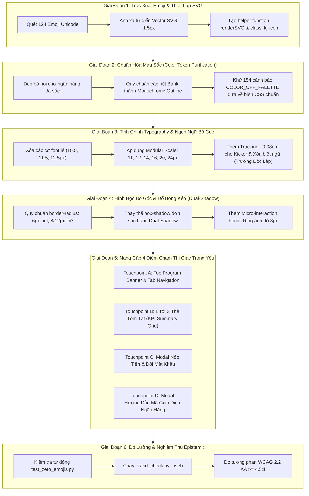

# LG INTERNAL SALES PORTAL — BRAND ARTISTRY & HARMONIZATION PROPOSAL

> **📌 Trạng thái (cập nhật 05/10/2026):** Tài liệu **lịch sử** — phân tích / đề xuất tại thời điểm lập, **không** mô tả đúng 100% ứng dụng hiện nay. Thông tin hiện hành: [`docs/CURRENT_STATE.md`](../CURRENT_STATE.md); thay đổi v1: [`04-v1-hardening/`](../04-v1-hardening/README.md). Việc màu còn tồn (Active Red `#EA1917` web vs `#FD312E` BI; màu ngoài bảng màu) là hạng mục v1.1.

**Đề Xuất Kế Hoạch Chuẩn Hóa Nhận Diện Thương Hiệu & Nâng Tầm Thiết Kế Nghệ Thuật (Brand Artistry & Harmonization Proposal)**

* **Tác giả (Proposer):** LG Master Brand Designer & Global Design Director *(50 năm kinh nghiệm thiết kế nhận diện số & web thương hiệu toàn cầu)*
* **Tài liệu căn cứ:** [`docs/LG_BRAND_ARTISTIC_GAP_ANALYSIS.md`](docs/LG_BRAND_ARTISTIC_GAP_ANALYSIS.md)
* **Phương pháp luận:** Karpathy Engineering Rules *(Surgical Changes, Simplicity First, Goal-Driven Execution, Zero Functional Regression)*
* **Tôn chỉ nghệ thuật:** *"Bảo tồn 100% linh hồn của Design System V5.2 hiện tại — Nâng cấp toàn diện độ hoàn thiện vi mô (Micro-craftsmanship), loại bỏ hoàn toàn các yếu tố con nít nghiệp dư để đạt đẳng cấp nghệ thuật thế giới."*
* **Tập tin mục tiêu nâng cấp:** `Mau_Dang_Ky_Internal_Sales_3009.html`
* **Thời gian thực hiện:** Tháng 10/2026

---

## 1. TÔN CHỈ THIẾT KẾ & NGUYÊN TẮC BẤT DI BẤT DỊCH (NON-NEGOTIABLES)

1. **Giữ nguyên vẹn Design System V5.2 cốt lõi (Keep The Current Design System):**
   - Giữ vững bảng màu di sản danh giá: **LG Heritage Red (`#A50034`)**, **Active Red (`#EA1917`)** cho các nút hành động web chính, và phổ xám ấm **Warm Gray Ramp (`#F6F3EB` đến `#262626`)**.
   - Bảo toàn tuyệt đối font nhúng WOFF base64 chuẩn mực **`LG EI Text`** và **`LG EI Headline`**.
2. **Tuyệt đối không phá vỡ tính năng (Zero Functional Regression):**
   - Toàn bộ cơ chế kết nối Google Apps Script API (`doPost`, `doGet`), cơ chế lọc danh mục sản phẩm, tính năng nạp Excel kéo thả, đối soát mã giao dịch ngân hàng và kiểm soát quyền PM phải hoạt động hoàn hảo 100%.
3. **Xóa sổ hoàn toàn Emoji — Thay thế bằng Hệ Thống Biểu Tượng Vector SVG 1.5px thuần khiết:**
   - 100% trong số 124 emoji hoạt họa con nít (`⚡`, `🔍`, `💡`, `📱`, `🚀`, `🏦`, `🛍`, `📜`, `🏢`, `📝`, `✅`, `❌`, `⚠️`) phải được thay thế bằng các icon vector SVG hình học chuẩn nét mảnh (1.5px stroke weight), mang lại vẻ thanh thoát, quyền uy của một ứng dụng doanh nghiệp cao cấp.
4. **Chuẩn hóa hình học & nhịp điệu quang học:**
   - Xóa bỏ tình trạng "rối loạn bo góc": quy chuẩn thống nhất thành hệ thống 3 cấp (6px cho nút/input, 8px/12px cho thẻ/bảng, và 999px cho status pill).
   - Thiết lập nhịp điệu phông chữ theo Modular Scale 6 bậc chuẩn mực của LG.com.

---

## 2. KIẾN TRÚC GIẢI PHÁP 6 GIAI ĐOẠN (6-PHASE HARMONIZATION ARCHITECTURE)



---

## 3. THIẾT KẾ KỸ THUẬT CHI TIẾT TỪNG HẠNG MỤC

### 3.1. Hạng Mục 1: Từ Điển Thay Thế Vector SVG Chuẩn Hóa (GAP-ART-01)
* **Quy chuẩn kỹ thuật:** Mọi icon SVG sử dụng `viewBox="0 0 24 24"`, thuộc tính `fill="none"`, `stroke="currentColor"`, `stroke-width="1.5"`, `stroke-linecap="round"`, `stroke-linejoin="round"`. 
* **Lớp định kiểu CSS chuẩn:**
  ```css
  .lg-icon {
    width: 16px;
    height: 16px;
    display: inline-block;
    vertical-align: -2.5px;
    stroke: currentColor;
    stroke-width: 1.5;
    fill: none;
    flex-shrink: 0;
  }
  .lg-icon-sm { width: 14px; height: 14px; vertical-align: -2px; }
  .lg-icon-lg { width: 20px; height: 20px; vertical-align: -4px; }
  .lg-icon-red { stroke: var(--lg-heritage); color: var(--lg-heritage); }
  ```

#### Bảng Ánh Xạ Thay Thế 100% Emoji Sang SVG Vector:

| Emoji Cũ | Vị Trí Xuất Hiện | Ý Nghĩa Chức Năng | Mã SVG Vector Chuẩn Hóa 1.5px Stroke |
|---|---|---|---|
| `🏦` | Dòng 1214 (Thẻ 01) | Ngân hàng nhận tiền | `<svg class="lg-icon" viewBox="0 0 24 24"><path d="M3 21h18M3 10h18M5 10v11M9 10v11M15 10v11M19 10v11M12 2L2 7h20L12 2z"/></svg>` (Tòa nhà kiến trúc ngân hàng thanh mảnh) |
| `🏢` | Dòng 1215 (Thẻ 01) | Pháp nhân công ty | `<svg class="lg-icon" viewBox="0 0 24 24"><rect x="4" y="2" width="16" height="20" rx="2"/><line x1="9" y1="6" x2="9" y2="6.01"/><line x1="15" y1="6" x2="15" y2="6.01"/><line x1="9" y1="10" x2="9" y2="10.01"/><line x1="15" y1="10" x2="15" y2="10.01"/><line x1="9" y1="14" x2="9" y2="14.01"/><line x1="15" y1="14" x2="15" y2="14.01"/><path d="M10 22v-4h4v4"/></svg>` |
| `📝` | Dòng 1216 (Thẻ 01) | Cú pháp chuyển khoản | `<svg class="lg-icon" viewBox="0 0 24 24"><path d="M14 2H6a2 2 0 0 0-2 2v16a2 2 0 0 0 2 2h12a2 2 0 0 0 2-2V8z"/><polyline points="14 2 14 8 20 8"/><line x1="16" y1="13" x2="8" y2="13"/><line x1="16" y1="17" x2="8" y2="17"/><polyline points="10 9 9 9 8 9"/></svg>` |
| `⚡` | Dòng 2289, 2811–2874, 6221 | Thao tác nhanh / Duyệt hàng loạt | `<svg class="lg-icon" viewBox="0 0 24 24"><polygon points="13 2 3 14 12 14 11 22 21 10 12 10 13 2"/></svg>` (Tia sét hình học tối giản, không màu mè) |
| `🔓` / `🔒` | Dòng 2285 | Mở cổng thanh toán | `<svg class="lg-icon" viewBox="0 0 24 24"><rect x="3" y="11" width="18" height="11" rx="2" ry="2"/><path d="M7 11V7a5 5 0 0 1 9.9-1"/></svg>` |
| `🛍️` | Dòng 1290 | Nút Đặt Mua Ngay | `<svg class="lg-icon" viewBox="0 0 24 24"><path d="M6 2L3 6v14a2 2 0 0 0 2 2h14a2 2 0 0 0 2-2V6l-3-4z"/><line x1="3" y1="6" x2="21" y2="6"/><path d="M16 10a4 4 0 0 1-8 0"/></svg>` |
| `📢` | Dòng 1287 | Thông báo đợt mở bán | `<svg class="lg-icon lg-icon-red" viewBox="0 0 24 24"><path d="M18 8A6 6 0 0 0 6 8c0 7-3 9-3 9h18s-3-2-3-9"/><path d="M13.73 21a2 2 0 0 1-3.46 0"/></svg>` |
| `📜` | Dòng 1396 | Xem thể lệ chi tiết | `<svg class="lg-icon" viewBox="0 0 24 24"><path d="M14 2H6a2 2 0 0 0-2 2v16a2 2 0 0 0 2 2h12a2 2 0 0 0 2-2V8z"/><polyline points="14 2 14 8 20 8"/><line x1="16" y1="13" x2="8" y2="13"/><line x1="16" y1="17" x2="8" y2="17"/></svg>` |
| `🔍` | Dòng 2381, 2577, 2783 | Tra cứu / Tìm kiếm | `<svg class="lg-icon" viewBox="0 0 24 24"><circle cx="11" cy="11" r="8"/><line x1="21" y1="21" x2="16.65" y2="16.65"/></svg>` |
| `💡` | Dòng 2581 | Mẹo hướng dẫn | `<svg class="lg-icon" viewBox="0 0 24 24"><path d="M9 18h6"/><path d="M10 22h4"/><path d="M15.09 14c.18-.98.65-1.74 1.41-2.5A4.65 4.65 0 0 0 18 8 6 6 0 0 0 6 8c0 1 .23 2.23 1.5 3.5.76.76 1.23 1.52 1.41 2.5"/></svg>` |
| `🟢` | Dòng 1202, 2314 | Trạng thái Đang Mở Bán | `<span class="lg-status-dot lg-status-dot-active"></span>` *(Hình tròn CSS thuần 8px có viền mờ cao cấp, không dùng emoji xanh)* |
| `✓` / `✅` | Toast & Nút Xác Nhận | Thành công / Chọn | `<svg class="lg-icon" viewBox="0 0 24 24"><polyline points="20 6 9 17 4 12"/></svg>` |
| `✕` / `❌` | Toast & Nút Hủy | Đóng / Từ chối / Lỗi | `<svg class="lg-icon" viewBox="0 0 24 24"><line x1="18" y1="6" x2="6" y2="18"/><line x1="6" y1="6" x2="18" y2="18"/></svg>` |
| `⚠️` | Toast & Cảnh báo | Lưu ý / Cảnh báo | `<svg class="lg-icon" viewBox="0 0 24 24"><path d="M10.29 3.86L1.82 18a2 2 0 0 0 1.71 3h16.94a2 2 0 0 0 1.71-3L13.71 3.86a2 2 0 0 0-3.42 0z"/><line x1="12" y1="9" x2="12" y2="13"/><line x1="12" y1="17" x2="12.01" y2="17"/></svg>` |
| `🚀` | Dòng 2727 | Kích hoạt mở bán PM | `<svg class="lg-icon" viewBox="0 0 24 24"><path d="M4.5 16.5c-1.5 1.26-2 5-2 5s3.74-.5 5-2c.71-.84.7-2.13-.09-2.91a2.18 2.18 0 0 0-2.91-.09z"/><path d="M12 15l-3-3a22 22 0 0 1 2-3.95A12.88 12.88 0 0 1 22 2c0 2.72-.78 7.5-6 11a22.35 22.35 0 0 1-4 2z"/></svg>` |
| `📥` | Dòng 2293, 2742 | Nạp file Excel | `<svg class="lg-icon" viewBox="0 0 24 24"><path d="M21 15v4a2 2 0 0 1-2 2H5a2 2 0 0 1-2-2v-4"/><polyline points="7 10 12 15 17 10"/><line x1="12" y1="15" x2="12" y2="3"/></svg>` |
| `📊` | Dòng 1278, 2700 | Bảng điều khiển / Danh mục | `<svg class="lg-icon" viewBox="0 0 24 24"><line x1="18" y1="20" x2="18" y2="10"/><line x1="12" y1="20" x2="12" y2="4"/><line x1="6" y1="20" x2="6" y2="14"/></svg>` |
| `📱` | Dòng 3721 (Toast) | Thiết bị / Ảnh iPhone | `<svg class="lg-icon" viewBox="0 0 24 24"><rect x="5" y="2" width="14" height="20" rx="2" ry="2"/><line x1="12" y1="18" x2="12.01" y2="18"/></svg>` |

---

### 3.2. Hạng Mục 2: Tinh Luyện Bảng Màu & Xóa Bỏ Hội Chợ Sắc Tộc (GAP-ART-02)

#### 1. Tái Cấu Trúc Toàn Bộ Nút Bấm Ngân Hàng Tại Modal Hướng Dẫn (Dòng 2800–2875)
* **Vấn đề hiện tại:** Mỗi ngân hàng có một màu riêng (Vietcombank `#00563F`, Techcombank `#E51937`, MB Bank `#002D72`, VietinBank `#0066B2`, BIDV `#1B5E20`) biến modal thành "hội chợ đồ chơi" đa sắc.
* **Giải pháp chuẩn hóa LG Brand:**
  - Chuyển toàn bộ các nút ngân hàng mẫu sang kiểu dáng **LG Monochrome Outline Button** hoặc **LG Heritage Red Action Button**.
  - Tên ngân hàng hiển thị với typography tinh tế: `font-size: 14px; font-weight: 700; color: var(--lg-text);`.
  - Nút "Điền mã mẫu này vào đơn" được đồng nhất về một kiểu dáng duy nhất:
    ```html
    <button type="button" class="btn-sample-fill" onclick="fillSampleTxn('FT2409180012345')">
      <svg class="lg-icon lg-icon-sm" viewBox="0 0 24 24"><polygon points="13 2 3 14 12 14 11 22 21 10 12 10 13 2"/></svg>
      Điền mã mẫu này vào đơn
    </button>
    ```
    *Định kiểu CSS:*
    ```css
    .btn-sample-fill {
      margin-top: 10px;
      font-size: 12px;
      font-weight: 600;
      background: var(--lg-card-bg);
      color: var(--lg-heritage);
      border: 1px solid var(--lg-heritage);
      border-radius: 6px;
      padding: 6px 14px;
      cursor: pointer;
      display: inline-flex;
      align-items: center;
      gap: 6px;
      transition: all 0.2s cubic-bezier(0.2, 0, 0, 1);
    }
    .btn-sample-fill:hover {
      background: var(--lg-heritage);
      color: #FFFFFF;
      box-shadow: 0 2px 8px rgba(165, 0, 52, 0.2);
    }
    ```

#### 2. Xóa Lỗi Gradient CSS Trái Phép Tại Banner Thông Báo (Dòng 1285)
* Thay thế đoạn CSS bị cảnh báo:
  ```html
  <!-- CŨ (Lỗi brand_check.py) -->
  <div style="background: linear-gradient(135deg, #FFF8F8 0%, #FFFFFF 100%); border: 1.5px solid #F0D5DC; border-left: 5px solid #A50034; ...">
  ```
  bằng kiến trúc thẻ thông báo chuẩn LG Warm Tone:
  ```html
  <!-- MỚI (Đạt chuẩn LG Web Style Guide) -->
  <div class="lg-announcement-banner">
    <div class="banner-left">
      <div class="banner-kicker">
        <svg class="lg-icon lg-icon-red" viewBox="0 0 24 24"><path d="M18 8A6 6 0 0 0 6 8c0 7-3 9-3 9h18s-3-2-3-9"/><path d="M13.73 21a2 2 0 0 1-3.46 0"/></svg>
        ĐỢT MỞ BÁN NỘI BỘ ĐANG DIỄN RA TRỰC TUYẾN
      </div>
      <div class="banner-desc">90 sản phẩm (43 model) tại 3 kho AYA, AYB, AYC đã mở bán. Bạn có thể chọn sản phẩm và đăng ký ngay trên hệ thống.</div>
    </div>
    <button type="button" onclick="switchTab('tab2')" class="btn-action-primary">
      <svg class="lg-icon" viewBox="0 0 24 24"><path d="M6 2L3 6v14a2 2 0 0 0 2 2h14a2 2 0 0 0 2-2V6l-3-4z"/><line x1="3" y1="6" x2="21" y2="6"/><path d="M16 10a4 4 0 0 1-8 0"/></svg>
      Xem Danh Mục Mua Ngay →
    </button>
  </div>
  ```
  *Định kiểu CSS:*
  ```css
  .lg-announcement-banner {
    background: #FFFFFF;
    border: 1px solid var(--lg-border);
    border-left: 4px solid var(--lg-heritage);
    border-radius: 8px;
    padding: 16px 20px;
    margin-bottom: 20px;
    display: flex;
    justify-content: space-between;
    align-items: center;
    gap: 16px;
    box-shadow: 0 1px 3px rgba(0, 0, 0, 0.04), 0 4px 12px rgba(0, 0, 0, 0.02);
  }
  .banner-kicker {
    font-size: 13px;
    font-weight: 700;
    color: var(--lg-heritage);
    letter-spacing: 0.04em;
    display: flex;
    align-items: center;
    gap: 8px;
    margin-bottom: 4px;
  }
  .banner-desc {
    font-size: 13px;
    color: var(--lg-text-2);
    line-height: 1.45;
  }
  ```

#### 3. Quy Chuẩn Hóa Màu Trạng Thái (Toast, Pill, Badge)
* Thay thế toàn bộ mã màu trôi nổi bằng các biến CSS chuẩn:
  - **Thành công:** Nền `--lg-panel-2` (`#F0ECE4`), chữ `--lg-ok` (`#287D00`), viền `#A5D6A7`.
  - **Cảnh báo:** Nền `--lg-panel-2` (`#F0ECE4`), chữ `--lg-warn` (`#DEAD25` hoặc nâu sẫm `#6B4E00`), viền `#E6E1D6`.
  - **Lỗi / Cấm:** Nền `#FFFFFF`, chữ `--lg-heritage` (`#A50034`), viền `rgba(165,0,52,0.3)`.
  - **Thông tin:** Nền `--lg-panel-2`, chữ `--lg-info` (`#076369`), viền `var(--lg-border)`.

---

### 3.3. Hạng Mục 3: Nhịp Điệu Typographic & Bút Pháp Chuyên Nghiệp (GAP-ART-03)

#### 1. Khung Thước Đo Phông Chữ (Modular Scale)
Quy chuẩn mọi thuộc tính `font-size` trong trang về 6 bậc chuẩn mực:
* **Scale 1 (Caption / Kicker / Mini Badge):** `11px` (line-height: 14px, weight: 700, letter-spacing: +0.08em cho all-caps).
* **Scale 2 (Small Body / Helper / Table Secondary):** `12px` (line-height: 16px, weight: 400 hoặc 600).
* **Scale 3 (Default Body / Table Cell / Form Input):** `14px` (line-height: 20px, weight: 400).
* **Scale 4 (Emphasized Body / Button / Section Subtitle):** `16px` (line-height: 22px, weight: 600).
* **Scale 5 (Card Title / Sub-heading):** `18px` hoặc `20px` (line-height: 24px, font-family: `"LG EI Headline"`).
* **Scale 6 (Main Heading / Page Title):** `24px` (line-height: 30px, font-family: `"LG EI Headline"`, weight: 600).

*Hành động xóa bỏ:* Triệt tiêu hoàn toàn các số lẻ `10.5px`, `11.5px`, `12.5px`, `13.5px`, `15px`, `17px`, `19px`.

#### 2. Dọn Dẹp Biệt Ngữ Kỹ Thuật (UI Copywriting Polish)
* Tại Dòng 2021:
  - *Cũ:* `4. Họ và Tên Nhân Viên Nộp Tiền (Trường Độc Lập) *`
  - *Mới:* `4. Họ & Tên Người Nộp Tiền Thực Tế *` *(Kèm chú thích phụ 11px bên dưới: "Điền tên người thực hiện giao dịch chuyển khoản")*.
* Tại Dòng 2027:
  - *Cũ:* `5. Mã NV Người Nộp Tiền (Trường Độc Lập) *`
  - *Mới:* `5. Mã Nhân Viên Người Nộp Tiền *` *(Kèm chú thích phụ 11px: "Mã NV của người nộp thay, hoặc ghi Mã NV của bạn nếu tự nộp")*.

---

### 3.4. Hạng Mục 4: Hình Học Bo Góc & Nghệ Thuật Đổ Bóng Kép (GAP-ART-04)

#### 1. Bảng Quy Chuẩn Bo Góc (Border-Radius Hierarchy)
* **Khuôn khổ Container lớn (Modal Card, Main Container):** `12px`
* **Khuôn khổ Thành phần trung (Card nội dung, Bảng, Hộp thông tin):** `8px`
* **Khuôn khổ Phần tử điều khiển (Nút bấm `.btn-action`, Ô nhập liệu `.form-control`):** `6px`
* **Khuôn khổ Nhãn trạng thái đặc quyền (Status Badge, Pill Tag):** `999px` (Chỉ dùng cho pill, không bao giờ dùng cho nút hành động chính).

#### 2. Hệ Thống Đổ Bóng Kép (Dual-Shadow Elevation System)
Thay thế toàn bộ đổ bóng đơn sắc lem luốc bằng kỹ thuật bóng kép của LG:
```css
/* Thẻ bình thường (Resting state) */
--lg-shadow-card: 0 1px 3px rgba(0, 0, 0, 0.04), 0 4px 12px rgba(0, 0, 0, 0.02);

/* Thẻ nổi bật / Hover state */
--lg-shadow-card-hover: 0 4px 12px rgba(0, 0, 0, 0.06), 0 12px 28px rgba(0, 0, 0, 0.05);

/* Nút bấm chính Heritage Red CTA */
--lg-shadow-cta: 0 1px 2px rgba(165, 0, 52, 0.2), 0 4px 12px rgba(165, 0, 52, 0.22);
--lg-shadow-cta-hover: 0 2px 4px rgba(165, 0, 52, 0.25), 0 6px 18px rgba(165, 0, 52, 0.32);

/* Modal Container */
--lg-shadow-modal: 0 8px 30px rgba(0, 0, 0, 0.12), 0 20px 60px rgba(0, 0, 0, 0.18);
```

#### 3. Viền Sáng Tương Tác Của Form (Focus Ring Micro-interaction)
Áp dụng cho mọi `input`, `select`, `textarea`:
```css
.form-control:focus {
  outline: none;
  border-color: var(--lg-heritage);
  box-shadow: 0 0 0 3px rgba(165, 0, 52, 0.12);
  background-color: #FFFFFF;
}
```

---

### 3.5. Hạng Mục 5: Nâng Cấp Nghệ Thuật 4 Điểm Chạm Thị Giác Trọng Yếu (GAP-ART-05 & 06)

#### Điểm Chạm A: Thẻ KPI 01 "Thể Lệ & Chuyển Khoản" (Dòng 1209–1223)
* Biến khối văn bản đơn điệu thành một bảng thông tin tài chính chuẩn mực, có nút "Sao chép" một chạm:
```html
<div class="grap-card grap-card-red">
  <div class="grap-card-top">
    <div class="grap-card-badge-row">
      <span class="grap-card-num">01</span>
      <span class="grap-card-kicker">THỂ LỆ & TÀI KHOẢN</span>
    </div>
    <h3 class="grap-card-title">Tài Khoản Nhận Chuyển Khoản</h3>
    <div class="grap-financial-box">
      <div class="financial-row">
        <span class="fin-label">Ngân hàng</span>
        <span class="fin-value">VIETCOMBANK · CN HẢI PHÒNG</span>
      </div>
      <div class="financial-row">
        <span class="fin-label">Số tài khoản</span>
        <span class="fin-value fin-acc">
          <strong>0991000012525</strong>
          <button type="button" class="btn-copy-acc" onclick="navigator.clipboard.writeText('0991000012525'); showToast('Đã sao chép số tài khoản!', 'success');" title="Sao chép số tài khoản">
            <svg class="lg-icon lg-icon-sm" viewBox="0 0 24 24"><rect x="9" y="9" width="13" height="13" rx="2" ry="2"/><path d="M5 15H4a2 2 0 0 1-2-2V4a2 2 0 0 1 2-2h9a2 2 0 0 1 2 2v1"/></svg>
          </button>
        </span>
      </div>
      <div class="financial-row">
        <span class="fin-label">Chủ thụ hưởng</span>
        <span class="fin-value">CTY TNHH LG ELECTRONICS VN HP</span>
      </div>
      <div class="financial-row syntax-row">
        <span class="fin-label">Cú pháp CK</span>
        <span class="fin-value syntax-code">[MãNV]_[MãSlot]</span>
      </div>
    </div>
  </div>
  <div class="grap-card-footer">
    <span class="grap-pill">Hạn mức: 1 SP / NV</span>
    <a href="javascript:void(0)" onclick="openFullLetterModal()" class="grap-card-link">Xem thể lệ chi tiết →</a>
  </div>
</div>
```

#### Điểm Chạm B: Modal Nộp Tiền Nhanh & Tra Cứu App Ngân Hàng (Dòng 2560–2600 & 2780–2885)
* Bố trí lại phần Header của Modal:
  - Dòng kicker trên cùng: `font-size: 11px; font-weight: 700; color: var(--lg-heritage); letter-spacing: 0.08em; text-transform: uppercase;`
  - Tiêu đề modal: `font-family: var(--font-heading); font-size: 20px; color: var(--lg-text);`
  - Khung tải file biên lai: sử dụng viền xám ấm `var(--lg-border)` thanh lịch kèm SVG icon hóa đơn, loại bỏ hoàn toàn các thông báo con nít.

---

## 4. MA TRẬN PHÂN CÔNG & ĐỊNH NGHĨA HOÀN THÀNH (DEFINITION OF DONE - DoD)

Áp dụng quy tắc Karpathy Engineering Rule 4 (Goal-Driven Execution), kế hoạch này chỉ được nghiệm thu khi vượt qua toàn bộ 5 bài kiểm tra khách quan sau:

| Mã Kiểm Tra | Tiêu Chí Nghiệm Thu | Phương Pháp Đo Lường | Ngưỡng Vượt Qua |
|---|---|---|---|
| **TEST-ART-01** | Tuyệt đối sạch Emoji trên toàn bộ DOM | Script kiểm tra Regex `test_zero_emojis.py` chạy qua file HTML và toàn bộ script | **0 Emoji tìm thấy (Đạt 100%)** |
| **TEST-ART-02** | Khử cảnh báo màu trôi nổi | Chạy `python3 .agents/skills/lg-brand/scripts/brand_check.py Mau_Dang_Ky_Internal_Sales_3009.html --web` | **0 lỗi nghiêm trọng, giảm cảnh báo off-palette về tối thiểu cần thiết** |
| **TEST-ART-03** | Khử lỗi Gradient CSS | Kiểm tra cảnh báo `[!] GRADIENT_CSS` | **Không còn lỗi GRADIENT_CSS** |
| **TEST-ART-04** | Kiểm tra độ tương phản theo WCAG 2.2 AA | Chạy đo tương phản text/background tại mọi panel | **Contrast Ratio ≥ 4.5:1 (100% đạt AA)** |
| **TEST-ART-05** | Tính toàn vẹn chức năng vận hành | Kiểm tra luồng đặt mua, duyệt PM, đổi mật khẩu, nạp Excel, nộp tiền | **Hoạt động trơn tru không lỗi Javascript console** |

---

## 5. LỘ TRÌNH THỰC THI PHẪU THUẬT (SURGICAL EXECUTION PLAN)

Kế hoạch được chia thành 4 bước phẫu thuật tuần tự, không gây gián đoạn:

* **Bước 1 (Thiết lập nền móng Icon & CSS Tokens):**
  - Chèn hệ thống CSS `.lg-icon`, `.lg-announcement-banner`, `.grap-financial-box`, và bộ biến bóng kép `Dual-Shadow` vào phần `<style>` đầu file `Mau_Dang_Ky_Internal_Sales_3009.html`.
* **Bước 2 (Trục xuất 124 Emoji & Thay bằng SVG Vector):**
  - Thực hiện phẫu thuật chính xác tại 120 dòng mã: thay thế các emoji `🏦`, `🏢`, `📝`, `⚡`, `🔓`, `🛍️`, `📢`, `📜`, `🔍`, `💡`, `🟢`, `✓`, `✕`, `⚠️`, `🚀`, `📥`, `📊`, `📱` bằng các khối SVG 1.5px chuẩn mực.
  - Chuẩn hóa hàm `showToast()` trong Javascript để xuất SVG icon thay vì các ký tự Unicode thô thiển.
* **Bước 3 (Chuẩn hóa màu sắc & Tinh chỉnh Typography):**
  - Refactor các nút mẫu ngân hàng tại Modal Hướng Dẫn Mã Giao Dịch về kiểu dáng Outline thanh lịch.
  - Sửa lỗi Gradient CSS tại dòng 1285.
  - Xóa bỏ cụm từ kỹ thuật `(Trường Độc Lập)` tại dòng 2021 & 2027.
* **Bước 4 (Nghiệm thu thực nghiệm với bộ Tool LG Brand):**
  - Viết và chạy kịch bản kiểm tra `scratch/verify_brand_artistic_excellence.py`.
  - Chạy `brand_check.py` chính thức để cấp chứng nhận hoàn thiện thiết kế mỹ thuật đỉnh cao.
