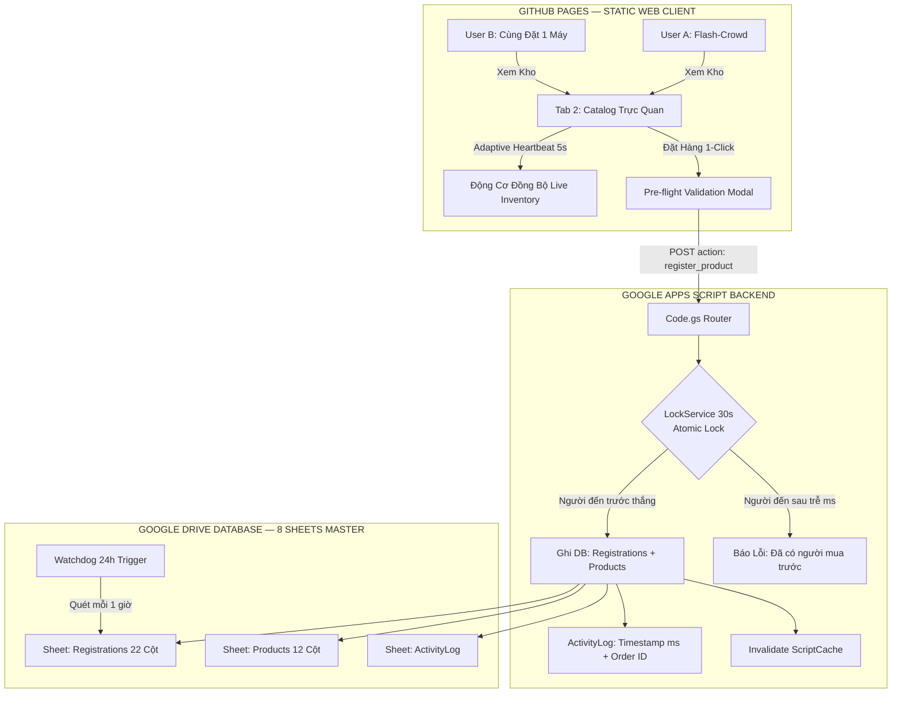
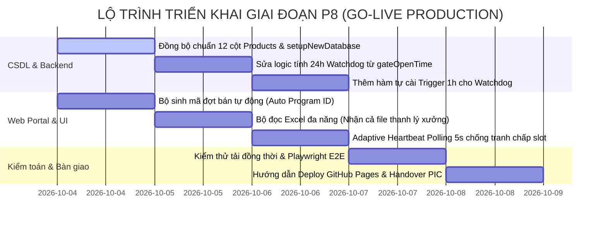

# BÁO CÁO PHÂN TÍCH CHUYÊN SÂU & ĐIỂM MÙ VẬN HÀNH GO-LIVE (PHASE P8)

> **📌 Trạng thái (cập nhật 05/10/2026):** Tài liệu **lịch sử** — phân tích / đề xuất tại thời điểm lập, **không** mô tả đúng 100% ứng dụng hiện nay. Thông tin hiện hành: [`docs/CURRENT_STATE.md`](../CURRENT_STATE.md); thay đổi v1: [`04-v1-hardening/`](../04-v1-hardening/README.md). Polling hiện hành: **6–8 giây** khi đang ở Tab 2 / Tab 4, 45–60 giây ở tab khác, dừng khi ẩn trang. Bước "dán URL vào `SHEET_API_URL`" đã được thay bằng bản build `portal.html`.

## DEEP ANALYSIS, BLINDSPOTS & ARCHITECTURAL AUDIT — LG INTERNAL SALES PORTAL
*Dự án: Cổng Đăng Ký Mua Hàng Nội Bộ — LG Electronics Việt Nam Hải Phòng (LGEVH)*  
*Chuẩn quản trị: McKinsey Executive Problem Solving & Kỷ luật Kỹ thuật Karpathy Epistemic*  
*Môi trường mục tiêu: Production Static Web trên GitHub Pages kết nối Google Apps Script & Google Sheets CSDL cá nhân*

---

## 1. TÓM TẮT ĐIỀU HÀNH & NGUYÊN TẮC QUẢN TRỊ (EXECUTIVE SUMMARY)

Theo nguyên lý quản trị Peter Drucker *"If it cannot be measured, it cannot be managed"* và kỷ luật kỹ thuật Karpathy *"Biết rõ mình đang làm gì và tại sao trước khi viết một dòng code"*, giai đoạn **Phase P8 (Go-Live & Production Handover)** là bước chuyển dịch mang tính sống còn từ môi trường thử nghiệm sang vận hành thực tế phục vụ hàng trăm cán bộ công nhân viên LG.

Hệ thống triển khai trên nền tảng **GitHub Pages (Static Hosting)** kết nối **Google Apps Script Web App (Backend API)** và **Google Drive / Google Sheets (CSDL)**. Kiến trúc này mang lại ưu điểm chi phí zero-cost và khả năng phân quyền cá nhân hóa, nhưng đòi hỏi sự chuẩn hóa tuyệt đối về **tính toàn vẹn dữ liệu (Data Integrity)**, **đối soát thời gian thực (Real-time Concurrency)** và **chống lỗi người dùng (Human Error Prevention)**.



---

## 2. PHÂN TÍCH CHI TIẾT 6 YÊU CẦU CỐT LÕI TỪ NGƯỜI DÙNG

### 2.1. Yêu cầu 1: Làm mới dữ liệu thời gian thực (Real-time Data Refresh & Anti-Collision)
* **Thực trạng kỹ thuật `[VERIFIED]`:**
  - Google Apps Script là môi trường serverless không duy trì kết nối Socket hai chiều (Không hỗ trợ WebSockets hay Server-Sent Events SSE).
  - Client hiện tại sử dụng cơ chế SWR Cache lưu trong `sessionStorage` với thời gian sống 25 giây (`SWR_CACHE_TTL_MS = 25000`). Nếu một nhân viên mở Tab 2 và giữ nguyên màn hình trong 3–5 phút, dữ liệu hiển thị không tự động cập nhật nếu không có thao tác đổi tab hoặc F5.
* **Hậu quả vận hành:**
  - Trong đợt Flash-Crowd (8:00 – 8:05 sáng mở bán), User B vẫn thấy nút xanh "Đặt hàng" trên máy mà User A vừa đặt trước đó 10 giây. Khi User B bấm vào, hệ thống gửi request lên backend và bị backend từ chối. Mặc dù backend không cho phép double-booking (nhờ `LockService`), trải nghiệm người dùng của User B bị hẫng hụt ("tại sao web báo còn hàng mà bấm mua lại báo hết").
* **Giải pháp kiến trúc:**
  1. **Adaptive Background Polling (Nhịp tim thích ứng):** Khi nhân viên đang active tại Tab 2, client tự động kích hoạt polling ngầm mỗi **5 – 8 giây** (chỉ gọi API kiểm tra danh sách `takenSlots` với payload siêu nhẹ < 1KB, bypass qua CDN cache).
  2. **Trình lắng nghe đa tab (Cross-Tab BroadcastChannel):** Sử dụng `BroadcastChannel` và `window.addEventListener('storage')` để ngay khi một tab trên cùng trình duyệt/thiết bị đặt hàng thành công, mọi tab khác lập tức cập nhật trạng thái slot sang `Registered` mà không cần gọi mạng.
  3. **Tín hiệu Live Inventory Pulse:** Thêm chấm xanh nhấp nháy `🟢 Live Sync` trên thanh công cụ kho hàng giúp người dùng an tâm về tính cập nhật của dữ liệu.

---

### 2.2. Yêu cầu 2: Ghi nhận thời gian chi tiết (Timestamp Tracking & Audit Trail)
* **Thực trạng kỹ thuật `[VERIFIED]`:**
  - Backend `register_product_` sử dụng `new Date().toISOString()` ghi vào Cột A Sheet `Registrations` và Sheet `ActivityLog`.
  - Khóa `LockService.getScriptLock()` đảm bảo tính tuần tự tuyệt đối: request nào giành được lock trước sẽ được ghi trước, request đến sau dù chỉ **1 mili-giây** cũng phải chờ và ghi nhận timestamp sau.
* **Điểm cần nâng cấp chuẩn Jeong-Do:**
  - Cần sinh mã **Order ID duy nhất chuẩn hóa quốc tế**: `ORD-YYYYMMDD-HHMMSS-SLOT-EMP` (Ví dụ: `ORD-20261004-080123-HE001-VH88921`).
  - Ghi nhận đầy đủ: (1) Thời điểm đăng ký máy, (2) Thời điểm PM mở cổng thanh toán, (3) Thời điểm nhân viên nộp tiền chuyển khoản, (4) Thời điểm PM duyệt đối soát.

---

### 2.3. Yêu cầu 3: Tự động đề xuất Mã Đợt Bán (Auto-Generated Program Code)
* **Phân tích tâm lý & hành vi PM (Human Factors):**
  - **Vấn đề 1 (Low-tech & Tránh phiền phức):** PM thường lúng túng không biết đặt tên mã đợt bán như thế nào cho đúng chuẩn, dễ gõ tùy tiện như `test`, `ha`, `dotban1`.
  - **Vấn đề 2 (Trùng lặp dữ liệu):** Nếu PM đặt trùng mã đã có trong quá khứ (ví dụ gõ lại `IS2026Q3-HA` cho đợt tháng 10), toàn bộ các bảng tính CSDL `Products`, `Registrations` sẽ bị lẫn lộn sản phẩm đợt mới với đợt cũ.
* **Giải pháp chuẩn hóa (Smart Code Suggestion Engine):**
  - Hệ thống tự động đề xuất mã đợt bán theo công thức chuẩn hóa:
    $$\text{ProgramID} = \text{IS-YYYYQn-[NGÀNH HÀNG]-[SỐ THỨ TỰ]}$$
    *Ví dụ:* `IS-2026Q4-HA-01`, `IS-2026Q4-HE-01`, `IS-2026Q4-ALL-02`.
  - **Cơ chế đề xuất trên giao diện:**
    - Khi PM mở Modal Tạo Chương Trình, ô `Mã đợt bán` đã được hệ thống **tự động điền sẵn** dựa theo Quý hiện tại và số thứ tự đợt kế tiếp.
    - Cạnh ô input có nút `Đổi mã tự động 🔄` và huy hiệu `✓ Mã hợp lệ (Chưa tồn tại)`.
    - Hệ thống kiểm tra trực tiếp với danh sách `Programs` hiện có; nếu phát hiện trùng lập tức khóa nút bấm "Kích Hoạt Mở Bán" và cảnh báo đỏ.

---

### 2.4. Yêu cầu 4: Kiểm toán liên kết CSDL & Bản đồ trường thông tin (Database Deep Audit)
* **Thực trạng đối chiếu dữ liệu `[VERIFIED]`:**
  Qua rà soát chi tiết mã nguồn [`apps-script/Code.gs`](apps-script/Code.gs), các template Excel trong thư mục `assets/templates/`, `data/` và file thực tế [`PM internal promotion template.xlsx`](PM internal promotion template.xlsx), phát hiện sự **bất đồng bộ nghiêm trọng** giữa hàm khởi tạo tự động `setupNewDatabase()` và hàm đọc dữ liệu `products_()`, `programs_()`.

#### Bảng so sánh cấu trúc Sheet `Products`:
| Vị trí cột | Hàm `products_()` & `register_product_` | Hàm `setupNewDatabase()` (Dòng 1722) | File mẫu nạp PM (`data/Mau_Danh_Muc...xlsx`) | File thực tế nhà máy (`PM internal promotion...xlsx`) | Đánh giá & Rủi ro |
| :---: | :--- | :--- | :--- | :--- | :--- |
| **Col 1** | `ProgramID` | `UniqueCode` | `WH (Kho)` | `No` | ❌ **Lệch cấu trúc hoàn toàn:** `products_()` đọc Col 1 làm ProgramID, nếu dùng DB từ `setupNewDatabase` sẽ đọc nhầm UniqueCode. |
| **Col 2** | `UniqueCode` | `ProgramID` | `Slot ID` | `Product/CAT` (MWO, TV...) | ❌ Lệch Col 1 & 2. |
| **Col 3** | `Kho` (AYA/AYB/AYC) | `Category` | `Model` | `Date` | ❌ Lệch trường Kho. |
| **Col 4** | `Category` | `Model` | `Ngành hàng` | `Checker` | ❌ Lệch Category. |
| **Col 5** | `Model` | `Description` | `Giá bán (VNĐ)` | `W/H` (Kho) | ❌ Lệch Model. |
| **Col 6** | `Description` | `RRP` | `Giá niêm yết (RRP)` | `Model` | ❌ Lệch Description. |
| **Col 7** | `RRP` | `InternalPrice` | `Mô tả chi tiết` | `Serial` | ❌ Lệch Giá niêm yết. |
| **Col 8** | `InternalPrice` | `Kho` | *(Hết)* | `NOTE` (Tình trạng xước/móp) | ❌ Lệch Giá nội bộ. |
| **Col 9** | `Qty` | `Status` | — | `Operation` | ❌ Thiếu trường Qty. |
| **Col 10** | `Status` (Available/Registered) | *(Không có)* | — | `Box, packing` | ❌ `setupNewDatabase` chỉ tạo 9 cột, thiếu Status khiến `register_product_` ghi đè sai ô! |
| **Col 11** | `EmpCode` | *(Không có)* | — | ... | ❌ Thiếu cột EmpCode. |
| **Col 12** | `Timestamp` | *(Không có)* | — | ... | ❌ Thiếu cột Timestamp. |

> [!CAUTION]
> **KẾT LUẬN KIỂM TOÁN CƠ SỞ DỮ LIỆU:**  
> Hàm `setupNewDatabase()` tại dòng 1722 của `Code.gs` đang tạo ra cấu trúc 9 cột cũ, trong khi backend nghiệp vụ v7.3 (`PROD_COL`) yêu cầu chuẩn 12 cột. Đây là **điểm nghẽn P0** cần phải phẫu thuật đồng bộ ngay lập tức trước khi triển khai chính thức.

---

### 2.5. Yêu cầu 5: Thiết lập cờ gửi Email tự động thật (`ENABLE_AUTO_EMAIL`)
* **Thực trạng kỹ thuật `[VERIFIED]`:**
  - Tại dòng 229 file [`apps-script/Code.gs`](apps-script/Code.gs):
    ```javascript
    var enabled = String(cfg['ENABLE_AUTO_EMAIL'] || '').toLowerCase() === 'true';
    ```
  - Backend đã tích hợp đầy đủ 5 template email HTML chuẩn thương hiệu LG V5.2 và cơ chế **Circuit Breaker** (ngắt mạch an toàn trong 1 giờ nếu chạm hạn mức gửi của Google Workspace).
  - Tuy nhiên, trong hàm `setupNewDatabase()`, sheet `Config` chưa được nạp sẵn dòng `ENABLE_AUTO_EMAIL`, khiến hệ thống mặc định chạy ở chế độ giả lập (`[SIMULATED]`).

---

### 2.6. Yêu cầu 6: Trigger tự động cho Watchdog 24h & Khắc phục điểm mù mở cổng thanh toán
* **Thực trạng kỹ thuật `[VERIFIED]`:**
  - Hàm `runExpirationWatchdog()` đã có sẵn tại dòng 1176 [`apps-script/Code.gs`](apps-script/Code.gs), gọi hàm `check_expired_slots_()`.
  - **Điểm mù chí mạng phát hiện qua kiểm toán code:**  
    Tại dòng 1092–1096:
    ```javascript
    var rawTs = data[r][0]; // Cột 1: Timestamp lúc nhân viên bấm đăng ký
    var regDate = rawTs instanceof Date ? rawTs : new Date(rawTs);
    var diffMs = now - regDate.getTime();
    if (diffMs >= TWENTY_FOUR_HOURS_MS) { ... }
    ```
    Hệ thống đang tính 24h từ **thời điểm nhân viên giữ chỗ ban đầu**, chứ KHÔNG PHẢI từ **thời điểm PM mở cổng thanh toán**!  
    *Ví dụ thực tế:* Nhân viên đăng ký máy lúc 09:00 thứ Hai (trạng thái: `Đã đăng ký - Chờ mở thanh toán`). PM rà soát danh sách và bấm "Mở cổng thanh toán" lúc 10:00 sáng thứ Ba (đã trôi qua 25 tiếng). Ngay lượt quét watchdog kế tiếp, đơn hàng lập tức bị hủy vì `diffMs > 24h`, nhân viên không có lấy một phút nào để nộp tiền!
  - **Khắc phục:** Thời hạn 24 giờ bắt buộc phải được tính từ thời điểm cổng thanh toán được kích hoạt (`gateOpenTime`).

---

## 3. PHÂN TÍCH 5 ĐIỂM MÙ VẬN HÀNH (OPERATIONAL BLINDSPOTS)

| # | Điểm mù vận hành | Mô tả rủi ro nếu bỏ qua | Giải pháp xử lý triệt để |
|:---:|:---|:---|:---|
| **BM-01** | **File Excel nạp thực tế có cấu trúc phức tạp** | File [`PM internal promotion template.xlsx`](PM internal promotion template.xlsx) có 3 dòng tiêu đề, các cột như `MRP (+VAT)`, `Selling price (+VAT)`, `NOTE`, `Serial`, `Grade`. Trình đọc Excel hiện tại chỉ nhận file đơn giản 1 dòng header. | Xây dựng bộ parser thông minh tự động nhận diện header đa dòng, tự động map cột `Selling price` $\rightarrow$ `InternalPrice`, `MRP` $\rightarrow$ `RRP`, `NOTE` $\rightarrow$ `Description`. |
| **BM-02** | **Môi trường chạy GitHub Pages không có Backend Node.js** | GitHub Pages chỉ lưu trữ file tĩnh (`.html`, `.js`, `.css`), toàn bộ dữ liệu phải thông qua Google Apps Script Web App. Nếu Apps Script bị khóa quyền CORS hoặc Deploy sai chế độ ("Execute as: User accessing" thay vì "Execute as: Me"), web sẽ liệt hoàn toàn. | Đóng gói bộ script kiểm tra sức khỏe API 1-Click (`healthCheckAPI()`) và hướng dẫn triển khai chuẩn xác từng bước. |
| **BM-03** | **Quá tải hạn mức gửi Email hàng ngày của Google (Quota Exceeded)** | Tài khoản Gmail miễn phí giới hạn 100 email/ngày. Tài khoản Google Workspace doanh nghiệp `@lge.com` giới hạn 1,500 email/ngày. Trong đợt mở bán 300 sản phẩm, việc gửi xác nhận đăng ký + mở cổng + duyệt tiền có thể chạm ngưỡng nếu dùng tài khoản cá nhân. | Kích hoạt bộ ngắt mạch Circuit Breaker: nếu gửi lỗi do hết quota, hệ thống tự động ngắt gửi mail trong 1h và chuyển sang ghi log, tuyệt đối không làm treo đơn hàng của nhân viên. |
| **BM-04** | **Tranh chấp khóa Slot khi hủy đơn (Cancellation Race Condition)** | Khi nhân viên bấm "Hủy đơn" trên giao diện hoặc PM từ chối đơn, slot được giải phóng về `Available`. Nếu lúc này 2 nhân viên khác cùng canh để bấm mua, có thể phát sinh tranh chấp. | Sử dụng `LockService` cả ở chiều nạp đơn và chiều hủy đơn, đảm bảo tính toàn vẹn trạng thái 100%. |
| **BM-05** | **Xuất file quyết toán kế toán bị thiếu trường** | Kế toán nhà máy LGEVH và Kiểm toán Jeong-Do cần đầy đủ 22 trường thông tin để đối soát với sao kê ngân hàng Vietcombank Tây Hồ. Nếu file xuất Excel từ web thiếu Mã giao dịch ngân hàng hoặc Mã số thuế/Bộ phận, kế toán sẽ từ chối nghiệm thu đợt bán. | Chuẩn hóa hàm xuất Excel báo cáo 22 cột khớp 100% với mẫu sổ cái kế toán doanh nghiệp. |

---

## 4. BẢN ĐẶC TẢ KẾ HOẠCH HÀNH ĐỘNG GIAI ĐOẠN P8 (BLUEPRINT ROADMAP)



---

## 5. CÂU HỎI LÀM RÕ DÀNH CHO USER (SOCRATES & POPPER CHECK)

Trước khi tiến hành sửa đổi mã nguồn, để tuân thủ tuyệt đối quy tắc **"Không suy diễn, không ảo giác"**, xin xác nhận 3 điểm nghiệp vụ sau:

1. **Về định dạng Mã Đợt Bán tự động:** Bạn có muốn định dạng mặc định là `IS-{NĂM}Q{QUÝ}-{NGÀNH HÀNG}-{STT}` (Ví dụ: `IS-2026Q4-HA-01`) hay một quy tắc đặt tên nào khác đang được dùng tại LGEVH?
2. **Về file Excel nạp sản phẩm:** Hệ thống sẽ hỗ trợ song song 2 định dạng: (A) File mẫu hệ thống 7 cột tiêu chuẩn và (B) File thực tế từ xưởng kiểm định ([`PM internal promotion template.xlsx`](PM internal promotion template.xlsx)). Bạn có đồng ý với cơ chế tự động nhận diện thông minh này không?
3. **Về tài khoản gửi Email:** Bạn dự kiến triển khai Google Apps Script trên tài khoản Google Workspace công ty (`@lge.com` - hạn mức 1,500 mail/ngày) hay tài khoản Gmail cá nhân (`@gmail.com` - hạn mức 100 mail/ngày)?
