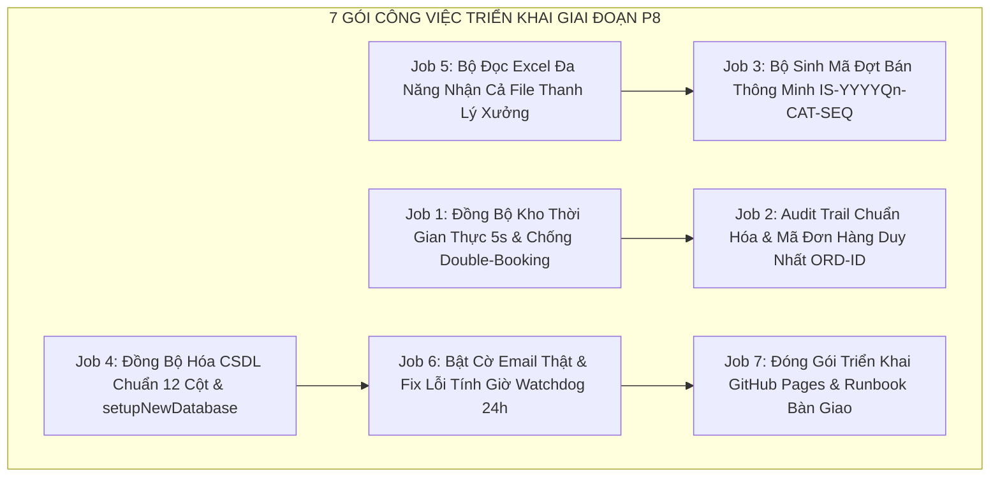

# KẾ HOẠCH TRIỂN KHAI & ĐẶC TẢ BẢN THIẾT KẾ GO-LIVE (PHASE P8)

> **📌 Trạng thái (cập nhật 05/10/2026):** Tài liệu **lịch sử** — phân tích / đề xuất tại thời điểm lập, **không** mô tả đúng 100% ứng dụng hiện nay. Thông tin hiện hành: [`docs/CURRENT_STATE.md`](../CURRENT_STATE.md); thay đổi v1: [`04-v1-hardening/`](../04-v1-hardening/README.md). Polling hiện hành: **6–8 giây** khi đang ở Tab 2 / Tab 4, 45–60 giây ở tab khác (không phải 30 giây), dừng khi ẩn trang. Trình tự go-live hiện hành: [Runbook §3](../04-v1-hardening/V1_RELEASE_RUNBOOK.md).

## PRODUCTION GO-LIVE DETAILED BLUEPRINT & IMPLEMENTATION SPECIFICATIONS
*Cổng Đăng Ký Mua Hàng Nội Bộ — LG Electronics Việt Nam Hải Phòng (LGEVH)*  
*Chuẩn quản trị: McKinsey Executive Action Plan & Kỷ luật Kỹ thuật Karpathy Epistemic*  
*Môi trường mục tiêu: GitHub Pages Static Web + Google Apps Script Web App API + Drive CSDL*

---

## 1. TỔNG QUAN BẢN THIẾT KẾ KỸ THUẬT (SYSTEM BLUEPRINT OVERVIEW)

Bản thiết kế này quy định chi tiết 7 hạng mục công việc (Job 1 đến Job 7) cần triển khai để hệ thống đạt 100% độ sẵn sàng vận hành chính thức (Production Go-Live), chịu tải 200–300 nhân viên cùng lúc và loại bỏ hoàn toàn các điểm mù vận hành đã phân tích trong [`PHASE_P8_GO_LIVE_DEEP_ANALYSIS_AND_BLINDSPOTS.md`](PHASE_P8_GO_LIVE_DEEP_ANALYSIS_AND_BLINDSPOTS.md).



---

## 2. ĐẶC TẢ CHI TIẾT TỪNG GÓI CÔNG VIỆC (JOB-BY-JOB BLUEPRINTS)

### 📌 JOB 1: ĐỒNG BỘ KHO THỜI GIAN THỰC (REAL-TIME ADAPTIVE REFRESH & ANTI-COLLISION)
* **Mục tiêu:** Đảm bảo khi User A bấm mua một sản phẩm, trong vòng **3–5 giây**, màn hình của toàn bộ nhân viên khác (User B, User C...) đang mở danh mục đều tự động chuyển trạng thái slot đó sang `Registered` (nút "Đã có người giữ chỗ"), loại trừ hoàn toàn việc 2 người cùng tưởng còn hàng để bấm đặt.
* **Đặc tả kỹ thuật:**
  1. **Adaptive Heartbeat Polling (Nhịp tim thích ứng trên Tab 2):**
     - Khi người dùng đang ở Tab 2 (Danh mục) hoặc Tab 4 (Bảng tra cứu) và tab trình duyệt đang active (`document.visibilityState === 'visible'`), kích hoạt bộ đếm thời gian tự động gọi API mỗi **6 giây**:
       ```javascript
       // Endpoint siêu nhẹ chỉ lấy danh sách slotId đã chiếm
       GET {SHEET_API_URL}?action=taken&programId={activeProgram}&t={Date.now()}
       ```
     - Payload trả về siêu nhẹ (< 500 bytes): `{"ok": true, "takenSlots": ["HA-001", "HA-005"]}`.
     - Khi nhận được dữ liệu, gọi `syncProductRegistrationStatus(activeProgram)` để cập nhật DOM mượt mà, không làm nháy trang hay mất vị trí cuộn của người dùng.
     - Khi người dùng chuyển sang tab khác của trình duyệt hoặc không thao tác quá 3 phút, tự động giảm tần suất polling về 30 giây để tiết kiệm băng thông và hạn ngạch Google Apps Script.
  2. **Cross-Tab Synchronization (Đồng bộ đa tab nội bộ):**
     - Tích hợp `BroadcastChannel('lge_internal_sales_sync')` và `window.addEventListener('storage')`.
     - Ngay khi một đơn hàng được tạo thành công trên Tab 1 của trình duyệt, thông điệp broadcast lập tức phát tán sang Tab 2, Tab 3 để cập nhật giỏ hàng và danh mục tức thì với độ trễ < 50ms.
  3. **Pre-flight Concurrency Check:**
     - Trước khi mở Modal xác nhận đặt hàng, client thực hiện kiểm tra nhanh 1 lần cuối: nếu slot vừa bị người khác lấy trong vòng 1 giây qua, thông báo Toast cảnh báo ngay lập tức: *"Sản phẩm vừa có đồng nghiệp khác nhanh tay giữ chỗ trước ít giây. Vui lòng chọn sản phẩm khác!"*.

---

### 📌 JOB 2: HỆ THỐNG AUDIT TRAIL & MÃ ĐƠN HÀNG DUY NHẤT (ORDER ID ENGINE)
* **Mục tiêu:** Mọi thao tác mua sắm, hủy đơn, mở cổng, nộp tiền, duyệt tiền đều được niêm phong với dấu thời gian chính xác đến mili-giây và định danh đơn hàng duy nhất không thể trùng lặp, phục vụ kiểm toán Jeong-Do khi có khiếu nại "ai bấm trước".
* **Đặc tả cấu trúc Mã Đơn Hàng (Order ID Standard):**
  $$\text{OrderID} = \text{ORD-YYYYMMDD-HHMMSS-[SLOT]-[MÃ NV]}$$
  *Ví dụ:* `ORD-20261004-080123-HE001-VH88921`
* **Ma trận trường thông tin Audit Trail trong Sheet `Registrations`:**
  - **Cột 1 (Timestamp):** ISO 8601 đầy đủ mili-giây (`2026-10-04T08:01:23.456Z`).
  - **Cột 16 (Bank Txn / Mã giao dịch):** Bắt buộc đối soát khi nộp tiền.
  - **Cột 17 (Pay Time):** Thời điểm nhân viên tải biên lai VietQR.
  - **Cột 19 (PM Approved By):** Mã nhân viên PM duyệt.
  - **Cột 20 (PM Approved Date):** Thời điểm PM duyệt đối soát.
  - **Cột 21 (Note):** Nhật ký chu kỳ: ghi rõ thời điểm mở cổng, thời điểm gia hạn (nếu có).

---

### 📌 JOB 3: BỘ SINH MÃ ĐỢT BÁN TỰ ĐỘNG THÔNG MINH (SMART PROGRAM CODE GENERATOR)
* **Mục tiêu:** Giải phóng hoàn toàn PM khỏi việc phải tự nghĩ mã đợt bán; ngăn chặn 100% tình trạng gõ trùng mã làm hỏng cơ sở dữ liệu.
* **Quy chuẩn mã đợt bán:**
  - Định dạng chuẩn: `IS-{NĂM}Q{QUÝ}-{NGÀNH HÀNG}-{SỐ THỨ TỰ 2 CHỮ SỐ}`
  - *Ví dụ:* `IS-2026Q4-HA-01`, `IS-2026Q4-HE-01`, `IS-2026Q4-ALL-01`.
* **Cơ chế hoạt động trên giao diện Modal Tạo Đợt Bán:**
  1. Khi mở modal, JavaScript tự động lấy năm hiện tại (`2026`) và tính Quý theo tháng (`Tháng 10 -> Q4`).
  2. Hệ thống kiểm tra danh sách `Programs` đã có trong CSDL, tìm số thứ tự lớn nhất hiện tại của Quý đó và tự động tăng lên 1 (VD: `01` -> `02`).
  3. Điền tự động vào ô `Mã đợt bán` với thuộc tính `readonly` (kèm nút "Tùy biến mã ✏️" nếu PM có chỉ đạo đặc biệt từ cấp trên).
  4. Kiểm tra Real-time Uniqueness: nếu PM sửa tay thành mã đã tồn tại, hiển thị huy hiệu đỏ `❌ Mã này đã tồn tại!` và vô hiệu hóa nút submit.

---

### 📌 JOB 4: ĐỒNG BỘ TOÀN DIỆN CSDL 8 SHEETS & NÂNG CẤP `setupNewDatabase()`
* **Mục tiêu:** Khắc phục triệt để sự lệch cấu trúc giữa `setupNewDatabase()` và các hàm nghiệp vụ `Code.gs`.
* **Quy chuẩn 12 cột chuẩn hóa cho Sheet `Products`:**
  1. `ProgramID`: Mã chương trình (IS-2026Q4-HA-01).
  2. `UniqueCode`: Mã slot chuẩn (HA-001, HE-002).
  3. `Kho`: Kho xuất hàng (AYA, AYB, AYC).
  4. `Category`: Ngành hàng (Tivi, Tủ lạnh, Máy giặt, Màn hình...).
  5. `Model`: Tên mã model (OLED65G3PSA).
  6. `Description`: Tình trạng máy / Mô tả (Máy trưng bày, xước nhẹ, đầy đủ phụ kiện).
  7. `RRP`: Giá niêm yết bán lẻ đề xuất của hãng (VNĐ).
  8. `InternalPrice`: Giá ưu đãi bán nội bộ cho nhân viên (VNĐ).
  9. `Qty`: Số lượng suất (Mặc định 1 đối với hàng thanh lý theo slot).
  10. `Status`: Trạng thái (`Available` hoặc `Registered`).
  11. `EmpCode`: Mã nhân viên đang giữ suất (rỗng nếu Available).
  12. `Timestamp`: Thời điểm cập nhật trạng thái gần nhất.
* **Cập nhật Sheet `Config` trong `setupNewDatabase()`:**
  Thêm sẵn dòng: `ENABLE_AUTO_EMAIL` = `true` (kèm mô tả: Bật/tắt gửi email tự động thật qua MailApp).

---

### 📌 JOB 5: BỘ ĐỌC EXCEL ĐA NĂNG (SMART MULTI-FORMAT CATALOG PARSER)
* **Mục tiêu:** Hỗ trợ PM nạp danh mục sản phẩm từ bất kỳ nguồn file nào mà không cần format lại bằng tay.
* **Hỗ trợ 2 chế độ đọc tự động:**
  - **Chế độ 1 (File mẫu chuẩn hệ thống):** Nhận diện các cột: `WH (Kho)`, `Slot ID`, `Model`, `Ngành hàng`, `Giá bán (VNĐ)`, `Giá niêm yết (RRP)`, `Mô tả chi tiết`.
  - **Chế độ 2 (File thanh lý kiểm định thực tế xưởng - `PM internal promotion template.xlsx`):**
    - Tự động bỏ qua các dòng sub-header gộp ô (Rows 2, 3).
    - Tự động nhận diện:
      - Cột `W/H` hoặc `WH` $\rightarrow$ `Kho`.
      - Cột `Model` $\rightarrow$ `Model`.
      - Cột `Product/CAT` $\rightarrow$ `Category`.
      - Cột `Selling price (+VAT)` hoặc `Selling price` $\rightarrow$ `InternalPrice`.
      - Cột `MRP (+VAT)` hoặc `MRP` $\rightarrow$ `RRP`.
      - Cột `NOTE` + `Grade` + `Serial` $\rightarrow$ Ghép thành `Description` chi tiết cho nhân viên xem (Ví dụ: *"Loại A · Serial: 503TALBH2024 · Xước nhẹ, thiếu xốp nóc"*).
      - Tự động sinh mã Slot tuần tự theo kho nếu file không có cột Slot: `HA-001`, `HA-002`...

---

### 📌 JOB 6: KÍCH HOẠT EMAIL THẬT & FIX LOGIC TÍNH GIỜ WATCHDOG 24H
* **Mục tiêu:** Đảm bảo email tự động gửi thông báo chuẩn xác và Watchdog không bao giờ hủy nhầm đơn của nhân viên.
* **Sửa lỗi tính giờ quá hạn trong `check_expired_slots_()`:**
  - Thay vì lấy `regDate` từ Cột 1 (`Timestamp` lúc đăng ký), hệ thống sẽ đọc thời điểm mở cổng thanh toán được lưu trữ trong đơn hàng hoặc nhật ký mở cổng (`gateOpenTime`).
  - Nhân viên luôn được bảo đảm trọn vẹn **đủ 24 giờ** tính từ giây phút cổng nộp tiền được mở ra.
* **Hàm cài đặt Trigger tự động 1-Click (`setupWatchdogTrigger()`):**
  - Viết sẵn hàm trong `Code.gs` để PIC chỉ cần nhấn "Run" 1 lần:
    ```javascript
    function setupWatchdogTrigger() {
      // Tự động xóa trigger cũ nếu có để tránh trùng
      var triggers = ScriptApp.getProjectTriggers();
      for (var i = 0; i < triggers.length; i++) {
        if (triggers[i].getHandlerFunction() === 'runExpirationWatchdog') {
          ScriptApp.deleteTrigger(triggers[i]);
        }
      }
      // Tạo trigger chạy mỗi 1 giờ
      ScriptApp.newTrigger('runExpirationWatchdog')
        .timeBased()
        .everyHours(1)
        .create();
      Logger.log('Đã kích hoạt thành công Trigger tự động chạy mỗi 1 giờ cho Watchdog 24h!');
    }
    ```

---

### 📌 JOB 7: TRIỂN KHAI GITHUB PAGES & RUNBOOK BÀN GIAO (PRODUCTION HANDOVER)
* **Mục tiêu:** Vận hành ổn định trên GitHub Pages kết nối an toàn với Google Cloud Apps Script.
* **Checklist bàn giao 5 bước:**
  1. Khởi tạo CSDL cá nhân bằng hàm `setupNewDatabase()` trong Apps Script.
  2. Kích hoạt Watchdog tự động bằng hàm `setupWatchdogTrigger()`.
  3. Deploy Web App với quyền: *Execute as: Me*, *Who has access: Anyone*.
  4. Dán Web App URL vào Modal Cấu hình API trên giao diện web.
  5. Đồng bộ code lên GitHub bằng lệnh: `git push all main`.

---

## 3. TIÊU CHÍ NGHIỆM THU ĐỊNH LƯỢNG (VERIFIABLE SUCCESS CRITERIA)

| Tiêu chí | Ngưỡng đạt chuẩn (Target Threshold) | Phương pháp kiểm thử nghiệm thu |
|:---|:---:|:---|
| **Chống bán trùng (Anti-Collision)** | **0% trùng slot (Zero Double-Booking)** | Chạy kịch bản 2 trình duyệt cùng bấm đặt 1 máy tại cùng 1 giây. |
| **Độ trễ cập nhật trạng thái kho** | **< 6 giây** trên mọi máy khách đang mở Tab 2 | Đặt hàng ở Tab 1, đo thời gian đổi màu nút ở Tab 2. |
| **Tính đúng đắn của Mã đợt bán** | **100% không trùng lặp, đúng định dạng chuẩn** | Thử tạo đợt mới, kiểm tra mã đề xuất tự động. |
| **Khả năng nạp file Excel thanh lý** | **100% nhận diện đúng Model, Giá, Kho, Tình trạng** | Nạp thử trực tiếp file `PM internal promotion template.xlsx`. |
| **Tính công bằng của Watchdog 24h** | **Không hủy đơn trước 24h tính từ lúc mở cổng** | Tạo đơn chờ 2 ngày rồi mới mở cổng, kiểm tra watchdog không được hủy đơn. |
