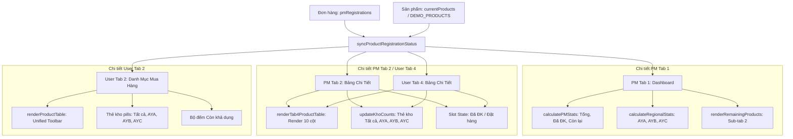

# Kiến Trúc Đồng Bộ Dữ Liệu Tập Trung (Single Source of Truth - SSOT)

> **📌 Trạng thái (cập nhật 05/10/2026):** Tài liệu **lịch sử** — phân tích / đề xuất tại thời điểm lập, **không** mô tả đúng 100% ứng dụng hiện nay. Thông tin hiện hành: [`docs/CURRENT_STATE.md`](../CURRENT_STATE.md); thay đổi v1: [`04-v1-hardening/`](../04-v1-hardening/README.md). Thay đổi v1 liên quan: nhân viên thật **không** rơi về dữ liệu demo khi máy chủ chậm (hiện panel "Thử lại"); ô 03 đọc đơn từ máy chủ.

### LG Internal Sales Portal — Đồng Bộ Dữ Liệu Thời Gian Thực & Cơ Chế Đảm Bảo Cho Tương Lai

*Tài liệu kỹ thuật lưu hành nội bộ — Thiết kế và bàn giao cho Đội ngũ Kỹ thuật & AI Agent kế thừa.*

---

## 1. Bối cảnh & Nguyên Lý Thiết Kế Cốt Lõi

Trong các hệ thống phân phối nội bộ phức tạp, cổng bán hàng dành cho hai đối tượng người dùng độc lập:
1. **Quản trị viên (PM):** Cần góc nhìn tổng quan chiến lược, kiểm soát tồn kho theo vùng miền (Regional KPI), phê duyệt chứng từ chuyển khoản và theo dõi sản phẩm chưa có người mua.
2. **Nhân viên (User):** Cần góc nhìn trực quan để tra cứu danh mục, lọc theo kho công tác, xem chi tiết tình trạng hàng hóa và bấm đăng ký giữ chỗ tức thì (FCFS).

Do hệ thống phục vụ nhiều góc nhìn đồng thời qua 4 màn hình chính:
- **PM Tab 1:** Bảng Điều Khiển PM (KPIs, Sub-tab 1: Đơn hàng, Sub-tab 2: SP còn trống, Modal Vùng miền)
- **PM Tab 2:** Bảng Chi Tiết Sản Phẩm (`#tab4` - Chế độ bảng Excel tra cứu toàn bộ sản phẩm)
- **User Tab 2:** Danh Mục & Đăng Ký Mua Hàng (Chế độ Thẻ & Bảng, Bộ lọc kho)
- **User Tab 4:** Bảng Chi Tiết Sản Phẩm (`#tab4` - Dành cho nhân viên tra cứu tình trạng slot)

Nếu sản phẩm lưu trữ trạng thái cố định (`status: 'Available'`) trong khi đơn hàng lưu trữ riêng biệt trong danh sách đăng ký (`pmRegistrations`), hệ thống sẽ phát sinh lỗi **bất đồng bộ trạng thái (State Desynchronization)**.

**Giải pháp kiến trúc:** Áp dụng mô hình **Single Source of Truth (SSOT)** kết hợp **Động Cơ Đối Soát Động (Dynamic Reconciliation Engine)**. Sản phẩm không tự quyết định trạng thái hiển thị của mình; trạng thái của sản phẩm luôn là một **hàm suy diễn thời gian thực** dựa trên tập hợp đơn hàng hợp lệ đang hoạt động.

---

## 2. Động Cơ Đối Soát Động: `syncProductRegistrationStatus`

### 2.1. Mã nguồn lõi (Core Implementation)
Hàm trọng tâm được triển khai tại dòng ~7395 của file [`Mau_Dang_Ky_Internal_Sales_3009.html`](../../Mau_Dang_Ky_Internal_Sales_3009.html):

```javascript
function syncProductRegistrationStatus(programId, productsList) {
  const pid = programId || activeProgram;
  const prods = (productsList && Array.isArray(productsList) && productsList.length)
    ? productsList
    : (currentProducts && currentProducts.length && currentProducts[0].programId === pid)
      ? currentProducts
      : (typeof DEMO_PRODUCTS !== 'undefined' && DEMO_PRODUCTS[pid])
        ? DEMO_PRODUCTS[pid]
        : [];
  if (!prods || !prods.length) return prods;

  // 1. Lấy toàn bộ đơn hàng hiện có (Ưu tiên DB/API, fallback Demo)
  const allRegs = (typeof pmRegistrations !== 'undefined' && pmRegistrations.length)
    ? pmRegistrations
    : (typeof DEMO_REGISTRATIONS !== 'undefined' ? DEMO_REGISTRATIONS : []);

  // 2. Lọc đơn hàng ĐANG HOẠT ĐỘNG (Loại trừ Từ chối, Hủy)
  const activeRegs = allRegs.filter(r => 
    (r.programId === pid || !r.programId) && 
    r.status !== 'Từ chối' && 
    r.status !== 'Hủy' && 
    !String(r.status || '').startsWith('Đã hủy')
  );

  // 3. Xây dựng tập hợp slotId đã bị chiếm
  const takenSlots = new Set(activeRegs.map(r => r.slotId));
  if (typeof takenSet !== 'undefined') {
    activeRegs.forEach(r => { if (r.slotId) takenSet.add(r.slotId); });
  }

  // 4. Cập nhật trạng thái từng sản phẩm
  prods.forEach(p => {
    const code = p.uniqueCode || p.slotId;
    if (takenSlots.has(code)) {
      p.status = 'Registered';
    } else {
      p.status = 'Available';
    }
  });

  return prods;
}
window.syncProductRegistrationStatus = syncProductRegistrationStatus;
```

### 2.2. Quy tắc đối soát (Reconciliation Invariants)
1. **Đơn hợp lệ chiếm giữ slot:** Bất kỳ đơn nào có trạng thái:
   - `Đã đăng ký - Chờ mở thanh toán`
   - `Đã khai nộp - chờ đối soát`
   - `Đã duyệt thanh toán`
   - `Chờ nộp tiền` / `Mới đăng ký`  
   $\rightarrow$ Slot tương ứng lập tức mang trạng thái `Registered`.
2. **Giải phóng slot tự động:** Khi PM bấm `pmRejectPayment` ("Từ chối thanh toán") hoặc nhân viên bấm `cancelUserRegistration` ("Hủy đơn"):
   - Đơn chuyển sang `Từ chối` hoặc `Đã hủy bởi nhân viên` / `Đã hủy bởi PM`.
   - `syncProductRegistrationStatus` tự động loại đơn này khỏi `activeRegs`.
   - Slot tương ứng tự động quay về `Available`, nút bấm chuyển về màu xanh "Đặt hàng".

---

## 3. Ma Trận Đồng Bộ 4 Màn Hình (4-Way View Parity Matrix)

Bất kể người dùng đang đứng ở vai trò nào, các hàm hiển thị đều liên kết trực tiếp với động cơ đồng bộ:



### Bảng đối chiếu số liệu kiểm thử trên chương trình `IS2026Q3-HE`:

| Chỉ số theo dõi | PM Tab 1 (Tổng quan) | PM Tab 2 (`#tab4`) | User Tab 2 (Danh mục) | User Tab 4 (`#tab4`) |
| :--- | :---: | :---: | :---: | :---: |
| **Tổng số sản phẩm** | **90** | **90** | **90** | **90** |
| **Đã đăng ký** | **1** (`#034` AYA) | **1** (`#034` AYA) | **1** (`#034` AYA) | **1** (`#034` AYA) |
| **Còn khả dụng (Toàn quốc)** | **89** | **89** | **89** | **89** |
| **Kho AYA (Miền Bắc)** | Còn 43 / 44 | Còn 43 / 44 | Còn 43 / 44 | Còn 43 / 44 |
| **Kho AYB (Miền Trung)** | Còn 1 / 1 | Còn 1 / 1 | Còn 1 / 1 | Còn 1 / 1 |
| **Kho AYC (Miền Nam)** | Còn 45 / 45 | Còn 45 / 45 | Còn 45 / 45 | Còn 45 / 45 |
| **Trạng thái dòng `#034`** | Hiện trong Sub-tab 1 | Khóa: "Đã đăng ký" | Đã có người giữ chỗ | Khóa: "Đã đăng ký" |
| **89 dòng còn lại** | Hiện trong Sub-tab 2 | Nút xanh "Đặt hàng" | Nút đỏ "Đăng ký ngay" | Nút xanh "Đặt hàng" |

---

## 4. Cơ Chế Đảm Bảo Cho Các Chương Trình PM Tạo Mới Trong Tương Lai

Để đảm bảo bất kỳ chương trình nào PM tạo mới trong tương lai đều duy trì 100% tính nhất quán mà không cần can thiệp code thủ công, hệ thống thiết lập các quy chuẩn bất biến sau:

### 4.1. Chuẩn hóa khi Nạp Excel (`confirmStandaloneImport`)
Khi PM tải file Excel danh mục máy thanh lý lên hệ thống:
1. **Tạo mã Slot chuẩn hóa:** Tự động đánh số thứ tự `#001`, `#002`, ... `#NNN` và lưu vào thuộc tính `uniqueCode` và `slotId`.
2. **Chuẩn hóa mã kho:** Toàn bộ tên kho được chuẩn hóa chữ hoa và cắt khoảng trắng thừa:
   ```javascript
   const kho = String(rawKho || 'Khác').toUpperCase().trim();
   ```
3. **Khởi tạo trạng thái gốc:** Mọi sản phẩm mới nạp mặc định có `status = 'Available'`.
4. **Kích hoạt đồng bộ ngay lập tức:**
   ```javascript
   syncProductRegistrationStatus(targetProg, enriched);
   currentProducts = enriched;
   renderProductTable(enriched);
   renderTab4ProductTable(enriched);
   if (currentUser && currentUser.role === 'PM') {
     renderPMDashboard();
   }
   ```

### 4.2. Chuẩn hóa khi Tạo Chương Trình Mới (`createProgram`)
Hàm tạo đợt bán hàng mới trong modal PM:
- Lưu chương trình vào `programs` (lưu tại `localStorage` và đồng bộ Sheet).
- Nếu nạp kèm file Excel, sản phẩm được gán `programId = newId` và chạy qua `syncProductRegistrationStatus`.
- Cả hai bảng của PM (Tab 1, Tab 2) và của User (Tab 2, Tab 4) lập tức nhận diện chương trình mới với số lượng slot hoàn toàn đồng nhất từ giây đầu tiên.

### 4.3. Bắt sự kiện chuyển Tab (`switchTab`)
Khi người dùng hoặc PM chuyển đổi giữa các Tab:
```javascript
if (tabId === 'tab2') {
  if (typeof syncProductRegistrationStatus === 'function') {
    syncProductRegistrationStatus(activeProgram, currentProducts);
  }
  if (typeof updateKhoCounts === 'function') updateKhoCounts();
}
if (tabId === 'tab4') {
  if (typeof syncProductRegistrationStatus === 'function') {
    syncProductRegistrationStatus(activeProgram, currentProducts);
  }
  if (typeof renderTab4ProductTable === 'function') {
    renderTab4ProductTable(currentProducts);
  }
  if (typeof updateKhoCounts === 'function') updateKhoCounts();
}
```

---

## 5. Quy Chuẩn Thẩm Mỹ Nhận Diện LG (LG Brand Guidelines V5.2)

Khi hiển thị trạng thái và màu sắc, hệ thống tuân thủ nghiêm ngặt bảng màu chính thức:

| Phần tử UI | Màu sắc chuẩn | Mã HEX | Ý nghĩa nhận diện |
| :--- | :--- | :--- | :--- |
| **Nút "Đã đăng ký" / Đã khóa** | LG Heritage Red | `#A50034` | Màu thương hiệu cốt lõi, biểu trưng trạng thái đã có chủ sở hữu |
| **Nút "Đặt hàng" / Khả dụng** | LG Forest Green | `#0E6251` | Trạng thái tích cực, kích thích thao tác đăng ký FCFS |
| **Thẻ kho đang chọn** | LG Heritage Red | `#A50034` | Active state của bộ lọc kho |
| **Nền Canvas chính** | LG Warm Gray 01 | `#F6F3EB` | Nền ấm đặc trưng nhận diện LG Electronics |
| **Font chữ hệ thống** | LG EI Headline / Text | Local Assets | Bộ font chính thức của LGE, không dùng Arial/Inter |

---

## 6. Hướng Dẫn Kiểm Thử Nhanh Cho AI Agent Mới

Khi tiếp nhận dự án, Agent có thể chạy kiểm chứng toán học toàn bộ tính năng đồng bộ trong 2 giây bằng lệnh Node.js:

```bash
node -e "
const fs = require('fs');
const html = fs.readFileSync('Mau_Dang_Ky_Internal_Sales_3009.html', 'utf8');
console.log('1. Has SSOT Engine:', html.includes('function syncProductRegistrationStatus'));
console.log('2. Regional Stats Hooked:', html.includes('syncProductRegistrationStatus(pid, prods);'));
console.log('3. Tab 2 Catalog Hooked:', html.includes('syncProductRegistrationStatus(activeProgram, products);'));
console.log('4. Tab 4 Table Hooked:', html.includes('syncProductRegistrationStatus(activeProgram, prods);'));
console.log('5. Warehouse Counters Hooked:', html.includes('syncProductRegistrationStatus(activeProgram, prods);'));
"
```
Kết quả đạt chuẩn: Cả 5 dòng đều trả về `true`.
