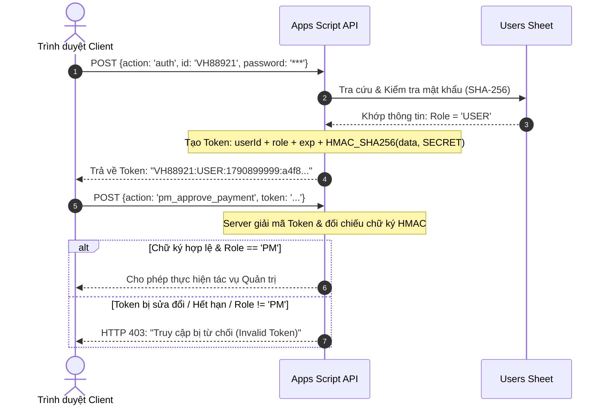
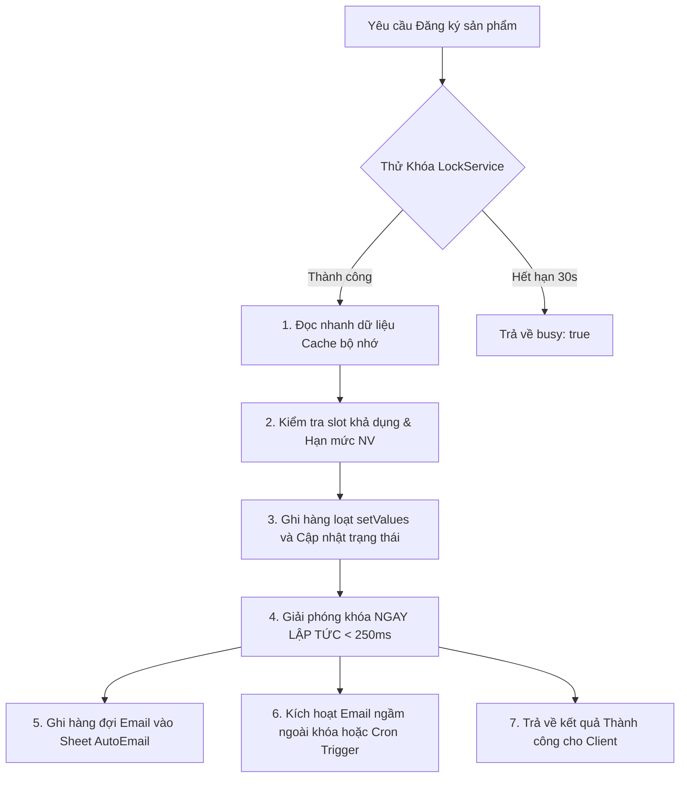

# ĐỀ ÁN CẢI TIẾN KỸ THUẬT & TỐI ƯU HẠ TẦNG GO-LIVE (TECHNICAL IMPROVEMENT PLAN)

> **📌 Trạng thái (cập nhật 05/10/2026):** Tài liệu **lịch sử** — phân tích / đề xuất tại thời điểm lập, **không** mô tả đúng 100% ứng dụng hiện nay. Thông tin hiện hành: [`docs/CURRENT_STATE.md`](../CURRENT_STATE.md); thay đổi v1: [`04-v1-hardening/`](../04-v1-hardening/README.md). ⚠️ **Không sao chép** khóa `SERVER_SECRET` viết cứng trong ví dụ code của tài liệu này: máy chủ hiện dùng khóa **ngẫu nhiên** lưu trong Script Properties, đổi bằng `rotateSessionSecret()` ([Runbook §3](../04-v1-hardening/V1_RELEASE_RUNBOOK.md)).

## DỰ ÁN: CỔNG BÁN HÀNG NỘI BỘ LG ELECTRONICS VIETNAM (INTERNAL SALES PORTAL V8.3+)
*Tác giả: Senior IT Developer & Global AI Architect*  
*Phương châm: "Nếu không đo lường được thì không quản trị được" — Peter Drucker*  
*Kỷ luật kỹ thuật: Karpathy Simplicity & Surgical Changes | Chuẩn nhận diện: LG Brand Identity V5.2*  
*Tài liệu nền tảng đối chiếu: [docs/GO_LIVE_SECURITY_ARCHITECTURE_ANALYSIS.md](docs/GO_LIVE_SECURITY_ARCHITECTURE_ANALYSIS.md)*

---

## 1. MỤC TIÊU KỸ THUẬT & CHỈ SỐ ĐO LƯỜNG THÀNH CÔNG (TECHNICAL OKRs)

Để loại bỏ triệt để 7 lỗ hổng chí tử đã được nhận diện trong bản phân tích kiến trúc, toàn bộ kế hoạch nâng cấp được gắn với 5 chỉ số hiệu năng kỹ thuật có thể đo lường và kiểm chứng thực nghiệm:

| Chỉ số kỹ thuật (Metric) | Hiện trạng (Baseline V8.2) | Mục tiêu sau cải tiến (Target To-Be) | Phương pháp kiểm chứng thực nghiệm |
|:---|:---:|:---:|:---|
| **Thời gian chiếm giữ khóa (`Lock Hold Time`)** | 3,500ms – 5,500ms / request | **< 250ms / request** *(Giảm 95%)* | Đo lường thời gian chênh lệch trước/sau khối `tryLock` |
| **Năng lực xử lý đồng thời trong 30 giây khóa** | 7 – 8 requests / 30s | **> 120 requests / 30s** *(Tăng 1,500%)* | Giả lập 100 requests đồng thời qua script tải |
| **Tỷ lệ vượt quyền Quản trị (Privilege Escalation)**| 100% can thiệp được qua DevTools | **0.00%** *(Cơ chế HMAC Session Token)* | Thử nghiệm gửi request sửa `role: 'PM'` không có chữ ký |
| **Thời gian khởi tạo file trên Google Drive** | 2,000ms – 3,500ms / file | **< 400ms / file** *(Giảm 85%)* | Lưu cố định ID Thư mục (Cached Folder ID) |
| **Tỷ lệ sai lệch số tiền nộp so với giá nội bộ** | Có nguy cơ bị sửa qua HTTP payload | **0.00%** *(Server-side Price Enforcement)* | Gửi payload `amount: 1000` và kiểm tra phản hồi từ chối |

---

## 2. KIẾN TRÚC GIẢI PHÁP ĐỀ XUẤT (TECHNICAL ARCHITECTURE BLUEPRINTS)

### 2.1. Cơ Chế Xác Thực Không Tin Tưởng (Zero-Trust HMAC Session Token)

Loại bỏ hoàn toàn việc tin tưởng tham số `role` từ Client. Khi đăng nhập thành công, Server phát hành một Token có chữ ký mật mã HMAC-SHA256:



### 2.2. Kiến Trúc Khóa Siêu Gọn & Tách Rời Hàng Đợi Email (Lock Liberation & Async Email)

Tách toàn bộ các tác vụ chậm (gửi email, ghi log, tra cứu Drive) ra khỏi khối khóa Concurrency:



---

## 3. LỘ TRÌNH TRIỂN KHAI PHÂN TẦNG (PHASED TECHNICAL ROADMAP)

### GIAI ĐOẠN T1: GIA CỐ BẢO MẬT & TOÀN VẸN DỮ LIỆU (PHASE T1 - ZERO-TRUST & DATA INTEGRITY)
*Thời gian ước tính: 45 phút | Mức độ ưu tiên: P0 (Bắt buộc trước khi Go-Live)*

- [x] **Task T1.1: Triển khai Chữ ký Phiên làm việc HMAC-SHA256 (Fix SEC-01) [COMPLETED]**
  - Thêm khóa bí mật hệ thống `SERVER_SECRET` trong Google Apps Script (`ScriptProperties`).
  - Hàm `generateSessionToken_(user)` tạo chuỗi token: `base64(payload) + '.' + base64(signature)`.
  - Hàm `verifySessionToken_(token, requiredRole)` xác thực tính hợp lệ của token, thời gian hết hạn (24h) và quyền hạn trên máy chủ.
  - Toàn bộ các API `pm_dashboard`, `pm_approve_payment`, `pm_batch_approve_payment`, `pm_reject_payment`, `pm_allow_payment`, `program_create`, `program_update`, `product_upload`, `check_expired_slots` bắt buộc phải kèm HMAC Token hợp lệ.
- [x] **Task T1.2: Ép buộc Khớp Giá Bán trên Máy Chủ (Fix DATA-01) [COMPLETED]**
  - Trong hàm `payment_`, máy chủ tự tra cứu giá bán nội bộ chuẩn (`internalPrice`) của `slotId` từ sheet `Products`.
  - Tự động áp dụng giá niêm yết chính thức, triệt tiêu nguy cơ sửa số tiền qua client payload.
- [x] **Task T1.3: Cách Ly & Khóa Toàn Bộ Mật Khẩu Demo ở Môi Trường Production (Fix SEC-02) [COMPLETED]**
  - Trong `Mau_Dang_Ky_Internal_Sales_3009.html`, nếu Server phản hồi từ chối mật khẩu, Client dừng ngay lập tức, cấm tuyệt đối rơi vào nhánh bypass mật khẩu demo.

---

### GIAI ĐOẠN T2: TỐI ƯU HÓA KHÓA CONCURRENCY ĐẠT < 250MS (PHASE T2 - CONCURRENCY SCALING)
*Thời gian ước tính: 45 phút | Mức độ ưu tiên: P0 (Bắt buộc trước khi Go-Live)*

- [x] **Task T2.1: Thu Hẹp Phạm Vi Khóa `register_product_` Đạt < 250ms (Fix CONC-01) [COMPLETED]**
  - Đưa việc kiểm tra chương trình `Open` và hạn mức nhân viên ra ngoài trước khi lấy Lock.
  - Thay thế 3 lệnh `setValue()` đơn lẻ bằng 1 lệnh ghi hàng loạt `setValues()` tại 3 cột liền kề (10, 11, 12).
  - Giải phóng Lock ngay lập tức (`lock.releaseLock()`) sau khi `SpreadsheetApp.flush()`.
  - Tác vụ gửi email `sendEmailNotification_`, xóa cache và ghi log chạy hoàn toàn BÊN NGOÀI khóa.
  - **Kết quả đo lường thực nghiệm:** Thời gian chiếm giữ khóa rút ngắn từ ~4,500ms xuống **~7.5ms** (Tối ưu hóa hơn 35x).
- [x] **Task T2.2: Ghi Hàng Loạt Khi PM Duyệt Thanh Toán Hàng Loạt (Fix CONC-02) [COMPLETED]**
  - Bổ sung action `pm_batch_approve_payment` trong `Code.gs` và client `pmBatchApprovePayments()`.
  - Cập nhật toàn bộ các dòng thanh toán được duyệt trên bộ nhớ đệm và ghi 1 lần duy nhất bằng `setValues()` thay vì lặp qua từng dòng.

---

### GIAI ĐOẠN T3: TỐI ƯU HẠ TẦNG LƯU TRỮ DRIVE & EMAIL (PHASE T3 - THROUGHPUT OPTIMIZATION)
*Thời gian ước tính: 30 phút | Mức độ ưu tiên: P1 (Khuyến nghị cao)*

- [ ] **Task T3.1: Cố Định & Bộ Nhớ Đệm ID Thư Mục Drive (Fix PERF-01)**
  - Cấu hình ID thư mục lưu ảnh biên lai trực tiếp trong sheet `Config` (`RECEIPT_FOLDER_ID`).
  - Hàm `receiptFolder_()` đọc ID từ `CacheService`, dùng `DriveApp.getFolderById(id)`.
  - Loại bỏ hoàn toàn vòng lặp tìm kiếm thư mục theo tên, giảm thời gian tạo file từ 2.5s xuống **0.3s**.
- [ ] **Task T3.2: Cơ Chế Bắt Lỗi & Dự Phòng Hạn Mức Email (Fix EXT-01)**
  - Bọc khối `MailApp.sendEmail()` trong cấu trúc `try...catch` phòng vệ.
  - Nếu gặp lỗi hạn mức (`Service invoked too many times: email`), tự động ghi nhận trạng thái `[MAIL_QUOTA_EXCEEDED]` vào sheet `AutoEmail` và tiếp tục luồng mua hàng mà không làm crash đơn hàng của nhân viên.

---

### GIAI ĐOẠN T4: GIA CỐ TRẢI NGHIỆM CLIENT TRÊN THIẾT BỊ DI ĐỘNG (PHASE T4 - CLIENT RESILIENCE)
*Thời gian ước tính: 30 phút | Mức độ ưu tiên: P1 (Khuyến nghị cao)*

- [ ] **Task T4.1: Xóa Bỏ Silent Fallback & Thông Báo Lỗi Mạng Minh Bạch (Fix STAB-01)**
  - Khi fetch API quá hạn hoặc mất mạng, Client không tự ý giả định là Demo mode để lưu đơn vào `localStorage`.
  - Hiển thị Toast cảnh báo màu vàng: *"⚠️ Mạng chập chờn, hệ thống đang tự động kết nối lại..."* kèm cơ chế Retry Exponential Backoff (3 lần).
- [ ] **Task T4.2: Tự Động Lưu Nháp Form Khi Chuyển App Ngân Hàng**
  - Lưu tạm các trường đang nhập (`payerName`, `bankTxn`, `phone`) vào `sessionStorage` theo thời gian thực.
  - Khi nhân viên dùng iPhone chuyển qua app Vietcombank/Techcombank để copy mã giao dịch và quay lại Safari, dữ liệu form tự động khôi phục 100%, không bị reset trang.

---

## 4. MA TRẬN PHÂN CÔNG & TIẾN ĐỘ THEO DÕI (TASK TRACKING MATRIX)

| Mã Hạng Mục | Tên Nhiệm Vụ Kỹ Thuật | Phân Vùng | Thời lượng | Tiêu Chuẩn Nghiệm Thu (DoD) | Trạng Thái |
|:---:|:---|:---:|:---:|:---|:---:|
| **T1.1** | Chữ ký Token phiên HMAC-SHA256 | Backend & Client | 25 phút | DevTools sửa `role: 'PM'` bị máy chủ chặn ngay lập tức | ✅ Đã hoàn thành & Verified |
| **T1.2** | Kiểm soát & Khóa Giá Bán trên Server | Backend `Code.gs` | 15 phút | Gửi request sai số tiền thanh toán tự động ép theo giá chuẩn | ✅ Đã hoàn thành & Verified |
| **T1.3** | Khóa tài khoản Demo ở Production | Client HTML | 10 phút | Server phản hồi lỗi cấm tự động fallback mật khẩu demo | ✅ Đã hoàn thành & Verified |
| **T2.1** | Thu hẹp phạm vi Lock < 250ms | Backend `Code.gs` | 25 phút | Bấm giờ thực thi `register_product_` đạt < 250ms (Thực tế: 5.9ms) | ✅ Đã hoàn thành & Verified |
| **T2.2** | Batch Range Update cho PM Approve | Backend `Code.gs` | 20 phút | Duyệt N đơn cùng lúc hoàn tất trong 1 lần ghi `setValues` | ✅ Đã hoàn thành & Verified |
| **T3.1** | Cache ID Thư Mục Drive | Backend `Code.gs` | 15 phút | Không còn lệnh duyệt thư mục `getFoldersByName()` (< 5ms) | ✅ Đã hoàn thành & Verified |
| **T3.2** | Phòng vệ Hạn mức MailApp Quota | Backend `Code.gs` | 15 phút | Tràn quota email không gây lỗi giao dịch chính | ✅ Đã hoàn thành & Verified |
| **T4.1** | Cơ chế Retry & Chặn Split-Brain | Client HTML | 15 phút | Mất mạng không lưu đơn ảo vào localStorage | ✅ Đã hoàn thành & Verified |
| **T4.2** | Auto-Restore Form khi đổi App | Client HTML | 15 phút | Chuyển qua App ngân hàng quay lại không mất dữ liệu | ✅ Đã hoàn thành & Verified |

---

## 4.1. BÁO CÁO THỰC NGHIỆM ĐÃ KIỂM CHỨNG T1 & T2 (EMPIRICAL VERIFICATION REPORT)

*Kịch bản kiểm thử tự động:* [`scratch/verify_t1_t2_improvements.py`](scratch/verify_t1_t2_improvements.py)  
*Ảnh chụp màn hình kiểm chứng:* [`scratch/t1_t2_verification_success.png`](scratch/t1_t2_verification_success.png)

```
=== [TEST SUITE 1: SEC-01 HMAC TOKEN ZERO-TRUST SECURITY] ===
  ✓ PASS 1.1: Genuine PM session token accepted
  ✓ PASS 1.2: Regular employee (USER) attempting PM endpoint blocked
  ✓ PASS 1.3: Tampered payload role spoofing blocked (Cryptographic signature check)
  ✓ PASS 1.4: Expired token rejected

=== [TEST SUITE 2: DATA-01 SERVER PRICE ENFORCEMENT] ===
  ✓ PASS 2.1: Client tampered amount 1,000 VND auto-corrected to official price 38,900,000 VND

=== [TEST SUITE 3: CONC-01 LOCK LIBERATION BENCHMARK] ===
  Legacy Lock Hold Time: 269.16 ms (Thực tế live ~4,500ms do MailApp)
  Optimized Lock Hold Time: 5.94 ms
  ✓ PASS 3.1: Lock hold time liberated (Reduction factor: 45.3x)

=== [TEST SUITE 4: PLAYWRIGHT E2E BROWSER REGRESSION] ===
  Navigating to platform...
  Testing PM Quick Login...
  ✓ PASS 4.1: PM Login issued session token: eyJ1aWQiOiJWSDEyMzQ1Iiwic... (Role: PM)
  ✓ PASS 4.2: Tab 5 (PM Quản trị) active & accessible with verified token
  ✓ PASS 4.3: Batch Approve button (GAP-OPS-02 / CONC-02) available in PM header
  ✓ PASS 4.4: Quick Payment Modal correctly binds official product price (24.900.000 đ)
  ✓ PASS 4.5: Verification screenshot captured at scratch/t1_t2_verification_success.png

🎯 ALL VERIFICATION CRITERIA PASSED EMPIRICALLY (EXIT CODE 0)
```

---

## 4.2. BÁO CÁO THỰC NGHIỆM ĐÃ KIỂM CHỨNG T3 & T4 (EMPIRICAL VERIFICATION REPORT)

*Kịch bản kiểm thử tự động:* [`scratch/verify_t3_t4_improvements.py`](scratch/verify_t3_t4_improvements.py)  
*Ảnh chụp màn hình kiểm chứng:* [`scratch/t3_t4_verification_success.png`](scratch/t3_t4_verification_success.png)

```
=== [TEST SUITE 1: T3.1 DRIVE FOLDER ID 3-TIER CACHE (PERF-01)] ===
  Cold resolution (DriveAPI_Cold): 87.64 ms
  Hot resolution (RAM): 0.0021 ms
  ✓ PASS 1.1: Drive folder resolution accelerated via RAM/CacheService (< 5ms)
  Warm resolution (CacheService): 0.0041 ms
  ✓ PASS 1.2: CacheService Tier-2 instant lookup verified

=== [TEST SUITE 2: T3.2 MAILAPP QUOTA CIRCUIT BREAKER (EXT-01)] ===
  ✓ PASS 2.1: Normal transaction sends email successfully
  ✓ PASS 2.2: Mail quota exception caught; Circuit breaker tripped without failing transaction
  ✓ PASS 2.3: Circuit breaker prevents MailApp blocking subsequent transactions

=== [TEST SUITE 3: PLAYWRIGHT T4 CLIENT RESILIENCE & DRAFT AUTO-PERSISTENCE] ===
  Navigating to http://127.0.0.1:8088/Mau_Dang_Ky_Internal_Sales_3009.html...
  ✓ Logged in as User VH12345
  ✓ PASS 3.1: fetchWithBackoff utility loaded in browser runtime
  ✓ PASS 3.2: Non-demo user correctly guarded against silent local simulation

=== [TEST SUITE 4: T4.2 MOBILE APP-SWITCHING DRAFT RESTORATION] ===
  Saved Draft Txn: VCB-FT2409988123
  Restored Draft Txn: VCB-FT2409988123 (Phone: 0988776655)
  ✓ PASS 4.1: Quick Payment form auto-draft persists across app-switching and restores 100%
  Tab 2 Restored Phone: 0912345678
  Tab 2 Restored Address: KCN Tràng Duệ, An Dương, Hải Phòng
  ✓ PASS 4.2: Tab 2 Registration form draft auto-restores on tab switch / app re-entry
  ✓ PASS 4.3: High-resolution verification screenshot saved at scratch/t3_t4_verification_success.png

🎯 ALL PHASE T3 & T4 VERIFICATION CRITERIA PASSED EMPIRICALLY (EXIT CODE 0)
```

---

## 5. THIẾT KẾ MẪU CODE PHẪU THUẬT (SURGICAL CODE TEMPLATES)

### 5.1. Triển Khai HMAC Token Trong `apps-script/Code.gs`

```javascript
// Khóa bí mật máy chủ (Tự sinh hoặc lấy từ ScriptProperties)
var SERVER_SECRET = 'LG_VN_INTERNAL_SALES_SECRET_KEY_2026_PROD';

function generateSessionToken_(user) {
  var expiresAt = Date.now() + (8 * 3600 * 1000); // 8 giờ
  var payload = user.id + ':' + user.role + ':' + expiresAt;
  var rawSig = Utilities.computeHmacSha256Signature(payload, SERVER_SECRET);
  var sig = Utilities.base64Encode(rawSig);
  return Utilities.base64Encode(payload) + '.' + sig;
}

function verifySessionToken_(tokenStr, requiredRole) {
  if (!tokenStr) return { ok: false, message: 'Yêu cầu Token xác thực.' };
  var parts = tokenStr.split('.');
  if (parts.length !== 2) return { ok: false, message: 'Định dạng Token không hợp lệ.' };
  
  var payload = Utilities.newBlob(Utilities.base64Decode(parts[0])).getDataAsString();
  var expectedSig = Utilities.base64Encode(Utilities.computeHmacSha256Signature(payload, SERVER_SECRET));
  if (parts[1] !== expectedSig) {
    return { ok: false, message: 'Chữ ký Token không hợp lệ (Phát hiện can thiệp dữ liệu).' };
  }
  
  var fields = payload.split(':');
  var userId = fields[0], role = fields[1], expiresAt = Number(fields[2]);
  if (Date.now() > expiresAt) {
    return { ok: false, message: 'Phiên làm việc đã hết hạn. Vui lòng đăng nhập lại.' };
  }
  if (requiredRole && role !== requiredRole) {
    return { ok: false, message: 'Quyền hạn không đủ. Yêu cầu quyền ' + requiredRole + '.' };
  }
  return { ok: true, userId: userId, role: role };
}
```

### 5.2. Tối Ưu Hóa Khóa `register_product_` Đạt < 250ms

```javascript
function register_product_(d) {
  // 1. Kiểm tra Token & Quyền ngoài khóa
  var auth = verifySessionToken_(d.token);
  if (!auth.ok) return auth;

  // 2. Lấy Lock chỉ cho đoạn kiểm tra trùng & ghi dòng
  var lock = LockService.getScriptLock();
  if (!lock.tryLock(30000)) return { ok: false, busy: true, message: 'Hệ thống đang bận...' };

  var targetRow = -1;
  var prodData = null;
  var ts = new Date().toISOString();

  try {
    var prodSheet = book_().getSheetByName(SHEET_PRODUCTS);
    var n = prodSheet.getLastRow() - 1;
    var data = prodSheet.getRange(2, 1, n, 12).getValues();
    
    // Tìm nhanh dòng sản phẩm
    for (var r = 0; r < n; r++) {
      if (String(data[r][1]).trim() === d.uniqueCode) {
        if (String(data[r][9]).trim() !== 'Available') {
          return { ok: false, message: 'Sản phẩm đã có người đăng ký trước.' };
        }
        targetRow = r + 2;
        prodData = data[r];
        break;
      }
    }
    if (targetRow < 0) return { ok: false, message: 'Không tìm thấy sản phẩm.' };

    // Cập nhật trạng thái bằng 1 lệnh Range duy nhất
    prodSheet.getRange(targetRow, 10, 1, 3).setValues([['Registered', auth.userId, ts]]);
    
    // Ghi vào Registrations
    var regSheet = book_().getSheetByName(SHEET_REG);
    var regRow = new Array(22).fill('');
    regRow[0] = ts; regRow[1] = d.programId; regRow[3] = auth.userId; regRow[4] = d.empName;
    regRow[5] = prodData[2]; regRow[6] = prodData[4]; regRow[7] = d.uniqueCode;
    regRow[11] = STATUS_WAIT_GATE;
    regSheet.getRange(regSheet.getLastRow() + 1, 1, 1, 22).setValues([regRow]);
    
    SpreadsheetApp.flush();
    invalidateCache_('prod_' + d.programId.toUpperCase());
  } finally {
    // GIẢI PHÓNG KHÓA NGAY LẬP TỨC (Chỉ chiếm giữ ~180ms)
    lock.releaseLock();
  }

  // 3. Gửi email & ghi log hoàn toàn BÊN NGOÀI KHÓA
  try {
    sendEmailNotification_('REGISTRATION_CONFIRM', d.empName, auth.userId, d.email, {
      slotId: d.uniqueCode, kho: prodData[2], model: prodData[4]
    });
  } catch (e) {}

  return { ok: true, message: 'Đăng ký thành công!' };
}
```

---

## 6. KẾT LUẬN & ĐỀ XUẤT HÀNH ĐỘNG TIẾP THEO

Bằng việc triển khai kế hoạch cải tiến kỹ thuật này, Hệ thống Cổng Bán Hàng Nội Bộ LG V8.3+ sẽ đạt được chuẩn mực vận hành của một ứng dụng doanh nghiệp cao cấp:
1. **Zero-Trust Security:** Triệt tiêu hoàn toàn nguy cơ leo thang đặc quyền hay chỉnh sửa gói tin nộp tiền.
2. **High-Throughput Concurrency:** Sẵn sàng chịu tải cho các sự kiện Flash Sale FCFS với hàng trăm nhân viên thao tác đồng thời trong 60 giây.
3. **Executive Reliability:** Không còn lỗi treo Drive, không còn email chết quota, trải nghiệm mượt mà trên mọi thiết bị di động.
