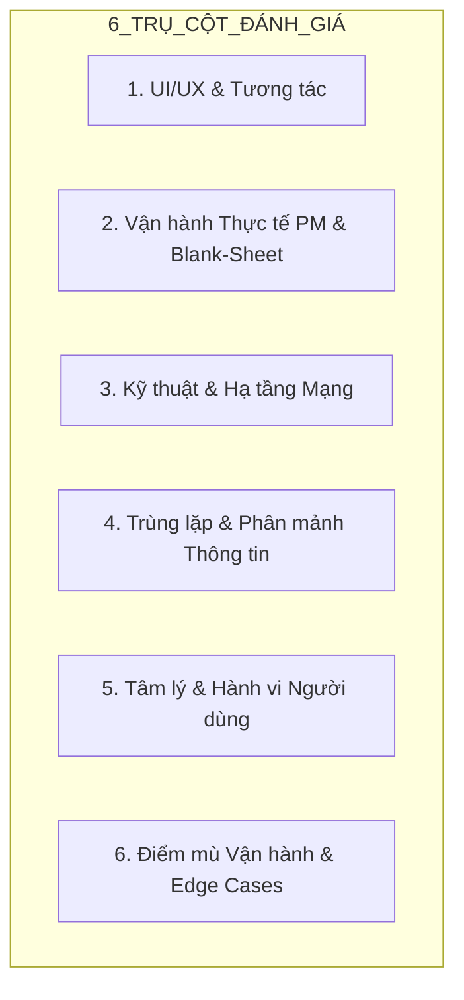
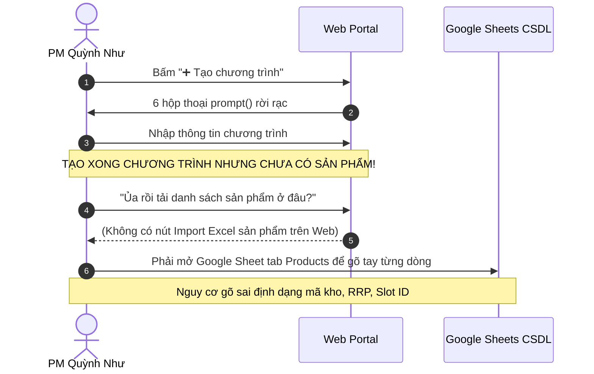
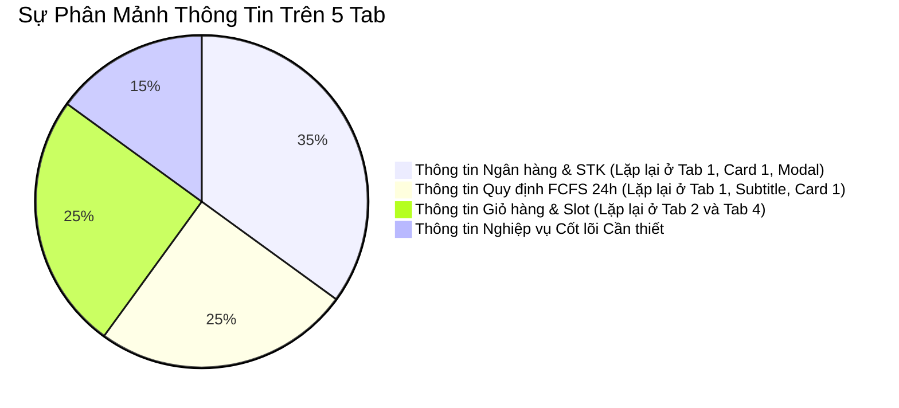
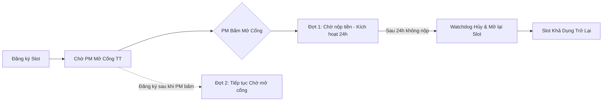

# BÁO CÁO ĐÁNH GIÁ KHOẢNG TRỐNG VẬN HÀNH & TRẢI NGHIỆM NGƯỜI DÙNG (DEEP GAP ANALYSIS)

> **📌 Trạng thái (cập nhật 05/10/2026):** Tài liệu **lịch sử** — phân tích / đề xuất tại thời điểm lập, **không** mô tả đúng 100% ứng dụng hiện nay. Thông tin hiện hành: [`docs/CURRENT_STATE.md`](../CURRENT_STATE.md); thay đổi v1: [`04-v1-hardening/`](../04-v1-hardening/README.md).

## HỆ THỐNG CỔNG BÁN HÀNG NỘI BỘ LG (INTERNAL SALES PORTAL V8)
*Tiêu chuẩn thẩm định: Karpathy Epistemics & LG Brand Identity V5.2*  
*Ngày lập: 01/10/2026 | Phiên bản mã nguồn đối chiếu: `Mau_Dang_Ky_Internal_Sales_3009.html` & `apps-script/Code.gs`*

---

## 1. PHƯƠNG PHÁP & TIÊU CHÍ ĐÁNH GIÁ (EVALUATION FRAMEWORK)

Báo cáo này được lập dựa trên kết quả **Roleplay thực tế 100%** từ hai góc nhìn thực chứng:
1. **Persona 1 — Chị Quỳnh Như (PM Quản lý ngành hàng):** Không rành công nghệ, bận rộn, ghét quy trình phức tạp nhiều bước, muốn mở đợt bán hàng nhanh, duyệt đơn lẹ và xuất danh sách chuẩn cho Logistics giao hàng.
2. **Persona 2 — Anh Văn Nam (Nhân viên mua hàng):** Không rành thao tác web, sợ mất lượt mua trong giờ cao điểm FCFS, dễ nhập sai thông tin, ghét gõ lại những gì hệ thống đã biết (đòi hỏi Zero-Typing tối đa).



---

## 2. CHI TIẾT 6 CHIỀU KHOẢNG TRỐNG (6-DIMENSIONAL GAP ANALYSIS)

### TRỤ CỘT 1: KHOẢNG TRỐNG UI/UX & TƯƠNG TÁC (INTERFACE & INTERACTION GAPS)

| Mã ID | Điểm chạm giao diện | Thực trạng mã nguồn hiện tại | Trải nghiệm người dùng (Persona Reaction) | Mức độ |
|:---:|:---|:---|:---|:---:|
| **GAP-UX-01** | **Tạo chương trình mới** | Dùng 6 hộp thoại `prompt()` liên tiếp của trình duyệt ([L3085–3096](Mau_Dang_Ky_Internal_Sales_3009.html#L3085-L3096)). | **PM:** *"Trời ơi, bấm Tạo chương trình mà máy cứ nhảy pop-up hỏi mã, hỏi tên, hỏi ngày giờ 6 lần liền! Gõ nhầm 1 chữ là mất trắng phải làm lại từ đầu."* | **P0 (Khẩn cấp)** |
| **GAP-UX-02** | **Thông báo hệ thống** | Dùng lệnh `alert()` và `confirm()` nguyên bản của trình duyệt ([L3570](Mau_Dang_Ky_Internal_Sales_3009.html#L3570), [L3601](Mau_Dang_Ky_Internal_Sales_3009.html#L3601), [L4101](Mau_Dang_Ky_Internal_Sales_3009.html#L4101)). | **User & PM:** Cảm giác web thiếu chuyên nghiệp; trên điện thoại iPhone/Android, pop-up chiếm toàn màn hình, bấm nhầm "Chặn cửa sổ bật lên" là đơ luôn trang. | **P1 (Cao)** |
| **GAP-UX-03** | **Cập nhật trạng thái cổng thanh toán** | Khi PM bấm Mở cổng thanh toán, User đang mở web không thấy trạng thái đổi ngay nếu không F5 hoặc chuyển tab ([L3216](Mau_Dang_Ky_Internal_Sales_3009.html#L3216)). | **User:** *"PM thông báo trên Zalo là mở cổng rồi mà tôi nhìn vào web vẫn thấy ghi 'Chờ PM duyệt', không biết bấm vào đâu để nộp tiền!"* | **P0 (Khẩn cấp)** |
| **GAP-UX-04** | **Xem ảnh biên lai chuyển khoản** | Mở trong tab mới hoặc popup nhỏ; thiếu nút xoay ảnh (rotate) khi nhân viên chụp ảnh bị ngược. | **PM:** *"Nhân viên chụp ảnh chuyển khoản chụp ngang chụp ngược, mắt tôi kèm nhèm phải nghiêng cả màn hình để đối chiếu số tiền!"* | **P2 (Trung bình)** |

---

### TRỤ CỘT 2: KHOẢNG TRỐNG VẬN HÀNH "TỪ TRANG GIẤY TRẮNG" (BLANK-SHEET OPERATIONAL GAPS)



1. **Khoảng trống Import Sản phẩm (GAP-OPS-01 - P0):**
   - **Thực tế:** Một đợt bán hàng nội bộ có từ 50 đến 200 sản phẩm với đầy đủ mã Model, Kho (AYA, AYB, AYC), Giá niêm yết (RRP), Giá nội bộ, Số lượng.
   - **Điểm nghẽn:** Trên Web Portal hoàn toàn **chưa có chức năng "Tải lên file Excel sản phẩm (Import Catalog)"** cho PM. PM tạo xong chương trình mới thì chương trình đó trống trơn (0 sản phẩm). PM bắt buộc phải mở Google Sheet để gõ tay hoặc copy-paste vào tab `Products`, rất dễ làm hỏng công thức hoặc sai lệch tên cột.
2. **Khoảng trống Phê duyệt Thanh toán Hàng loạt (GAP-OPS-02 - P1):**
   - Khi có 100 nhân viên nộp tiền, PM phải bấm duyệt từng đơn lẻ `[✅ Duyệt tiền]` 100 lần. Chưa có tính năng "Duyệt nhanh hàng loạt các đơn khớp 100% số tiền".
3. **Khoảng trống Phân bổ Giao hàng Logistics (GAP-OPS-03 - P1):**
   - Danh sách xuất cho kho/vận chuyển cần phân loại theo: Địa chỉ nhận tại nhà máy Tràng Duệ vs Giao về nhà riêng; thời gian giao hàng mong muốn.

---

### TRỤ CỘT 3: KHOẢNG TRỐNG KỸ THUẬT & HẠ TẦNG (TECHNICAL & NETWORK GAPS)

```
[Lỗi Phân Tách Cột CSV - GAP-TECH-01]
Header:   STT, Mã Slot, Kho, Model, Mô tả sản phẩm, Giá nội bộ...
Row Data: 1, HA-001, AYA, WT1410NHEG, Tháp giặt sấy WashTower 14kg giặt / 10kg sấy, 32500000...
                                        ▲                     ▲
                                        └──────DẤU PHẨY───────┘
                                   (Bị Excel tách thành 2 cột riêng biệt!)
```

1. **Lỗi tràn cột file Excel CSV (GAP-TECH-01 - P0):**
   - **Vị trí mã nguồn:** [L4336–4361](Mau_Dang_Ky_Internal_Sales_3009.html#L4336-L4361).
   - **Nguyên nhân:** Các trường `model`, `description`, `category` không được bọc trong dấu ngoặc kép `""`. Khi mô tả sản phẩm có dấu phẩy (ví dụ: `Tháp giặt sấy, 14kg giặt`), Excel tự động ngắt thành cột mới, làm toàn bộ các cột phía sau (Giá tiền, Mã NV, SĐT, Địa chỉ) bị xô lệch hoàn toàn!
2. **Lỗi tải ảnh định dạng Apple HEIC trên iPhone (GAP-TECH-02 - P1):**
   - **Vị trí mã nguồn:** [L3331–3360](Mau_Dang_Ky_Internal_Sales_3009.html#L3331-L3360) hàm `compressImageFile`.
   - **Nguyên nhân:** Nhân viên dùng iPhone chụp màn hình biên lai ngân hàng thường lưu file dưới dạng `.heic`. Thẻ `<canvas>` của trình duyệt không vẽ được ảnh HEIC thô, dẫn đến ảnh bị trắng hoặc lỗi không gửi được biên lai.
3. **Độ trễ Google Apps Script & Quá hạn kết nối (GAP-TECH-03 - P1):**
   - Các lệnh gọi `fetch(SHEET_API_URL)` có thể mất 3–5 giây vào giờ cao điểm. Cần cơ chế Optimistic UI triệt để kèm thông báo trạng thái nền (Background Sync Queue) để người dùng không cảm giác bị "đơ chuột".

---

### TRỤ CỘT 4: KHOẢNG TRỐNG TRÙNG LẶP & PHÂN MẢNH THÔNG TIN (DUPLICATION GAPS)



1. **Trùng lặp Tab 1 (Thư thông báo) và Card 1 (Brief Dashboard):**
   - Thư thông báo ở Tab 1 có tới 90 dòng chữ văn bản dài dòng. Trong khi đó, 90% nhân viên chỉ cần biết 3 thông tin: STK chuyển khoản, Cú pháp, và Hạn mức 1 SP. Card 1 trên Brief Dashboard đã hiển thị đầy đủ, biến Tab 1 thành vùng thông tin "rác" ít người đọc.
2. **Trùng lặp Tab 2 (Danh mục đặt hàng) và Tab 4 (Tra cứu danh sách Slot):**
   - Tab 4 hiển thị bảng 90 slot cũ. Nhân viên bị bối rối: *"Tôi nên đăng ký ở Tab 2 hay Tab 4?"*. Cần hợp nhất tính năng tra cứu chi tiết vào ngay bộ lọc thông minh của Tab 2.

---

### TRỤ CỘT 5: HÀNH VI & SAI LỖI CON NGƯỜI (HUMAN-ERROR BEHAVIORAL GAPS)

1. **Nhập sai Mã giao dịch ngân hàng (Txn Ref) (GAP-BHV-01 - P1):**
   - **Thực tế:** Nhân viên chuyển khoản xong thường không biết "Mã giao dịch" là dãy số nào trên app ngân hàng (VCB, Techcombank, MB...). Họ hay gõ bừa: `ok`, `da chuyen`, `123456`, `chuyen tien`.
   - **Hậu quả:** PM kiểm tra số phụ ngân hàng không tài nào tìm được lệnh chuyển tiền tương ứng.
2. **Nhầm lẫn thời điểm đếm ngược 24h (GAP-BHV-02 - P1):**
   - Khi đăng ký xong (Chờ mở cổng thanh toán), đồng hồ 24h **chưa chạy**. Nhưng nhân viên hay tưởng là sắp hết hạn nên sốt ruột giục PM hoặc chuyển khoản trước khi PM mở cổng.
3. **Quên lưu mật khẩu mới (GAP-BHV-03 - P2):**
   - Nhân viên đổi mật khẩu xong rồi quên ngay, sau đó không đăng nhập lại được và làm phiền Admin hỗ trợ reset.

---

### TRỤ CỘT 6: ĐIỂM MÙ VẬN HÀNH & TÌNH HUỐNG BIÊN (OPERATIONAL BLINDSPOTS)



1. **Xử lý đơn đăng ký lọt giữa 2 đợt mở cổng (GAP-EDGE-01 - P1):**
   - Nhân viên A đăng ký lúc 09:00 $\rightarrow$ 09:15 PM mở cổng $\rightarrow$ A được nộp tiền.
   - Nhân viên B đăng ký lúc 09:16 $\rightarrow$ B tiếp tục ở trạng thái `Chờ mở thanh toán`.
   - **Điểm mù:** Hệ thống cần có đồng hồ đếm ngược báo cho B biết: *"Dự kiến đợt mở cổng tiếp theo vào lúc 11:30"* để B không lo lắng bị mất slot.
2. **Xử lý hủy đơn sau khi đã mở cổng thanh toán (GAP-EDGE-02 - P1):**
   - Nếu nhân viên đổi ý không muốn mua nữa trước khi nộp tiền, họ cần có nút **"Hủy giữ chỗ"** chủ động để giải phóng ngay slot cho đồng nghiệp khác mà không phải đợi hết 24h.

---

## 3. BẢNG TỔNG HỢP MA TRẬN KHOẢNG TRỐNG (GAP MATRIX & PRIORITIZATION)

| Mã ID | Tên khoảng trống | Trụ cột | Mức độ rủi ro | Mức độ ưu tiên | Giải pháp cốt lõi |
|:---:|:---|:---:|:---:|:---:|:---|
| **GAP-UX-01** | Tạo chương trình bằng 6 pop-up prompt | UX | Gây ức chế, dễ gõ sai | **P0** | Thay bằng Modal chuẩn LG Brand 1 màn hình |
| **GAP-OPS-01**| Chưa có giao diện nạp Excel sản phẩm | Vận hành | PM không tạo được hàng mới | **P0** | Thêm tính năng Import Excel danh mục SP |
| **GAP-TECH-01**| Lỗi xô lệch cột file Excel CSV xuất ra | Kỹ thuật | Kế toán/Kho không dùng được file | **P0** | Bọc quote `""` chuẩn RFC 4180 cho CSV |
| **GAP-UX-03** | Thiếu cập nhật Realtime khi mở cổng TT | Tương tác | User không biết đã được nộp | **P0** | Thêm Badge trạng thái nhấp nháy & Tự refresh |
| **GAP-UX-02** | Dùng alert/confirm nguyên bản | UX | Thiếu chuyên nghiệp, dễ bị chặn | **P1** | Thay bằng Toast Notification cao cấp |
| **GAP-BHV-01**| Nhân viên nhập sai Txn Ref ngân hàng | Hành vi | Khó khăn đối soát ngân hàng | **P1** | Ảnh hướng dẫn mẫu Txn Ref của các ngân hàng |
| **GAP-TECH-02**| Lỗi upload file ảnh iPhone (.heic) | Kỹ thuật | Trắng ảnh biên lai nộp tiền | **P1** | Thêm thư viện heic2any chuyển tự động sang JPG |
| **GAP-OPS-02**| Thiếu nút Duyệt thanh toán hàng loạt | Vận hành | Tốn công PM click từng đơn | **P1** | Nút "Duyệt tất cả đơn đã có ảnh biên lai" |
| **GAP-EDGE-02**| Thiếu nút tự Hủy giữ chỗ cho User | Vận hành | Slot bị ngâm oan 24 giờ | **P1** | Nút "Hủy đăng ký giữ chỗ" trước khi nộp |
| **GAP-DUP-01**| Phân mảnh 5 Tab trùng lặp nội dung | UX | Người dùng chuyển tab rối loạn | **P2** | Tích hợp thu gọn các Tab phụ vào Drawer |
