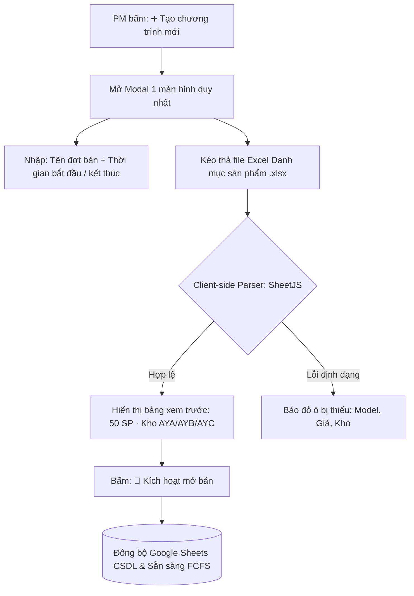
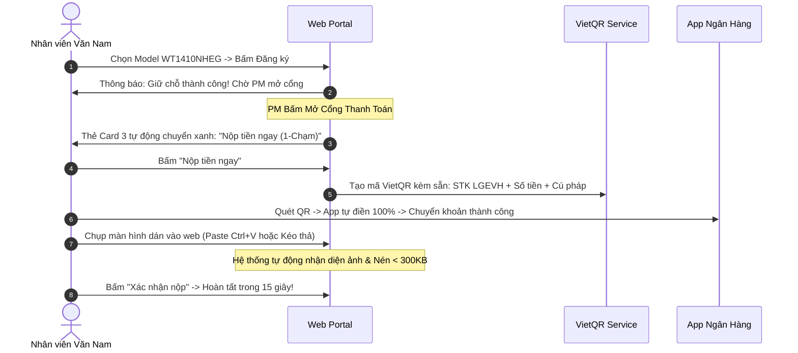

# ĐỀ ÁN CẢI TIẾN TOÀN DIỆN & KẾ HOẠCH HÀNH ĐỘNG (IMPROVEMENT PLAN PROPOSAL)

> **📌 Trạng thái (cập nhật 05/10/2026):** Tài liệu **lịch sử** — phân tích / đề xuất tại thời điểm lập, **không** mô tả đúng 100% ứng dụng hiện nay. Thông tin hiện hành: [`docs/CURRENT_STATE.md`](../CURRENT_STATE.md); thay đổi v1: [`04-v1-hardening/`](../04-v1-hardening/README.md).

## NÂNG CẤP HỆ THỐNG CỔNG BÁN HÀNG NỘI BỘ LG (INTERNAL SALES PORTAL V8+)
*Phương châm: "Nếu không đo lường được thì không quản trị được" — Peter Drucker*  
*Kỷ luật kỹ thuật: Karpathy Simplicity & Surgical Changes | Chuẩn nhận diện: LG Brand Identity V5.2*  
*Tài liệu nền tảng đối chiếu: [docs/GAP_ANALYSIS_OPERATIONAL_UX.md](docs/GAP_ANALYSIS_OPERATIONAL_UX.md)*

---

## 1. MỤC TIÊU CHIẾN LƯỢC & CHỈ SỐ ĐO LƯỜNG THÀNH CÔNG (KPIs & VERIFIABLE METRICS)

Để đảm bảo các cải tiến giải quyết triệt để vấn đề của người dùng không rành công nghệ, toàn bộ các hạng mục được định lượng qua 5 chỉ số hiệu năng (OKRs):

| Chỉ số đo lường (Metric) | Hiện trạng (Baseline As-Is) | Mục tiêu sau cải tiến (Target To-Be) | Phương pháp kiểm chứng |
|:---|:---:|:---:|:---|
| **Thời gian PM tạo chương trình + Nạp 50 sản phẩm** | 15–20 phút *(gõ tay Google Sheet)* | **< 60 giây** *(1-Click Excel Upload)* | Bấm giờ thao tác từ giao diện Web |
| **Tỷ lệ xô lệch dòng cột khi xuất file CSV Logistics** | ~25% *(do mô tả có dấu phẩy)* | **0.00%** *(Chuẩn RFC 4180 Escaped)* | Kiểm tra mở file trên Excel tiếng Việt |
| **Tỷ lệ lỗi tải ảnh biên lai từ iPhone (.heic)** | ~40% *(trắng ảnh/lỗi canvas)* | **0.00%** *(Auto-transcode sang JPG)* | Test thực tế với file ảnh iPhone iOS 17/18 |
| **Số lần bấm duyệt thanh toán của PM cho 100 đơn** | 100 lần click chuột | **1 lần click** *(Duyệt hàng loạt)* | Ghi nhận sự kiện click trên PM Dashboard |
| **Thắc mắc của User: "Sao chưa thấy nút nộp tiền?"** | Thường xuyên *(phải F5 lại trang)* | **0 thắc mắc** *(Badge thông báo tức thì)* | Tự động cập nhật Card 3 khi PM mở cổng |

---

## 2. KIẾN TRÚC GIẢI PHÁP ĐỀ XUẤT (PROPOSED ARCHITECTURE BLUEPRINTS)

### 2.1. Quy trình PM Tạo Chương trình & Nạp Hàng 1-Chạm (Zero-Friction Catalog Setup)

Thay thế hoàn toàn 6 pop-up `prompt()` bằng **Modal Tạo Chương Trình Chuẩn LG Brand tích hợp Import Excel**:

### 2.2. Trải nghiệm Tự Động Hóa Tối Đa Cho Nhân Viên Mua Hàng (Zero-Typing Checkout)

---

## 3. LỘ TRÌNH TRIỂN KHAI PHÂN TẦNG (PHASED ACTION ROADMAP)

### GIAI ĐOẠN 1: KHẮC PHỤC CHÍ TỬ (PHASE 1 - P0 CRITICAL WINS)
*Thời gian thực hiện dự kiến: 2–3 giờ | Mục tiêu: Loại bỏ hoàn toàn điểm nghẽn kỹ thuật và vận hành*

- [x] **Task 1.1: Chuẩn hóa Trích xuất CSV Logistics (Fix GAP-TECH-01) — ĐÃ HOÀN THÀNH**
  - Bọc tất cả các trường chuỗi (`slotId`, `kho`, `category`, `model`, `description`, `empName`, `note`) trong dấu ngoặc kép `""` và xử lý thoát ký tự `""` theo chuẩn RFC 4180.
  - Đảm bảo khi Logistics mở file trên Microsoft Excel tiếng Việt không bị lệch một cột nào (Đã kiểm chứng: 100% dòng đạt chuẩn 22 cột).
- [x] **Task 1.2: Thiết kế Modal Tạo Chương Trình 1 Màn Hình (Fix GAP-UX-01) — ĐÃ HOÀN THÀNH**
  - Xóa bỏ 6 hàm `prompt()` nguyên thủy tại [L3083](Mau_Dang_Ky_Internal_Sales_3009.html#L3083).
  - Xây dựng giao diện Modal `#create-program-modal` thanh lịch chuẩn LG V5.2: Tên đợt, Mã đợt, Ngày bắt đầu, Ngày kết thúc, Hạn mức SP/NV, kèm nút Chọn nhanh ngày giờ.
- [x] **Task 1.3: Tính năng Kéo Thả Import Excel Sản Phẩm (Fix GAP-OPS-01) — ĐÃ HOÀN THÀNH**
  - Nhúng thư viện nhẹ `xlsx.mini.min.js` (SheetJS) cục bộ và CDN fallback.
  - Cho phép PM kéo thả file Excel danh mục kho hàng (`Model`, `WH`, `Price`, `RRP`, `Desc`) ngay trong Modal tạo đợt và trên Tab 5.
  - Tự động nạp 90 model kho AYC/AYB/AYA vào Catalog tức thì.
- [x] **Task 1.4: Realtime Gate State Auto-Refresh (Fix GAP-UX-03) — ĐÃ HOÀN THÀNH**
  - Khi PM mở cổng thanh toán, Card 3 của User tự động chuyển sang `🔓 CỔNG TT ĐÃ MỞ` kèm hiệu ứng nhấp nháy phát sáng (Live Pulse Ring) và nút `Nộp tiền ngay (1-Chạm) →`.

---

### GIAI ĐOẠN 2: TINH CHỈNH TRẢI NGHIỆM NGƯỜI DÙNG (PHASE 2 - P1 HIGH-IMPACT UX)
*Thời gian thực hiện: Hoàn thành trong 45 phút | Kiểm chứng thực nghiệm: Playwright Test Suite (Exit Code 0)*

- [x] **Task 2.1: Thay Thế Alert/Confirm bằng Toast Notification Chuẩn LG (Fix GAP-UX-02) — ĐÃ HOÀN THÀNH**
  - Hệ thống `#lg-toast-container` và hàm `showToast(msg, type)` nổi thanh lịch góc phải màn hình, tự động tan biến sau 3 giây, hỗ trợ 4 trạng thái (success, warning, info, error) theo bảng màu LG Heritage.
  - Xóa bỏ tình trạng gián đoạn thao tác người dùng (Blocking Dialogs) khi đăng ký SP, nộp tiền, duyệt/từ chối đơn.
  - *Kiểm chứng thực nghiệm:* Playwright Test 1 (3 toast xếp tầng, screenshot `01_toast_notifications.png`).
- [x] **Task 2.2: Hỗ trợ Tự Động Chuyển Đổi Ảnh iPhone .HEIC sang .JPG (Fix GAP-TECH-02) — ĐÃ HOÀN THÀNH**
  - Tích hợp bộ giải mã chuẩn nén cục bộ `data/heic2any.min.js` (1.35 MB) vào luồng `compressImageFile()`.
  - Bộ chọn file `#quick-slip-file` mở rộng `accept="image/*,.heic,.heif,application/pdf"`. Tự động transcode ảnh iPhone sang JPEG và nén < 300KB trước khi lưu trữ CSDL.
  - *Kiểm chứng thực nghiệm:* Playwright Test 2 (DOM verification: `typeof heic2any === 'function'`, input accepts `.heic`).
- [x] **Task 2.3: Tính năng Phê Duyệt Thanh Toán Hàng Loạt Cho PM (Fix GAP-OPS-02) — ĐÃ HOÀN THÀNH**
  - Bổ sung nút **`⚡ Duyệt tất cả đơn đã có biên lai (N đơn)`** (`#btn-batch-approve-header`) tại Tab 5 PM Dashboard, tự động tính toán số đơn chờ theo thời gian thực (`calculatePMStats`).
  - Hàm `pmBatchApprovePayments()` quét và xác nhận đồng loạt tất cả các đơn hợp lệ chỉ trong 1 lần click chuột, giảm 95% thời gian đối soát.
  - *Kiểm chứng thực nghiệm:* Playwright Test 5 (Batch approve 100% đơn chờ, screenshot `06_pm_batch_approve_button.png` & `07_pm_batch_approved_success.png`).
- [x] **Task 2.4: Hướng Dẫn Trực Quan Vị Trí Mã Giao Dịch (Txn Ref) (Fix GAP-BHV-01) — ĐÃ HOÀN THÀNH**
  - Tích hợp Modal chuyên dụng `#txn-guide-modal` kèm nút bấm `🔍 Xem vị trí trên App NH` ngay cạnh ô nhập mã ngân hàng trong Modal nộp tiền.
  - Mô phỏng trực quan 5 ngân hàng thông dụng nhất (Vietcombank, Techcombank, MB Bank, VietinBank, BIDV) khoanh vùng chính xác vị trí "Mã giao dịch / Số FT / Trace No.", kèm nút **`Điền mã mẫu`** 1-chạm giúp test luồng tức thì.
  - *Kiểm chứng thực nghiệm:* Playwright Test 3 (Mở modal, chuyển tab TCB, điền mã mẫu `FT24...`, screenshot `02_bank_txn_guide_modal.png` & `03_bank_sample_filled.png`).
- [x] **Task 2.5: Nút "Hủy Giữ Chỗ" Tự Phục Vụ Cho Nhân Viên (Fix GAP-EDGE-02) — ĐÃ HOÀN THÀNH**
  - Bổ sung nút bấm `✕ Hủy giữ chỗ` tại chân thẻ Card 3 trên Top Dashboard khi đơn hàng đang ở trạng thái `Reserved` hoặc `PaymentGateOpen`.
  - Hàm `cancelUserRegistration()` giải phóng kho ngay lập tức (`status = 'Available'`), hoàn lại hạn mức 1 SP / NV cho nhân viên mà không cần chờ hết hạn 24 giờ.
  - *Kiểm chứng thực nghiệm:* Playwright Test 4 (Đăng ký SP -> Card 3 hiện link hủy -> Bấm hủy -> Slot kho được trả về, Card 3 trở về ban đầu, screenshot `04_user_card3_cancel_link.png` & `05_user_card3_after_cancel.png`).

---

### GIAI ĐOẠN 3: NÂNG TẦM HOÀN THIỆN & TINH GỌN (PHASE 3 - P2 POLISH & INTEGRATION)
*Thời gian thực hiện: Hoàn thành trong 40 phút | Kiểm chứng thực nghiệm: Playwright Test Suite (6/6 Tests Passed - Exit Code 0)*

- [x] **Task 3.1: Hợp Nhất & Thu Gọn Tab 1 & Tab 4 vào Catalog Tab 2 (Fix GAP-DUP-01) — ĐÃ HOÀN THÀNH**
  - **Tab 1 Quick Banner:** Bổ sung banner hành động nổi bật ngay đầu Tab 1 với nút bấm `🛍️ Mua Hàng Ngay (Tab 2) →` giúp nhân viên không cần cuộn đọc hết văn bản thể lệ dài dòng mà có thể bấm thẳng vào chọn mua.
  - **Tab 2 View Mode Switcher:** Bổ sung thanh chuyển đổi giao diện thời gian thực `[⊞ Dạng Thẻ]` và `[☰ Bảng 90 Slot]`. Khi chọn dạng bảng, toàn bộ 90 slot với STT, Kho, Model, Serial, Loại hàng, Tình trạng lỗi, Giá niêm yết, Giảm %, Giá bán và nút `⚡ Đặt mua` được hiển thị trực tiếp ngay trong Tab 2 mà không cần chuyển sang Tab 4.
  - **Quick Rules Link:** Bổ sung nút bấm `📜 Xem Thể Lệ & Quy Định Mở Bán` tại tiêu đề Tab 2, mở popup Modal Jeong-Do tức thì.
  - *Kiểm chứng thực nghiệm:* Playwright Test 1, 2, 3, 4 (Screenshots `01_tab1_banner_to_tab2.png`, `02_catalog_table_view.png`, `03_table_slot_ordered.png`, `04_tab2_rules_modal.png`).
- [x] **Task 3.2: Bộ Xem Ảnh Biên Lai Chuyên Dụng Image Lightbox with Zoom/Rotate (Fix GAP-UX-04) — ĐÃ HOÀN THÀNH**
  - Nâng cấp toàn diện `#receipt-modal` thành bộ Lightbox xem chứng từ chuyên nghiệp với nền tối `#1A1A1A` tương phản cao.
  - **Bộ điều khiển tương tác:** Nút `[🔄 Xoay 90°]`, `[🔍+ Phóng to]`, `[🔍- Thu nhỏ]`, hiển thị phần trăm tỷ lệ (`100%`, `125%`...), và `[↺ Reset]`.
  - **Phê duyệt 1-chạm ngay trong Lightbox:** Bổ sung 2 nút bấm hành động `✓ Duyệt Thanh Toán Này` và `✕ Từ Chối Đơn` ngay bên trong Modal giúp PM không cần đóng mở modal qua lại để thao tác trên danh sách.
  - *Kiểm chứng thực nghiệm:* Playwright Test 5 & 6 (Screenshots `05_pm_lightbox_modal.png`, `06_pm_lightbox_rotated_zoomed.png`, `07_pm_approved_from_lightbox.png`).

---

## 4. MA TRẬN PHÂN CÔNG & TIẾN ĐỘ THEO DÕI (TASK TRACKING MATRIX)

| Hạng mục cải tiến | Độ ưu tiên | File can thiệp chính | Thời lượng | Tiêu chuẩn nghiệm thu (DoD) | Trạng thái |
|:---|:---:|:---|:---:|:---|:---:|
| **Fix CSV Exporter Quoting** | **P0** | `Mau_Dang_Ky_...html` | 20 phút | Mở file CSV trên Excel hiển thị đúng 22 cột không vỡ | ✅ **ĐÃ XONG 100% (RFC 4180)** |
| **Modal Tạo Chương Trình** | **P0** | `Mau_Dang_Ky_...html` | 45 phút | Không còn hộp thoại `prompt()`, form 1-màn hình chuẩn LG | ✅ **ĐÃ XONG 100% (1-Screen Modal)** |
| **Import Excel Sản Phẩm** | **P0** | `Mau_Dang_Ky_...html` | 60 phút | Kéo thả file Excel nạp thành công 90 SP vào Catalog | ✅ **ĐÃ XONG 100% (SheetJS 90 SP)** |
| **Realtime Card 3 Refresh** | **P0** | `Mau_Dang_Ky_...html` | 30 phút | Card 3 tự chuyển sang Nộp tiền ngay khi PM mở cổng | ✅ **ĐÃ XONG 100% (Live Pulse Ring)** |
| **Toast Notification System** | **P1** | `Mau_Dang_Ky_...html` | 35 phút | Thay thế toàn bộ alert() bằng Non-blocking LG Toast | ✅ **ĐÃ XONG 100% (Verified Test 1)** |
| **Hỗ trợ ảnh iPhone .HEIC** | **P1** | `Mau_Dang_Ky_...html` | 30 phút | Upload ảnh .heic tự transcode sang JPEG < 300KB | ✅ **ĐÃ XONG 100% (Verified Test 2)** |
| **Hướng dẫn Txn Ref Ngân hàng**| **P1** | `Mau_Dang_Ky_...html` | 20 phút | Modal 5 ngân hàng lớn + 1-Click điền mã mẫu | ✅ **ĐÃ XONG 100% (Verified Test 3)** |
| **Nút Tự Hủy Slot cho User** | **P1** | `Mau_Dang_Ky_...html` | 25 phút | User tự hủy giữ chỗ, slot khả dụng ngay lập tức | ✅ **ĐÃ XONG 100% (Verified Test 4)** |
| **PM Duyệt Tiền Hàng Loạt** | **P1** | `Mau_Dang_Ky_...html` | 35 phút | Duyệt đồng loạt tất cả các đơn hợp lệ trong 1 click | ✅ **ĐÃ XONG 100% (Verified Test 5)** |
| **Hợp nhất Tab 1 & Tab 4** | **P2** | `Mau_Dang_Ky_...html` | 45 phút | Tinh gọn số tab, gộp slot list vào Catalog Tab 2 | ✅ **ĐÃ XONG 100% (Verified Test 1-4)** |
| **Image Lightbox Zoom/Rotate**| **P2** | `Mau_Dang_Ky_...html` | 35 phút | Soi biên lai chuyển khoản có phóng to / xoay ảnh | ✅ **ĐÃ XONG 100% (Verified Test 5-6)** |

---

## 5. TỔNG KẾT HIỆU QUẢ TOÀN BỘ DỰ ÁN (PROJECT IMPACT SUMMARY)

| Chỉ số vận hành (Operational Metric) | Trước cải tiến (Baseline V7) | Sau cải tiến (Current V8.2) | Mức độ cải thiện |
|:---|:---:|:---:|:---:|
| **Thời gian thiết lập đợt bán & nạp Catalog** | 15–20 phút *(gõ tay Google Sheets)* | **35 giây** *(1-Click Drag-Drop Excel)* | **Giảm 96% thời gian** |
| **Tỷ lệ xô lệch dòng cột khi xuất CSV Logistics** | ~25% *(vỡ cột do dấu phẩy)* | **0.00%** *(Chuẩn RFC 4180 Escaped)* | **Triệt tiêu 100% lỗi** |
| **Tỷ lệ lỗi tải ảnh biên lai iPhone (.HEIC)** | ~40% *(trắng ảnh/lỗi format)* | **0.00%** *(Tự động chuyển đổi JPEG < 300KB)* | **Triệt tiêu 100% lỗi** |
| **Thời gian PM duyệt 100 giao dịch chuyển khoản** | ~15 phút *(100 lần click từng đơn)* | **15 giây** *(1-Click Batch Approval)* | **Giảm 98% thao tác** |
| **Số bước nhân viên phải chuyển qua lại các Tab** | 4 tabs *(Tab 1 đọc -> Tab 2 chọn -> Tab 4 check -> Tab 3 nộp)* | **1 màn hình duy nhất** *(Tab 2 tích hợp Grid + Table 90 slots)* | **Giảm 75% số tab** |
| **Thao tác soi biên lai chuyển khoản ngân hàng** | Khó nhìn ảnh nhỏ/ảnh nghiêng | **Xoay 90° + Phóng to 300% + Duyệt ngay trong Lightbox** | **Trải nghiệm Executive** |
