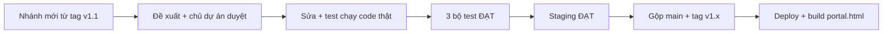

# 04 — V1 Hardening (Gia cố bản v1 chính thức)

Thư mục này lưu mọi thay đổi trong giai đoạn chuẩn bị go-live bản v1 (14/10/2026) và sau đó.

## Quy tắc

1. **Đề xuất trước, sửa sau.** Thay đổi chạm luồng Admin / PM / Nhân viên, hoặc chạm hàm trong Vùng Bất Khả Xâm Phạm (`03-architecture-and-analysis/IMPROVEMENT_PLAN_PROPOSAL.md` §3B), phải được chủ dự án duyệt.
2. **Mỗi thay đổi đã làm** cập nhật: bảng *Nhật ký thay đổi* bên dưới, và hướng dẫn sử dụng liên quan trong `02-user-and-pm-guide/`.
3. **Có test chạy code thật** cho mỗi lỗi được sửa (`tests/cloud_mode_regression.py` hoặc test staging).

## Tài liệu

| File | Nội dung | Dành cho |
|---|---|---|
| [`V1_HARDENING_CHANGE_PROPOSAL.md`](V1_HARDENING_CHANGE_PROPOSAL.md) | 22 phát hiện có bằng chứng, đo rủi ro polling, 5 gói thay đổi, tiêu chí go-live | Chủ dự án, kỹ sư |
| [`V1_RELEASE_RUNBOOK.md`](V1_RELEASE_RUNBOOK.md) | Điểm khôi phục & cách quay lại, staging, trình tự triển khai, **công tắc email**, xử lý sự cố, lệnh kiểm thử | Admin / PIC, PM (mục 4) |
| [`../02-user-and-pm-guide/PM_AND_USER_OPERATIONAL_GUIDE.md`](../02-user-and-pm-guide/PM_AND_USER_OPERATIONAL_GUIDE.md) — Phần C | Những gì nhân viên & PM thấy khác đi trong bản v1 | Nhân viên, PM |

## Phiên bản chuẩn v1.1

**v1.1** (05/10/2026) là bản chuẩn để mọi nâng cấp sau này dựa vào. Gồm toàn bộ việc gia cố trong thư mục này.

| Thành phần | Bản chuẩn v1.1 | Đường lùi |
|---|---|---|
| Mã nguồn | Git tag **`v1.1`** trên `main` · `v1.2` (sửa cửa sổ biên lai) · `v1.3` (khung Hướng dẫn bước 1) · **`v1.4`** (bản mới nhất: chờ đăng nhập 45 giây; chỉ đổi web) | `v1.1` → tag `checkpoint-pre-v1-hardening-20261005` |
| Apps Script chính thức | **Version 7** (deployment cũ, URL không đổi) | Version 6 |
| Apps Script staging | Version 3 | — |
| Web nhân viên | `portal.html` build từ tag **`v1.4`** (Apps Script không đổi: vẫn Version 7) | Bản `portal.html` của tag trước |
| Dữ liệu | Bản sao "Copy of LG Internal Sales Database - 2026-10-04 (Appscript v6)" | — |

**Quy trình nâng cấp từ v1.1 (bắt buộc):**

1. `git switch -c <tên-việc> v1.1` — không sửa thẳng trên `main`.
2. Chạm Vùng Bất Khả Xâm Phạm hoặc luồng Admin / PM / Nhân viên → đề xuất trước, chờ duyệt.
3. Trước khi gộp: `node tests/backend_gas_harness.js`, `python3 tests/cloud_mode_regression.py`, `node tests/run_e2e_tests.js` đều ĐẠT; có sửa `Code.gs` → staging ĐẠT (Runbook §2b).
4. Gộp vào `main`, gắn tag mới (`v1.2`, `v1.3`…), cập nhật bảng trên, nhật ký bên dưới và `docs/CURRENT_STATE.md`.
5. Build lại `portal.html` **từ đúng tag** và deploy Apps Script phiên bản mới; ghi số Version.

## Vùng Bất Khả Xâm Phạm — ngoại lệ đã dùng (ghi minh bạch)

| Hàm (No-Touch #) | Thay đổi | Lý do | Duyệt |
|---|---|---|---|
| `loadProducts` (#8) | Chờ 8 giây + thử lại 2 lần; tài khoản thật không rơi về dữ liệu demo | V1-03 | Gói A — 05/10 |
| `loadProducts` (#8) — lần 2 | Thêm 3 dòng `productsLoadedFor = programId` (đánh dấu danh mục đã tải). Logic tải không đổi | Mục 21 — chữ "Hết hàng" khi đang tải | Chủ dự án — 05/10 |
| `handleRegisterProduct` (#1) | **Chỉ thêm 2 dòng gọi hàm**: làm mới ô 03 khi giữ chỗ thành công; áp danh sách slot đã hết khi bị từ chối. Logic giữ chỗ không đổi | V1-02, C6 | Gói A + C — 05/10 (phần này chưa ghi rõ trong bảng đề xuất, bổ sung tại đây) |

## Nhật ký thay đổi

| Ngày | ID | Thay đổi | Ảnh hưởng luồng | Trạng thái | Tài liệu đã cập nhật |
|---|---|---|---|---|---|
| 05/10/2026 | — | Lập đề xuất V1 Hardening | — | Chờ duyệt | Thư mục này |
| 05/10/2026 | D | Thêm `tests/cloud_mode_regression.py` (baseline 3/7) | Không | Đã thêm | Thư mục này |
| 05/10/2026 | C2 | Quy tắc hủy giữ chỗ: chỉ trước khi khai nộp tiền | Nhân viên | **Đã duyệt** (chưa code) | Đề xuất §5, §8 |
| 05/10/2026 | D | Thêm `tests/polling_race_simulation.py` | Không | Đã thêm | Đề xuất §4 |
| 05/10/2026 | — | Đề xuất bản 2: thêm V1-00 (nhân viên không có URL máy chủ), V1-19 (Sheet ai có link cũng sửa được), đo polling, Gói P | — | **Đã duyệt cả 5 gói** | Đề xuất |
| 05/10/2026 | K1 | Sheet chính chuyển sang Restricted (chủ dự án tự làm) | Admin | Xong — đã xác minh quyền Drive | Runbook §1 |
| 05/10/2026 | — | Điểm khôi phục: git tag `checkpoint-pre-v1-hardening-20261005`, nhánh `backup/pre-v1-hardening-20261005`, bản sao Sheet BACKUP + STAGING (riêng tư) | Không | Xong | Runbook §1–2 |
| 05/10/2026 | B1–B4 | Máy chủ: bỏ chấp nhận token demo, khóa phiên ngẫu nhiên + `rotateSessionSecret()`, giữ chỗ/nộp tiền/hủy bắt buộc phiên chính chủ, từ chối đơn chỉ mở đúng slot | Admin (1 lệnh), mọi người đăng nhập lại 1 lần | Code xong, test 52/52 | Runbook §3; SETUP_APPS_SCRIPT |
| 05/10/2026 | C1–C7 | Khóa khi ghi sheet; route hủy giữ chỗ; `setupNewDatabase` an toàn; cache chương trình; seed email TẮT; endpoint polling `taken`; duyệt hàng loạt chờ máy chủ | Nhân viên (hủy), PM (duyệt hàng loạt) | Code xong, test 52/52 + 25/25 | Guide Phần C |
| 05/10/2026 | K2 | **Công tắc Email tự động BẬT/TẮT** + action `email_setting` (sau đó giới hạn **chỉ ADMIN** — xem dòng ADMIN) | ADMIN | Code xong, test | Runbook §4; Guide C.3; SETUP_APPS_SCRIPT |
| 05/10/2026 | A1–A4 | Danh mục, ô 02, ô 03 đúng dữ liệu máy chủ; không rơi về demo; panel "Đang kết nối máy chủ… / Thử lại"; sửa chữ "sau 2 giờ"; polling 10–12 giây *(sau đó trả về 6–8 giây — dòng Q2)* | Nhân viên | Code xong, test 25/25 | Guide C.1 |
| 05/10/2026 | P | `PORTAL_MODE` + `scripts/build_production.py` → `portal.html` không có dữ liệu demo; nút Hỗ trợ dùng bí danh chung thay tên/hotline mẫu | Nhân viên (link mới) | Code xong, test | Runbook §3 |
| 05/10/2026 | D | `tests/backend_gas_harness.js`, `tests/staging_smoke_test.py`; mở rộng `cloud_mode_regression.py` (7 kịch bản) | Không | Xong | Runbook §6 |
| 05/10/2026 | Staging | Chủ dự án deploy staging (Runbook §2 bước 1–6). Đo trên máy chủ thật: token giả 5/5 bị chặn, FCFS đúng 1 người thắng (3 lần, kể cả dưới tải), polling 0% lỗi tới 60 yêu cầu/giây | Không | **ĐẠT** | Runbook §2, Đề xuất §4.5 |
| 05/10/2026 | Staging | Sự cố do test: 4 lượt giữ chỗ thử đã gửi email xác nhận thật tới địa chỉ mẫu của tài khoản test trước khi tắt email staging. Đã TẮT `ENABLE_AUTO_EMAIL` trên staging; thêm cảnh báo hạn mức email dùng chung | Không | Đã xử lý | Runbook §2, §4 |
| 05/10/2026 | Q2 | Polling trả về **6–8 giây** (thiết kế đã duyệt) theo số đo staging | Nhân viên | Code xong | Đề xuất §4.5; Guide C.1 |
| 05/10/2026 | ADMIN | **Role mới `ADMIN`**: toàn quyền PM trên mọi chương trình + cài đặt hệ thống. Công tắc email **chỉ ADMIN** thấy & đổi được (máy chủ kiểm tra `ADMIN`) | ADMIN, PM | Code xong, test 63/63 + 32/32; staging chờ deploy bản mới | Runbook §4, §4b; Guide C.3; USERS_SHEET_TEMPLATE |
| 05/10/2026 | — | Nút Hỗ trợ: liên hệ `minhhien.hoang@lge.com` (theo chủ dự án) | Nhân viên | Code xong | — |
| 05/10/2026 | Docs | **Rà soát toàn bộ tài liệu**: tạo `docs/CURRENT_STATE.md` (nguồn chuẩn); viết lại `docs/README.md`; sửa Hướng dẫn vận hành Phần A/B theo giao diện thật (giữ chỗ 1 chạm, nhãn nút, trạng thái, hẹn giờ chỉ chạy khi trang PM mở); cập nhật 01-setup, E2E walkthrough, README gốc, PROJECT_PLANNING; khung trạng thái cho 4 đề xuất 02 + 13 file 03; HANDOVER mục 0.3; ghi chú `assets/` | Không (chỉ tài liệu) | Xong | Toàn bộ `docs/`, `assets/*/README.md` |
| 05/10/2026 | Phát hiện | Trong lúc rà soát: **đơn ảo từ bản demo hiện trong `portal.html`** (tái hiện bằng test), PM Dashboard không tự làm mới, hẹn giờ phụ thuộc trình duyệt PM, Jeong-Do không có ô tích, câu chữ Tour lệch v1, tab `Users` đọc theo vị trí cột | Nhân viên, PM | **Chờ duyệt** — không sửa code | `CURRENT_STATE.md` mục 9 (14–20); Runbook §5 |
| 05/10/2026 | 2b | Staging chạy bản có role ADMIN (Version 2): ADMIN đọc công tắc email + xem Dashboard PM khác, PM bị chặn, 5/5 token giả bị từ chối | Không | **ĐẠT** | Runbook §2b |
| 05/10/2026 | V1-16 | `pm_dashboard_`: PM không gửi mã chương trình → chỉ nhận đơn chương trình mình phụ trách (trước: mọi chương trình). ADMIN không đổi. 5 dòng `Code.gs` | PM (không thấy khác khi dùng bình thường) | Code xong, harness 67/67 (bản cũ FAIL 2); chờ deploy staging → chính thức | CURRENT_STATE §7, §9 |
| 05/10/2026 | 14 | `build_production.py` đổi tên 8 khóa bộ nhớ trình duyệt trong `portal.html` → không đọc đơn ảo và **hẹn giờ cũ của bản demo** (build cũ: hẹn giờ demo gửi lệnh thật `program_update`). Bản demo không đổi | Nhân viên, PM | Code xong, Kịch bản 8 — 37/37 (build cũ FAIL 3) | CURRENT_STATE §9; Runbook §3 bước 7, §5 |
| 05/10/2026 | 2b/2c | Staging Version 3 (có V1-16): 2b ĐẠT lần 2; V1-16 kiểm chứng trên máy chủ thật (PM không thấy đơn chương trình ADMIN, ADMIN thấy); không gửi email. Thêm cờ `--scope-user` vào `staging_smoke_test.py` | Không | **ĐẠT** | Runbook §2b |
| 05/10/2026 | §3 | Bản chính thức Version 7 (PIC deploy): kiểm tra chỉ đọc 10/10; `portal.html` build với URL chính thức, kiểm bằng trình duyệt thật. Phát hiện: còn 5 tài khoản `test123` (gồm ADMIN), chữ "Hết hàng" khi đang tải, dữ liệu test trong Sheet chính | Không | Bước 1–7 xong; bước 8 chờ duyệt | Runbook §3; CURRENT_STATE §9 (4, 21, 22) |
| 05/10/2026 | 21 | Ô 02: "Đang tải…" khi danh mục chưa về, "Chưa có sản phẩm" khi trống (trước: "Hết hàng (100% Slot đã đăng ký)") | Nhân viên | Code xong; Kịch bản 9 → 41/41 (bản cũ FAIL 2); `portal.html` build lại | CURRENT_STATE §9 |
| 05/10/2026 | §3 | Chủ dự án: gỡ `test123`, đóng 4 chương trình test, TẮT email. Máy chủ xác nhận cả 3. Số tài khoản hiện đầy đủ ở web / VietQR / email. Còn: mật khẩu dạng chuỗi số đơn giản (giá trị không ghi vào repo) | Admin | Chờ đổi mật khẩu → bước 8 | Runbook §3 |
| 05/10/2026 | — | Ô 02 ghi **"Chưa có đợt bán"** khi không có chương trình nào (trước: kẹt "Đang tải...") | Nhân viên | Code xong; Kịch bản 10 → 43/43 (bản cũ FAIL) | CURRENT_STATE §9 |
| 05/10/2026 | **v1.1** | **Phát hành v1.1**: gộp `v1-hardening` vào `main` (fast-forward), tag `v1.1`, đẩy lên 2 remote → `portal.html` lên GitHub Pages. Kế hoạch nâng cấp sau go-live đổi tên thành **v1.2** | Tất cả | Chủ dự án duyệt | Mục "Phiên bản chuẩn v1.1"; CURRENT_STATE; Runbook §1, §3 |
| 05/10/2026 | §3-10 | Kiểm tra cuối trên link thật `…/portal.html`: **8/8 ĐẠT** | Không | Xong | Runbook §3 |
| 05/10/2026 | Docs | **Sổ tay vận hành ngày mở bán** (`02-user-and-pm-guide/SO_TAY_VAN_HANH_NGAY_MO_BAN.md`): checklist theo mốc giờ + xử lý sự cố cho người không chuyên | ADMIN, PM | Xong | Sổ tay; CURRENT_STATE §11 |
| 05/10/2026 | Setup | Trigger quét quá hạn thiếu trên bản chính thức (0 trigger) — nguyên nhân: Runbook §3 không có bước này. Chủ dự án đã chạy `setupWatchdogTrigger`. Thêm Runbook bước 5b + **mục 3b Danh mục cài đặt một lần** (đối chiếu toàn bộ `Code.gs`) | Admin | Xong | Runbook §3, §3b; SETUP_APPS_SCRIPT |
| 05/10/2026 | Phát hiện | 🔴 Cửa sổ biên lai PM hiện hình "Giao dịch thành công" giả (tái hiện bằng trình duyệt); 🟠 máy chủ không chặn theo giờ bắt đầu; 🟡 nút "Mở lại chương trình" luôn lỗi | PM | **Chờ duyệt** — đã có cách làm tạm trong Sổ tay | CURRENT_STATE §9 (24–26) |
| 05/10/2026 | **v1.2** / 24 | **Cửa sổ biên lai chỉ hiện biên lai thật** (chủ dự án duyệt): bỏ 2 hình minh họa "Giao dịch thành công" + mã GD bịa; hàm chung `renderReceiptView()` — ảnh thật / nút mở link Drive / "Chưa có ảnh biên lai". Nhánh `fix/receipt-modal-v1.2` từ `main`. Chỉ đổi web; `Code.gs` không đổi | PM, ADMIN | Kịch bản 11 → 49/49 (bản cũ FAIL 3); e2e 165 (sửa 1 kiểm tra chuỗi + thêm 1); harness 67/67; luồng thật staging ĐẠT. Phát hành: gộp `main`, tag `v1.2`, build `portal.html` | Sổ tay vận hành; Guide B.3; CURRENT_STATE §9 |
| 05/10/2026 | Setup | Trigger kiểm chứng: Last run 16:15:39, Error rate 0%. Thư mục biên lai: kiểm quyền Drive — "Anyone with the link"; staging ghi file test vào thư mục chính thức | Admin | Trigger xong; quyền thư mục **chờ chốt** | Runbook §3b; CURRENT_STATE §9 (27, 28) |
| 05/10/2026 | **v1.3** | **Hướng dẫn nhanh bước 1 — khung đỏ lệch khi tự mở lần đầu** (chủ dự án báo, cả Nhân viên / PM / ADMIN). Nguyên nhân: tour tự mở 0,8 giây sau đăng nhập, danh sách chương trình từ máy chủ về sau đó làm thanh chương trình đổi kích thước, nhưng khung chỉ được đo lại khi cửa sổ resize/scroll. Sửa: `ResizeObserver` theo dõi bố cục trong lúc tour mở (`watchTourLayout`), ngắt khi thoát tour. Không đổi nội dung / thứ tự bước | Nhân viên, PM, ADMIN (lần đăng nhập đầu) | Kịch bản 12: bản cũ lệch 10–28 px (FAIL 3), bản mới 0 px → 55/55; mọi bước tour (4 NV + 5 PM) lệch 0 px; e2e 165, harness 67 | CURRENT_STATE §9 |
| 05/10/2026 | **v1.4** | **Đăng nhập chờ máy chủ 45 giây** (trước 12 giây) + nút báo "Máy chủ đang khởi động…" sau 10 giây. Lý do: lần đăng nhập đầu sau thời gian nghỉ trên link thật báo "quá thời gian chờ (12s)"; khởi động nguội đo 15–40 giây. 1 yêu cầu chờ lâu hơn, **không** tự gửi lại (tránh trùng). Hàm `handleLogin` (không thuộc Vùng Bất Khả Xâm Phạm) | Mọi người (đăng nhập) | Kịch bản 13: bản cũ FAIL 2 → 58/58; e2e 165 (cập nhật 1 kiểm tra chuỗi 12s → 45s); harness 67; bố cục nút kiểm ở 1440 px và 375 px | CURRENT_STATE §9 (30); Sổ tay Phần 3 |
| 05/10/2026 | **v2 GĐ1** | **Giao diện v2 — Giai đoạn 1 (font & tương phản)**, sau công tắc `html.ui-v2` (mặc định TẮT → nhân viên vẫn thấy v1.4; xem trước `?ui=v2`). Hết Arial, hết tô đậm giả, 216 → 0 lỗi tương phản (12 màn hình, Sáng + Đêm); sửa lỗi có từ trước: hero Tab 1 không đọc được ở chế độ Đêm. Chỉ CSS + 1 script bật/tắt; không đổi ID/luồng/máy chủ | Không (khi TẮT) | Kịch bản 14; test giao diện 64/64 cả khi tắt và bật v2; e2e 165; harness 67 | `design/UI_V2_DIRECTION_PROPOSAL.md` §11 |
| 06/10/2026 | **v2 GĐ2** | Nền ấm liền mạch, header, thanh chọn segmented (chương trình + tab), chữ ≥ 14 px ở các phần này; nền Đêm tối theo. **Link "Xem trên LG.com" / "Tìm thông tin model"** trên thẻ & bảng sản phẩm (`scripts/build_product_links.py`). Vẫn sau công tắc `ui-v2` (mặc định TẮT) | Không (khi TẮT) | Kịch bản 14 (+3) & 15; 75/75 tắt và bật v2; e2e 165; harness 67; 0 lỗi tương phản | `design/UI_V2_DIRECTION_PROPOSAL.md` §11.4 |
