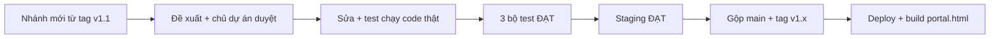

# 04 — V1 Hardening (Gia cố bản v1 chính thức)

Thư mục này lưu mọi thay đổi trong giai đoạn chuẩn bị go-live bản v1 (14/10/2026) và sau đó.

## Quy tắc

1. **Đề xuất trước, sửa sau.** Thay đổi chạm luồng Admin / PM / Nhân viên, hoặc chạm hàm trong Vùng Bất Khả Xâm Phạm (`03-architecture-and-analysis/IMPROVEMENT_PLAN_PROPOSAL.md` §3B), phải được chủ dự án duyệt.
2. **Mỗi thay đổi đã làm** cập nhật: bảng *Nhật ký thay đổi* bên dưới, và hướng dẫn sử dụng liên quan trong `02-user-and-pm-guide/`.
3. **Có test chạy code thật** cho mỗi lỗi được sửa (`tests/cloud_mode_regression.py` hoặc test staging).

## Tài liệu

| File | Nội dung | Dành cho |
|---|---|---|
| [`V1_HARDENING_CHANGE_PROPOSAL.md`](V1_HARDENING_CHANGE_PROPOSAL.md) | 22 phát hiện có bằng chứng, đo rủi ro polling, 5 gói thay đổi, tiêu chí go-live | Chủ dự án, kỹ sư |
| [`V1_RELEASE_RUNBOOK.md`](V1_RELEASE_RUNBOOK.md) | Điểm khôi phục & cách quay lại, staging, trình tự triển khai, **công tắc email**, xử lý sự cố, lệnh kiểm thử | Admin / PIC, PM (mục 4) |
| [`../02-user-and-pm-guide/PM_AND_USER_OPERATIONAL_GUIDE.md`](../02-user-and-pm-guide/PM_AND_USER_OPERATIONAL_GUIDE.md) — Phần C | Những gì nhân viên & PM thấy khác đi trong bản v1 | Nhân viên, PM |

## Phiên bản chuẩn v1.1

**v1.1** (05/10/2026) là bản chuẩn để mọi nâng cấp sau này dựa vào. Gồm toàn bộ việc gia cố trong thư mục này.

| Thành phần | Bản chuẩn v1.1 | Đường lùi |
|---|---|---|
| Mã nguồn | Git tag **`v1.1`** trên `main` · `v1.2` (sửa cửa sổ biên lai) · `v1.3` (khung Hướng dẫn bước 1) · **`v1.4`** (bản mới nhất: chờ đăng nhập 45 giây; chỉ đổi web) | `v1.1` → tag `checkpoint-pre-v1-hardening-20261005` |
| Apps Script chính thức | **Version 7** (deployment cũ, URL không đổi) | Version 6 |
| Apps Script staging | Version 3 | — |
| Web nhân viên | `portal.html` build từ tag **`v1.4`** (Apps Script không đổi: vẫn Version 7) | Bản `portal.html` của tag trước |
| Dữ liệu | Bản sao "Copy of LG Internal Sales Database - 2026-10-04 (Appscript v6)" | — |

**Quy trình nâng cấp từ v1.1 (bắt buộc):**

> **Từ 07/10/2026 (v2.2.2):** GitHub Actions `lgcom-links-refresh.yml` có thể tự commit bảng link LG.com lên `main` của repo `Gobitangocbao` (thứ Hai 08:00). Trước khi gộp / push một bản phát hành: **`git pull --ff-only gobita main`**, rồi mới `git push all main` (nếu không, push sẽ bị từ chối vì `main` trên GitHub đã có commit mới).

1. `git switch -c <tên-việc> v1.1` — không sửa thẳng trên `main`.
2. Chạm Vùng Bất Khả Xâm Phạm hoặc luồng Admin / PM / Nhân viên → đề xuất trước, chờ duyệt.
3. Trước khi gộp: `node tests/backend_gas_harness.js`, `python3 tests/cloud_mode_regression.py`, `node tests/run_e2e_tests.js` đều ĐẠT; có sửa `Code.gs` → staging ĐẠT (Runbook §2b).
4. Gộp vào `main`, gắn tag mới (`v1.2`, `v1.3`…), cập nhật bảng trên, nhật ký bên dưới và `docs/CURRENT_STATE.md`.
5. Build lại `portal.html` **từ đúng tag** và deploy Apps Script phiên bản mới; ghi số Version.

## Vùng Bất Khả Xâm Phạm — ngoại lệ đã dùng (ghi minh bạch)

| Hàm (No-Touch #) | Thay đổi | Lý do | Duyệt |
|---|---|---|---|
| `loadProducts` (#8) | Chờ 8 giây + thử lại 2 lần; tài khoản thật không rơi về dữ liệu demo | V1-03 | Gói A — 05/10 |
| `loadProducts` (#8) — lần 2 | Thêm 3 dòng `productsLoadedFor = programId` (đánh dấu danh mục đã tải). Logic tải không đổi | Mục 21 — chữ "Hết hàng" khi đang tải | Chủ dự án — 05/10 |
| `handleRegisterProduct` (#1) | **Chỉ thêm 2 dòng gọi hàm**: làm mới ô 03 khi giữ chỗ thành công; áp danh sách slot đã hết khi bị từ chối. Logic giữ chỗ không đổi | V1-02, C6 | Gói A + C — 05/10 (phần này chưa ghi rõ trong bảng đề xuất, bổ sung tại đây) |

## Nhật ký thay đổi

| Ngày | ID | Thay đổi | Ảnh hưởng luồng | Trạng thái | Tài liệu đã cập nhật |
|---|---|---|---|---|---|
| 05/10/2026 | — | Lập đề xuất V1 Hardening | — | Chờ duyệt | Thư mục này |
| 05/10/2026 | D | Thêm `tests/cloud_mode_regression.py` (baseline 3/7) | Không | Đã thêm | Thư mục này |
| 05/10/2026 | C2 | Quy tắc hủy giữ chỗ: chỉ trước khi khai nộp tiền | Nhân viên | **Đã duyệt** (chưa code) | Đề xuất §5, §8 |
| 05/10/2026 | D | Thêm `tests/polling_race_simulation.py` | Không | Đã thêm | Đề xuất §4 |
| 05/10/2026 | — | Đề xuất bản 2: thêm V1-00 (nhân viên không có URL máy chủ), V1-19 (Sheet ai có link cũng sửa được), đo polling, Gói P | — | **Đã duyệt cả 5 gói** | Đề xuất |
| 05/10/2026 | K1 | Sheet chính chuyển sang Restricted (chủ dự án tự làm) | Admin | Xong — đã xác minh quyền Drive | Runbook §1 |
| 05/10/2026 | — | Điểm khôi phục: git tag `checkpoint-pre-v1-hardening-20261005`, nhánh `backup/pre-v1-hardening-20261005`, bản sao Sheet BACKUP + STAGING (riêng tư) | Không | Xong | Runbook §1–2 |
| 05/10/2026 | B1–B4 | Máy chủ: bỏ chấp nhận token demo, khóa phiên ngẫu nhiên + `rotateSessionSecret()`, giữ chỗ/nộp tiền/hủy bắt buộc phiên chính chủ, từ chối đơn chỉ mở đúng slot | Admin (1 lệnh), mọi người đăng nhập lại 1 lần | Code xong, test 52/52 | Runbook §3; SETUP_APPS_SCRIPT |
| 05/10/2026 | C1–C7 | Khóa khi ghi sheet; route hủy giữ chỗ; `setupNewDatabase` an toàn; cache chương trình; seed email TẮT; endpoint polling `taken`; duyệt hàng loạt chờ máy chủ | Nhân viên (hủy), PM (duyệt hàng loạt) | Code xong, test 52/52 + 25/25 | Guide Phần C |
| 05/10/2026 | K2 | **Công tắc Email tự động BẬT/TẮT** + action `email_setting` (sau đó giới hạn **chỉ ADMIN** — xem dòng ADMIN) | ADMIN | Code xong, test | Runbook §4; Guide C.3; SETUP_APPS_SCRIPT |
| 05/10/2026 | A1–A4 | Danh mục, ô 02, ô 03 đúng dữ liệu máy chủ; không rơi về demo; panel "Đang kết nối máy chủ… / Thử lại"; sửa chữ "sau 2 giờ"; polling 10–12 giây *(sau đó trả về 6–8 giây — dòng Q2)* | Nhân viên | Code xong, test 25/25 | Guide C.1 |
| 05/10/2026 | P | `PORTAL_MODE` + `scripts/build_production.py` → `portal.html` không có dữ liệu demo; nút Hỗ trợ dùng bí danh chung thay tên/hotline mẫu | Nhân viên (link mới) | Code xong, test | Runbook §3 |
| 05/10/2026 | D | `tests/backend_gas_harness.js`, `tests/staging_smoke_test.py`; mở rộng `cloud_mode_regression.py` (7 kịch bản) | Không | Xong | Runbook §6 |
| 05/10/2026 | Staging | Chủ dự án deploy staging (Runbook §2 bước 1–6). Đo trên máy chủ thật: token giả 5/5 bị chặn, FCFS đúng 1 người thắng (3 lần, kể cả dưới tải), polling 0% lỗi tới 60 yêu cầu/giây | Không | **ĐẠT** | Runbook §2, Đề xuất §4.5 |
| 05/10/2026 | Staging | Sự cố do test: 4 lượt giữ chỗ thử đã gửi email xác nhận thật tới địa chỉ mẫu của tài khoản test trước khi tắt email staging. Đã TẮT `ENABLE_AUTO_EMAIL` trên staging; thêm cảnh báo hạn mức email dùng chung | Không | Đã xử lý | Runbook §2, §4 |
| 05/10/2026 | Q2 | Polling trả về **6–8 giây** (thiết kế đã duyệt) theo số đo staging | Nhân viên | Code xong | Đề xuất §4.5; Guide C.1 |
| 05/10/2026 | ADMIN | **Role mới `ADMIN`**: toàn quyền PM trên mọi chương trình + cài đặt hệ thống. Công tắc email **chỉ ADMIN** thấy & đổi được (máy chủ kiểm tra `ADMIN`) | ADMIN, PM | Code xong, test 63/63 + 32/32; staging chờ deploy bản mới | Runbook §4, §4b; Guide C.3; USERS_SHEET_TEMPLATE |
| 05/10/2026 | — | Nút Hỗ trợ: liên hệ `minhhien.hoang@lge.com` (theo chủ dự án) | Nhân viên | Code xong | — |
| 05/10/2026 | Docs | **Rà soát toàn bộ tài liệu**: tạo `docs/CURRENT_STATE.md` (nguồn chuẩn); viết lại `docs/README.md`; sửa Hướng dẫn vận hành Phần A/B theo giao diện thật (giữ chỗ 1 chạm, nhãn nút, trạng thái, hẹn giờ chỉ chạy khi trang PM mở); cập nhật 01-setup, E2E walkthrough, README gốc, PROJECT_PLANNING; khung trạng thái cho 4 đề xuất 02 + 13 file 03; HANDOVER mục 0.3; ghi chú `assets/` | Không (chỉ tài liệu) | Xong | Toàn bộ `docs/`, `assets/*/README.md` |
| 05/10/2026 | Phát hiện | Trong lúc rà soát: **đơn ảo từ bản demo hiện trong `portal.html`** (tái hiện bằng test), PM Dashboard không tự làm mới, hẹn giờ phụ thuộc trình duyệt PM, Jeong-Do không có ô tích, câu chữ Tour lệch v1, tab `Users` đọc theo vị trí cột | Nhân viên, PM | **Chờ duyệt** — không sửa code | `CURRENT_STATE.md` mục 9 (14–20); Runbook §5 |
| 05/10/2026 | 2b | Staging chạy bản có role ADMIN (Version 2): ADMIN đọc công tắc email + xem Dashboard PM khác, PM bị chặn, 5/5 token giả bị từ chối | Không | **ĐẠT** | Runbook §2b |
| 05/10/2026 | V1-16 | `pm_dashboard_`: PM không gửi mã chương trình → chỉ nhận đơn chương trình mình phụ trách (trước: mọi chương trình). ADMIN không đổi. 5 dòng `Code.gs` | PM (không thấy khác khi dùng bình thường) | Code xong, harness 67/67 (bản cũ FAIL 2); chờ deploy staging → chính thức | CURRENT_STATE §7, §9 |
| 05/10/2026 | 14 | `build_production.py` đổi tên 8 khóa bộ nhớ trình duyệt trong `portal.html` → không đọc đơn ảo và **hẹn giờ cũ của bản demo** (build cũ: hẹn giờ demo gửi lệnh thật `program_update`). Bản demo không đổi | Nhân viên, PM | Code xong, Kịch bản 8 — 37/37 (build cũ FAIL 3) | CURRENT_STATE §9; Runbook §3 bước 7, §5 |
| 05/10/2026 | 2b/2c | Staging Version 3 (có V1-16): 2b ĐẠT lần 2; V1-16 kiểm chứng trên máy chủ thật (PM không thấy đơn chương trình ADMIN, ADMIN thấy); không gửi email. Thêm cờ `--scope-user` vào `staging_smoke_test.py` | Không | **ĐẠT** | Runbook §2b |
| 05/10/2026 | §3 | Bản chính thức Version 7 (PIC deploy): kiểm tra chỉ đọc 10/10; `portal.html` build với URL chính thức, kiểm bằng trình duyệt thật. Phát hiện: còn 5 tài khoản `test123` (gồm ADMIN), chữ "Hết hàng" khi đang tải, dữ liệu test trong Sheet chính | Không | Bước 1–7 xong; bước 8 chờ duyệt | Runbook §3; CURRENT_STATE §9 (4, 21, 22) |
| 05/10/2026 | 21 | Ô 02: "Đang tải…" khi danh mục chưa về, "Chưa có sản phẩm" khi trống (trước: "Hết hàng (100% Slot đã đăng ký)") | Nhân viên | Code xong; Kịch bản 9 → 41/41 (bản cũ FAIL 2); `portal.html` build lại | CURRENT_STATE §9 |
| 05/10/2026 | §3 | Chủ dự án: gỡ `test123`, đóng 4 chương trình test, TẮT email. Máy chủ xác nhận cả 3. Số tài khoản hiện đầy đủ ở web / VietQR / email. Còn: mật khẩu dạng chuỗi số đơn giản (giá trị không ghi vào repo) | Admin | Chờ đổi mật khẩu → bước 8 | Runbook §3 |
| 05/10/2026 | — | Ô 02 ghi **"Chưa có đợt bán"** khi không có chương trình nào (trước: kẹt "Đang tải...") | Nhân viên | Code xong; Kịch bản 10 → 43/43 (bản cũ FAIL) | CURRENT_STATE §9 |
| 05/10/2026 | **v1.1** | **Phát hành v1.1**: gộp `v1-hardening` vào `main` (fast-forward), tag `v1.1`, đẩy lên 2 remote → `portal.html` lên GitHub Pages. Kế hoạch nâng cấp sau go-live đổi tên thành **v1.2** | Tất cả | Chủ dự án duyệt | Mục "Phiên bản chuẩn v1.1"; CURRENT_STATE; Runbook §1, §3 |
| 05/10/2026 | §3-10 | Kiểm tra cuối trên link thật `…/portal.html`: **8/8 ĐẠT** | Không | Xong | Runbook §3 |
| 05/10/2026 | Docs | **Sổ tay vận hành ngày mở bán** (`02-user-and-pm-guide/SO_TAY_VAN_HANH_NGAY_MO_BAN.md`): checklist theo mốc giờ + xử lý sự cố cho người không chuyên | ADMIN, PM | Xong | Sổ tay; CURRENT_STATE §11 |
| 05/10/2026 | Setup | Trigger quét quá hạn thiếu trên bản chính thức (0 trigger) — nguyên nhân: Runbook §3 không có bước này. Chủ dự án đã chạy `setupWatchdogTrigger`. Thêm Runbook bước 5b + **mục 3b Danh mục cài đặt một lần** (đối chiếu toàn bộ `Code.gs`) | Admin | Xong | Runbook §3, §3b; SETUP_APPS_SCRIPT |
| 05/10/2026 | Phát hiện | 🔴 Cửa sổ biên lai PM hiện hình "Giao dịch thành công" giả (tái hiện bằng trình duyệt); 🟠 máy chủ không chặn theo giờ bắt đầu; 🟡 nút "Mở lại chương trình" luôn lỗi | PM | **Chờ duyệt** — đã có cách làm tạm trong Sổ tay | CURRENT_STATE §9 (24–26) |
| 05/10/2026 | **v1.2** / 24 | **Cửa sổ biên lai chỉ hiện biên lai thật** (chủ dự án duyệt): bỏ 2 hình minh họa "Giao dịch thành công" + mã GD bịa; hàm chung `renderReceiptView()` — ảnh thật / nút mở link Drive / "Chưa có ảnh biên lai". Nhánh `fix/receipt-modal-v1.2` từ `main`. Chỉ đổi web; `Code.gs` không đổi | PM, ADMIN | Kịch bản 11 → 49/49 (bản cũ FAIL 3); e2e 165 (sửa 1 kiểm tra chuỗi + thêm 1); harness 67/67; luồng thật staging ĐẠT. Phát hành: gộp `main`, tag `v1.2`, build `portal.html` | Sổ tay vận hành; Guide B.3; CURRENT_STATE §9 |
| 05/10/2026 | Setup | Trigger kiểm chứng: Last run 16:15:39, Error rate 0%. Thư mục biên lai: kiểm quyền Drive — "Anyone with the link"; staging ghi file test vào thư mục chính thức | Admin | Trigger xong; quyền thư mục **chờ chốt** | Runbook §3b; CURRENT_STATE §9 (27, 28) |
| 05/10/2026 | **v1.3** | **Hướng dẫn nhanh bước 1 — khung đỏ lệch khi tự mở lần đầu** (chủ dự án báo, cả Nhân viên / PM / ADMIN). Nguyên nhân: tour tự mở 0,8 giây sau đăng nhập, danh sách chương trình từ máy chủ về sau đó làm thanh chương trình đổi kích thước, nhưng khung chỉ được đo lại khi cửa sổ resize/scroll. Sửa: `ResizeObserver` theo dõi bố cục trong lúc tour mở (`watchTourLayout`), ngắt khi thoát tour. Không đổi nội dung / thứ tự bước | Nhân viên, PM, ADMIN (lần đăng nhập đầu) | Kịch bản 12: bản cũ lệch 10–28 px (FAIL 3), bản mới 0 px → 55/55; mọi bước tour (4 NV + 5 PM) lệch 0 px; e2e 165, harness 67 | CURRENT_STATE §9 |
| 05/10/2026 | **v1.4** | **Đăng nhập chờ máy chủ 45 giây** (trước 12 giây) + nút báo "Máy chủ đang khởi động…" sau 10 giây. Lý do: lần đăng nhập đầu sau thời gian nghỉ trên link thật báo "quá thời gian chờ (12s)"; khởi động nguội đo 15–40 giây. 1 yêu cầu chờ lâu hơn, **không** tự gửi lại (tránh trùng). Hàm `handleLogin` (không thuộc Vùng Bất Khả Xâm Phạm) | Mọi người (đăng nhập) | Kịch bản 13: bản cũ FAIL 2 → 58/58; e2e 165 (cập nhật 1 kiểm tra chuỗi 12s → 45s); harness 67; bố cục nút kiểm ở 1440 px và 375 px | CURRENT_STATE §9 (30); Sổ tay Phần 3 |
| 05/10/2026 | **v2 GĐ1** | **Giao diện v2 — Giai đoạn 1 (font & tương phản)**, sau công tắc `html.ui-v2` (mặc định TẮT → nhân viên vẫn thấy v1.4; xem trước `?ui=v2`). Hết Arial, hết tô đậm giả, 216 → 0 lỗi tương phản (12 màn hình, Sáng + Đêm); sửa lỗi có từ trước: hero Tab 1 không đọc được ở chế độ Đêm. Chỉ CSS + 1 script bật/tắt; không đổi ID/luồng/máy chủ | Không (khi TẮT) | Kịch bản 14; test giao diện 64/64 cả khi tắt và bật v2; e2e 165; harness 67 | `design/UI_V2_DIRECTION_PROPOSAL.md` §11 |
| 06/10/2026 | **v2 GĐ2** | Nền ấm liền mạch, header, thanh chọn segmented (chương trình + tab), chữ ≥ 14 px ở các phần này; nền Đêm tối theo. **Link "Xem trên LG.com" / "Tìm thông tin model"** trên thẻ & bảng sản phẩm (`scripts/build_product_links.py`). Vẫn sau công tắc `ui-v2` (mặc định TẮT) | Không (khi TẮT) | Kịch bản 14 (+3) & 15; 75/75 tắt và bật v2; e2e 165; harness 67; 0 lỗi tương phản | `design/UI_V2_DIRECTION_PROPOSAL.md` §11.4 |
| 06/10/2026 | **v2 GĐ3** | Thẻ tổng quan: ô 01 trắng (số TK lớn), ô 02 tỉ lệ lớn, ô 03 thẻ Focus (số lớn nét mảnh, bộ đếm PM giữ màu); ô KPI PM thẻ trắng số lớn. Nhúng LG EI Headline Light (tên font riêng, chỉ v2 dùng). Vẫn sau công tắc `ui-v2` (mặc định TẮT) | Không (khi TẮT) | Kịch bản 14 (+4) → 79/79 tắt và bật v2; e2e 165; harness 67; 0 lỗi tương phản | `design/UI_V2_DIRECTION_PROPOSAL.md` §11.5 |
| 06/10/2026 | **v2 GĐ4** | Danh mục & thẻ sản phẩm (segmented lọc kho / Thẻ-Bảng, giá 24 px, nút 48 px), Bảng điều khiển PM chữ 14 px, nút theo vai trò (Active Red = hành động chính). Vẫn sau công tắc `ui-v2` (mặc định TẮT) | Không (khi TẮT) | Kịch bản 14 (+3) → 82/82 tắt và bật v2; e2e 165; harness 67; tour 9/9 bước 0 px | `design/UI_V2_DIRECTION_PROPOSAL.md` §11.6 |
| 06/10/2026 | **v2 GĐ5** | Màn đăng nhập trên LG Master Gradient 04 (file gốc `assets/branding/`, chỉ tải khi bật v2), thẻ đăng nhập mới, lề mobile 16 px. **Hoàn tất 5 giai đoạn v2** — vẫn sau công tắc `ui-v2` (mặc định TẮT); checklist bật: `design/UI_V2_DIRECTION_PROPOSAL.md` §13 | Không (khi TẮT) | Kịch bản 14 (+5) → 87/87 tắt và bật v2; e2e 165; harness 67; verify.py: font không phải LG EI 5 → 0 | §11.7, §13 |
| 06/10/2026 | **v2.0** | **Bật giao diện v2 cho mọi người** (`UI_V2_DEFAULT = true`, chủ dự án duyệt để toàn bộ người dùng test). Đường lùi: `?ui=v1` (từng người) hoặc đổi lại `false` (tất cả). Nút "Duyệt Thanh Toán Này" trong cửa sổ biên lai → Active Red. Hướng dẫn sử dụng: Phần D (giao diện mới), Sổ tay: dòng xử lý sự cố `?ui=v1` | Nhân viên, PM, ADMIN (chỉ giao diện) | Test giao diện chạy 3 cách mở (mặc định / `?ui=v2` / `?ui=v1`), e2e 165, harness 67 | Guide Phần D; Sổ tay; CURRENT_STATE; Runbook §1 |
| 06/10/2026 | **v2.0.1** | **Favicon (icon trên tab trình duyệt) sai logo**: trước đây là hình SVG **tự vẽ** (vòng tròn + vòng cung + nét chữ L + chấm — trông như đồng hồ), vi phạm quy tắc "không vẽ lại logo". Nay là **biểu tượng LG cắt từ file logo chính thức** `LGE_Logo_HeritageRed_Grey_RGB.png` (32 px cho tab + 180 px cho màn hình chính điện thoại); guideline cho phép dùng riêng biểu tượng làm icon website. Logo header / màn đăng nhập đã kiểm: giống hệt từng điểm ảnh với file chính thức. Áp dụng cả `?ui=v1` | Không (chỉ icon) | Kịch bản 14 +2 → 89/89; e2e 165; harness 67 | `design/v2/favicon_official_symbol.png` |
| 06/10/2026 | **v2.0.2** | **3 thẻ tổng quan theo mẫu GRAP** (chủ dự án yêu cầu, cả 3 vai trò): ô 01 Heritage Red `#A50034`, ô 02 Warm Gray 05 `#E6E1D6`, ô 03 Warm Gray 01 `#262626` (đều trong bảng màu LG); bo 16 px; di chuột → nhấc 2 px + bóng `0 12px 30px` (0,15 s, tắt khi hệ điều hành bật giảm chuyển động). **Tiêu đề dashboard 40 px** (trước 20 px = bằng tiêu đề thẻ), tiêu đề thẻ 24 px, dòng nhãn 14 px, mô tả 16 px. Thanh tiến độ ô 02: rãnh làm đậm (trùng màu thẻ), xanh thanh toán → Tree Green `#316D15` (chuẩn trên nền xám ấm). Thay quyết định GĐ3 "ô 01 thẻ trắng" | Không (chỉ giao diện) | Kịch bản 14 (+3: màu 3 thẻ, tiêu đề > tiêu đề thẻ, hiệu ứng di chuột) → 92/92 mặc định và `?ui=v1`; e2e 165; harness 67; 0 lỗi tương phản | `design/v2/dashboard_cards_grap_style.png` |
| 06/10/2026 | **v2.0.3** | **Cửa sổ "Nộp tiền ngay" (ô 03) khai nộp giống Tab 3** (chủ dự án báo: đính kèm biên lai không tự điền). Trước: cửa sổ không quét OCR, không có ô Ngày giờ (máy chủ ghi giờ bấm gửi thay vì giờ chuyển khoản), biên lai không bắt buộc, tên file gửi lên luôn `…_receipt.png`. Sau: chọn ảnh → quét OCR bằng đúng hàm của Tab 3 (`autoScanReceiptOCR` nhận ô đích; Tab 3 dùng mặc định cũ, không đổi) → điền **Mã giao dịch** dạng `Ngân hàng - Mã` và **Ngày giờ chuyển khoản** `dd/mm/yyyy hh:mm:ss`; thêm ô Ngày giờ (bắt buộc, gửi `payTime`); biên lai bắt buộc; gửi `fileName` đúng đuôi sau khi nén; bản nháp T4.2 giữ cả Ngày giờ. Số tiền: không thêm ô — máy chủ luôn lấy giá chính thức từ sheet Products cho cả hai đường (`payment_`, DATA-01). Apps Script không đổi (Version 7) | Có — chỉ cửa sổ ô 03: thêm ô Ngày giờ, biên lai bắt buộc (như Tab 3). Tab 3 không đổi | Kịch bản 16 (10 phép đo, có kiểm Tab 3 không đổi) → 102/102 mặc định và `?ui=v1`; e2e 165; harness 67; chạy thêm OCR thật (Tesseract) trên ảnh biên lai mẫu: điền đúng 2 ô | — |
| 06/10/2026 | **v2.0.4** | **Thanh tab chính (1–4) không còn xuống dòng lộn xộn** (chủ dự án báo, giao diện nhân viên). Nguyên nhân đo được: 4 tab đủ nhãn rộng 1.297 px > khung 1.280 px → tab 4 rớt xuống hàng 2 trên mọi PC; điện thoại phải vuốt, chỉ thấy ~1,3 tab. Sửa (chỉ CSS v2): PC ≥ 1.344 px 1 hàng đủ nhãn; 1.076–1.343 px ẩn nhãn trang trí (Rules / Catalog Live / Excel View / Tham Khảo) — **giữ "0 Đơn" và nhãn tab PM** vì có số liệu; 961–1.075 px thêm chữ 14 px; máy tính bảng 720–960 px 1 hàng ô bằng nhau; điện thoại < 720 px lưới 2×2, chữ chia dòng cân. Không đổi chức năng chuyển tab / ẩn tab theo vai trò | Không (chỉ giao diện) | Kịch bản 17 (5 khổ màn hình) → 107/107 mặc định và `?ui=v1`; e2e 165; harness 67; 0 lỗi tương phản; không cắt chữ / cuộn ngang | `design/v2/main_tabs_one_row.png` |
| 06/10/2026 | **v2.0.5** | **File "Xuất Excel" mở bị dồn hết vào cột A** (chủ dự án báo, PM/ADMIN tải danh sách gửi giao hàng). Nguyên nhân: file CSV đúng chuẩn (BOM UTF-8, dấu phẩy, 22 cột) nhưng Excel tách cột theo **dấu phân cách danh sách của máy** — máy đặt vùng Việt Nam (`vi_VN`, dấu thập phân là dấu phẩy) dùng dấu `;`. Sửa: nút PM/ADMIN và nút "Xuất Excel" Tab 3 tải **file `.xlsx` thật** bằng SheetJS có sẵn (`data/xlsx.mini.min.js`) → đúng cột trên mọi máy; cùng 22 trường, cùng thứ tự; giá/số tiền là số định dạng `#,##0`; SĐT giữ số 0 đầu; có bộ lọc tiêu đề. Thư viện không tải được → tải CSV như cũ. Nhãn nút "Xuất Excel (CSV)" → "Xuất Excel" (giữ `id` cho tour) | Có — định dạng file tải về (.csv → .xlsx); dữ liệu không đổi | Kịch bản 18 → 111/111 mặc định và `?ui=v1`; e2e 165; harness 67; tải thật + đọc bằng openpyxl: 22 cột, số, SĐT dạng chữ | — |
| 06/10/2026 | **v2.0.6** | **Cột thời gian trong danh sách giao hàng** (chủ dự án duyệt 2 mục). (1) **"Thời gian nộp" sai tháng** (file ghi "Wed Jun 10 2026" cho đơn nộp 06/10): máy chủ ghi chuỗi `dd/MM/yyyy` → Google Sheet tự đổi thành NGÀY theo kiểu tháng/ngày (chỉ ngày 1–12 bị đảo). `Code.gs` thêm `asText_()` (dấu `'` đầu = Sheet giữ chữ; dấu không hiện và không có khi đọc — cùng cách đã dùng cho Mã Slot / SĐT / Số tiền), áp cho Thời gian nộp và **Ngày PM duyệt** (cùng lỗi, 3 chỗ: duyệt từng đơn, duyệt hàng loạt, từ chối). **Cần deploy Apps Script Version 8** (Runbook §1). (2) **"Thời gian ĐK" là giờ quốc tế** (`2026-10-06T07:52:01Z` = 14:52 giờ VN; đơn đăng ký từ thẻ sản phẩm): web hiển thị `06/10/2026 14:52:01` ở bảng PM (2 bảng), file Excel, ô 03, bảng tra cứu Tab 3 — **chỉ đổi cách hiển thị**, giá trị gốc giữ nguyên cho logic hạn 24 giờ / giờ mở nộp tiền | Không (chỉ cách ghi / cách hiển thị) | Harness +6 (73/73); kịch bản 19 → 115/115 mặc định và `?ui=v1`; e2e 165; kiểm tay ô 03 + Tab 3 | — |
| 06/10/2026 | **v2.1** | **Serial Number cho từng máy** (chủ dự án thêm cột SERIAL NUMBER vào file mẫu). Rà soát trước khi sửa: bộ đọc Excel đã nhận cột serial (tìm theo tên → chèn cột D không lệch cột) nhưng **máy chủ bỏ đi** (Products 12 cột) → serial chỉ còn dạng chữ trong "Mô tả"; cột Serial ở Tab 4 / bộ chọn luôn "—" với dữ liệu thật; nút "Tải file mẫu" dùng **bản nhúng cũ 7 cột**, không phải `data/Mau_Danh_Muc…xlsx`. Sửa — **máy chủ** (`Code.gs`, cần Version 8): Products thêm **cột M "Serial"** ở cuối (ghi dạng chữ, giữ số 0 đầu; tự tạo tiêu đề; sheet cũ 12 cột vẫn chạy), `prodSerials_()` tra serial theo Mã Slot cho Dashboard PM, tra cứu đơn, 5 loại email — **Registrations không thêm cột**. **Web**: `snOf / snHtml / snTxt` + lớp `.sn` (chữ thường, 12 px v1 / 14 px v2, mờ 72% theo màu chữ bên cạnh → đúng cả nền sáng/tối); S/N cạnh Model ở thẻ & bảng Tab 2, bộ chọn, Tab 4, ô 03, cửa sổ Nộp tiền ngay, Tab 3 (form, bảng xác nhận, tra cứu), 3 bảng PM, cửa sổ biên lai, xem trước khi nạp Excel, 9 hộp thoại/thông báo; file **Xuất Excel** thêm cột "Serial Number" sau "Model" (22 → 23 trường); nút "Tải file mẫu" = file mẫu mới 8 cột; serial không còn chép vào "Mô tả" (tránh hiện 2 lần) | Có — thêm trường dữ liệu; luồng đăng ký / nộp tiền / duyệt không đổi | Harness +10 (83/83); kịch bản 20 (11 phép đo, đọc file mẫu thật) → 126/126 mặc định và `?ui=v1`; e2e 165; 0 lỗi tương phản; không cắt chữ / cuộn ngang | `design/v2/serial_number_display.png` |
| 06/10/2026 | **v2.1.1** | **Tab 2 dạng Bảng ở chế độ tối: chữ gần như không đọc được** (lỗi có từ trước, phát hiện khi kiểm v2.1; chủ dự án duyệt sửa). Nguyên nhân đo được: `.product-table` luôn nền trắng `#FFF` nhưng ô không đặt màu chữ → kế thừa chữ sáng `#F0ECE4` của chế độ tối. Sửa 1 dòng CSS: bảng có màu chữ cố định Warm Gray 01 `#262626` (cùng quy tắc với các bề mặt luôn sáng khác). Đo màu từng ô trước/sau: chế độ sáng **0 ô đổi** (v2 và v1); chế độ tối chỉ các ô đang mờ đổi `#F0ECE4 → #262626`. Dòng đã giữ chỗ vẫn mờ 55% như thiết kế | Không (chỉ giao diện) | Kịch bản 21; hồi quy mặc định và `?ui=v1`; e2e; harness; độ tương phản | — |
| 06/10/2026 | **v2.1.2** | **Serial nằm ngay trong sheet Registrations và Slots** (chủ dự án: bên giao hàng nhận file từ PM / mở sheet phải thấy serial, mọi dữ liệu có Model đều có serial). Trước: serial chỉ ở Products M và được ghép theo Mã Slot khi web đọc / Xuất Excel — mở sheet Registrations thì không thấy. Sửa: (1) **Sheet chính thức** (qua quyền chỉnh sửa chủ dự án cấp tạm): tiêu đề `Registrations!W1`, `Slots!L1` = "Serial" (định dạng như tiêu đề khác), cột W / L dạng Text — kiểm bằng CSV do Google xuất: Products 13 cột (M), Registrations 23 (W), Slots 12 (L). Thêm vào CUỐI vì chèn cạnh Model sẽ dịch 15 cột mà mọi lệnh đọc/ghi dựa vào. (2) **`Code.gs`** (cần **Version 9**): `C.SERIAL = 23`; đăng ký (thẻ SP và form cũ) ghi serial của slot vào W; sheet thiếu cột → ghi 22 cột như cũ, đăng ký không lỗi; Dashboard PM / tra cứu ưu tiên W, thiếu thì lấy theo Products; hàm chạy tay `syncSerialsToRegistrations` (trong khóa, chỉ điền ô trống); CSDL mới có tiêu đề Serial ở cả 3 sheet. Web không đổi | Không (thêm cột dữ liệu) | Harness +7 (90/90, có kiểm ghi trong khóa); e2e 165; máy chủ V8 sau khi thêm tiêu đề: danh mục / slot đã giữ vẫn đúng | — |
| 06/10/2026 | **v2.2** | **Biên lai nộp tiền chia thư mục theo chương trình** (chủ dự án: mọi biên lai đang chung 1 thư mục → PM nhiều chương trình khó gom đúng biên lai gửi kế toán). `Code.gs` (cần **Version 10**): `payment_` đọc Mã chương trình của đơn rồi `saveReceipt_` lưu vào `Bien lai nop tien / <ProgramID> - <Tên chương trình>` (`receiptFolderFor_`): tự tạo lần đầu (khóa ngắn chống tạo trùng khi 2 người nộp cùng lúc, chạy NGOÀI khóa ghi sheet), nhớ ID thư mục trong Script Properties, tìm theo tiền tố ProgramID nên PM đổi tên thư mục vẫn khớp, kế thừa quyền Restricted. Hàm chạy tay `organizeReceiptsByProgram` chuyển file cũ theo **cột Receipt Link** (không đoán theo tên file); file không khớp đơn nào giữ nguyên. Di chuyển không đổi ID → link trong sheet và nút Xem biên lai trên web không đổi. Web không đổi | Không (cách lưu file) | Harness: Drive giả lập + 8 phép kiểm (98/98); e2e 165; hồi quy 128/128 | — |
| 07/10/2026 | **v2.2.1** | **Bảng link LG.com: cập nhật + báo cáo thay đổi** (chủ dự án chọn phương án 1). (1) Bảng tạo lại từ sitemap LG.com/vn do chủ dự án lưu bằng trình duyệt ngày 07/10 (máy cục bộ bị Akamai chặn HTTP 403): **2.335 trang sản phẩm**. (2) Sửa bộ lọc: bỏ mục gốc không phải sản phẩm (`tro-giup`, `gioi-thieu-lg`, `lifesgood`, `khuyen-mai`) — loại 7 mục rác (thông báo, chiến dịch); 0 link sản phẩm đổi. (3) `scripts/build_product_links.py` in báo cáo mỗi lần chạy: model mới / **bị gỡ (link có thể 404)** / đổi đường dẫn; `--catalog file.xlsx` đo độ phủ (file mẫu: 4/6 = 67%, gợi ý mã gần giống: 34WP65C ↔ 34WP65G-B); **dừng không ghi** nếu số trang giảm > 30% (`--force` để bỏ qua); `--dry-run`. (4) Workflow thử `.github/workflows/lgcom-links-check.yml` (chạy tay, chỉ báo cáo, không commit) để biết máy chủ GitHub có tải được sitemap không | Không (chỉ dữ liệu link) | Hồi quy kịch bản 15 (link LG.com / Google) | — |
| 07/10/2026 | **v2.2.2** | **Bảng link LG.com tự cập nhật hằng tuần** (chủ dự án chọn phương án 1 sau khi thử: máy chủ GitHub tải sitemap HTTP 200). Workflow `lgcom-links-refresh.yml` (thay workflow thử): thứ Hai 08:00 VN, chỉ commit khi link thay đổi, yêu cầu Pages build, dừng an toàn nếu bị chặn / sitemap hỏng / giảm > 30%; chỉ chạy trên repo Gobitangocbao. Script không ghi lại file khi không có thay đổi (tránh commit thừa chỉ vì ngày). Quy trình phát hành thêm bước `git pull --ff-only gobita main` | Không (chỉ dữ liệu link) | Chạy thử trên nhánh tạm: bot commit đúng + Pages build; chạy trên main: không đổi → không commit | — |
| 07/10/2026 | **v2.3** | **Tab 3: mã VietQR ngay trong "Mẫu biểu điền thông tin nộp tiền"** (chủ dự án: nhân viên không phải cuộn lên/xuống để chuyển khoản). Bấm "Nộp tiền" → khung QR + Mã Slot, Model (S/N), số tiền, STK, chủ TK, nội dung CK `<Mã NV> <Mã Slot>` ngay dưới dòng "Đang khai nộp tiền cho…". **URL mã QR giống hệt cửa sổ "Nộp tiền ngay"** cho cùng đơn (kiểm bằng test); cửa sổ đó không sửa. Khóa form → ẩn QR. Bề mặt luôn sáng (màu cố định), xếp dọc trên điện thoại. Số tiền ghi theo cách của Tab 3 (`5,000,000 đ`) | Có — thêm khung hiển thị; luồng khai nộp không đổi | Kịch bản 22 (5 phép đo) → 134/134 mặc định và `?ui=v1`; e2e 165; harness 98; tương phản 0 lỗi; 390 px không cuộn ngang | `design/v2/tab3_vietqr.png` |
| 07/10/2026 | **v2.3.1** | **Số tiền ghi theo chuẩn Việt Nam ở mọi màn hình** (chủ dự án duyệt): `1.875.000 đ` thay cho `1,875,000 đ`. Nguyên nhân: 2 hàm `fmtVND` (Tab 3, bảng PM, KPI doanh thu, xuất xác nhận) và `pkMoney` (bộ chọn sản phẩm) dùng kiểu Mỹ `en-US`, trong khi `formatVND` (thẻ sản phẩm, cửa sổ Nộp tiền ngay) dùng `vi-VN`. Sửa: cả hai gọi chung `formatVND`. Kiểm chéo: mọi chỗ đọc lại số tiền đã hiển thị chỉ lấy chữ số (`replace(/[^0-9]/g,'')`) → ô số tiền Tab 3 `5.000.000` không báo lệch; số gửi máy chủ không đổi (máy chủ luôn áp giá chuẩn từ Products). File Xuất Excel lưu số (`#,##0`) → Excel tự hiện theo vùng của máy | Không (chỉ hiển thị) | Kịch bản 23 (quét chữ Tab 2/3/4 + bảng PM: 0 số kiểu 1,875,000 đ) → 137/137 | — |
| 07/10/2026 | **v2-final** | **CHỐT PHIÊN BẢN v2** = `v2.3.1` (tag `v2-final`). Tồn đọng chuyển sang v3, **chờ chủ dự án duyệt**: (1) Nạp Excel: giá nhập dạng CHỮ kiểu VN (`24.900.000`) bị đọc thành 24,9 đ — đề xuất chỉ giữ chữ số; (2) Email Apps Script ghi tiền `toLocaleString('vi-VN')` — chưa kiểm hiển thị thật; (3) Mã DVH09B / 34WP65C trong file mẫu không có trên LG.com (có thể là DVHP09B / 34WP65G-B); (4) dữ liệu test trong sheet chính thức cần xóa trước 14/10 | — | — | — |
| 08/10/2026 | **v2.4.0** | **Tiếng Anh: nút VI/EN** (chủ dự án duyệt Q-I1 → Q-I8). Lớp dịch phía web (`assets/i18n/i18n.js` + từ điển `en.js`: 1.097 câu, 215 mẫu câu). Mặc định tiếng Việt; ở VI lớp dịch không làm gì. Chỉ dịch chữ hiển thị; máy chủ, email, Sheet, mọi file Excel giữ tiếng Việt. Sửa kèm (Q-I7) **lỗi có sẵn: bộ lọc trạng thái tab 3 luôn ẩn hết dòng** → lọc theo `data-status`. Tắt cho tất cả: `I18N_ENABLED = false`. Apps Script không đổi (Version 10) | Không (chỉ hiển thị; bộ lọc tab 3 nay chạy đúng) | Kịch bản 24 (EN), 25 (VI) → 156/156 (v2 và `?ui=v1`); harness 98/98; e2e đạt; quét EN: 0 câu tiếng Việt; VI so với `v2-final`: DOM 56/56 + điểm ảnh 56/56 trùng | `design/I18N_EN_FEASIBILITY.md` §9, `design/i18n/TAB1_EN_REVIEW.md`, Runbook §1, `CURRENT_STATE.md` |
| 08/10/2026 | **v2.4.1** | **Sửa cột "Giảm" ở bảng PM "Hàng còn trống (chưa đăng ký)"**: mọi dòng hiện **-35%** do code ghi cứng `p.off || '35%'` (dữ liệu máy chủ không có trường `off`). Nay tính từ giá như Tab 2 / bộ chọn sản phẩm: `(1 − giá nội bộ / giá niêm yết)`; thiếu giá → "—". Ví dụ 39.990.000 → 5.998.500 = **-85%** (file test 50 slot: 75–85%). Chỉ đổi hiển thị 1 ô; không xuất file, không gửi máy chủ | Không | Kịch bản 26 | `docs/04-v1-hardening/README.md` |
| 10/10/2026 | Repo | **Thư mục `.agents/skills/` chỉ giữ trên máy** (chủ dự án duyệt): bỏ khỏi git (`git rm --cached`, file trên máy giữ nguyên) + thêm vào `.gitignore`. Lý do: `lg-brand` (169 tệp, có 9 font LG EI bản quyền nội bộ LGE) nằm trong kho công khai từ commit `729aff8` (02/10) và tải được từ web. Web không dùng thư mục này (font nhúng sẵn trong `portal.html`). Tệp vẫn còn trong lịch sử commit cũ | Không | Kịch bản hồi quy + e2e + harness; link font cũ → 404 | `docs/01-setup-and-deployment/GIT_CONFIGURATION_AND_HANDOVER.md` §1 |
| 11/10/2026 | **v2.5.0** | **Sửa lỗi + giao diện điện thoại (Đợt 0 + Đợt 1 của v3)**, chủ dự án duyệt 11/10 (`design/V3_PENDING_DECISIONS.md`). **Lỗi chức năng:** (1) "Mở bán ngay" / "Kết sổ" / Hẹn giờ **không gửi token** → máy chủ luôn từ chối (Sheet thật: 0 dòng `PROGRAM_OPEN/CLOSED` 05–10/10) → thêm `token`; (2) R1 badge tab 3 "0 Đơn" dù có đơn → đếm đơn máy chủ, cùng nguồn ô 03; (3) R2 KPI PM "Tổng SP 0" khi danh mục tải sau → `loadProducts` tính lại KPI; (4) R3 "Tổng tiền thanh toán đã nộp" cộng cả đơn chưa nộp → tách "Tổng giá trị đơn · Đã nộp (chờ đối soát + đã duyệt)"; (5) B1 PM 0 chương trình → lỗi JS; (6) B2 nút "Đôn đốc" chỉ báo "đã gửi", không gửi gì → ẩn; (7) B3 EN ô mật khẩu; (8) B4 chế độ Đêm chữ "Google Cloud Live" tương phản 1,03:1 → 9,45:1; (9) C3 Tab 1 lấy số SP / model / kho thật từ danh mục (cả máy tính). **Điện thoại ≤ 719px (chỉ CSS + 1 nút ☰):** A1 đầu trang 1 hàng (285 → 61 px; ☰ mở lại đủ nút), A2 ô 03 lên đầu khi có đơn (1.393 → 487 px = màn 1), A3 "Nộp tiền ngay" nút đỏ 48 px + "Hủy giữ chỗ" dòng riêng, A4 nút trợ lý ảo ẩn khi mở cửa sổ / form nộp tiền, Q1 ẩn thanh HOT/NEW, R4 thanh chương trình xuống dòng (thấy đủ mọi đợt), R8 "↗" / "·" không rơi dòng. **Không làm A5** (ô nhập 16 px): trang đã có `maximum-scale=1` nên iPhone không tự phóng to — chưa kiểm trên iPhone thật. Apps Script không đổi (Version 10) | Có — sửa 1 & 6 (đã duyệt); còn lại chỉ hiển thị | `tests/v25_phone_fixes_test.py` 36/36 (Chromium + WebKit), bản cũ v2.4.1 trượt đúng các mục; hồi quy 158/158 (mặc định và `?ui=v1`); e2e 165/165; harness 98/98; quét EN 0; máy tính: xem `design/V3_PENDING_DECISIONS.md` §8 | `design/V3_PENDING_DECISIONS.md` §8, `SO_TAY_VAN_HANH_NGAY_MO_BAN.md` mục C |
| 11/10/2026 | Dữ liệu | **Xoá dữ liệu test, đợt 1** (chủ dự án duyệt): Sheet chính thức xoá 3 chương trình test (OTHER-01, OTHER-02, TV-01), 62 sản phẩm, 12 đơn. Trước khi xoá: tạo bản sao lưu toàn bộ Sheet và đối chiếu đủ số dòng từng tab (Runbook §1). Giữ 73 tài khoản test để còn thử trên điện thoại; xoá ở đợt 2 khi nạp nhân viên thật (sổ tay mục A). Cột Serial (Products M, Registrations W) vẫn định dạng chữ `@` sau khi xoá | Dữ liệu | Đọc lại: 3 tab chỉ còn dòng tiêu đề; Users / ActivityLog / Config không đổi | Runbook §1, `SO_TAY_VAN_HANH_NGAY_MO_BAN.md` mục A |
| 11/10/2026 | **v2.6.0** | **(1) "Mở bán ngay" / "Kết sổ" / Hẹn giờ chờ máy chủ đúng cách** (chủ dự án duyệt): trước đây hủy lệnh sau 4 giây rồi **vẫn đổi trạng thái trên màn hình + báo "thành công"** dù máy chủ chưa xác nhận (tái hiện: mất mạng → màn hình hiện Open). Nay chờ tối đa 45 giây với màn chờ "Đang gửi lệnh…"; không tự gửi lại; chưa xác nhận được thì báo rõ và **không đổi màn hình**. **(2) B1 thẻ sản phẩm gọn trên điện thoại ≤ 719 px** (chỉ CSS; HTML, nút, chức năng giữ nguyên): biểu tượng 64 px bên trái; **mô tả tình trạng không cắt bớt**. Thẻ 515 → 308 px; danh mục 50 TV 40,3 → 24,3 màn hình (iPhone 13). Đích ≤ 15 màn hình chưa đạt: muốn đạt phải cắt mô tả lỗi hoặc bỏ link LG.com (chờ quyết định). Quay lại v2.5.0: Runbook §1. Apps Script không đổi (Version 10) | Có — (1) đã duyệt; (2) chỉ hiển thị | `tests/v25_phone_fixes_test.py` 47/47 (Chromium + WebKit), bản v2.5.0 trượt đúng 6 mục; hồi quy 158/158 (mặc định và `?ui=v1`); e2e 165/165; harness 98/98; quét EN 0; máy tính: `design/V3_PENDING_DECISIONS.md` §8.5 | `design/V3_PENDING_DECISIONS.md` §8.5, Runbook §1, `SO_TAY_VAN_HANH_NGAY_MO_BAN.md` mục C |
