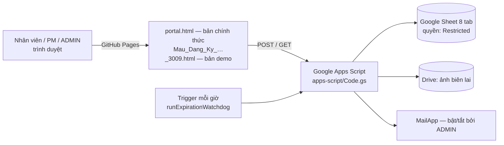
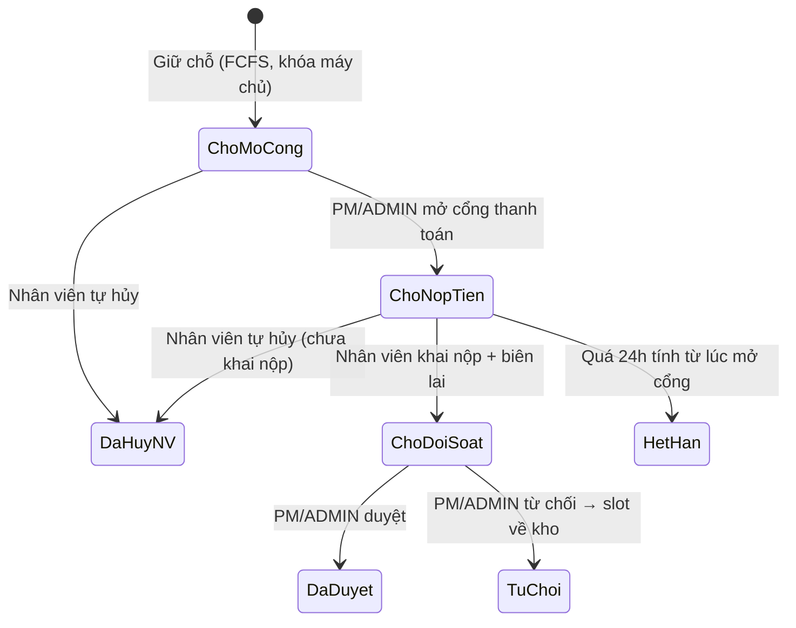

# THÔNG TIN HIỆN HÀNH — LG INTERNAL SALES PORTAL
### Đọc trang này trước. Đây là nguồn chuẩn duy nhất về trạng thái ứng dụng.

| Mục | Giá trị |
|---|---|
| Cập nhật | **07/10/2026** — chốt phiên bản v2 (đối chiếu mã nguồn `main`, máy chủ chính thức, GitHub Pages) |
| Phiên bản | **v2 ĐÃ CHỐT** — git tag **`v2-final`** = `v2.3.1` (07/10/2026). Lịch sử: v1.1 → v1.4 (gia cố) → v2.0 (giao diện mới) → v2.0.1–v2.3.1 (favicon, thẻ GRAP, Nộp tiền ngay tự điền biên lai, tab 1 hàng, Xuất Excel .xlsx, giờ VN, Serial Number, biên lai theo thư mục chương trình, link LG.com tự cập nhật, VietQR Tab 3, tiền chuẩn VN). Chi tiết từng bản: [04-v1-hardening/README.md](04-v1-hardening/README.md). **08/10: v2.4.0 = thêm tiếng Anh (nút VI/EN)**, chỉ đổi web → [design/I18N_EN_FEASIBILITY.md](../design/I18N_EN_FEASIBILITY.md) §9; chờ chủ dự án duyệt bản dịch Tab 1 ([design/i18n/TAB1_EN_REVIEW.md](../design/i18n/TAB1_EN_REVIEW.md)). Bước tiếp theo (TẠM DỪNG, chờ chủ dự án trả lời): **v3 giao diện điện thoại** → [design/V3_PENDING_DECISIONS.md](../design/V3_PENDING_DECISIONS.md) |
| Trạng thái | Web `portal.html` = tag `v2.4.0` trên GitHub Pages (tiếng Việt mặc định; tắt tiếng Anh cho tất cả: `I18N_ENABLED = false`, Runbook §1). Apps Script chính thức **Version 10** (quay lại: Version 9). Bảng link LG.com tự cập nhật thứ Hai 08:00 (GitHub Actions) — trước khi push: `git pull --ff-only gobita main`. Mọi thay đổi v3 bắt đầu từ tag `v2.4.0`, và mọi chữ mới / đổi phải thêm vào từ điển EN (`assets/i18n/en_source.json`, quét `scripts/i18n_collect.py` = 0) |
| Máy chủ (cập nhật 07/10/2026) | Apps Script chính thức **Version 10** (22:54 06/10/2026; quay lại: Version 9). V8: thời gian nộp / ngày PM duyệt ghi dạng chữ + Serial cột M Products. V9: serial ghi cột W Registrations khi đăng ký (`syncSerialsToRegistrations` điền đơn cũ). V10: biên lai lưu theo thư mục `Bien lai nop tien/<ProgramID> - <Tên>` (`organizeReceiptsByProgram` đã chạy). Sheet chính thức: tiêu đề Serial ở `Products!M1`, `Registrations!W1`, `Slots!L1` (dạng Text); quyền chia sẻ **Restricted**. **Dữ liệu TEST cần xóa / thay trước 14/10:** serial ở Products M (OTHER-01 = serial file mẫu, OTHER-02 = `TEST-…`), các dòng đơn test, chương trình test |
| Link nhân viên (chính thức) | `https://ai-coreteam.github.io/portal.html` (từ 08/10/2026; link cũ `gobitangocbao.github.io/lg-internal-sales-portal/…` tự chuyển sang) — gửi đúng link này, **không kèm `?ui=v2`** (v2 đã mặc định; tham số này chặn việc quay lại v1.4). **Link ngắn = trang gốc** `https://ai-coreteam.github.io` → mở cổng chính thức (giữ `?lang=en`); mã QR trong `assets/qr/`. Bản demo: `…/Mau_Dang_Ky_Internal_Sales_3009.html` |
| Giao diện v2 | **Bật cho mọi người từ 06/10/2026 (tag `v2.0`)** — chủ dự án duyệt để toàn bộ người dùng test. Chức năng như v1.4. Xem giao diện cũ: thêm `?ui=v1` vào link. Quay lại v1.4 cho tất cả: `UI_V2_DEFAULT = false` → test → build `portal.html` → push ([Runbook §1](04-v1-hardening/V1_RELEASE_RUNBOOK.md)). Thiết kế: [`design/UI_V2_DIRECTION_PROPOSAL.md`](../design/UI_V2_DIRECTION_PROPOSAL.md) |
| Mở bán | **10:00, 14/10/2026** → hạn chót **17:00, 16/10/2026** (theo Tab 1 của trang) |
| Khi tài liệu khác mâu thuẫn với trang này | Trang này đúng. Tài liệu trong `03-architecture-and-analysis/` là **lịch sử phân tích**, mỗi file có khung "Trạng thái" ở đầu |

---

## 1. Kiến trúc trong 1 hình

Hệ thống chạy dưới **tài khoản Gmail cá nhân** của chủ Sheet. Theo [hạn mức Google](https://developers.google.com/apps-script/guides/services/quotas): **100 email/ngày** (dùng chung cho mọi dự án Apps Script của tài khoản, kể cả staging), 30 lượt chạy đồng thời / tài khoản.

## 2. Hai bản giao diện

| | Bản demo | Bản chính thức |
|---|---|---|
| File | `Mau_Dang_Ky_Internal_Sales_3009.html` (`index.html` chuyển hướng tới đây) | `portal.html` — sinh bằng `python3 scripts/build_production.py --api-url <URL>` |
| Dùng cho | Đào tạo, thử nghiệm | Nhân viên mua hàng thật |
| Máy chủ | Không nối (dữ liệu trên trình duyệt) hoặc tự dán URL qua "Cấu hình API" | Gắn cố định URL Apps Script, mở là đăng nhập được |
| Tài khoản demo | Có (mật khẩu `test123`, xem mục 4) | **Không có** — dữ liệu demo bị xóa khỏi mã nguồn |
| Trạng thái | Đang chạy trên GitHub Pages | **Chưa phát hành** — chờ Runbook mục 3 |

## 3. Vai trò

| Vai trò (cột G tab `Users`) | Làm được gì |
|---|---|
| `USER` — nhân viên | Xem danh mục, giữ chỗ (FCFS), nộp tiền VietQR, tra cứu đơn, **tự hủy trước khi khai nộp tiền**, đổi mật khẩu |
| `PM` | Mọi việc quản trị đợt bán **trên chương trình của chính mình**: tạo đợt, nạp Excel, hẹn giờ, mở cổng thanh toán, đối soát / duyệt / từ chối, quét quá hạn, kết sổ, xuất CSV |
| `ADMIN` *(từ 05/10/2026)* | Mọi việc của PM trên **mọi chương trình** + cài đặt hệ thống (**công tắc email tự động** — chỉ ADMIN thấy). Chỉ gán 1–2 người |

## 4. Tài khoản demo (chỉ có trong bản demo)

| Mã NV | Vai trò | Tên hiển thị | Nút đăng nhập nhanh |
|---|---|---|---|
| `VH12345` | PM | Nguyễn Thị Quỳnh Như | ✓ |
| `VH99999` | PM | Nguyen Ngoc Bao | — |
| `VH88921` | USER | Trần Văn Nam | ✓ |
| `VH11111` | USER | Nguyen Ngoc Bao | ✓ |
| `VH55432`, `VH33211`, `VH99120` | USER | Lê Hoàng Anh, Hoàng Minh Trí, Đặng Thanh Hà | — |
| `VH00001` | USER (Inactive) | Test Inactive — dùng để thử tài khoản bị khóa | — |

Mật khẩu chung: `test123` (trừ `VH00001`). Không có tài khoản demo vai trò ADMIN.

> ⚠️ Tài khoản demo **không** thao tác được trên máy chủ chính thức (máy chủ từ chối chữ ký demo). Sheet chính hiện có một số tài khoản dùng mật khẩu `test123` — mật khẩu này công khai trong repo, phải đổi hoặc xóa trước go-live (mục 9).

## 5. Vòng đời đơn hàng

Tên trạng thái trong Sheet: `Đã đăng ký - Chờ mở thanh toán` · `Chờ nộp tiền` · `Đã khai nộp - chờ đối soát` · `Đã duyệt thanh toán` · `Từ chối` · `Hết hạn giữ chỗ` · `Đã hủy bởi nhân viên`.

## 6. Thông số vận hành (đọc từ code)

| Thông số | Giá trị | Nguồn |
|---|---|---|
| Hạn mức mua | Theo từng chương trình (`MaxPerEmployee` tab `Programs`; dữ liệu hiện tại: HA = 1, HE = 2) | `register_product_` |
| Chống trùng slot | Khóa `LockService` trên máy chủ; staging: 3 người cùng bấm → luôn đúng 1 người thắng | Runbook §2 |
| Thời hạn nộp tiền | 24 giờ **tính từ lúc mở cổng**; nhắc ở giờ thứ 22; watchdog chạy mỗi giờ | `check_expired_slots_` |
| Cập nhật kho trên màn hình | Polling **6–8 giây** khi đang xem danh mục; cập nhật ngay khi bị từ chối | `TAKEN_POLL_MS = 6000` |
| Ô "03 Đơn Hàng Của Bạn" | Lấy từ máy chủ; tự làm mới mỗi 60 giây khi có đơn đang chờ | `refreshMyServerOrders` |
| Máy chủ chậm | Chờ 8 giây × thử lại 2 lần → panel "Đang kết nối máy chủ… / Thử lại", tự thử lại sau 15 giây | `fetchWithBackoff` |
| Phiên đăng nhập | Trình duyệt giữ 8 giờ; token máy chủ hết hạn sau 24 giờ | `AUTH_SESSION_HOURS`, `generateSessionToken_` |
| Ảnh biên lai | Nén trên trình duyệt (rộng tối đa 1280 px, chất lượng 0,75); máy chủ nhận tối đa 5 MB; hỗ trợ HEIC | `compressImageFile`, `MAX_FILE_BYTES` |
| Dải icon danh mục tròn | Chỉ chuyển sang Tab 2 và cuộn tới danh mục — **không lọc** sản phẩm; chọn đợt bán bằng thanh chương trình | `selectQuickCategory` |
| Email tự động | 6 loại; bật/tắt bằng công tắc của ADMIN; chạm hạn mức → tự ngưng 1 giờ, đơn vẫn xử lý | `sendEmailNotification_`, `email_setting_` |

## 7. Bảo mật hiện hành

| Biện pháp | Trạng thái |
|---|---|
| Token phiên ký HMAC, khóa ngẫu nhiên; `rotateSessionSecret()` để thay khóa | ✅ (staging: 5/5 token giả bị từ chối) |
| Giữ chỗ / nộp tiền / hủy chỉ cho chính chủ phiên đăng nhập | ✅ |
| Giá nộp tiền do máy chủ áp theo giá chuẩn | ✅ |
| PM chỉ xem đơn chương trình mình phụ trách, kể cả khi không chọn chương trình (V1-16) | ✅ code + test + staging thật; chờ deploy chính thức |
| `portal.html` không đọc dữ liệu / hẹn giờ bản demo để lại trong trình duyệt | ✅ code + test |
| Quyền Google Sheet: **Restricted** | ✅ (từ 05/10/2026; xác nhận lại 05/10: tài khoản dịch vụ bên ngoài đọc Sheet chính bị từ chối) |
| `SPREADSHEET_ID` vẫn ghi cứng ở dòng 21 `Code.gs` và có trong lịch sử repo công khai | ⚠️ Rủi ro thấp vì Sheet đã Restricted; có thể dùng Script Property `SPREADSHEET_ID` thay thế |
| Mật khẩu: nhân viên tự đổi → lưu SHA-256; Admin gõ trực tiếp trên Sheet → lưu dạng chữ | ⚠️ Theo thiết kế đã duyệt |

## 8. Cơ sở dữ liệu (8 tab do `setupNewDatabase()` tạo)

`Registrations` (22 cột) · `Slots` (form cũ) · `Config` · `ActivityLog` · `Users` · `Programs` (10 cột) · `Products` (12 cột) · `AutoEmail`.

- **`Users`**: A `ID` · B `Password` · C `Name` · D `Department` · E `Phone` · F `Email` · **G `Role`** (`USER`/`PM`/`ADMIN`) · H `Status` (`Active`/`Inactive`). Chi tiết: [`01-setup-and-deployment/USERS_SHEET_TEMPLATE.md`](01-setup-and-deployment/USERS_SHEET_TEMPLATE.md).
- **`Config`** đáng chú ý: `ENABLE_AUTO_EMAIL` (công tắc email) · `ALLOW_DEMO_TOKENS` (chỉ bật trên staging, mặc định tắt) · `MAX_PER_EMPLOYEE` (form cũ).
- `setupNewDatabase()` **từ chối chạy** trên Sheet đã có dữ liệu.

## 9. Việc còn mở và quyết định đang chờ

| # | Việc | Người quyết / làm |
|---|---|---|
| 1 | ✅ **Xong 05/10**: staging Version 3 (role ADMIN + V1-16) — Runbook §2b ĐẠT, V1-16 kiểm chứng trên máy chủ thật | — |
| 2 | ✅ Bản chính thức triển khai 05/10 (Runbook §3 bước 1–8; bước 10 xem Runbook) | — |
| 3 | ✅ `v1-hardening` gộp vào `main`, gắn tag `v1.1`, đẩy lên 2 remote (05/10, chủ dự án duyệt) | — |
| 4 | 🔴 `test123` đã gỡ. **Còn mật khẩu dễ đoán**: ADMIN `VH22222`, PM `VH99999` và 3 tài khoản USER đang dùng **chuỗi số 6 chữ số đơn giản** (kiểm chứng trên máy chủ 05/10; không ghi giá trị vào repo). URL máy chủ nay công khai trong `portal.html` → ai đoán đúng có quyền ADMIN. Đề xuất: `VH88921`, `VH55432` → `Inactive`; ADMIN / PM đặt mật khẩu riêng ≥ 10 ký tự rồi tự đổi trên web (lưu SHA-256) | Admin — **trước 14/10** |
| 5 | Xác nhận phạm vi ADMIN: thao tác trên **mọi** chương trình (đang làm như vậy) | Chủ dự án |
| 6 | ✅ **Đã sửa 05/10 (V1-16, chủ dự án duyệt)**: PM gọi Dashboard không kèm mã chương trình nay chỉ nhận đơn của chương trình mình phụ trách; ADMIN vẫn thấy tất cả. Test máy chủ: bản cũ lộ đơn chương trình khác, bản mới không; **staging thật ĐẠT** | Chờ deploy bản chính thức (Runbook §3) |
| 7 | Số tài khoản: web (9 chỗ), mã VietQR và email đều hiện **đầy đủ `0991000012525`** (kiểm chứng trên `portal.html` 05/10). Riêng ô `BANK_ACC` tab `Config` mất số 0 do Sheet tự đổi thành số — code không đọc ô này. Chi nhánh Vietcombank: giao diện và email ghi **"Tây Hồ"**; `assets/content/bank_accounts.json` và hướng dẫn PM ghi **"Tây Hà Nội"**. Số TK `0991000012525` thống nhất ở mọi nơi | Tài chính xác nhận |
| 8 | Cú pháp chuyển khoản: ô 01 ghi `[MãNV]_[MãSlot]` (gạch dưới); mã VietQR và email dùng `MãNV MãSlot` (khoảng trắng) | Chủ dự án chốt 1 dạng |
| 9 | Vị trí kho AYA / AYB / AYC: các tài liệu cũ ghi 3 cách khác nhau | PM xác nhận |
| 10 | Liên hệ hỗ trợ: nút "Hỗ trợ" ghi `minhhien.hoang@lge.com`; màn hình đăng nhập ghi `internalsales.support@lge.com` | Chủ dự án chốt |
| 11 | PIC chính thức và phân quyền Sheet cho HR / Admin | Chủ dự án |
| 12 | Chuyển Apps Script sang tài khoản LG Workspace (1.500 email/ngày) | Khi IT sẵn sàng |
| 13 | v1.2: chuẩn hóa màu ngoài bảng màu LG (verifier lg-brand ngày 05/10: 177 cảnh báo), chọn Active Red `#EA1917` (web) hay `#FD312E` (BI) | Sau go-live |
| 14 | ✅ **Đã sửa 05/10 (chủ dự án duyệt)** — Đơn ảo / hẹn giờ cũ từ bản demo trong `portal.html`. Nguyên nhân: bản demo và `portal.html` cùng tên miền nên dùng chung bộ nhớ trình duyệt. Test xác nhận bản cũ: hiện đơn ảo "Đã duyệt thanh toán" **và hẹn giờ cũ của bản demo gửi lệnh thật `program_update` lên máy chủ**. Sửa: `build_production.py` đổi tên 8 khóa bộ nhớ trong `portal.html` (bản demo không đổi); test Kịch bản 8 | Áp dụng khi build `portal.html` |
| 15 | Bảng Điều Khiển PM ở chế độ máy chủ **không tự làm mới** — PM phải bấm `Tải lại` để thấy đơn mới | Chủ dự án: giữ / thêm tự làm mới |
| 16 | **Hẹn giờ (Timer) chỉ chạy khi trang PM đang mở** (lưu trong trình duyệt của PM, kiểm tra mỗi giây). Watchdog 24 giờ chạy trên máy chủ, không bị ảnh hưởng | PM vận hành tay ngày mở bán; chủ dự án quyết định có chuyển lên máy chủ không |
| 17 | Giữ chỗ 1 chạm **không có ô tích cam kết Jeong-Do riêng**; máy chủ ghi "Đồng ý" vào đơn | Chủ dự án (Jeong-Do) |
| 18 | Không thu địa chỉ: email ghi "Địa điểm nhận hàng: <kho>" → mô hình hiện tại là **nhận tại kho**. Hướng dẫn cũ ghi "SĐT & Địa chỉ nhận hàng" (đã sửa) | Chủ dự án xác nhận chính sách giao nhận |
| 19 | Câu chữ trong Tour lệch v1: "khóa máy riêng 24H" (thực tế 24 giờ tính từ lúc mở cổng); "tự động gửi Email khi PM duyệt" (email mặc định TẮT); kho "Hải Phòng AYA, Hà Nội AYB, Hưng Yên AYC" (gộp với mục 9) | Chờ duyệt sửa chữ |
| 20 | `assets/content/*.json` không được ứng dụng đọc; số tài khoản viết cứng 9 chỗ HTML + 2 chỗ `Code.gs`. File mẫu Excel ở `assets/templates/` và `data/` khác nhau; web tải bản nhúng trong HTML | Biết để không sửa nhầm chỗ; hợp nhất ở v1.2 |
| 21 | ✅ **Đã sửa 05/10**: ô 02 ghi "Đang tải…" khi danh mục chưa về, "Chưa có sản phẩm" khi chương trình trống, **"Chưa có đợt bán"** khi không có chương trình nào; "Hết hàng" chỉ khi đã tải và hết thật. Test Kịch bản 9–10 | — |
| 22 | ✅ 05/10: chủ dự án đã đóng (`CLOSED`) cả 4 chương trình test trong Sheet chính; nhân viên hiện thấy 0 chương trình (kiểm chứng trên máy chủ) | — |
| 23 | Khi **không có chương trình nào mở**: ô 03 trống, bước 1 của Tour chỉ vào thanh chương trình rỗng (thấy trên link thật 05/10; có từ trước, chỉ là hiển thị) | v1.2 — chờ duyệt |
| 24 | ✅ **Đã sửa ở v1.2 (05/10, chủ dự án duyệt)**: cửa sổ biên lai (cả 2 nơi) không còn vẽ hình "Giao dịch thành công" / mã GD bịa `FT24098912389`. Chỉ hiện: ảnh thật, nút "Mở biên lai thật ↗" (link Drive từ trường `receipt` của máy chủ), hoặc "Chưa có ảnh biên lai". Kiểm chứng: Kịch bản 11 (bản cũ FAIL 3) + luồng thật trên staging (giữ chỗ → mở cổng → nộp tiền có ảnh → PM mở biên lai = link Drive thật). Còn lại: ADMIN chia sẻ quyền xem thư mục "Bien lai nop tien" cho PM (Runbook §3b mục 9) | — |
| 25 | 🟠 Máy chủ **không** chặn theo giờ bắt đầu: "Kích Hoạt Mở Bán" tạo chương trình `Open` ngay → nhân viên giữ chỗ được trước giờ G. **Tạm thời:** đặt `Draft` ngay sau khi tạo, 10:00 bấm "Mở bán ngay" (Sổ tay vận hành A, C). Đề xuất v1.2: tạo ở trạng thái Draft hoặc máy chủ kiểm tra giờ bắt đầu | Chủ dự án |
| 26 | 🟡 Nút "Mở lại chương trình" hiện với chương trình đã kết sổ, nhưng máy chủ chỉ cho Draft → Open → Closed nên bấm sẽ báo lỗi | v1.2 — ẩn nút hoặc đổi quy tắc |
| 27 | ✅ Trigger quét quá hạn 24h: dự án chính thức có **0 trigger** tới 05/10 15:46 (Runbook §3 thiếu bước). Chủ dự án đã chạy `setupWatchdogTrigger`; **đã chạy thật 16:15:39, Error rate 0%**. Runbook thêm bước 5b + mục 3b | — |
| 28 | 🟠 Thư mục biên lai "Bien lai nop tien" đang **"Anyone with the link – Viewer"** (kiểm chứng quyền Drive 05/10): ai có link thư mục / link file đều xem được biên lai (tên, số tiền, thông tin ngân hàng). Link chỉ đi tới PM / ADMIN (nhân viên chỉ nhận cờ có/không), nhưng link chuyển tiếp được. Phương án: **Restricted + thêm email Google của từng PM (Viewer)** — cần PM có tài khoản Google. Kèm: staging đang ghi biên lai test vào cùng thư mục (Runbook §3b) | Chủ dự án (Jeong-Do) chốt |
| 29 | ✅ **Đã sửa ở v1.3**: Hướng dẫn tự mở lần đầu — khung đỏ bước 1 lệch khỏi thanh chương trình (dữ liệu máy chủ về sau khi đo). Nay đo lại khi bố cục đổi. Kịch bản 12 | — |
| 30 | ✅ **Đã sửa ở v1.4**: đăng nhập chờ máy chủ tối đa **45 giây** (trước: 12 giây, không đủ cho khởi động nguội 15–40 giây); sau 10 giây nút báo "Máy chủ đang khởi động… vui lòng chờ (tối đa 45 giây)". Kịch bản 13 (bản cũ FAIL 2). Vẫn nên khởi động máy chủ 9:45 ngày mở bán | — |

## 10. Kiểm thử

| Lệnh | Phạm vi | Kết quả 05/10/2026 |
|---|---|---|
| `node tests/backend_gas_harness.js` | Chạy `Code.gs` thật với Sheet giả lập | 67/67 |
| `python3 tests/cloud_mode_regression.py` | Chạy trang web thật với máy chủ giả lập (nhân viên, PM, ADMIN, bản chính thức, demo, dữ liệu demo còn sót) | 37/37 |
| `node tests/run_e2e_tests.js` | Bộ kiểm tra cũ (chủ yếu dò chuỗi trong mã nguồn) | 164/164 |
| `python3 tests/staging_smoke_test.py …` | Máy chủ staging thật | ĐẠT; 2b ADMIN + 2c V1-16 ĐẠT 05/10 (Version 3) |
| `python3 tests/polling_race_simulation.py` | Mô phỏng rủi ro polling | — |
| **08/10/2026 (v2.4.0)** | harness 98/98 · hồi quy 156/156 (v2) + 156/156 (`?ui=v1`) · e2e đạt · `python3 scripts/i18n_collect.py` = 0 câu tiếng Việt ở EN | ĐẠT |

## 11. Bản đồ tài liệu

| Thư mục | Tính chất | Đọc khi |
|---|---|---|
| [`04-v1-hardening/`](04-v1-hardening/README.md) | **Hiện hành** — thay đổi v1, Runbook triển khai & khôi phục, nhật ký thay đổi | Triển khai, xử lý sự cố, cần biết thay đổi gì |
| [`02-user-and-pm-guide/SO_TAY_VAN_HANH_NGAY_MO_BAN.md`](02-user-and-pm-guide/SO_TAY_VAN_HANH_NGAY_MO_BAN.md) | **Hiện hành** — checklist ngày mở bán cho ADMIN / PM + bảng xử lý sự cố | Trước và trong đợt bán |
| [`02-user-and-pm-guide/PM_AND_USER_OPERATIONAL_GUIDE.md`](02-user-and-pm-guide/PM_AND_USER_OPERATIONAL_GUIDE.md) | **Hiện hành** — hướng dẫn sử dụng (Phần C = bản v1) | Đào tạo nhân viên, PM, ADMIN |
| [`01-setup-and-deployment/`](01-setup-and-deployment/) | **Hiện hành** (đã cập nhật 05/10) | Cài đặt, Git, cấu trúc Sheet |
| `02-…/PROPOSAL_*`, `ONBOARDING_TOUR_…` | Đề xuất **đã triển khai** | Hiểu lý do thiết kế Tour và Tab 2 |
| [`03-architecture-and-analysis/`](03-architecture-and-analysis/) | **Lịch sử phân tích** — có khung trạng thái ở đầu mỗi file | Tra cứu lý do quyết định |
